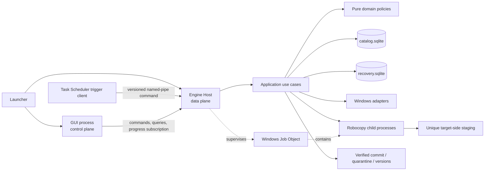
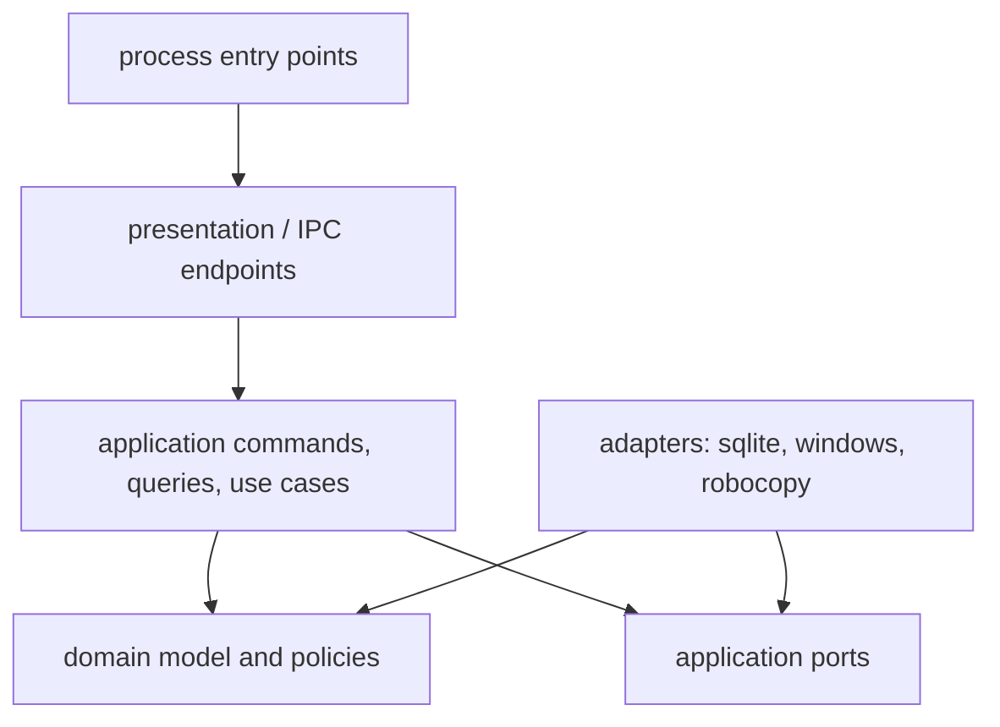

# MediaSync Home — generert masterspesifikasjon og Codex-plan

> **GENERERT FIL — IKKE REDIGER DIREKTE.** Kjør `python tools/build_master.py` etter endring i de kanoniske fagfilene under `docs/`. Validatoren feiler dersom masteren driver fra kildene.

| Felt | Verdi |
|---|---|
| **Dokumentversjon** | 2.9.2 — Codex-overleveringspakke med kanoniske fagfiler, komplett ADR-styring, streng baselinevalidator, GitHub-vennlig prosjektinngang og vertikal leveransestige |
| **Revidert** | 2026-07-16 |
| **Plattform** | Windows 10 og Windows 11, x64 |
| **Primærbruk** | Privat sikkerhetskopiering og synkronisering av flere terabyte bilder, videoer og andre filer mellom lokale disker, USB-disker og SMB/NAS |
| **Teknologi** | Python 3.14, PySide6/Qt 6, SQLite og Robocopy |
| **Brukerflate** | Grafisk Windows-program; ingen offentlig kommandolinje |
| **Hovedscenario** | Én kildemappe sikkerhetskopieres til opptil tre uavhengige mål |
| **Dokumentstatus** | Generert konsolidert referanse. `AGENTS.md` og de kanoniske fagfilene styrer aktivt Codex-arbeid. |

---

## Innholdsfortegnelse

- [0. Instruks til Codex](#0-instruks-til-codex)
- [0.5 Dokumentpakke, presedens og maskinlesbare kontrakter](#05-dokumentpakke-presedens-og-maskinlesbare-kontrakter)
- [1. Produktmål](#1-produktmål)
- [2. Låste produktvalg og standardverdier](#2-låste-produktvalg-og-standardverdier)
- [3. Terminologi og kravsporbarhet](#3-terminologi-og-kravsporbarhet)
- [4. Sikkerhetsmodell og invarianter](#4-sikkerhetsmodell-og-invarianter)
- [5. Synkroniseringsmoduser](#5-synkroniseringsmoduser)
- [6. Identiske filer, hash-evidens og duplikatdeteksjon](#6-identiske-filer-hash-evidens-og-duplikatdeteksjon)
- [7. Filfiltre](#7-filfiltre)
- [8. Produktdesign, GUI og brukeropplevelse](#8-produktdesign-gui-og-brukeropplevelse)
- [9. Teknisk arkitektur](#9-teknisk-arkitektur)
- [10. Repository-struktur](#10-repository-struktur)
- [11. Datamodell](#11-datamodell)
- [12. Endepunktoppdagelse, identitet og kapabiliteter](#12-endepunktoppdagelse-identitet-og-kapabiliteter)
- [13. Skanner, coverage og indeks](#13-skanner-coverage-og-indeks)
- [14. Sammenlignings- og planleggingsmotor](#14-sammenlignings--og-planleggingsmotor)
- [15. Robocopy-adapter og prosessisolasjon](#15-robocopy-adapter-og-prosessisolasjon)
- [16. Ressursstyring og selvbalanserende overføring](#16-ressursstyring-og-selvbalanserende-overføring)
- [17. Verifisering, durability, versjonering og karantene](#17-verifisering-durability-versjonering-og-karantene)
- [18. Automatisering uten Windows-tjeneste](#18-automatisering-uten-windows-tjeneste)
- [19. Feilhåndtering og observabilitet](#19-feilhåndtering-og-observabilitet)
- [20. Milepæler og konkrete Codex-oppgaver](#20-milepæler-og-konkrete-codex-oppgaver)
- [21. Teststrategi](#21-teststrategi)
- [22. Akseptansekriterier](#22-akseptansekriterier-for-komplett-hjemmeversjon)
- [23. Kodekvalitet og utviklingsregler](#23-kodekvalitet-og-utviklingsregler)
- [24. Foreslåtte versjoner ved prosjektstart](#24-foreslåtte-versjoner-ved-prosjektstart)
- [25. Offisielle tekniske referanser](#25-offisielle-tekniske-referanser)
- [26. Oppstartsprompt til Codex](#26-oppstartsprompt-til-codex)
- [27. Senere forbedringer](#27-senere-forbedringer)
- [28. Revisjonslogg](#28-revisjonslogg)

---

---

## 0. Instruks til Codex

Når repositoryet inneholder `AGENTS.md`, les bare dokumentene den peker til for gjeldende arbeidspakke. Bruk denne masterfilen som konsolidert referanse når målrettede dokumenter mangler nødvendig kontekst; ikke last den som full standardprompt.

### 0.1 Arbeidsmåte

1. Implementer én milepæl om gangen, i rekkefølgen angitt i kapittel 20.
2. Del arbeidet i små, gjennomgåbare endringer. Ikke bygg hele programmet i én fil eller ett stort steg.
3. Etter hver milepæl:
   - kjør alle relevante tester;
   - kjør linting og typekontroll;
   - oppdater `docs/IMPLEMENTATION_STATUS.md`;
   - dokumenter kjente avvik;
   - stopp ved milepælens kvalitetsport før neste milepæl.
4. Bruk krav-ID-ene i kapittel 3 som sporingsnøkler i kode, tester, dokumentasjon og PR-beskrivelser. Velg alltid den sikreste oppførselen når et krav er tvetydig.
5. Domenelogikk, skanning, sammenligning og kjøreplan skal kunne testes uten GUI og uten ekte NAS.
6. GUI-tråden skal aldri utføre filskanning, hashing, databasevedlikehold eller Robocopy-kjøring.
7. GUI-en skal følge designsystemet i kapittel 8. Farger, avstander, radius, typografi og ikoner skal komme fra sentrale tokens og registre.
8. En GUI-side regnes ikke som ferdig før relevante tom-, laste-, offline-, feil- og tilgjengelighetstilstander er implementert.
9. All produksjonskode og alle kodeidentifikatorer skrives på engelsk. GUI-tekst leveres først på norsk bokmål, med støtte for engelsk oversettelse.
10. Programmet skal være fullt brukbart uten internettilgang.
11. Mål og instrumenter varme kodebaner fra første milepæl; ikke vent til utgivelsesfasen med å oppdage arkitekturflaskehalser.
12. Ingen fase skal materialisere hele filkatalogen, operasjonsplanen eller GUI-tabellen i minnet.
13. Bruk avgrensede køer og backpressure mellom skanning, database, planlegging, overføring og verifisering.
14. Sammenlign ytelsen mot rå `os.scandir`, SQLite-bulkinnlasting og direkte Robocopy på samme maskin og datasett.
15. Optimaliser målt total gjennomstrømning og brukeropplevd ventetid, ikke bare enkeltfunksjoner eller syntetiske mikrobenchmarks.
16. Implementer standardflyten for hjemmebackup før avanserte synkroniseringsvalg. En bruker skal ikke måtte åpne avanserte seksjoner for å opprette eller kjøre en vanlig backup.
17. Hver brukerrettet tilstand skal ha én tydelig anbefalt neste handling. Ikke eksponer interne begreper som endepunkt, snapshot, plan-checksum, batch, commit eller Robocopy i normal visning.
18. En GUI-leveranse er ikke ferdig før oppgavetestene i §8.30 er gjennomført manuelt og resultatene er registrert i `docs/USABILITY_CHECKLIST.md`.
19. GUI-prosessen skal aldri åpne en skrivbar databaseforbindelse eller konstruere muterende filsystem-/Robocopy-adapters. Alle muterende use cases går gjennom Engine Host.
20. Alle interne kommandoer skal være versjonerte, idempotente og persisteres før endelig suksessrespons. En reconnect eller Task Scheduler-retry skal ikke opprette duplikatkjøring.
21. En forseglet plan, jobbrevisjon eller endepunktrevisjon skal aldri patches in-place. Endring oppretter ny revisjon eller avledet plan.
22. Ingen filsystemmutasjon skjer uten aktiv lease, matching target-precondition og varig recoveryintensjon.
23. Dependency-retningen i §9.6 håndheves med architecture tests i CI; dokumenterte grenser uten test regnes ikke som ferdige.
24. Databasetransaksjoner skal avsluttes før kode venter på fil-I/O, Robocopy, IPC, sleep eller brukerinput.
25. Launcher, GUI, Engine Host, trigger client og transferarbeidere kjører som standardbruker uten UAC-elevasjon, backup-/restoreprivilegier eller administratoravhengig fast path.
26. Plan-, IPC- og recoverypayloads lagrer bare persistente IDs og endepunktrelative stier. Absolutte bruker-/målstier rekonstrueres bare av `SafePath` fra en validert immutable endpointrevisjon.
27. Et forseglet snapshot er skrivebeskyttet. Sen hash eller ny metadata lagres i versjonert cache/avledet artefakt og kan aldri endre en plan som allerede er forseglet.
28. En ekstern transferprosess får ikke kjøre én instruksjon før prosessupervisoren har plassert den i riktig Job Object og bekreftet containment.
29. Dersom ADR-003 beholder separate katalog- og recoverydatabaser, har de aldri samtidige write-transaksjoner i samme use case. Cross-store-flyt bruker varige handoffs og kan gjenopptas etter hvert mellomsteg.
30. Application-laget skal ikke ha en generell «skriv fil»-port. Final tree kan bare endres gjennom en smal `CommitPort` som krever en levende, ikke-serialiserbar `MutationPermit` og en verifisert stagingartefakt.
31. Hver mutasjonslease skal ha en monoton fencing token. Stale worker-resultater, meldinger eller recoveryforsøk med eldre token skal avvises før ny filsystemmutasjon.
32. Durable inbox-, trigger- og outboxnøkler skal overleve vanlig historikkretention som kompakte dedupliseringstombstones. En gammel retry kan ikke bli en ny sideeffekt bare fordi detaljhistorikk er komprimert.
33. Intern databasebackup, restore og komprimeringsswap dekker alle autoritative state stores valgt av ADR-003 som ett manifestert epoch-sett; dersom flere filer brukes, kan de aldri blandes på tvers av epoker.
34. Ett skrivbart MediaSync-rotområde har nøyaktig én autorisert writer-installasjon per `ownership_epoch`. En annen installasjon er read-only til en eksplisitt overtakelsessaga er fullført.
35. En mappe med navnet `.mediasync` ekskluderes eller adopteres aldri bare på grunn av navnet. Kontrollområdet må klassifiseres og valideres mot checksummet markør før det behandles som produktmetadata.
36. Alle parent-child-forhold som påvirker sikkerhet skal håndheves med sammensatte fremmednøkler, unike parent-scope-nøkler eller en dokumentert database-trigger. Python-validering alene er ikke tilstrekkelig.
37. En gammel hashcachepost kan bare drive `SKIP_IDENTICAL` når evidensnivået beviser nåværende innhold, ikke bare uendrede metadata.
38. Source-preconditions skal bindes så nær Robocopys lesing som endepunktet tillater. Ubeskyttet kilde krever post-transfer-bevis eller utsettelse; metadata alene er ikke sikkert TOCTOU-bevis.
39. Staging, versjoner og karantene bruker korte, objektbaserte kontrollstier med manifester. De skal ikke speile hele brukerens relative mappetre under `.mediasync`.
40. Leases og claims i en levende Engine Host bruker monoton klokke. Persistente UTC-tidspunkter er diagnostikk og kan ikke alene avgjøre at en claim er utløpt etter prosess- eller systemrestart.
41. Eksakte tabellfelter, wire-formater, årsakskoder og state transitions skal finnes som versjonerte maskinlesbare kontrakter. Markdown forklarer hensikt; kontraktene og testene håndhever formen.

### 0.2 Absolutte sikkerhetsregler

Følgende regler er ikke valgfrie:

- Ikke bruk Robocopy-flaggene `/MIR`, `/PURGE`, `/MOVE` eller `/MOV` i produksjonsflyten.
- Ikke bruk `shell=True` ved prosessoppstart.
- Ikke slett eller flytt noe før både kilde og mål er verifisert mot lagret endepunktidentitet.
- Ikke foreta destruktive handlinger når en skanning er ufullstendig, en mappe er utilgjengelig eller det finnes uavklarte skannefeil.
- Ikke skriv direkte over en eksisterende gyldig målfil. Kopier først til staging, verifiser, registrer en varig commit-intensjon og bruk den dokumenterte replace-/fallback-flyten.
- Ikke la en brukerdefinert relativ sti kunne unnslippe et konfigurert rotområde.
- Ikke kjør to instanser av samme jobb mot samme mål samtidig.
- Ikke automatisk slett identiske filer som er funnet av duplikatdeteksjonen.
- Ikke kopier ACL, eier, auditing eller privilegerte sikkerhetsdata som standard.
- Ikke følg NTFS-junctions, reparse points eller symbolske lenker som standard.
- Ikke etterlign Allway Sync-navn, logo, ikoner, skjermbilder eller pikselnøyaktig design. Bruk bare den generelle arbeidsflyten med jobber, endepunkter, analyse og synkronisering som funksjonell referanse.
- Ikke behandle filsystemet og SQLite som én atomisk transaksjon. Alle irreversible filsystemsteg skal ha en varig, idempotent gjenopprettingstilstand før og etter steget.
- Ikke la GUI, trigger client eller launcher endre brukerfiler, starte Robocopy direkte eller åpne skrivbar katalog-/recoverydatabase.
- Ikke la Robocopy skrive til final tree; den får bare et unikt stagingmål.
- Ikke utfør mutasjon uten eksklusiv mållease og umiddelbart revalidert target-precondition.
- Ikke bruk `pickle`, dynamisk kodeinnlasting eller vilkårlig Python-objektserialisering i IPC.
- Ikke stole på pipe-event, logg, stale lease-rad eller prosess-ID som eneste korrekthetsbevis.
- Ikke starte en intern rolle med vilkårlige stier eller kommandoargumenter; interne entry points mottar bare validerte IDs og triggerdata.
- Ikke kjør noen produktprosess elevért eller med `SeBackupPrivilege`/`SeRestorePrivilege` som standard; manglende tilgang skal være en synlig blokkering, ikke en skjult privilege escalation.
- Ikke eksponer en generell muterende filsystemadapter til GUI, domain eller application. Bare commit-/karantene-/versjonsadaptere med eksplisitt mutasjonskapabilitet kan endre final tree.
- Ikke godta et worker-resultat, en commitmelding eller et recoveryforsøk med stale fencing token, selv om `run_id` og sti ellers matcher.
- Ikke slett en idempotency key eller trigger-dedupliseringsnøkkel slik at en forsinket retry kan skape en ny kjøring eller sideeffekt.
- Ikke restore én intern database fra et backupsett og beholde den andre fra en annen epoch.
- Ikke persister absolutte source-, target-, staging-, version-, quarantine- eller intentsegmentstier i plan/recovery. Persistér endepunkt-ID/revisjon og relative stier, og løs dem gjennom `SafePath` ved bruk.
- Ikke oppdater et forseglet snapshot eller dets filposter med sent beregnede hash-/metadatafelt.
- Ikke resume en ny Robocopy-prosess før den er opprettet suspended, tilordnet kontrollert Job Object og kontrollert for arvede handles/breakaway.
- Ikke hold write-transaksjoner i begge SQLite-databaser samtidig; bruk eksplisitte handoffrader og idempotent avstemming.
- Ikke muter et skrivbart mål dersom `endpoint.json` viser en annen `owner_installation_id`, ukjent `ownership_epoch` eller uavklart eierskap.
- Ikke ekskluder, overskriv, reparer eller adopter en eksisterende `.mediasync`-mappe uten klassifisert kontrolltilstand og eksplisitt sikker flyt.
- Ikke bruk en lokal fencing-token som om den var global mellom installasjoner. Autorisasjonen er tuple `(ownership_epoch, local_fencing_token)` under global endpointlock.
- Ikke klassifiser cached metadatahash som nåværende full innholdsverifisering.
- Ikke bruk full relativ brukersti som fysisk staging-, versjons- eller karantenesti.
- Ikke la et utløpt UTC-felt alene autorisere overtakelse av en claim eller lease etter restart.
- Ikke tillat regulære uttrykk uten begrenset motor, cancellering, mønstergrense og evalueringsbudsjett.

### 0.3 Første Codex-oppgave

Codex skal først utføre **Milepæl 0A.0 — miljø- og sikkerhetspreflight** og deretter stoppe. 0A gjennomføres som separate arbeidspakker; Codex starter aldri neste arbeidspakke uten at prosjekteieren åpner den. Ikke implementer produktfunksjoner, endelig schema eller muterende backupflyt i Milepæl 0A.

### 0.4 Bindende ytelsesdoktrine

Disse prinsippene gjelder gjennom hele implementasjonen:

1. **Skann én gang, gjenbruk resultatet.** Kildesnapshot deles mellom alle mål i samme kjøring. Ingen mål får starte en ny kildeskann eller ny kildehash uten dokumentert behov.
2. **Billigste sikre beslutning først.** Sti, type, størrelse, stabil fil-ID og tidspunkt brukes før quick hash; full BLAKE3 brukes bare når sikkerheten eller brukerens eksplisitte valg krever det.
3. **Strøm data gjennom systemet.** Scanner, databasewriter, planlegger, batcher og GUI bruker avgrensede batcher. Millioner av poster skal aldri bli én Python-liste.
4. **Én serialisert skrivetjeneste per valgt SQLite-database, eid av Engine Host.** Kandidatdesignet skiller katalog/read model fra recoveryjournal, men 0A.4 skal måle alternativene og 0A.6 skal legge anbefalingen frem for eiergodkjenning av ADR-003. Uansett valg serialiseres writes per database; bulk-/rekonstruerbare transaksjoner og kritiske recoverytransaksjoner får eksplisitt durability. GUI, launcher og trigger client åpner ikke databasefilene; queries går gjennom korte Engine Host-read models.
5. **Minimer prosessoppstart.** Robocopy-batcher bygges store nok til å amortisere oppstart, men små nok til presis pause, nye forsøk og fremdrift.
6. **Staging på målvolumet.** Staging skal ligge på samme volum/share som sluttmålet slik at commit normalt er en billig rename, ikke en ny full filkopi.
7. **Ressursbevisst samtidighet.** Rotasjonsdisk, SSD, USB og SMB får ulike profiler. Maksimal parallellitet er ikke synonymt med maksimal gjennomstrømning.
8. **Ingen dobbel lesing uten grunn.** En fil som allerede er fullhashet skal ikke hashes på nytt for mål 2 og 3. Balansert verifisering skal ikke lese alle terabyte en ekstra gang.
9. **GUI er en observatør, ikke en arbeider.** Ingen fil-I/O, stor SQL-spørring, JSON-parsing eller bildegenerering utføres i GUI-tråden.
10. **Mål før optimalisering.** Hver ytelsesendring skal ha en reproducerbar benchmark og må ikke endre planens semantikk eller sikkerhetsinvarianter.

Prioritetsrekkefølgen er: **dataintegritet → korrekthet → vedvarende gjennomstrømning → responsivitet → visuell finesse**. Visuell finesse skal fortsatt være høy, men aldri på bekostning av en rask og stabil arbeidsflyt.

### 0.5 Dokumentpakke, presedens og maskinlesbare kontrakter

Denne masterfilen er et konsolidert lesedokument. Den operative overleveringspakken er allerede delt slik at Codex bare laster relevant kontekst for gjeldende arbeidspakke:

```text
.editorconfig
.gitattributes
.gitignore
AGENTS.md
BUNDLE_MANIFEST.sha256
CHANGELOG.md
MASTER_SPEC.md
README.md
requirements-handoff.txt
docs/
├── README.md
├── GOVERNANCE.md
├── CODEX_START_PROMPT.md
├── HANDOFF_CHECKLIST.md
├── PRODUCT_REQUIREMENTS.md
├── REQUIREMENTS_INDEX.md
├── ARCHITECTURE.md
├── ENDPOINT_OWNERSHIP.md
├── STORAGE_AND_SCHEMA.md
├── RECOVERY_PROTOCOL.md
├── SYNC_SEMANTICS.md
├── ROBOCOPY_ADAPTER.md
├── GUI_AND_UX.md
├── PERFORMANCE.md
├── OPERATIONS_AND_AUTOMATION.md
├── TEST_PLAN.md
├── MILESTONES.md
├── REPOSITORY_AND_CODE_QUALITY.md
├── REFERENCES.md
├── LATER_IMPROVEMENTS.md
├── RELEASE_SCOPE.md
├── ARCHITECTURE_SPIKE_REPORT.md
├── DECISION_REGISTER.md
├── IMPLEMENTATION_STATUS.md
├── REQUIREMENTS_TRACEABILITY.md
├── USABILITY_CHECKLIST.md
├── BENCHMARKS.md
├── assets/
├── spikes/
└── adr/
schema/
├── README.md
├── contracts-manifest.yaml
├── catalog.sql
├── recovery.sql
├── ipc-command.schema.json
├── ipc-event.schema.json
├── endpoint-marker.schema.json
├── intent-segment.schema.json
├── reason-codes.yaml
└── state-machines.yaml
tools/
├── build_adr_docs.py
├── build_contract_types.py
├── build_master.py
└── validate_handoff.py
```

Bindende presedens ved konflikt:

1. kanoniske produkt- og sikkerhetskrav i `docs/REQUIREMENTS_INDEX.md`;
2. ADR-er med eierbeslutning `OWNER_ACCEPTED`;
3. versjonerte kontrakter med status `frozen` i `schema/contracts-manifest.yaml`;
4. databaseconstraints og genererte typer som er produsert fra fryste kontrakter;
5. kjørbare konformitets-, sikkerhets- og arkitekturtester;
6. gjeldende arbeidspakkes eksplisitte leveranse- og kvalitetsport;
7. forklarende tekst, eksempler og wireframes.

En kontrakt med status `draft`, `blocked` eller `candidate` i `schema/contracts-manifest.yaml` har ikke høyere autoritet enn eiergodkjente ADR-er og kanoniske krav. Codex kan sette ADR-feltet `evidence_status` til `EVIDENCE_COMPLETE`, `RECOMMENDED` eller `BLOCKED`, men bare prosjekteieren kan sette `owner_decision` til `OWNER_ACCEPTED`, `REJECTED`, `DEFERRED_WITH_SCOPE_REDUCTION` eller `SUPERSEDED`. Bare kontrakter med eksplisitt `frozen`-status, eiergodkjent ADR, skjema-/protokollversjon og tilhørende valideringstest kan brukes som maskinlesbar sannhetskilde. Plassholder-SQL skal aldri tolkes som implementeringsklart databaseskjema.

`AGENTS.md` skal være kort og inneholde dokumentpresedens, absolutte sikkerhetsinvarianter, aktuell milepæl, hvilke dokumenter som må leses, testkommandoer og stoppregler. Fagfilene under `docs/` er kanoniske. `MASTER_SPEC.md` genereres deterministisk med `python tools/build_master.py` og skal ikke redigeres direkte. CI skal feile ved drift mellom fagfiler, generert master, fryste SQL/JSON/YAML-kontrakter og kodegenererte typer. Masterfilen skal ikke limes inn som full prompt ved hver Codex-oppgave.

---

---

## 1. Produktmål

MediaSync Home skal være et oversiktlig Windows-program for en privat bruker som ønsker å kopiere og synkronisere store bilde- og videosamlinger til flere sikkerhetskopier. Programmet skal kombinere en kjent mappepar-orientert arbeidsflyt med en moderne, visuelt ryddig GUI.

Produktet skal oppleves raskt på to måter: Det skal bruke maskinvaren effektivt under langvarige terabyte-kjøringer, og det skal redusere tiden brukeren bruker på å forstå status og starte riktig handling. En kjent jobb skal kunne åpnes og startes uten en ny veiviser, mens analyse, sikkerhetskontroller og målstatus fortsatt er synlige og etterprøvbare.

Brukeren skal kunne:

- opprette en jobb med én kilde og ett til tre mål;
- velge mellom ikke-destruktiv oppdatering, speiling og toveissynkronisering;
- analysere forskjeller før kjøring;
- se nøyaktig hva som skal kopieres, erstattes, beholdes, settes i karantene eller behandles som konflikt;
- oppdage innholdsidentiske filer, også når navn eller plassering er forskjellige;
- starte, pause, fortsette og stoppe en kjøring;
- se total fremdrift, aktiv fil, hastighet, datamengde, estimert gjenstående arbeid og feil;
- automatisere jobber etter tid, pålogging, oppstart, tilkoblet disk eller filendringer;
- bruke programmet mot lokale disker, eksterne disker, tilordnede stasjoner og SMB/UNC-stier;
- hente frem historikk og revisjonslogg for hver kjøring;
- gjenbruke tidligere metadata og hashresultater uten å stole på utdatert informasjon;
- oppnå overføringshastighet nær direkte Robocopy når sikker staging og verifisering er tatt med;
- fortsette øvrige backupmål dersom ett mål er frakoblet eller tregt;
- se meningsfull respons umiddelbart, også mens millionstore datasett analyseres i bakgrunnen.

### 1.1 Prioritert hjemmescenario

Den viktigste arbeidsflyten er:

```text
D:\Bilder og videoer
    ├──> E:\FotoBackup
    ├──> F:\FotoBackup
    └──> \\NAS\Backup\FotoBackup
```

Kilden skal skannes én gang. Det skal deretter bygges en separat, sikker operasjonsplan for hvert mål. Målene skal kunne være frakoblet uten at det oppstår slettinger eller feilslutninger.

### 1.2 Ikke-mål for første komplette versjon

Følgende skal ikke implementeres i første komplette versjon:

- skylagrings-API-er;
- FTP, SFTP eller WebDAV;
- blokk- eller deltasynkronisering inne i store filer;
- medietranscoding;
- redigering av EXIF eller videometadata;
- automatisk fjerning av duplikater;
- hardlink-, reflink- eller dedupliseringsmotor;
- Volume Shadow Copy Service for åpne filer;
- Windows-tjeneste;
- mobilapp eller nettgrensesnitt;
- offentlig kommandolinjegrensesnitt;
- automatisk programoppdatering.


### 1.3 Leveransestige og scope-port

Arkitektur- og sikkerhetskrav kan bevises tidlig, men produktet skal leveres vertikalt. En senere funksjon skal ikke forsinke en trygg, brukbar hjemmebackup når den kan avgrenses uten å svekke sikkerheten.

| Leveranse | Bindende brukerflyt | Bevisst utsatt |
|---|---|---|
| **Alpha 0.1** | Én Windows-installasjon, én kilde, ett mål, manuell analyse, `COPY_NEW_ONLY_NO_REPLACE`, Robocopy til staging, kontrollert innsetting, verifisering og resultatside. | Erstatning, sletting, automatikk, tre mål, takeover og toveis. |
| **Alpha 0.2** | Endrede filer, versjonslager, full commit-/recoveryprotokoll og historikk. | Speiling, toveis og avansert retention. |
| **Beta** | Opptil tre mål, USB/NAS, ressursstyring, automatisering og informativ duplikatvisning. | Sikker takeover mellom installasjoner og toveis. |
| **1.0** | Speiling med karantene, restore og dokumentert retention. | Reverse/toveis dersom egne porter ikke er bestått. |
| **Senere** | Reverse, toveis, kontrollert takeover og valgfrie avanserte optimaliseringer. | Ikke del av første brukbare backup. |

Alle absolutte sikkerhetsinvarianter gjelder også Alpha 0.1. Scope-reduksjon kan fjerne en funksjon, men kan aldri svekke staging, no-overwrite, endepunktidentitet, recoverybevis eller sannferdig GUI-status.

---

---

## 2. Låste produktvalg og standardverdier

Dette kapittelet besvarer krav som ikke ble eksplisitt angitt av brukeren.

| Område | Beslutning |
|---|---|
| Lisens-/brukskontekst | Privat hjemmebruk. Ingen kopiering av proprietær kode, navn eller grafiske ressurser. |
| Operativsystem | Windows 10 og Windows 11, x64. ARM64 kan vurderes senere. |
| GUI | PySide6 med Qt Widgets, native vindusramme, sentralt tokenisert designsystem, original dataflyt-identitet og system-/lys-/mørk modus. |
| Brukermodell | **Backup** er standardproduktet: én kilde til ett–tre mål. `pair_sync`, reverse og toveis opprettes fra en separat avansert flyt og presenteres ikke som likeverdige førstegangsvalg. |
| Opprettingsflyt | Standard backup opprettes i høyst fire steg. Jobbnavn foreslås automatisk; modus, filtre, verifisering og automatisering har sikre standarder og krever ikke egne steg. |
| Statusspråk | GUI-et viser eksakt siste vellykkede kjøring per mål. Ordet `Oppdatert` brukes bare når en fullført og fortsatt gyldig analyse bekrefter null ventende endringer for det aktuelle målet. Filovervåking kan ugyldiggjøre statusen eller melde at endringer er oppdaget, men kan aldri alene bevise at målet er oppdatert. Programmet lover aldri generelt at data er `beskyttet`. |
| Språk | Norsk bokmål som standard, engelsk oversettelse klargjøres. |
| Offentlig CLI | Ingen. En intern, skjult kjørevariant kan brukes av Windows Oppgaveplanlegging. |
| Jobbmodell | `multi_target_backup` har én autoritativ kilde og ett til tre mål, alltid kilde → mål. `pair_sync` har nøyaktig to endepunkter og kan bruke begge retninger eller toveis. |
| Endepunkter | Lokal disk, USB-disk, mapped drive og SMB/UNC. |
| Uavhengige backupmål | Mål som kan bevises å ligge på samme fysiske lagringsenhet eller samme identifiserte nettverksdeling, vises ikke som uavhengige kopier. Ukjent fysisk uavhengighet merkes som ukjent, ikke som bekreftet. |
| Standardmodus | `Update A → B`: kopier nye og endrede filer, behold ekstra filer på målet. |
| Speiling | Ekstra målinnhold flyttes til karantene, ikke permanent sletting. |
| Toveis konflikt | Behold begge filer med konfliktmerking. Ingen stille overskriving. |
| Forhåndsanalyse | Første kjøring og endret konfigurasjon krever synlig kontroll. For en etablert backup utfører `Kjør backup` sikkerhetskontroll og analyse og fortsetter automatisk bare når planen består av nye kopier, mappeoppretting, identiske hopp og forventede filterhopp. Inneholder analysen bare identiske filer og forventede filterhopp, vises `Ingen endringer`, og ingen tom kjøring opprettes. Erstatning, karantene, konflikt, blokkering eller terskelavvik åpner kontrollvisningen før noe utføres. |
| Sletting | Karantene i 30 dager som standard. Permanent tømming er en separat handling. |
| Overskrevne filer | Gammel målversjon beholdes i 30 dager som standard. |
| Filtyper | Alle filendelser støttes som opake bytefiler innenfor kilde- og målfilsystemets dokumenterte grenser. Mediepresets er valgfrie. |
| Sidecar-filer | Vanlige sidecars som XMP, THM, AAE og SRT behandles som vanlige filer og kan grupperes visuelt med hovedfilen. |
| Filstabilitet | En fil må være uendret i minst 30 sekunder før automatisk kjøring kopierer den. Manuell kjøring kan vise en advarsel og hoppe over ustabile filer. |
| Sammenligning | Størrelse og tidspunkt først; hash ved tvil, verifisering eller duplikatdeteksjon. |
| Hash | BLAKE3 som standard, med full filstørrelse som del av identitetsbeviset. |
| Verifisering | Balansert modus som standard: størrelse/tidspunkt og hash der kildehash finnes eller risikoen er høy. Full hash kan aktiveres per jobb. |
| Metadata | Bevar primær datastrøm, attributter og tidsstempler. Ikke kopier ACL/eier/auditing som standard. Standardpolicyen bevarer og verifiserer named streams når begge endepunkter støtter dem; ellers kopieres primær datastrøm med samlet advarsel og revisjonsspor. Full ekvivalens for hele filobjektet loves bare når alle relevante streams er verifisert. |
| Tomme mapper | Ja. |
| Reparse points | Ekskluderes som standard og vises som advarsel. |
| Case-sensitivitet | Opprinnelig navn bevares. En dedikert Windows-navnesammenligner og endepunktets case-modus styrer nøkkelen; generisk Python `casefold()` er ikke autoritativ. Kolliderende poster lagres begge og blokkeres som konflikt. |
| Flytting/omdøping | Oppdages med stabil fil-ID lokalt eller full hash når mulig. Ellers behandles det som ny fil pluss slettet fil. |
| Utilgjengelig endepunkt | Jobben settes i ventemodus. Ingen destruktive handlinger. |
| Flyttbar disk | Identifiseres med volum-GUID, serienummer og en egen endepunktmarkør, ikke bare stasjonsbokstav. |
| NAS-legitimasjon | Bruk eksisterende Windows-økt og Windows Credential Manager. Programmet lagrer ikke passord i klartekst. |
| Logger | Detaljert operasjonslogg og sammendrag; beholdes i 90 dager som standard. |
| Eksport | CSV og JSON for kjøringsresultater. |
| Feil på enkeltfil | Tre forsøk; hopp deretter over filen, fortsett resten, og marker kjøringen med advarsel eller feil. |
| Nettverksbrudd | Sett kjøringen på vent eller planlegg et nytt forsøk; ikke fullfør eller slett. |
| Samtidighet | Ressursbevisst og selvbalanserende; begrens parallellitet på samme fysiske disk eller NAS. |
| Indeks | SQLite med vedvarende filindeks, hashcache, baseline og kjøringshistorikk. |
| Automatisering | Manuell, tidsplan, pålogging, lokal systemoppstart, disktilkobling og filendring. NAS/UNC-jobber følger en eksplisitt Task Scheduler-sikkerhetskontekst og kjører normalt bare når brukeren er logget inn. |
| Tjeneste | Ingen Windows-tjeneste. Oppgaveplanlegging og en agent i systemstatusfeltet brukes. |
| Pakking | Signerbar Windows-installasjon samt valgfri installasjonsfri mappepakke. Mutable tilstand og SQLite-databaser ligger alltid i lokal, ACL-beskyttet per-bruker AppData; «mappepakke» betyr ikke at autoritativ state flyttes til USB/NAS. |
| Ytelsesprofil | `Auto` som standard, med `Skånsom` og `Maks gjennomstrømning` som eksplisitte alternativer. |
| Skannestrategi | Én strømmet skann per endepunkt; kildekatalogen deles mellom alle mål. Ingen hashing i skannerens ordinære varme kodebane. |
| Hashstrategi | Cache og behovsstyrt hashing. Vanlig backup skal ikke fullhashe alle uendrede filer. |
| Database | Lokal, ACL-beskyttet SQLite-state eid av Engine Host. Kandidatdesignet bruker `catalog.sqlite` og `recovery.sqlite`; 0A.4 må måle én- og to-databasealternativene, og bare prosjekteieren kan godkjenne ADR-003 i 0A.6. Én serialisert skrivetjeneste per valgt database, keyset-paginering, preparerte spørringer og adaptive bulkbatcher. |
| Robocopy | Få, presise og adaptive batcher. `/Z`, `/J`, `/MT` og loggnivå velges per endepunkt og arbeidslast. |
| GUI-data | Lazy loading, virtuelle tabeller, delegater fremfor rad-widgets og coalesced fremdriftssignaler. |
| Effektiv hovedflyt | En eksisterende trygg backupjobb skal normalt kunne startes fra dashboardet med én bevisst handling. Analyse skjer alltid, men vises som kontrollstopp bare når noe krever oppmerksomhet. |
| Internett | Ikke nødvendig for bruk. |
| Utviklingsmetode | Små milepæler, automatiserte tester og sikkerhetsport etter hver fase. |

---

---

## 3. Terminologi og kravsporbarhet

- **Endepunkt:** En rotmappe på lokal disk, USB eller SMB/NAS.
- **Kilde:** Den autoritative siden i en enveisjobb.
- **Mål:** Siden som mottar data i en enveisjobb.
- **Jobb:** Lagret konfigurasjon for ett synkroniseringsoppsett.
- **Kjøring:** Én logisk utførelse av en godkjent plan.
- **Kjøringsforsøk:** Én konkret prosess-/restartperiode innen samme logiske kjøring.
- **Snapshot:** Registrert tilstand for et endepunkt på et bestemt tidspunkt.
- **Baseline:** Sist vellykkede felles tilstand som brukes i toveissynkronisering.
- **Plan:** Uforanderlig operasjonssett bygget fra bestemte snapshots og en bestemt konfigurasjon.
- **Staging:** Midlertidig område på målvolumet der filer kopieres før verifisering og innsetting.
- **Commit:** Den journalførte overgangen fra verifisert staging til endelig målsti. Commit er en flerfaset protokoll, ikke én database-/filsystemtransaksjon.
- **Recoveryjournal:** Den lille, varige SQLite-journalen som registrerer filsystemintensjon, overgang og observerte postbetingelser.
- **Karantene:** Gjenopprettbart område for innhold som ellers ville blitt slettet ved speiling.
- **Versjonslager:** Gjenopprettbart område for tidligere versjoner av erstattede filer.
- **Bekreftet identisk:** Samme filstørrelse og samme komplette kryptografiske hash.
- **Mulig identisk:** Samsvar på billigere metadata eller delhash; skal aldri presenteres som sikkert identisk.
- **Forventet replika:** En tilsiktet backupkopi av samme logiske fil på et konfigurert mål. Den er ikke «bortkastet plass».
- **Endepunktgenerasjon:** En monoton identifikator som endres når rot, markør, volum eller relevant kapabilitetsprofil endres.
- **Writer-eier:** Den ene `installation_id` som er autorisert til å endre et skrivbart rotområde i gjeldende eierskapsepoke.
- **Eierskapsepoke:** `ownership_epoch`, en monoton mål-side generasjon som økes ved eksplisitt overtakelse. Lokale fencing-tokens er bare meningsfulle innen samme epoke.
- **Kontrollområdeklassifisering:** Resultatet av å inspisere `.mediasync` før ekskludering eller bruk, for eksempel `VALID_OWNED`, `VALID_FOREIGN` eller `UNKNOWN_NONEMPTY_DIRECTORY`.
- **Hash-evidens:** Bevisstyrken bak en hash, for eksempel `CURRENT_READ_HASH` eller `METADATA_REVALIDATED_CACHED_HASH`.
- **Assurance-nivå:** Hva som faktisk er kontrollert for et filobjekt, adskilt fra durability og fra at overføringsprosessen avsluttet.
- **Intern objektallokering:** En kort, ID-basert fysisk fil i kontrollområdet med manifest som peker tilbake til logisk rolle og original relativ sti.

### 3.1 Normative ord

- **SKAL / SKAL IKKE:** bindende krav.
- **BØR / BØR IKKE:** sterk anbefaling; avvik krever dokumentert begrunnelse og test.
- **KAN:** tillatt, men valgfritt.
- **Standard:** produktets oppførsel uten eksplisitt brukerendring.

Kravtekst i tabeller, kodeblokker og kvalitetsporter er like bindende som vanlig brødtekst. Eksempler er illustrative med mindre de eksplisitt er merket som obligatoriske.

### 3.2 Kanoniske krav-ID-er

Krav-ID-ene under er sporingsnøkler. Detaljene i angitt kapittel er kanoniske; milepæler og tester skal referere til ID-en fremfor å gjenta hele kravet i flere varianter.

| ID | Kanonisk krav | Kilde |
|---|---|---|
| `SAF-001` | Robocopy `/MIR`, `/PURGE`, `/MOVE` og `/MOV` er forbudt i produksjonsflyten. | `docs/GOVERNANCE.md`, `docs/ROBOCOPY_ADAPTER.md` — §0.2, §15 |
| `SAF-002` | Endepunktidentitet og `SafePath` skal verifiseres før skriving. | `docs/ARCHITECTURE.md` — §4.1–4.2 |
| `SAF-003` | Ufullstendig skann eller identitetsavvik blokkerer alle destruktive operasjoner. | `docs/ARCHITECTURE.md` — §4.4 |
| `SAF-004` | En gyldig målfil skal aldri overskrives direkte eller mistes ved feil. | `docs/ARCHITECTURE.md` — §4.5–4.6 |
| `SAF-005` | Kilde- og målrot i samme jobb skal være distinkte og ikke overlappe eller være nestet. På tvers av lagrede jobber blokkeres rot-overlap når minst én rolle kan skrive; flere rene read-claims på samme kilde er tillatt. Samme fysiske enhet kan tillates med tydelig advarsel når røttene ellers er separate. | `docs/ARCHITECTURE.md`, `docs/GUI_AND_UX.md`, `docs/ENDPOINT_OWNERSHIP.md` — §4.2, §8.8, §9.9, §12.7 |
| `REC-001` | Hvert irreversibelt filsystemsteg skal ha en varig journaltilstand før og etter steget. | `docs/ARCHITECTURE.md`, `docs/OPERATIONS_AND_AUTOMATION.md` — §4.5, §19.6 |
| `REC-002` | Recovery skal være idempotent og kunne avgjøre tilstand fra journal pluss faktiske filer. | `docs/ARCHITECTURE.md`, `docs/OPERATIONS_AND_AUTOMATION.md` — §4.5–4.6, §9.10, §19.6 |
| `REC-003` | Target-side recoverybevis skal være immutable, checksummede intentsegmenter med bounded størrelse; det skal ikke opprettes én kontrollfil per brukerfil. | `docs/ARCHITECTURE.md`, `docs/STORAGE_AND_SCHEMA.md` — §4.5, §9.14, §11.2 |
| `SYNC-001` | `multi_target_backup` er alltid kilde → mål; reverse/toveis er bare gyldig for `pair_sync`. | `docs/SYNC_SEMANTICS.md` — §5 |
| `SYNC-002` | Planen som godkjennes i GUI er samme uforanderlige plan som utføres. | `docs/ARCHITECTURE.md`, `docs/SYNC_SEMANTICS.md` — §4.3, §14.9–14.10 |
| `SYNC-003` | Forventede replikaer skal ikke klassifiseres som mulig lagringsbesparelse. | `docs/SYNC_SEMANTICS.md` — §6 |
| `SYNC-004` | Toveisbaseline skal være bundet til et eksplisitt baselinekontekstsett; endret rot, filter eller sammenligningssemantikk kan ikke gjenbruke baseline uten bevist ekvivalens. | `docs/SYNC_SEMANTICS.md`, `docs/STORAGE_AND_SCHEMA.md` — §5.5, §11.1, §14.10 |
| `DB-001` | Case-kollisjoner skal lagres komplett; en sammenligningsnøkkel kan ikke være unik per snapshot. | `docs/STORAGE_AND_SCHEMA.md`, `docs/SYNC_SEMANTICS.md` — §11.1, §13.7 |
| `DB-002` | Recoveryjournalen bruker `synchronous=FULL`; rekonstruerbare indeksdata kan bruke `NORMAL`. | `docs/STORAGE_AND_SCHEMA.md` — §11.2–11.3 |
| `DB-003` | Skann, plan og GUI-spørringer skal være strømmet, indeksert og minneavgrenset. | `docs/ARCHITECTURE.md`, `docs/STORAGE_AND_SCHEMA.md`, `docs/SYNC_SEMANTICS.md` — §9.8, §9.11, §11.3, §13–14 |
| `DB-004` | Forseglede snapshots og planer er immutable; database-retention er referansedrevet, journalført og kan aldri fjerne aktivt recovery-/baselinebevis. | `docs/STORAGE_AND_SCHEMA.md`, `docs/SYNC_SEMANTICS.md` — §11.0, §11.5–11.6, §13.5 |
| `DB-005` | Intern backup, restore og databasekomprimering bruker ett checksummet backup-sett/epoch som dekker alle autoritative state stores valgt av ADR-003; blandede epoker eller restore forbi uavklarte target-intents er forbudt. | `docs/STORAGE_AND_SCHEMA.md`, `docs/OPERATIONS_AND_AUTOMATION.md` — §11.4, §11.6–11.7, §19.7 |
| `END-001` | Maksimal filstørrelse, navnelengde, case-modus, omdøping/erstatning og metadataegenskaper skal kartlegges før planforsegling. | `docs/ENDPOINT_OWNERSHIP.md` — §12 |
| `META-001` | Windows-opprettelsestid lagres som `birthtime_ns`; `ctime_ns` brukes ikke som opprettelsestid. | `docs/STORAGE_AND_SCHEMA.md`, `docs/SYNC_SEMANTICS.md` — §11.1, §13.5 |
| `META-002` | Named streams har en eksplisitt policy og verifiseres dersom full ekvivalens loves. | `docs/ENDPOINT_OWNERSHIP.md`, `docs/ROBOCOPY_ADAPTER.md`, `docs/RECOVERY_PROTOCOL.md` — §12.5, §15.5, §17.8 |
| `AUTO-001` | Task Scheduler-logontype skal velges etter behov for nettverk og interaktiv bruker. | `docs/OPERATIONS_AND_AUTOMATION.md` — §18.2 |
| `AUTO-002` | Automatikkpolicyen skal inngå i den uforanderlige planen; utsatte handlinger skal være eksplisitte planrader med revisjonsspor. | `docs/SYNC_SEMANTICS.md`, `docs/OPERATIONS_AND_AUTOMATION.md` — §14.4, §14.9–14.10, §18.6 |
| `PERF-001` | Alle produksjonskøer og caches har eksplisitte maksimumsgrenser. | `docs/ARCHITECTURE.md`, `docs/PERFORMANCE.md` — §9.8, §9.11, §16.8 |
| `PERF-002` | Utgivelsesbygget måles mot direkte Robocopy og GUI-latensbudsjettene. | `docs/ROBOCOPY_ADAPTER.md`, `docs/TEST_PLAN.md` — §15.11, §21.9 |
| `ARC-001` | GUI/trigger er kontrollplan; en headless Engine Host er eneste muterende tilstandseier og eneste eier av skrivbare databaseforbindelser. | `docs/ARCHITECTURE.md` — §9.1–9.5 |
| `ARC-002` | Dependency-retning og ports/adapters-grenser skal håndheves av architecture tests; domain/application kan ikke importere konkrete sideeffekter. | `docs/ARCHITECTURE.md`, `docs/REPOSITORY_AND_CODE_QUALITY.md` — §9.6–9.7, §23 |
| `ARC-003` | Jobb- og målmutasjon krever OS-backed leases; flere leases tas i kanonisk orden og mistet lease stopper nye mutasjoner. | `docs/ARCHITECTURE.md` — §4.4, §9.9 |
| `ARC-004` | Muterende IPC-/triggerkommandoer er versjonerte, schema-validerte og idempotente; events er ikke sannhetskilde. | `docs/ARCHITECTURE.md`, `docs/STORAGE_AND_SCHEMA.md` — §9.4–9.5, §11 |
| `ARC-005` | Jobbkonfigurasjon, endepunktbeskrivelser og planer er uforanderlige revisjoner som refereres eksakt av analyse og run. | `docs/ARCHITECTURE.md`, `docs/STORAGE_AND_SCHEMA.md` — §4.3, §9.12, §11 |
| `ARC-006` | Hver målmutasjon bruker compare-and-swap-preconditions og handle-/reparse-revalidering umiddelbart før commit. | `docs/ARCHITECTURE.md`, `docs/SYNC_SEMANTICS.md` — §4.2, §4.4–4.5, §14 |
| `ARC-007` | Eksterne sideeffekter bruker transactional outbox eller desired-state reconciliation; ingen falsk cross-system-transaksjon. | `docs/ARCHITECTURE.md`, `docs/STORAGE_AND_SCHEMA.md`, `docs/OPERATIONS_AND_AUTOMATION.md` — §9.13, §11, §18 |
| `ARC-008` | IPC-, database-, plan- og kontrollmappeschema har eksplisitt kompatibilitets- og migrasjonsprotokoll. | `docs/ARCHITECTURE.md`, `docs/STORAGE_AND_SCHEMA.md` — §9.15, §11.4 |
| `ARC-009` | Overganger mellom katalogdatabase, recoverydatabase og filsystem bruker eksplisitt handoff/saga med korrelasjons-ID og startup-reconciliation; ingen cross-store write lock eller falsk atomisitet. | `docs/ARCHITECTURE.md`, `docs/STORAGE_AND_SCHEMA.md` — §4.5, §9.8, §11.2–11.4 |
| `ARC-010` | Eksterne transferprosesser får ikke kjøre før de er sikkert innlemmet i Engine Hosts Job Object; assignmentfeil blokkerer batchen. | `docs/ARCHITECTURE.md`, `docs/ROBOCOPY_ADAPTER.md` — §9.2, §15.2 |
| `ARC-011` | Final tree kan bare muteres gjennom kapabilitetsstyrte, smale porter. `CommitPort` krever en levende `MutationPermit`, verifisert stagingartefakt og eksplisitte preconditions; rå absolutte stier og generelle write-API-er er forbudt. | `docs/ARCHITECTURE.md`, `docs/ROBOCOPY_ADAPTER.md` — §4.4–4.5, §9.7, §15–17 |
| `ARC-012` | Hver mutasjonslease har en monoton fencing token som følger coordinator, recovery, intentsegment og commit; stale arbeid avvises før sideeffekt. | `docs/ARCHITECTURE.md`, `docs/STORAGE_AND_SCHEMA.md`, `docs/ENDPOINT_OWNERSHIP.md` — §4.4, §9.8–9.10, §11.2, §12.7 |
| `ARC-013` | Command inbox, triggerdeduplisering og outbox bruker varige nøkler, claim-leases og kompakte tombstones slik at restart, retry og retention ikke kan duplisere akseptert effekt. | `docs/ARCHITECTURE.md`, `docs/STORAGE_AND_SCHEMA.md`, `docs/OPERATIONS_AND_AUTOMATION.md` — §9.4, §9.13, §11.1, §18.3 |
| `DUR-001` | Staging og finalfil har eksplisitt durabilitynivå; flush/write-through brukes etter endepunktpolicy uten å love mer enn lagringslaget kan garantere. | `docs/ARCHITECTURE.md`, `docs/RECOVERY_PROTOCOL.md` — §4.5, §9.14, §17 |
| `SEC-001` | Launcher, GUI, Engine Host, trigger og transferarbeidere kjører uten elevasjon og med minste nødvendige privilegier; vilkårlig sti, DLL-søk eller arvet handle kan ikke utvide mutasjonsflaten. | `docs/ARCHITECTURE.md`, `docs/ROBOCOPY_ADAPTER.md`, `docs/REPOSITORY_AND_CODE_QUALITY.md` — §9.2–9.4, §15.2, §23.5 |
| `OWN-001` | Ett skrivbart rotområde har én autorisert writer-installasjon per eierskapsepoke; fremmed eier er read-only til kontrollert overtakelse. | `docs/ARCHITECTURE.md`, `docs/ENDPOINT_OWNERSHIP.md` — §4.1, §4.4, §12.7 |
| `CTRL-001` | `.mediasync` klassifiseres før ekskludering, oppretting, migrasjon eller adoption; ukjent brukerinnhold behandles aldri som kontrollmetadata. | `docs/ARCHITECTURE.md`, `docs/SYNC_SEMANTICS.md`, `docs/ENDPOINT_OWNERSHIP.md` — §4.1, §7.2, §12 |
| `DB-006` | Aktive jobb-/endepunktrevisjoner uttrykkes med separate head-tabeller uten sirkulær førstegangsinnsetting. | `docs/STORAGE_AND_SCHEMA.md` — §11.1 |
| `DB-007` | Sikkerhetsrelevante parent-child-forhold håndheves med sammensatte fremmednøkler eller tilsvarende databaseconstraints. | `docs/STORAGE_AND_SCHEMA.md` — §11.0–11.1 |
| `CASE-001` | Case-sensitivitet og sammenligningskontekst persisteres per katalog og inngår i snapshot-, plan- og preconditionbevis. | `docs/STORAGE_AND_SCHEMA.md`, `docs/ENDPOINT_OWNERSHIP.md`, `docs/SYNC_SEMANTICS.md` — §11.1, §12.6, §13.3 |
| `HASH-001` | Hashcache lagrer evidensnivå; bare nåværende eller journalbevist innholdsevidens kan drive `SKIP_IDENTICAL`. | `docs/SYNC_SEMANTICS.md`, `docs/STORAGE_AND_SCHEMA.md` — §6, §11.1, §13.8, §14.7 |
| `SRC-001` | Kildefilen bindes mot planen med source path-/type-/identity-precondition og, der mulig, en `SourceReadGuard` gjennom transfer. | `docs/ARCHITECTURE.md`, `docs/SYNC_SEMANTICS.md`, `docs/ROBOCOPY_ADAPTER.md` — §4.5, §13.6, §15 |
| `PATH-001` | Staging, versjonering og karantene bruker korte objektstier og manifester; full brukersti brukes bare som logisk metadata. | `docs/ARCHITECTURE.md`, `docs/ROBOCOPY_ADAPTER.md`, `docs/RECOVERY_PROTOCOL.md` — §4.1, §15.3, §17.4–17.5 |
| `SYNC-005` | Konfliktnavn materialiseres deterministisk i den forseglede planen; «behold begge» er en recoverybeskyttet saga. | `docs/SYNC_SEMANTICS.md` — §5.5, §14 |
| `DUP-001` | Flere stier til samme filobjekt klassifiseres separat fra duplikatinnhold og teller ikke som mulig besparelse. | `docs/SYNC_SEMANTICS.md`, `docs/STORAGE_AND_SCHEMA.md` — §6, §11.1 |
| `VER-001` | Transferstatus, assurance og durability er separate resultataxer og skal vises sannferdig. | `docs/RECOVERY_PROTOCOL.md` — §17.1–17.3 |
| `TIME-001` | Claims og live timeouts bruker monoton klokke; persistente UTC-felt er diagnostikk og startup-reconciliation, ikke eneste utløpsbevis. | `docs/ARCHITECTURE.md`, `docs/STORAGE_AND_SCHEMA.md` — §9.8, §9.13, §11.1 |
| `LOCK-001` | Uten pålitelig endpointlock kan bare eksplisitt `COPY_NEW_ONLY_NO_REPLACE` tillates når sikker no-overwrite-innsetting er bevist. | `docs/ARCHITECTURE.md`, `docs/ENDPOINT_OWNERSHIP.md`, `docs/OPERATIONS_AND_AUTOMATION.md` — §4.4, §12.7, §18.6 |
| `OPS-001` | Lokal AppData-tilstand har preflight, kvoter og sikker `SQLITE_FULL`-håndtering. | `docs/STORAGE_AND_SCHEMA.md`, `docs/OPERATIONS_AND_AUTOMATION.md` — §11.8, §19 |
| `FILTER-001` | Avanserte regulære uttrykk bruker begrenset/cancellable evaluering med ressursbudsjett; glob er standard. | `docs/SYNC_SEMANTICS.md` — §7 |
| `PROC-001` | Robocopy-sti hentes fra Windows system-directory-API, og argumentserialisering round-trip-testes mot Windows-regler. | `docs/ROBOCOPY_ADAPTER.md` — §15.2, §15.9 |
| `REC-004` | Katalogoppretting, katalogmetadata, karantene og restore har egne idempotente recoverytilstandsmaskiner. | `docs/ARCHITECTURE.md`, `docs/RECOVERY_PROTOCOL.md`, `docs/OPERATIONS_AND_AUTOMATION.md` — §4.5, §17, §19.6 |
| `DOC-001` | Implementasjonen bruker milepælsrettede dokumenter og maskinlesbare kontrakter med CI-kontrollert presedens/drift. | `docs/GOVERNANCE.md`, `docs/REPOSITORY_AND_CODE_QUALITY.md`, `docs/MILESTONES.md` — §0.5, §10, §20 |
| `UX-001` | Kilde, retning, mål og konsekvens skal kunne forstås samtidig, med én primærhandling per område. | `docs/GUI_AND_UX.md` — §8 |
| `UX-002` | GUI-et skal være tastaturbrukbart, DPI-robust og responsivt under aktiv I/O. | `docs/GUI_AND_UX.md` — §8.21–8.23 |
| `UX-003` | Standard hjemmebackup skal kunne opprettes i høyst fire steg med sikre standarder og uten tekniske valg. | `docs/GUI_AND_UX.md` — §8.1, §8.8 |
| `UX-004` | Status skal være sannferdig per mål; aktivitet, oppmerksomhet og ferskhet skal vises som separate dimensjoner med tydelig delresultat og anbefalt neste handling. | `docs/GUI_AND_UX.md` — §8.5, §8.7, §8.11 |
| `UX-005` | En etablert trygg backup skal kunne startes med én bevisst handling; risikofunn skal avbryte hurtigflyten og kreve kontroll. | `docs/GUI_AND_UX.md` — §8.10, §8.28 |
| `UX-006` | GUI-et skal skille antall konfigurerte mål fra antall bekreftet uavhengige lagringsenheter og varsle ved aliaser eller samme fysiske mål. | `docs/GUI_AND_UX.md`, `docs/ENDPOINT_OWNERSHIP.md` — §8.7–8.8, §12 |
| `OBS-001` | Commit, versjonering, karantene, konflikt og feil skal ha revisjonsspor. | `docs/STORAGE_AND_SCHEMA.md`, `docs/OPERATIONS_AND_AUTOMATION.md` — §11.1–11.2, §19.4–19.5 |

---

## 4. Sikkerhetsmodell og invarianter

### 4.0 Trussel- og feilmodell

MediaSync Home skal beskytte mot realistiske feil i et hjemmeoppsett:

- app-, GUI-, Engine Host- eller Robocopy-krasj;
- strømbrudd og uventet Windows-omstart;
- NAS-/USB-frakobling og midlertidig nettverksbrudd;
- dupliserte Task Scheduler-triggere og samtidige launcherprosesser;
- to MediaSync-installasjoner eller maskiner som forsøker å skrive samme mål;
- mål- eller kildefiler som endres etter analyse;
- feil disk, feil share, stialias, reparse point og rot-overlap;
- full disk, databasebusy, database-/migrasjonsfeil og ufullstendig skann;
- korrupte eller uventede IPC-meldinger;
- uventet oppgradering mens arbeid pågår.

Følgende ligger utenfor garantien og skal beskrives ærlig i brukerhåndboken:

- en ondsinnet lokal administrator eller prosess med samme brukerrettigheter som bevisst endrer databaser, kontrollmapper eller IPC;
- ransomware som har samme eller høyere tilgang enn brukeren;
- lagringsmaskinvare/NAS som bekrefter flush uten å gjøre data fysisk varige;
- bitråte som ikke oppdages uten en eksplisitt integritetskontroll;
- punkt-i-tid-konsistens uten VSS eller endepunktspesifikk snapshotteknologi.

Sikkerhetsmodellen skal derfor aldri markedsføre vanlige backupkopier som ransomware-sikre, offline eller fysisk uavhengige uten faktisk bevis.

### 4.1 Endepunktidentitet, eksklusivt writer-eierskap og kontrollområde

Et endepunkt en jobb kan skrive til, registreres eksplisitt med **Registrer som skrivbart MediaSync-endepunkt**. Registreringen oppretter produktmetadata, men kopierer, erstatter eller flytter ingen brukerfiler. En strengt skrivebeskyttet kilde i `multi_target_backup` kan identifiseres uten kontrollområde. I `pair_sync` må begge endepunkter som kan motta data være registrert.

#### 4.1.1 Én writer-installasjon per skrivbart rotområde

Første komplette hjemmeversjon bruker ikke distribuert multi-writer-koordinering. Den bindende modellen er:

> Ett skrivbart MediaSync-rotområde har nøyaktig én autorisert `owner_installation_id` i én monoton `ownership_epoch`.

En annen installasjon eller maskin kan lese, analysere og vise historisk kontrollmetadata, men kan ikke stagingkopiere, versjonere, karanteneflytte, reparere kontrollområdet eller endre final tree. Lokal fencing er tuple:

```text
(ownership_epoch, local_fencing_token)
```

`local_fencing_token` er bare monoton innen samme eierskapsepoke og må aldri sammenlignes globalt mellom installasjoner. En overtatt eller reinstallert writer får ny `installation_id` og høyere `ownership_epoch`; alle permits, intents og workerresultater fra eldre epoke er stale.

#### 4.1.2 Fysisk kontrollstruktur

Kontrollområdet er globalt for endpointidentitet/lås og namespacet per installasjon for arbeidsobjekter:

```text
<writable-endpoint-root>\.mediasync
├── endpoint.json
├── ownership
│   ├── epoch-00000001.json
│   └── epoch-00000002.json
├── locks
│   └── mutation.lock
└── installations
    └── <installation-id-short>
        ├── objects
        │   └── 3f
        │       └── <allocation-id>.payload
        ├── manifests
        │   └── <allocation-id>.json
        ├── recovery
        │   └── <run-id-short>
        │       └── segment-000001.intent.jsonl
        ├── probes
        └── temp
```

Globale objekter:

- `endpoint.json` — aktiv, checksummet markør med endpoint-ID, owner og eierskapsepoke;
- `ownership/epoch-*.json` — immutable eierskapsbevis og takeover-audit;
- `locks/mutation.lock` — global eksklusiv writerlock for hele rotområdet.

Installasjonsspesifikke objekter:

- korte staging-, version- og quarantineobjekter under `objects/`;
- immutable manifester som binder objekt-ID til logisk rolle, original relativ sti, operation/run og innholdsfingerprint;
- bounded target-side intentsegmenter og probeobjekter.

En installasjon skal aldri rydde en annen installasjons namespace automatisk. Reinstallasjon bruker nytt namespace. Adoption av et gammelt namespace er en separat, journalført recovery-/overtakelsessaga.

#### 4.1.3 Markørformat

`endpoint.json` skal minst følge `schema/endpoint-marker.schema.json` og inneholde:

```json
{
  "control_schema_version": 4,
  "endpoint_id": "550e8400-e29b-41d4-a716-446655440000",
  "control_area_id": "550e8400-e29b-41d4-a716-446655440001",
  "owner_installation_id": "550e8400-e29b-41d4-a716-446655440002",
  "ownership_epoch": 7,
  "ownership_mode": "EXCLUSIVE_WRITER",
  "created_utc": "2026-07-15T12:00:00Z",
  "updated_utc": "2026-07-15T12:00:00Z",
  "expected_volume_id": null,
  "expected_share": "server/share/root",
  "root_identity_hash_algorithm": "BLAKE3-256",
  "root_identity_hash": "0000000000000000000000000000000000000000000000000000000000000000",
  "latest_ownership_record": "ownership/epoch-00000007.json",
  "canonicalization_algorithm": "JCS-RFC8785",
  "marker_checksum_algorithm": "BLAKE3-256",
  "marker_checksum": "1111111111111111111111111111111111111111111111111111111111111111",
  "application": "MediaSync Home"
}
```

`marker_checksum` er BLAKE3-256 over UTF-8-bytene fra `JCS-RFC8785`-kanonisering av hele objektet uten selve `marker_checksum`-feltet. Algoritme- og canonicalization-feltene inngår i det hashende objektet. JSON Schema-validering skal aktivere formatkontroll for `uuid` og `date-time`.

Markør og eierskapsrecord publiseres med unik tempfil, flush etter endpointpolicy og no-overwrite/same-directory rename etter den dokumenterte kontrollprotokollen. Ved takeover skrives først et immutable nytt epoch-record; deretter publiseres ny aktiv markør. En ukjent eller korruptert markør repareres ikke optimistisk.

#### 4.1.4 Klassifisering før ekskludering eller bruk

En katalog med navnet `.mediasync` klassifiseres før den kan brukes som kontrollområde eller ekskluderes fra snapshot:

```text
ABSENT
VALID_OWNED
VALID_FOREIGN
VALID_READ_ONLY_NEWER_SCHEMA
PARTIAL_CONTROL_AREA
UNKNOWN_EMPTY_DIRECTORY
UNKNOWN_NONEMPTY_DIRECTORY
CASE_ALIAS_COLLISION
CORRUPT_MARKER
```

| Tilstand | Tillatt oppførsel |
|---|---|
| `ABSENT` | Kan registreres etter eksplisitt brukerhandling og writable probe |
| `VALID_OWNED` | Normal kontrollbruk når owner/epoch/root matcher |
| `VALID_FOREIGN` | Read-only; tilby kontrollert overtakelsesveiviser |
| `VALID_READ_ONLY_NEWER_SCHEMA` | Read-only; ingen downgrade eller mutasjon |
| `PARTIAL_CONTROL_AREA` | Blokker mutasjon; åpne recoveryveiviser |
| `UNKNOWN_EMPTY_DIRECTORY` | Krev eksplisitt valg; ikke adopter automatisk |
| `UNKNOWN_NONEMPTY_DIRECTORY` | Hard blokkering; behandle som mulig brukerinnhold |
| `CASE_ALIAS_COLLISION` | Hard blokkering til navnekollisjon er løst manuelt |
| `CORRUPT_MARKER` | Read-only/recovery; ingen automatisk «reparasjon» |

Standardfilteret ekskluderer `.mediasync/**` bare når `VALID_OWNED`, `VALID_FOREIGN` eller `VALID_READ_ONLY_NEWER_SCHEMA` beviser et faktisk MediaSync-kontrollområde. På en ren kilde er en ukjent mappe med dette navnet vanlig brukerdata eller et synlig, blokkerende avvik — den forsvinner aldri stille.

0B-implementasjonsnote: Den lokale standard-backupflyten registrerer et valgt mål
bare etter den eksplisitte review-handlingen **Opprett og registrer**. Engine Host
publiserer først en restartbar catalog-intent og godtar deretter bare et fraværende
kontrollområde eller en eksakt, intentbundet partial staging fra samme forsøk.
Provisioneren oppretter en checksummet schema-4-markør, immutable ownership-record,
påkrevde globale og installasjonsspesifikke namespaces, og utfører en avgrenset
write/read/delete-probe. Vellykket commit appender ny immutable endpointrevisjon med
neste generation og ny immutable jobbrevisjon, før begge heads flyttes atomisk og den
aktive target-bindingen blir `WRITABLE_READY`. Pending intents avstemmes ved startup
før ordinær klassifisering. Fremmed, korrupt, nyere, ukjent eller endret kontrollstate
blokkeres uten automatisk takeover, reparasjon eller sletting. En varig opprettet jobb
kan derfor eksistere mens registreringen er retrybar; GUI beholder review-utkastet og
viser retryhandlingen eksplisitt.

#### 4.1.5 Kontrollert overtakelse

Overtakelse av `VALID_FOREIGN` er en eksplisitt saga:

1. ta global `mutation.lock` uten å stole på lokal database;
2. les markør, alle relevante ownership-records, intentsegmenter og namespaces read-only;
3. bevis at ingen aktiv målmutasjon eller uavklart fremmed recovery pågår;
4. vis gammel owner, siste kjente epoke, kontrollrester og konsekvens;
5. krev eksplisitt brukerbekreftelse og ny full analyse;
6. skriv immutable takeover-intent og nytt `ownership/epoch-N.json` med `N > previous`;
7. publiser ny checksummet `endpoint.json` med ny owner og epoke;
8. opprett ny lokal endpointrevisjon og invalider tidligere mutasjonsplaner;
9. tillat ingen mutasjon før full probe, full analyse og recoveryavstemming er bestått.

Hvis gammel epoke ikke kan bestemmes sikkert, er tilstanden `OWNERSHIP_RECOVERY_REQUIRED`; automatisk overtakelse er forbudt.

#### 4.1.6 Preflight før hver muterende kjøring

Engine Host skal verifisere:

- at rot og final namespace matcher lagret endpointrevisjon;
- at kontrollområdet klassifiseres `VALID_OWNED`;
- at `owner_installation_id` er lokal installasjon og `ownership_epoch` matcher planen/permiten;
- at `endpoint_id`, kontrollskjema, volum-/shareidentitet og root fingerprint stemmer;
- at global `mutation.lock` kan tas og holdes;
- at installasjonens object/manifest/recovery-roots faktisk ligger under riktig kontrollområde;
- at ingen fremmed namespace ryddes eller adopteres;
- at kapabilitetsprofil og fri plass tillater operasjonen;
- at actual final path fra handles fortsatt tilhører registrert rot.

Ved avvik stoppes kjøringen før brukerfiler endres. Kontrollområdet kan bare migreres eller repareres gjennom en eksplisitt, journalført flyt med ny endpointrevisjon.

### 4.2 Stibegrensning og reparse-herding

Implementer én sentral `SafePath`/`ReparseGuard`-grense. Alle filsystemoperasjoner bruker den; strengnormalisering alene er ikke tilstrekkelig.

Krav til intern sti:

- lagre faktisk Unicode-sti og separat, versjonert sammenligningsnøkkel;
- intern relativ separator er `/`, men adapteren genererer korrekt Windows-sti ved grensen;
- avvis `..`, absolutte fragmenter, drive-relative paths, ADS-fragmenter, device paths og alternative namespaces i bruker-/planrelative stier;
- avvis `.mediasync` og alle case-/Unicode-aliaser som kontrollsti med mindre den klassifiserte kontrollmarkøren eksplisitt autoriserer adapterrollen;
- kontroller at kombinert logisk sti ligger under endepunktroten;
- støtt `\\?\` og `\\?\UNC\` gjennom én adapter;
- ikke lower-case eller Unicode-normaliser det faktiske filnavnet;
- oppdag reserverte navn, trailing dots/spaces, ugyldige komponenter og lengdegrenser før kjøring.

Krav før hver mutasjon:

1. Åpne rot/foreldre med dokumenterte Win32-flagg og uten å følge et reparse point ukontrollert.
2. Inspiser alle relevante forfedre for reparse-attributt; standardpolicy avviser et nytt reparse point i den planlagte kjeden.
3. Hent final path fra handle der API/endepunkt støtter dette, og verifiser at den fortsatt ligger under registrert rotidentitet.
4. Verifiser parent/final file-ID eller annen identity-precondition når tilgjengelig.
5. Gjenta target-precondition umiddelbart før rename/replace/quarantine.
6. Dersom path resolution eller reparse-status endres mellom analyse og commit, sett operasjonen til `PLAN_STALE_REPARSE_CHANGED` eller `USER_DECISION_REQUIRED`; ikke prøv en alternativ sti.

Jobbvalidering skal avvise:

- mål i kilde eller kilde i mål;
- overlappende/nestede mål;
- overlappende sider i `pair_sync`;
- kjente lokale aliaser, junctions eller alternative stier til samme rot;
- UNC-overlap basert på normalisert server, share og relativ rot;
- overlap med en annen lagret jobb når minst én av rollene kan skrive. Rene read-only claims på samme kilde kan deles;
- et skrivbart rotområde eid av en annen `owner_installation_id` eller en uavklart eierskapsepoke.

Separate røtter på samme fysiske lagringsenhet kan tillates med tydelig advarsel om manglende uavhengighet. Stioverlap er en hard blokkering.

### 4.3 Uforanderlig plan og konfigurasjonsrevisjoner

Når analyse er ferdig, opprettes en plan bundet til eksakte uforanderlige revisjoner:

- `plan_id` og eventuelt `parent_plan_id`;
- `job_revision_id`;
- `endpoint_revision_id` og snapshot per rolle/mål;
- filtersett, filterversjon og rules hash;
- planner-, plan schema- og operation schema-versjon;
- utførelsespolicy og hash;
- kanonisk operasjonsstrøm;
- totaler og risiko per mål;
- checksumalgoritme og `plan_checksum`.

Kontrollsummen beregnes over en dokumentert kanonisk serialisering med stabil feltorden, eksakte integer-/nullregler og stabile relative stier. JSON-objektrekkefølge eller SQLite row order uten eksplisitt `ORDER BY` er ikke kanonisk.

Planen som vises og godkjennes er samme plan Engine Host utfører. Følgende oppretter ny analyse eller avledet plan:

- endret jobb-/filter-/endepunktrevisjon;
- endret utførelsespolicy;
- brukerens «hopp over», «behold begge» eller annen overstyring;
- planner/operation schema som ikke kan utføres semantisk identisk av gjeldende build.

En forseglet plan og dens operasjoner oppdateres aldri in-place. GUI-kommandoren refererer bare `plan_id`; Engine Host laster, verifiserer checksum og revaliderer preconditions.

0B-implementasjonsnote: Etter vellykket lokal målregistrering bygger Engine Host nå
den første standard-backupplanen fra den aktive jobbrevisjonens eksakte, forseglede
kilde- og målsnapshots. Planleggingen støtter foreløpig nøyaktig ett skrivbart mål;
flere mål blokkeres til hver operasjon kan bindes eksplisitt til riktig mål. Alle
relative stier kanoniseres under målets dokumenterte case-modus, og casekollisjoner
blokkerer planlegging. En eksisterende målfil behandles konservativt som en
versjonert erstatning med `MATCH_FINGERPRINT`; lik filstørrelse tolkes aldri alene
som identisk innhold. Mål-ekstra beholdes.

Catalog migration 31 lagrer ett materialiseringsutfall per eksakte aktive
jobbrevisjon. `SEALED` og `NO_CHANGES` er immutable og gjenbrukes ved startup og
idempotent command-replay. `BLOCKED` og `FAILED` kan oppdateres etter ny
klassifisering eller nye snapshots. GUI viser den forseglede planen også før en run
finnes, og ingen run opprettes automatisk. Planer med `CREATE_DIRECTORY` kan
kontrolleres, men markeres som ikke kjørbare; run admission avviser dem til
journalført katalogoppretting finnes i executoren.

### 4.4 Eierskap, leases, preconditions og destruktiv sperre

Ingen muterende target-operasjon utføres uten:

- aktiv Engine Host-eierskap;
- kontrollområde klassifisert `VALID_OWNED`;
- matching `owner_installation_id` og `ownership_epoch`;
- lokal run-/resourcelease;
- globalt eksklusivt endpoint lock-handle når endepunktet støtter sikker mutasjon;
- en lokal monoton `fencing_token` bundet til samme eierskapsepoke;
- matching endpointrevisjon/generasjon og planchecksum;
- eksplisitt source- og target-precondition;
- recoveryintensjon før irreversibelt steg;
- en levende, ikke-serialiserbar `MutationPermit` utstedt av ownership-/lease-/pathlaget.

`MutationPermit` binder minst:

```text
installation_id
ownership_epoch
lease_id
resource_key
local_fencing_token
endpoint_revision_id + endpoint_generation
validated root/control handles
tillatt mutasjonsscope
plan/operation binding
```

Den kan ikke opprettes fra IPC, JSON, en rå sti, en boolsk verdi eller en stale recoveryrad. Bare ownership-/leaseadapteren kan utstede den etter vellykket kontrollmarkørvalidering, global OS-lock og recoveryregistrering. Bare commit-, karantene-, versjons- og katalogadapterne kan konsumere den.

#### 4.4.1 Eierskaps- og fencingregel

1. Klassifiser kontrollområdet og verifiser `VALID_OWNED`.
2. Ta global `mutation.lock` på målroten.
3. Les aktiv marker/ownership-record på nytt gjennom validert handle.
4. Avvis dersom owner eller `ownership_epoch` er endret.
5. Recoverywriteren øker lokal token for ressursnøkkelen og registrerer `(ownership_epoch, local_fencing_token)` i én transaksjon.
6. Dersom registreringen feiler, lukkes lock-håndtaket og ingen permit utstedes.
7. Coordinator-, worker- og batchmeldinger bærer begge tokenkomponenter, men kan ikke selv mutere.
8. Rett før sideeffekt validerer adapteren markør, global lock, epoke, permit og lokal token.
9. Lease loss, ownerendring eller høyere eierskapsepoke ugyldiggjør alle eldre permits, meldinger, intents og staging som mutasjonsautorisasjon.

En lokal token fra epoke 12 kan aldri sammenlignes som «nyere» enn en token fra epoke 13. Epoken avgjør først; lokal token avgjør bare innen epoken.

#### 4.4.2 Degradert modus uten pålitelig endpointlock

Et endepunkt uten pålitelig eksklusiv kontrollås får ikke vanlig `UPDATE_FORWARD`. Den eneste mulige muterende degraderingen er:

```text
COPY_NEW_ONLY_NO_REPLACE
```

Dette er bare lov når alle punkter er bevist og dokumentert av endpointprofilen:

- målsti var `ABSENT` ved analyse;
- filen er fortsatt fraværende rett før innsetting;
- adapteren støtter sikker no-overwrite-innsetting;
- ingen eksisterende fil, katalog eller metadata erstattes;
- ingen versjonering, karantene, retention, speiling eller toveisoperasjon kjøres;
- automatisk kjøring er av som standard og GUI viser redusert sikkerhetsnivå.

Hvis sikker no-overwrite-innsetting ikke kan bevises, er endepunktet read-only. «Best effort overwrite» er forbudt.

#### 4.4.3 Target-preconditions

Target-preconditions bruker compare-and-swap-semantikk:

- `ABSENT` — final path må fortsatt mangle;
- `MATCH_FINGERPRINT` — eksisterende mål må fortsatt matche planens fingerprint, type, file-ID-evidence, parentidentity og case-kontekst;
- `DIRECTORY_EMPTY` — katalogen må fortsatt være forventet tom katalog;
- `NONE` — bare lovlig for ikke-muterende planrader.

Dersom en annen app, bruker eller maskin endrer målet etter analyse, skal MediaSync ikke overskrive endringen. Operasjonen blir `TARGET_CHANGED_SINCE_ANALYSIS`; resten kan fortsette bare når avhengigheter og sikkerhet tillater det.

#### 4.4.4 Destruktiv sperre

Karantene-/sletteoperasjoner blokkeres når minst ett av følgende gjelder:

- skann/coverage er ufullstendig eller relevant katalog er volatile/unreadable;
- rot, kontrollklassifisering, owner, eierskapsepoke eller endpointidentitet er endret;
- endpointlease eller global lock mangler/mistes;
- terskler for count, byte eller prosent overskrides;
- mer enn 10 % av tidligere observerte kildefiler plutselig mangler;
- I/O-, database- eller nettverksfeil gjør absence proof usikkert;
- baseline mangler for toveis sletting;
- tids-, case-, hash-evidens- eller kapabilitetssemantikk er ukjent;
- source/target/parent-precondition avviker;
- reparse point, path chain eller final path er endret;
- planen er bygget av inkompatibel planner/operation schema.

Før fase 40–50 skal motoren gjøre destruktiv revalidering:

- valider owner/epoch/global lock/leases og endpointidentity på nytt;
- verifiser coverage og at hver planlagt target-extra fortsatt mangler på kilden;
- revalider målobjektets fingerprint før quarantine;
- blokker alle gjenværende destruktive operasjoner i berørt scope dersom én relevant fraværspåstand ikke kan bevises;
- allerede verifiserte ikke-destruktive commits kan fullføres sikkert uten at drift tolkes som slettetillatelse.

Standard terskler:

```text
Maks karantenefiler uten ekstra bekreftelse: 100
Maks karantenebyte uten ekstra bekreftelse: 50 GiB
Maks andel av målinnhold: 5 %
Plutselig kildetap som blokkerer destruktive handlinger: 10 %
```

Terskler kan justeres per jobb, men hard safety gates kan ikke deaktiveres.

### 4.5 Staging, durability, commit og varig recovery

Filsystemet, katalogdatabasen og recoverydatabasen er tre separate failure domains. Commit er derfor en journalført compare-and-swap-protokoll med idempotente overganger.

#### 4.5.1 Operasjonstilstander

```text
PLANNED
  -> SOURCE_VALIDATED
  -> SOURCE_STABILITY_BOUND
  -> TARGET_PRECONDITION_VALIDATED
  -> STAGING_ALLOCATED
  -> TRANSFERRED
  -> STAGING_DURABLE
  -> STAGING_VERIFIED
  -> COMMIT_INTENT_RECORDED
  -> COMMIT_PRECONDITIONS_REVALIDATED
  -> OLD_TARGET_PRESERVED      # bare fallback
  -> FILESYSTEM_APPLIED
  -> FINAL_DURABLE
  -> FINAL_VERIFIED
  -> CATALOG_RECORDED
  -> CLEANED
```

Terminale/avvikende tilstander:

```text
SKIPPED
CONFLICT
DEFERRED
FAILED_RETRYABLE
FAILED_BLOCKED
CANCELLED
ROLLBACK_REQUIRED
USER_DECISION_REQUIRED
```

Hver overgang skal:

- være tillatt fra en eksplisitt foregående tilstand;
- appendes og committes i `recovery.sqlite` før neste irreversible steg;
- inneholde lease/resource key, endepunkt-/planrevisjoner, bare endepunktrelative stier, expected source/target/parent/staging/final fingerprints og durabilitynivå;
- ha idempotent command handler og verifiserbar postcondition;
- referere et immutable, checksummet target-side intentsegment før første irreversible målmutasjon;
- kunne fault-injiseres før og etter hvert filsystemsteg.

Et intentsegment er sekundært recoverybevis for en avgrenset commitbatch, ikke én fil per operasjon. Det skrives under:

```text
.mediasync\installations\<installation-id-short>\recovery\<run-id-short>\segment-<sequence>.intent.jsonl
```

Segmentet skal:

- inneholde kanoniske intentrader for maksimalt 10 000 operasjoner eller 16 MiB, det som nås først;
- bare bruke relative stier, persistente IDs, fingerprints, endpointgenerasjon, `lease_id`, `fencing_token` og plan-/manifestchecksum;
- skrives til unik tempfil, flushes etter endepunktpolicy og publiseres med no-overwrite rename;
- få en separat manifest/header med schema, antall, byte, segmenthash og tidligere segmenthash;
- være uforanderlig etter publisering;
- være `DURABLE` før noen operasjon i segmentet får gå fra `STAGING_VERIFIED` til `COMMIT_INTENT_RECORDED`;
- beholdes til alle refererte operasjoner er terminale, catalog er avstemt og retentionregelen tillater cleanup.

Dette unngår millioner av små kontrollfiler uten å miste sekundært bevis. Segmentet viser hva MediaSync hadde til hensikt; faktisk filtilstand og primær recoveryjournal avgjør hva som virkelig skjedde.

#### 4.5.2 Normal flyt for ny eller endret fil

1. Kontroller `VALID_OWNED`, owner/epoch, global lock, aktiv lease, endpointrevisjon og planchecksum.
2. Revalider kildefilen mot planens source fingerprint, entry type, reparse tag, volume/file-ID-evidence, parentidentity, path-chain-hash og parent case-context; registrer `SOURCE_VALIDATED`.
3. Forsøk å ta `SourceReadGuard` for den aktive filen eller den lille aktive batchen. På støttede lokale/SMB-endepunkter holdes et read-handle som tillater lesere, men blokkerer skrive-/delete-deling gjennom transferen. Dersom dette ikke er pålitelig, bind eksplisitt alternativ policy: `POST_TRANSFER_CURRENT_HASH_REQUIRED` eller `DEFER_UNSTABLE_SOURCE`. Registrer `SOURCE_STABILITY_BOUND`.
4. Revalider måltilstand mot `ABSENT` eller `MATCH_FINGERPRINT`; registrer `TARGET_PRECONDITION_VALIDATED`.
5. Opprett en kort, unik stagingallokering under installasjonens object namespace; registrer `STAGING_ALLOCATED`. Manifestet inneholder original relativ sti, men fysisk objektsti speiler ikke brukertreet.
6. Kopier med supervisert Robocopy bare til stagingallokeringen; registrer `TRANSFERRED`.
7. Lukk Robocopy-håndtak, enumerer allokeringen, normaliser til `<allocation-id>.payload`, reopen og flush etter endepunktpolicy; registrer faktisk durability som `STAGING_DURABLE`.
8. Les kildeidentitet på nytt. Dersom `SourceReadGuard` ikke ga tilstrekkelig bevis, beregn en nåværende source-hash etter transfer. Sikker modus krever `current source hash == staging hash`; mismatch gir `SOURCE_CHANGED_DURING_TRANSFER` og ingen commit.
9. Verifiser staging med eksplisitt assurance/evidens; registrer `STAGING_VERIFIED`.
10. Kontroller at immutable intentsegment er publisert, checksummet, `DURABLE` og bundet til samme owner/epoch/lease/token som permiten; registrer `COMMIT_INTENT_RECORDED`.
11. Revalider owner/epoch/permit/global lock, final path/reparse/parentidentity/case-context, source og targetprecondition; registrer `COMMIT_PRECONDITIONS_REVALIDATED`.
12. Bruk sikreste støttede operasjon:
    - eksisterende vanlig fil, samme volum: `ReplaceFileW` med objektbasert versjonsbackup når profil/API støtter dette;
    - ny fil: same-volume no-overwrite rename/innsetting;
    - fallback: bevar gammel fil som kort versionobjekt med manifest, registrer `OLD_TARGET_PRESERVED`, og rename staging til final.
13. Ved enhver OS-feil: inspiser faktisk final/staging/version, file IDs, manifests og postconditions; returkode alene avgjør ikke state.
14. Registrer `FILESYSTEM_APPLIED`.
15. Bruk write-through rename/flush etter policy og registrer `FINAL_DURABLE` med ærlig durabilitynivå.
16. Verifiser finalfil og registrer assurance separat fra durability; registrer `FINAL_VERIFIED`.
17. Oppdater catalog outcome/audit/read models i separat kritisk transaksjon; registrer deretter `CATALOG_RECORDED` i recoveryjournalen.
18. Frigi `SourceReadGuard`. Fjern bare sikkert overflødig staging og tempobjekter; registrer `CLEANED`. Intentsegment og bevarte objekter ryddes separat etter referanse-/retentionregler.

Robocopy får aldri final path som destinasjon. Bare commitadapteren kan endre final tree.
#### 4.5.3 Krasjvinduer og recovery

| Observasjon etter oppstart | Sikker handling |
|---|---|
| Staging finnes, final er gammel/absent | Verifiser lease, intentsegment og staging; fortsett eller behold gammel/absent final |
| Gammel fil er bevart, final mangler | Fullfør med verifisert staging eller gjenopprett gammel fil |
| Ny final finnes, catalog mangler | Verifiser final og registrer catalog idempotent |
| Final og version finnes | Verifiser begge; slett ingen før state er entydig |
| Intentsegment finnes, lokal journal mangler | Blokker automatisk mutasjon, importer segmentet som sekundært bevis og krev sikker avstemming |
| Lokal journal finnes, intentsegment mangler før commit | Blokker operasjonen; ikke rekonstruer intent optimistisk etter målmutasjon |
| Målprecondition avviker fra både gammel og ny forventning | `USER_DECISION_REQUIRED`; aldri «nyeste vinner» |
| Ingen forventet fil finnes | Blokker og krev brukeravgjørelse |

Recovery må alltid ta endpointlease og få en ny aktuell `MutationPermit` før den endrer noe. En stale databaserad, gammel fencing token eller et gammelt intentsegment gir ikke i seg selv mutasjonstillatelse. Recovery kan gjenbruke bevis og staging, men må binde eventuell ny sideeffekt til den nye permiten i en eksplisitt journalovergang.

#### 4.5.4 Cross-store handoff mellom catalog, recovery og filsystem

Katalogdatabasen og recoverydatabasen skal aldri låses i samme write-transaksjon. Overgangen inn og ut av en muterende run bruker en eksplisitt saga/handoff med én `handoff_id`, retning, payloadschema, canonical payloadhash og idempotente faser.

Den generiske handofftilstanden er monoton:

```text
PREPARED
  -> PEER_COMMITTED
  -> SOURCE_CONFIRMED
  -> COMPLETED
  -> ABORTED | AMBIGUOUS       # bare etter type-spesifikk regel
```

`SOURCE` betyr databasen som opprettet handoffen; `PEER` betyr den andre databasen. Begge sider lagrer samme ID, retning, payloadschema og payloadhash. Domeneobjektet kan ha egne faser, men de skal aldri brukes som erstatning for handoffens generiske avstemmingsstate.

Runstart (`catalog_to_recovery`):

```text
run: CREATED_NOT_READY
catalog handoff: PREPARED
  -> recovery run + peer handoff: PEER_COMMITTED
  -> catalog run: QUEUED/READY + source handoff: SOURCE_CONFIRMED
  -> begge handoffs: COMPLETED ved avstemming
```

1. En kritisk catalogtransaksjon oppretter `run`, `run_targets`, command receipt og `store_handoff=PREPARED`; receipt står i `EFFECT_PREPARED`, og run er ikke kjørbar.
2. Etter commit validerer recoverywriteren payloaden og oppretter matching `recovery_run` + `recovery_handoff=PEER_COMMITTED` i én separat transaksjon.
3. En ny catalogtransaksjon verifiserer matching peercommit, setter run kjørbar, `store_handoff=SOURCE_CONFIRMED` og command receipt `ACCEPTED` i samme commit.
4. Først etter denne transaksjonen kan Engine Host svare varig `ACCEPTED`, ta mutationleases og starte filarbeid.
5. Reconciler markerer begge sider `COMPLETED` når source-confirmation er observert. Dette er housekeeping; run-tillatelsen kommer fra trinn 3, ikke fra en usikker IPC-hendelse.
6. Krasj mellom fasene avstemmes ved oppstart. En ensidig `PREPARED` ferdigstilles eller aborteres etter type-regelen; receipt løftes aldri til `ACCEPTED` uten matching recoverybinding.

Terminal katalogføring (`recovery_to_catalog`):

1. Recoveryoperasjonen når `FINAL_VERIFIED` og oppretter `recovery_handoff=PREPARED` med operation-/run-/plan-/fencingkontekst.
2. En kritisk catalogtransaksjon validerer handoffpayload og skriver idempotent outcome/audit/read model; matching `store_handoff=PEER_COMMITTED` opprettes i samme commit.
3. Recoverywriteren observerer catalogcommit, registrerer `CATALOG_RECORDED` og `recovery_handoff=SOURCE_CONFIRMED` i samme recoverytransaksjon.
4. Reconciler markerer begge sider `COMPLETED`. Dersom krasj skjer mellom 2 og 3, gjenkjenner startup det allerede committede outcome via samme IDs/payloadhash og fullfører uten duplikat.

Type-regler:

- `ABORTED` er bare lovlig før peer har publisert en irreversibel autoritativ effekt, eller etter bevist kompensasjon.
- `AMBIGUOUS` blokkerer nye mutasjoner i berørt scope og krever faktisk fil-/databaseinspeksjon.
- State kan ikke rulles bakover eller overskrives av «siste writer».
- Handoffpayload inneholder bare stabile IDs, schema, hashes, expected phases, lease/fencing og high-water; bulkdata refereres gjennom immutable entities.
- En handler holder aldri catalog-write lock mens den venter på recovery, filsystem eller IPC.
- Reconciliation har bounded retry, audit og én eier. Den kan ikke ligge som en uavgrenset best-effort-bakgrunnsoppgave.

Uenighet som ikke kan avgjøres fra IDs, hashes, fencing tokens, high-water og faktiske filer blir `RECOVERY_STATE_AMBIGUOUS`, ikke «siste database vinner».


#### 4.5.5 Katalogoperasjoner som egne recoveryprotokoller

Katalogoperasjoner skal ikke behandles som «ufarlige sideeffekter». De har egne monotone state machines og typepreconditions.

Opprett katalog:

```text
DIRECTORY_PLANNED
  -> DIRECTORY_PARENT_VALIDATED
  -> DIRECTORY_CREATE_INTENT_RECORDED
  -> DIRECTORY_CREATED
  -> DIRECTORY_IDENTITY_VERIFIED
  -> DIRECTORY_CATALOG_RECORDED
```

- `ABSENT` må fortsatt gjelde rett før oppretting;
- dersom en vanlig fil eller reparse point finnes på stien, er dette `TARGET_TYPE_CONFLICT`, ikke idempotent suksess;
- eksisterende katalog kan bare godtas som retry når identity/postcondition matcher operasjonen.

Katalogmetadata:

```text
DIRECTORY_METADATA_PLANNED
  -> CHILDREN_TERMINAL
  -> METADATA_PRECONDITION_VALIDATED
  -> METADATA_INTENT_RECORDED
  -> METADATA_APPLIED
  -> METADATA_VERIFIED
  -> DIRECTORY_CATALOG_RECORDED
```

Metadata settes etter alle underordnede filoperasjoner, dypeste katalog først, fordi arbeid under katalogen ellers kan endre tidspunktet igjen.

Karantene/restore av katalog:

```text
DIRECTORY_QUARANTINE_PLANNED
  -> DIRECTORY_EMPTY_REVALIDATED
  -> QUARANTINE_INTENT_RECORDED
  -> DIRECTORY_OBJECT_PRESERVED
  -> SOURCE_PATH_REMOVED
  -> QUARANTINE_CATALOG_RECORDED
```

```text
DIRECTORY_RESTORE_PLANNED
  -> RESTORE_TARGET_ABSENT_REVALIDATED
  -> RESTORE_INTENT_RECORDED
  -> DIRECTORY_RESTORED
  -> DIRECTORY_RESTORE_VERIFIED
  -> RESTORE_CATALOG_RECORDED
```

Recovery skal inspisere type, identity, parent, objectmanifest og faktisk final path. Den må aldri tolke «finnes» som tilstrekkelig postcondition når objektet har feil type eller tilhører en annen operasjon.

### 4.6 Ingen stille datatap

- Toveiskonflikter avgjøres ikke automatisk med «nyeste vinner» som standard.
- Samme navn og ulikt innhold medfører konflikt/versjon, ikke fjerning av én kopi.
- Duplikatdeteksjon er informativ og endrer ikke struktur.
- Fil som endres under kopi eller før commit committes ikke.
- Mål som endres etter analyse overskrives ikke; planen blir utdatert for den operasjonen.
- Reparse-/rotendring etter analyse blokkerer mutasjon.
- Verifiseringsfeil lar tidligere gyldig målversjon forbli tilgjengelig.
- Mistet lease stopper nye mutasjoner og utløser recovery/avstemming.
- Sideeffektfeil i varsling eller Task Scheduler kan ikke rulle tilbake eller skjule en korrekt filcommit.

---

---

## 5. Synkroniseringsmoduser

### 5.1 Bindende jobbtypematrise

| Jobbtype | Gyldige moduser | Ugyldige moduser |
|---|---|---|
| `multi_target_backup` | Oppdater kilde → mål, Speil kilde → mål | Reverse update, reverse mirror, toveis |
| `pair_sync` | Oppdater venstre → høyre, Speil venstre → høyre, Oppdater høyre → venstre, Speil høyre → venstre, Toveis | Flere enn to endepunkter |

Domenemodell, databasevalidering og GUI skal håndheve denne matrisen. Et fler-målsoppsett skal aldri kunne tolkes som at flere backupmål skriver tilbake til samme kilde.

### 5.2 Oppdater i valgt retning

GUI-navn: **Kopier og oppdater →** eller **← Kopier og oppdater**.

| Tilstand | Handling |
|---|---|
| Finnes bare på autoritativ side | Kopier til mottakende side |
| Finnes på begge, bekreftet lik | Ingen handling |
| Finnes på begge, ulik | Bevar gammel mottakerversjon og sett inn autoritativ fil |
| Finnes bare på mottakende side | Behold filen |
| Mottakende side har identisk innhold under annet navn | Vis duplikatinformasjon, men bevar forventet struktur |

Dette er standardmodus for privat backup. I `multi_target_backup` er retningen alltid kilde → mål.

### 5.3 Speil i valgt retning

GUI-navn: **Speil →** eller **← Speil**.

| Tilstand | Handling |
|---|---|
| Finnes bare på autoritativ side | Kopier til mottakende side |
| Finnes på begge, bekreftet lik | Ingen handling |
| Finnes på begge, ulik | Bevar gammel mottakerversjon og sett inn autoritativ fil |
| Finnes bare på mottakende side | Flytt til karantene |

Rå Robocopy-speiling er forbudt. Python-planleggeren materialiserer alle ekstra objekter eksplisitt, og `SAF-003` må være bestått.

### 5.4 Reverse-moduser i `pair_sync`

Reverse update og reverse mirror har samme semantikk som §5.2–5.3 med høyre side som autoritativ. Retningsendring forkaster eksisterende plan og krever ny analyse. Disse valgene skal ikke vises for `multi_target_backup`.

### 5.5 Toveissynkronisering

Toveisjobb tillates bare i `pair_sync` mellom nøyaktig to endepunkter. Den bruker en gyldig baseline fra sist vellykkede og avklarte kjøring. Første kjøring uten baseline er ikke-destruktiv.

Baseline er ikke bare knyttet til `job_id`. Den tilhører et immutable `baseline_set` med en kanonisk `context_hash` over minst:

```text
left/right endpoint identity og relative roots
comparison_key_version og case-/timestampsemantikk
filter rules hash
metadata-/named-stream-/conflictpolicy som påvirker endringsdeteksjon
planner/baseline schema version
```

Endring som påvirker konteksten oppretter et nytt baseline-sett. Gjenbruk er bare tillatt når en eksplisitt ekvivalensfunksjon beviser at endringen er irrelevant for baseline; «samme jobbnavn» eller samme stabile endpoint-ID er ikke nok. En plan binder eksakt `baseline_set_id` og generasjon. Context mismatch gjør første påfølgende kjøring ikke-destruktiv og krever ny baselineetablering.

#### Beslutningsmatrise

| Venstre siden baseline | Høyre siden baseline | Handling |
|---|---|---|
| Uendret | Uendret | Ingen handling |
| Endret | Uendret | Kopier venstre til høyre |
| Uendret | Endret | Kopier høyre til venstre |
| Ny | Mangler | Kopier venstre til høyre |
| Mangler | Ny | Kopier høyre til venstre |
| Endret | Endret, samme innhold | Oppdater metadata/baseline; ingen innholdskopi |
| Endret | Endret, ulikt innhold | Konflikt; behold begge |
| Slettet | Uendret | Flytt høyre kopi til karantene |
| Uendret | Slettet | Flytt venstre kopi til karantene |
| Slettet | Endret | Konflikt; behold endret fil og registrer slettingsintensjon |
| Endret | Slettet | Konflikt; behold endret fil og registrer slettingsintensjon |
| Slettet | Slettet | Oppdater baseline |
| Ny på begge, samme innhold | Ny på begge | Merk identisk; ingen kopi |
| Ny på begge, ulikt innhold | Ny på begge | Konflikt; behold begge med konfliktfilnavn |

#### Deterministisk konfliktnavn og «behold begge»-saga

Konfliktnavnet materialiseres i `planned_operations.target_relative_path` før planchecksum beregnes. Execution får ikke bruke gjeldende klokke eller generere et nytt navn ved retry.

Kanonisk mønster:

```text
<stem> (conflict <side-label> <stable-short-id>)<extension>
```

`stable-short-id` avledes fra plan-ID, begge source entry-identiteter og conflict-ordinal gjennom versjonert kanonisk hash. Navnet skal:

- være identisk for samme forseglede plan;
- være gyldig på begge endepunkter;
- trimmes deterministisk til laveste relevante komponentgrense;
- kontrolleres mot reserverte navn, case-kontekst og eksisterende planlagte/faktiske navn;
- reserveres med `ABSENT`/no-overwrite-precondition;
- logge hvilken side hver variant kom fra.

«Behold begge» er en fleroperasjonssaga. Ingen original flyttes, erstattes eller karanteneflyttes før begge planlagte variantene er stagingkopiert, verifisert og kan settes inn uten overwrite. Baseline blir ikke avklart før begge resultater og alle avhengigheter er terminalt journalført.

### 5.6 Fler-mål-backup

En `multi_target_backup` med én kilde og opptil tre mål skal:

- skanne kilden én gang;
- skanne hvert mål separat;
- bygge én delplan per mål fra samme kildesnapshot;
- bare tillate Oppdater kilde → mål eller Speil kilde → mål;
- vise totalsammendrag og per-mål-sammendrag;
- kunne kjøre mål sekvensielt eller ressursstyrt parallelt;
- beholde uavhengig historikk og sist vellykkede status per mål;
- ikke la ett frakoblet mål blokkere andre mål, med mindre brukeren har valgt «alle mål må lykkes»;
- aldri bruke mål 1, 2 eller 3 som implicit kilde for et annet mål i første versjon.

---

## 6. Identiske filer, hash-evidens og duplikatdeteksjon

### 6.1 Mål og avgrensning

Programmet skal oppdage filer med identisk innhold selv om filnavn, mappe eller tidsstempler er forskjellige. Funksjonen er informativ og skal aldri endre filer automatisk.

En tilsiktet kopi på et konfigurert backupmål er en **forventet replika**, ikke et lagringsproblem. Flere stier på samme volum kan dessuten peke til samme filobjekt og skal ikke behandles som to fysiske kopier.

Relasjonsklasser:

- `EXPECTED_REPLICA` — tilsiktet kilde-/backuprelasjon;
- `INTRA_ENDPOINT_DUPLICATE` — ulike filobjekter med identisk innhold på samme endepunkt;
- `UNRELATED_CROSS_ENDPOINT_DUPLICATE` — identisk innhold uten forventet replika-relasjon;
- `SAME_FILE_MULTIPLE_PATHS` — flere stier/hardlinks til samme pålitelige `(volume_identity, file_id)`;
- `POTENTIAL_DUPLICATE` — kandidat uten tilstrekkelig full hash-evidens.

Bare reelle, separate filobjekter kan inngå i «mulig spart plass». `EXPECTED_REPLICA` og `SAME_FILE_MULTIPLE_PATHS` har alltid 0 byte mulig besparelse.

### 6.2 Hash-evidensnivåer

En hashverdi og beviset bak den er separate data:

| Evidens | Betydning | Kan vises som bekreftet identisk | Kan drive `SKIP_IDENTICAL` |
|---|---|---:|---:|
| `CURRENT_READ_HASH` | Hele filen er lest i aktuell analyse/transferkontekst med start-/sluttfingerprint | Ja | Ja |
| `USN_CONTINUITY_VALIDATED_HASH` | Tidligere full hash er bundet til komplett, ubrutt og testet journalbevis | Ja | Ja |
| `METADATA_REVALIDATED_CACHED_HASH` | Tidligere full hash; metadata/ID matcher, men innhold er ikke lest nå | Nei — vis «tidligere bekreftet» | Bare under eksplisitt svak hurtigpolicy, aldri for destruktiv avgjørelse |
| `STALE_HASH_HINT` | Cachepost med svak eller ufullstendig identitet | Nei | Nei |
| `QUICK_SIGNATURE_ONLY` | Segmentbasert kandidat | Nei | Nei |

Første komplette versjon trenger ikke implementere USN-integrasjon. Inntil den finnes, er `CURRENT_READ_HASH` eneste sterke cache-/skip-evidens på tvers av potensielt muterbare filer.

### 6.3 Kostnadsstyrt algoritme

1. Gruppér filer etter størrelse og relevant duplikatomfang.
2. Skill pålitelige `SAME_FILE_MULTIPLE_PATHS` før fysisk spareberegning.
3. Størrelser som bare forekommer én gang er ikke kandidater.
4. Beregn versjonert hurtigsignatur for resterende kandidater.
5. Hurtigsignaturen hashes over en kanonisk byteform som inkluderer `signature_schema_version`, total filstørrelse og for hvert segment: offset, lengde og bytes.
6. Segmentvalg er deterministisk: første 1 MiB, siste 1 MiB og eventuelt versjonert midtsegment for svært store filer.
7. Beregn full BLAKE3 bare for kandidater som fortsatt matcher.
8. Ved full lesing registreres fingerprint før og etter lesingen. Endret type, size, mtime, file-ID-evidence eller path chain gjør resultatet `SOURCE_CHANGED_DURING_HASH`.
9. Bekreft identitet bare når størrelse og full hash er lik, og hver hash har tilstrekkelig evidens for den aktuelle beslutningen.
10. Klassifiser relasjonen mot jobb, endepunkt, filobjektidentitet og forventet relativ sti.
11. Cache lagrer identitetsfelt, evidens, hash-/segmentschema og eventuelt journalbevis.

### 6.4 GUI-kategorier

- **Forventet backupkopi:** tilsiktet replika; teller ikke som mulig besparelse.
- **Samme fil, flere stier:** hardlink-/file-ID-relasjon; bruker ikke nødvendigvis ekstra plass.
- **Identisk på samme endepunkt:** bekreftet separate filobjekter med likt innhold.
- **Identisk annet sted:** bekreftet identisk innhold uten forventet replika-relasjon.
- **Tidligere bekreftet:** cached full hash uten nåværende innholdsbevis.
- **Mulig identisk:** samme størrelse og hurtigsignatur; full hash mangler.
- **Samme navn, forskjellig innhold:** konfliktindikasjon, ikke duplikat.
- **Samme innhold, ulik metadata:** innholdet er likt, metadata avviker.

### 6.5 Handlinger i første versjon

- åpne plassering;
- kopiere sti;
- filtrere operasjonslisten til gruppen;
- eksportere rapport med relasjons- og evidensklassifisering;
- markere en gruppe som gjennomgått;
- åpne valgt fil i systemets standardprogram.

Ikke tilby automatisk sletting, hardlinking, flytting eller deduplisering. Backupen skal heller ikke automatisk gjenskape hardlinktopologi på målet.

### 6.6 Samspill med synkronisering

- Forventet målsti hoppes bare over som bekreftet identisk når hash-evidensen oppfyller planens assurancepolicy.
- Dersom identisk innhold finnes på en annen målsti, kopieres fortsatt forventet struktur.
- Metadatarevalidert cache kan redusere kandidatmengde, men oppgraderes ikke til nåværende verifikasjon uten dokumentert bevis.
- Duplikatskanning kan kjøres separat, pauses og strupes under aktiv backup.
- Rapporten skal aldri antyde at planlagte backupreplikaer eller flere hardlinkstier bør fjernes.

---

## 7. Filfiltre

### 7.1 Filtertyper

Støtt include- og exclude-regler for:

- filtype/extension;
- filnavnglob;
- relativ sti/glob;
- mappe;
- minimums- og maksimumsstørrelse;
- endret dato;
- opprettet dato der filsystemet støtter det;
- skjult attributt;
- systemattributt;
- midlertidige filer;
- reparse points;
- tomme mapper;
- regulære uttrykk i en eksplisitt avansert modus.

Glob er standard og skal dekke vanlig hjemmebruk. Regex er ikke nødvendig for den anbefalte flyten.

### 7.2 Standardfilter og kontrollområde

Standard er **alle brukerfiler**, med automatiske system-/temp-ekskluderinger:

```text
$RECYCLE.BIN/**
System Volume Information/**
Thumbs.db
Desktop.ini
*.tmp
~$*
```

`.mediasync/**` er ikke en navnebasert standardekskludering. Den ekskluderes bare når kontrollområdeklassifiseringen i §4.1 beviser `VALID_OWNED`, `VALID_FOREIGN` eller `VALID_READ_ONLY_NEWER_SCHEMA`. En ukjent eller ikke-tom `.mediasync` på en kilde er brukerdata eller et synlig avvik.

Systemfil- og midlertidigfilter kan overstyres i avansert modus. Et validert kontrollområde kan aldri inkluderes som vanlig brukerdata av en writable jobb.

### 7.3 Mediepresets

Tilby valgfrie presets:

- Bilder: JPG, JPEG, HEIC, HEIF, PNG, TIFF, BMP, GIF, WEBP, AVIF.
- RAW: CR2, CR3, NEF, NRW, ARW, SR2, RAF, ORF, RW2, PEF, DNG og andre vanlige RAW-varianter.
- Video: MP4, MOV, M4V, AVI, MKV, MTS, M2TS, MPG, MPEG, WMV, WEBM og flere.
- Sidecars: XMP, AAE, THM, SRT, JSON og prosjektspesifikke sidecars.

Filene behandles som opake bytefiler; ingen dekoding kreves.

### 7.4 Deterministisk og ressursbegrenset evaluering

- Evaluer regler i dokumentert rekkefølge og lagre filterversjon/rules hash i planen.
- Vis i GUI hvorfor en fil ble inkludert eller ekskludert.
- Test versaluavhengig extension-sammenligning uten å endre originalnavn.
- Regex skal bruke en dokumentert ikke-backtracking/begrenset motor når mulig. Python `re` med ubegrenset backtracking i scanner-hotpath er ikke akseptabel standard.
- Maks mønsterlengde, antall regexregler, evalueringsbudsjett per batch og samlet CPU-budsjett skal være eksplisitte konfigurasjonsgrenser.
- Regex kjøres cancellable uten GUI-tråd og uten å holde databasewrite-lock.
- Et mønster som gjentatte ganger overskrider budsjettet deaktiveres for analysen med `FILTER_REGEX_BUDGET_EXCEEDED`; det skal ikke fryse skanneren eller gi taus delanalyse.
- Filtermotoren får property-/fuzztester for patologiske mønstre, Unicode og millionstore stilister.

---

## 8. Produktdesign, GUI og brukeropplevelse

GUI-en er en del av produktets sikkerhetsmodell. Den skal ikke bare se moderne ut; den skal gjøre det vanskelig å misforstå retning, mål, konsekvenser og kjørestatus. Alle visuelle valg i dette kapittelet er implementeringskrav med mindre de uttrykkelig er merket som valgfrie.

### 8.1 Designmål

MediaSync Home skal oppleves som et rolig, presist og pålitelig kontrollsenter for store filsamlinger. Uttrykket skal være moderne Windows, men ha en selvstendig identitet og ikke være en visuell kopi av Allway Sync eller andre kommersielle produkter.

Følgende prinsipper gjelder i prioritert rekkefølge:

1. **Neste handling skal være åpenbar.** Hver side og hvert jobbkort skal ha én anbefalt handling som følger av faktisk tilstand.
2. **Retning skal forstås umiddelbart.** Kilde, mål og backup-/synkroniseringsmodus skal kunne leses uten å åpne innstillinger.
3. **Status skal være sannferdig per mål.** Et vellykket gammelt resultat må ikke presenteres som om dagens kilde er verifisert oppdatert.
4. **Risiko skal vises før handling.** Erstatning, konflikt, karantene, utelatte mål og blokkering skal ha tydelig språk, ikon og konsekvensoppsummering.
5. **Vanlig hjemmebackup skal være enkel.** Hovedflyten er: velg jobb og trykk **Kjør backup**. Programmet analyserer og stopper bare når noe krever kontroll.
6. **Avansert funksjonalitet skal være tilgjengelig, men ikke dominere.** Bruk progressiv avdekking og en separat avansert opprettingsflyt for `pair_sync` og toveis.
7. **Programmet skal være rolig under langvarig arbeid.** Unngå blinkende elementer, raske animasjoner og støyende logger i hovedflaten.
8. **Status skal kunne forstås uten farge.** Tekst, ikon og form skal alltid støtte fargekodingen.
9. **Store datamengder skal føles håndterbare.** Vis summer, avvik og anbefalt handling før enkeltrader.
10. **Feil og delvise resultater skal være handlingsbare.** Vis hva som ble påvirket, hva som fortsatt er trygt, og hva brukeren bør gjøre videre.

#### 8.1.1 Opplevelsesmål

En ny bruker skal kunne:

- opprette en standard backup med én kilde og opptil tre mål i høyst fire skjermer uten dokumentasjon;
- fullføre opprettingen uten å velge hashmetode, Robocopy-parametere, Task Scheduler-logontype eller andre tekniske innstillinger;
- forstå forskjellen mellom **Oppdater backup**, **Speil backup** og **Toveis synkronisering** før et avansert valg lagres;
- forstå fra dashboardet hvilket mål som er ferskt, gammelt, frakoblet eller blokkert;
- starte en etablert trygg backup med én bevisst handling;
- forstå hvorfor hurtigflyten stoppet når planen inneholder erstatning, konflikt, karantene eller andre avvik;
- stoppe en aktiv kjøring uten å lure på om en fil blir stående halvkopiert;
- prøve bare et mislykket mål eller mislykkede elementer på nytt;
- finne igjen en tidligere versjon eller karantenefil fra historikken.

#### 8.1.2 Primær mental modell

Normalbrukeren skal møte **backup**, ikke en generell synkroniseringsmotor.

```text
Dette vil jeg beskytte  →  Her vil jeg ha kopier  →  Kjør backup
```

Den tekniske jobbtypen `multi_target_backup` presenteres som **Backupjobb**. Den separate jobbtypen `pair_sync` presenteres som **Avansert synkronisering** og opprettes fra en sekundær tekstlenke eller overflow-meny. Toveis og reverse skal aldri vises som like fremtredende valg som standard backup på tomt dashboard.

Brukerrettet terminologi:

| Internt begrep | Normal GUI-tekst |
|---|---|
| `multi_target_backup` | `Backupjobb` |
| `UPDATE_FORWARD` | `Oppdater backup` |
| `MIRROR_FORWARD` | `Speil backup` |
| `pair_sync` | `Avansert synkronisering` |
| analyse/plan | `Kontroll av endringer` / `Endringer som skal utføres` |
| run | `Backupkjøring` eller `Synkroniseringskjøring`, avhengig av jobbtype |
| endpoint | `Kilde`, `backupmål`, `disk`, `mappe` eller `NAS` |
| recovery | `Gjenoppretting` |

Interne ord som `snapshot`, `baseline`, `fingerprint`, `batch`, `commit`, `plan-checksum` og `Robocopy` finnes bare under **Tekniske detaljer** og diagnostikk.

#### 8.1.3 Progressiv avdekking

GUI-et har tre informasjonsnivåer, men ingen global «enkel/ekspert»-bryter som kan skjule sikkerhetskritisk informasjon:

1. **Primærnivå:** status, kilde, mål, neste handling, fremdrift og resultat.
2. **Flere valg:** filtre, tidsplan, versjonsbevaring, verifisering og ytelsesprofil per jobb.
3. **Tekniske detaljer:** filsystemegenskaper, årsakskoder, logger, Robocopy, database-/run-ID-er og scheduler-kontekst.

En bruker skal kunne fullføre standardflyten uten nivå 2 eller 3. Når et avansert valg påvirker sikkerhet eller datatapspotensial, skal konsekvensen likevel vises på primærnivå før start.

### 8.2 Visuell identitet

Den ikke-pikselbindende designreferansen [`assets/gui-concept-v1.png`](docs/assets/gui-concept-v1.png) viser ønsket stemning, hierarki og tetthet.

#### 8.2.1 Produktkarakter

Uttrykket skal være:

- mørkt eller lyst etter brukerens systemvalg;
- teknisk presist, men ikke «serververktøy»-preget;
- romslig, med tydelig hierarki og moderate kontraster;
- visuelt distinkt gjennom en grafisk **dataflyt-linje** som går igjen i logo, endepunktkart og fremdrift;
- fri for kameraklisjeer, roterende piler og kopierte produktikoner.

#### 8.2.2 Merkeelement

Lag et originalt merkeelement bestående av tre avrundede datalinjer som går fra én kilde til tre mål og danner en diskret skjold-/arkivform. Merket skal fungere i 16, 24, 32, 48 og 256 piksler.

Krav:

- egen SVG-kilde;
- monokrom variant for systemstatusfelt og små størrelser;
- lys og mørk variant;
- ingen tekst inne i selve ikonet;
- ingen fotografiske ressurser;
- ingen direkte likhet med Allway Sync-logo eller Windows Backup-ikonet.

Foreslått kort undertittel i første oppstart og om-dialog:

> **Dine filer. Flere trygge kopier.**

#### 8.2.3 Illustrasjoner

Illustrasjoner brukes bare i onboarding og tomtilstander. De skal bygges av de samme endepunktkortene og dataflyt-linjene som resten av GUI-en. Ikke bruk generiske stockbilder.

### 8.3 Bindende designsystem

Alle visuelle verdier skal ligge i én sentral tokenmodell. Ingen side eller widget skal ha tilfeldige hardkodede farger, marger, radiusverdier eller fontstørrelser.

Foreslått struktur:

```text
presentation/theme/
├── tokens.py
├── palettes.py
├── typography.py
├── metrics.py
├── icon_registry.py
├── qss_builder.py
└── theme_manager.py
```

#### 8.3.1 Avstand og rutenett

Bruk et grunnrutenett på 4 logiske piksler og følgende navngitte tokens:

| Token | Verdi | Typisk bruk |
|---|---:|---|
| `space_1` | 4 px | Ikonjustering, tette mellomrom |
| `space_2` | 8 px | Mellom ikon og tekst, kompakte kontroller |
| `space_3` | 12 px | Feltinteriør, små kort |
| `space_4` | 16 px | Standard gap og kortpadding |
| `space_5` | 20 px | Kontrollgrupper |
| `space_6` | 24 px | Seksjonspadding |
| `space_8` | 32 px | Mellom hovedseksjoner |
| `space_10` | 40 px | Store topp-/bunnavstander |
| `space_12` | 48 px | Onboarding og hero-flater |

Regler:

- hovedinnhold har 24 px padding ved normal bredde og 16 px i kompakt modus;
- kort har normalt 16 eller 20 px innvendig padding;
- tabellrader er 40 px i kompakt modus og 48 px i komfortabel modus;
- ingen vilkårlige avstander som 13, 17 eller 23 px uten dokumentert grunn;
- alle mål er logiske piksler og skal fungere med Qt DPI-skalering.

#### 8.3.2 Radius, kant og dybde

| Token | Verdi | Bruk |
|---|---:|---|
| `radius_sm` | 6 px | Chips, små felt, statusmerker |
| `radius_md` | 10 px | Felt, knapper og mindre kort |
| `radius_lg` | 14 px | Endepunktkort og paneler |
| `radius_xl` | 20 px | Onboarding/hero og store modaler |
| `border_hairline` | 1 px | Standard skillelinje |
| `border_focus` | 2 px | Tastaturfokus |

Dybde skal være subtil:

- standardkort bruker kantlinje, ikke skygge;
- hevede paneler og menyer kan bruke én myk skygge;
- dialoger og flytende paneler kan bruke sterkere skygge;
- ingen flere lag med skygger eller «glow» rundt vanlige kontroller;
- hover skal primært uttrykkes med overflateendring, ikke bevegelse.

#### 8.3.3 Typografi

Bruk Windows-systemfonten **Segoe UI Variable** når den finnes, deretter `Segoe UI`, og til slutt Qt sin generiske sans-serif. Ikke pakk eller distribuer fontfiler.

| Stil | Størrelse | Vekt | Bruk |
|---|---:|---:|---|
| `display` | 32 px | 650 | Onboarding og store tomtilstander |
| `title_1` | 26 px | 650 | Sidetittel |
| `title_2` | 20 px | 600 | Seksjonstittel og jobbtittel |
| `title_3` | 16 px | 600 | Korttittel og dialogtittel |
| `body` | 14 px | 400 | Standardtekst |
| `body_strong` | 14 px | 600 | Viktig verdi og kontrolltekst |
| `small` | 12 px | 400 | Sekundær metadata |
| `small_strong` | 12 px | 600 | Status og tabellhode |
| `mono` | 12–13 px | 400 | Stier, hash og tekniske verdier |

Regler:

- filstier bruker monospaced systemfont der det forbedrer lesbarheten;
- store bokstaver brukes bare i korte seksjonsetiketter, aldri i lange knapper;
- brødtekst skal ha minst 1,35 linjehøyde;
- avkortede stier skal vise full verdi i tooltip og kunne kopieres;
- tall som endres raskt, som hastighet og byte, bruker tabulære sifre når tilgjengelig.

#### 8.3.4 Lys palett

| Semantisk token | Verdi | Bruk |
|---|---|---|
| `canvas` | `#F4F6F9` | Appbakgrunn |
| `surface` | `#FFFFFF` | Kort og panel |
| `surface_subtle` | `#F8FAFC` | Sekundær flate |
| `surface_hover` | `#EEF3F8` | Hover |
| `surface_selected` | `#E9EFFF` | Valgt rad/kort |
| `border` | `#D8E0E8` | Standard kant |
| `border_strong` | `#AEB9C5` | Tydelig skille |
| `text_primary` | `#17212B` | Primær tekst |
| `text_secondary` | `#506070` | Sekundær tekst |
| `text_muted` | `#5B6A79` | Liten metadata på lyse og valgte flater |
| `accent` | `#315EFB` | Primær knapp/fylt kontroll |
| `accent_text` | `#2449C7` | Lenke eller aksenttekst på lyse flater |
| `accent_hover` | `#274EDB` | Hover på primær handling |
| `accent_pressed` | `#203FAF` | Presset primær handling |
| `text_on_accent` | `#FFFFFF` | Tekst/ikon på primær handling |
| `focus_ring` | `#315EFB` | Tastaturfokus |
| `success` | `#147A48` | Fullført/tilgjengelig |
| `warning` | `#9A5A00` | Risiko/venter |
| `danger` | `#C7352D` | Feil/destruktiv handling |
| `info` | `#1769AA` | Informasjon |

#### 8.3.5 Mørk palett

| Semantisk token | Verdi | Bruk |
|---|---|---|
| `canvas` | `#0E141B` | Appbakgrunn |
| `surface` | `#151D26` | Kort og panel |
| `surface_subtle` | `#1A2430` | Sekundær flate |
| `surface_hover` | `#223040` | Hover |
| `surface_selected` | `#24345C` | Valgt rad/kort |
| `border` | `#2B3948` | Standard kant |
| `border_strong` | `#4A5A6C` | Tydelig skille |
| `text_primary` | `#F3F6F9` | Primær tekst |
| `text_secondary` | `#BBC6D1` | Sekundær tekst |
| `text_muted` | `#A7B2BE` | Liten metadata på mørke og valgte flater |
| `accent` | `#7DA2FF` | Primær knapp/fylt kontroll |
| `accent_text` | `#AFC4FF` | Lenke eller aksenttekst på mørke flater |
| `accent_hover` | `#91B1FF` | Hover på primær handling |
| `accent_pressed` | `#668DEB` | Presset primær handling |
| `text_on_accent` | `#0B1220` | Tekst/ikon på primær handling |
| `focus_ring` | `#AFC4FF` | Tastaturfokus |
| `success` | `#54C98A` | Fullført/tilgjengelig |
| `warning` | `#F0B24B` | Risiko/venter |
| `danger` | `#FF7B72` | Feil/destruktiv handling |
| `info` | `#69B7F4` | Informasjon |

Palettene er bindende startverdier. Codex skal ha automatiserte kontrasttester for alle tillatte foreground/background-par, ikke bare hver tekstfarge mot hovedbakgrunnen. Minstekravet er 4,5:1 for normal tekst og 3:1 for store komponentgrenser og fokus der relevant. `accent` brukes som fylt kontrollfarge; løpende aksenttekst bruker `accent_text`.

Tillatte tekstpar skal minst testes mot `surface`, `surface_subtle`, `surface_hover` og `surface_selected` i begge temaer. En semantisk kombinasjon som ikke består, skal ikke kunne velges av komponentbiblioteket.

#### 8.3.6 Merkegradient

En diskret gradient fra `#315EFB` til `#18A999` kan brukes i:

- produktmerket;
- onboarding-illustrasjonen;
- et smalt aktivt dataflytsegment under kjøring.

Gradienten skal ikke brukes som bakgrunn bak tabeller, skjemaer eller lange tekstområder. Funksjonelle knapper bruker én solid semantisk farge.

#### 8.3.7 Semantiske statuser

| Status | Ikonform | Fargetone | Standardtekst |
|---|---|---|---|
| Klar/tilgjengelig | Fylt sirkel med hake | Grønn | `Klar` |
| Analyserer/kjører | Sirkel med fremdrift | Aksent | `Analyserer` / `Kopierer` |
| Venter/frakoblet | Klokke eller frakoblet plugg | Gul | `Venter på mål` |
| Advarsel | Trekant med utropstegn | Gul | `Trenger kontroll` |
| Feil | Sirkel med kryss | Rød | `Mislyktes` |
| Pauset | To vertikale streker | Nøytral/blå | `Pauset` |
| Identisk | Likhetstegn | Nøytral/grønn | `Identisk` |
| Konflikt | Delt filsymbol | Rød/gul | `Konflikt` |
| Karantene | Arkivboks/skjold | Gul | `Flyttes til karantene` |

Ingen status skal uttrykkes med farge alene.

### 8.4 Appramme og vindusstruktur

Bruk operativsystemets native vindusramme og standard Windows-funksjoner for flytting, maksimering, snapping og tilgjengelighet. Ikke bygg et rammeløst «custom chrome»-vindu i første versjon.

På Windows 11 kan en støttet system-backdrop brukes diskret i navigasjons-/tittelområdet dersom den kan implementeres uten uoffisielle API-er og uten å påvirke Windows 10. Solid `canvas` er obligatorisk fallback. Datatabeller og arbeidsflater skal alltid ha ugjennomsiktig bakgrunn for lesbarhet.

#### 8.4.1 Størrelser

- standard vindusstørrelse: 1440 × 900 logiske piksler;
- minimum: 1024 × 700;
- optimal arbeidsbredde: 1280–1720;
- dialoger skal aldri være høyere enn tilgjengelig arbeidsområde;
- sist brukte størrelse, posisjon, side og splitterposisjon lagres;
- ved skjermendring skal vinduet flyttes tilbake til et synlig område.

#### 8.4.2 Hovedsoner

```text
┌──────────────────────────────────────────────────────────────────────────────┐
│ Native title bar: MediaSync Home                                             │
├───────────────┬──────────────────────────────────────────────────────────────┤
│ Navigasjon    │ Handlingslinje: sidetittel · kontekst · primærhandling      │
│ 240 / 72 px   ├──────────────────────────────────────────────────────────────┤
│               │                                                              │
│ Oversikt      │ Arbeidsflate                                                 │
│ Jobber        │                                                              │
│ Historikk     │                                      ┌────────────────────┐  │
│               │                                      │ Valgfritt detaljpanel │  │
│ ───────────   │                                      │ 320–400 px        │  │
│ Innstillinger │                                      └────────────────────┘  │
│               │                                                              │
│               ├──────────────────────────────────────────────────────────────┤
│               │ Aktivitetslinje: samlet status · hastighet · varsler         │
└───────────────┴──────────────────────────────────────────────────────────────┘
```

Duplikater og gjenoppretting er kontekstuelle arbeidsflater, ikke permanente toppnivåer. Duplikater åpnes fra en jobb eller analyse; gjenoppretting åpnes fra jobbens historikk eller en kjøringsdetalj.

#### 8.4.3 Navigasjon

Venstre navigasjon skal ha denne rekkefølgen:

1. **Oversikt**
2. **Jobber**
3. **Historikk**
4. **Innstillinger** nederst

**Hjelp og om** ligger i applikasjonsmenyen og under Innstillinger. Kontekstuelle ruter for duplikater, kjøringsdetalj og gjenoppretting skal fortsatt ha breadcrumb og korrekt tilbakeflyt, men skal ikke gjøre navigasjonslisten lengre.

Krav:

- valgt side har både markør, bakgrunn og sterkere tekst;
- aktiv jobb kan vises som en liten statusindikator ved **Jobber**;
- navigasjonen kan komprimeres fra 240 til 72 px;
- kompakt modus beholder tooltips og tilgjengelige navn;
- ingen hamburgermeny ved normal skrivebordsbredde;
- sidebytte skal ikke åpne nye toppnivåvinduer;
- kontekstuelle sider returnerer til opprinnelig jobb eller kjøring uten å miste filter-/scrolltilstand.

#### 8.4.4 Handlingslinje

Handlingslinjen øverst i arbeidsflaten inneholder:

- sidetittel og eventuell breadcrumb;
- kontekstavhengig sekundær handling;
- én tydelig primærhandling helt til høyre;
- overflow-meny for sjeldne handlinger;
- global aktivitet/varsling;
- aldri mer enn fire synlige handlingsknapper samtidig.

Eksempel på en etablert backupjobb:

```text
Fotoarkiv / Oversikt                       [Rediger backup] [Kjør backup]
```

Når noe må kontrolleres:

```text
Fotoarkiv / Endringer                   [Forkast kontroll] [Start backup]
```

En avansert `pair_sync` bruker tilsvarende teksten `Start synkronisering`. Bruk presise, jobbtypespesifikke verb. Unngå generiske etiketter som `Kjør`, `OK` og `Utfør` når en mer konkret tekst finnes.

#### 8.4.5 Aktivitetslinje

En 36–40 px høy aktivitetslinje nederst viser global status uten å dominere:

- aktiv jobb;
- kort tilstandstekst;
- fase og prosent bare når totalen er kjent og prosent er meningsfull; ellers behandlede filer, forløpt tid eller ubestemt fremdrift;
- glidende gjennomsnittshastighet;
- antall advarsler/feil;
- knapp for å åpne aktiv kjøring.

Når ingen jobb kjører, vises siste bakgrunnshendelse eller teksten `Alle jobber er inaktive`.

### 8.5 Informasjonsarkitektur

#### 8.5.1 Primære objekter

GUI-en organiseres rundt følgende objekter:

- **Jobb** — lagret oppsett;
- **Endepunkt** — kilde eller mål;
- **Analyse** — øyeblikksbilde og uforanderlig plan;
- **Kjøring** — utførelse av en plan;
- **Filoperasjon** — én planlagt eller utført handling;
- **Duplikatgruppe** — innholdsidentiske filer;
- **Gjenopprettingselement** — karantene eller tidligere versjon.

Brukeren skal aldri måtte forstå databaseobjekter, batch-ID-er eller Robocopy-returkoder for å bruke programmet.

#### 8.5.2 Jobbnavigasjon

En standard backupjobb har fire faner:

1. **Oversikt** — målstatus, siste resultater og anbefalt neste handling.
2. **Endringer** — aktiv analyse, kontroll av planlagte endringer og aktiv kjøring.
3. **Automatikk** — tidsplan, disktilkobling og filendringstriggere.
4. **Historikk** — tidligere kjøringer, versjoner, karantene og gjenoppretting.

Jobboppsettet redigeres fra handlingen **Rediger backup** som åpner den samme kompakte opprettingsflaten med eksisterende verdier. Filvalg og filtre vises der under **Hva skal tas med**; de skal ikke kreve en permanent teknisk fane kalt `Regler`.

Duplikatanalyse åpnes fra **Endringer** eller overflow-menyen som en kontekstuell side. Karantene, versjoner og gjenoppretting åpnes fra **Historikk**. En aktiv kjøring vises i **Endringer** og kan åpnes direkte fra aktivitetslinjen.

#### 8.5.3 Bevaring av kontekst

- valgt jobb beholdes ved sidebytte;
- tabellfiltre, sortering, kolonnebredder og scrollposisjon beholdes per jobb;
- tilbakeknapp eller breadcrumb returnerer til tidligere side uten å miste kontekst;
- en endret jobb med ulagrede innstillinger skal ikke forlates uten tydelig valg om å lagre eller forkaste;
- utkast for en ny jobb lagres automatisk lokalt etter hvert gyldig steg og kan gjenopptas; redigering av en etablert jobb følger den eksplisitte lagringsmodellen i §8.8.6;
- når en handling åpner en detaljside, skal tilbakeflyten returnere til samme rad, filter og mål.

#### 8.5.4 Oppmerksomhets- og aktivitetsmodell

GUI-et skal ikke presse aktivitet, risiko og ferskhet inn i én statusverdi. De er separate dimensjoner:

| Oppmerksomhetsnivå | Betydning | Eksempel på neste handling |
|---|---|---|
| **Blokkert** | Sikker kjøring er ikke mulig. Gjenoppretting, feil målidentitet eller kritisk kapabilitetsfeil finnes. | `Løs problemet` |
| **Trenger oppmerksomhet** | Brukeren må kontrollere endringer, utsatte automatiske handlinger, feil, kapasitet eller et gammelt mål. | `Se endringer` / `Frigjør plass` |
| **Venter** | Et mål eller en trigger er midlertidig utilgjengelig, men ingen skade har skjedd. | `Kontroller mål` |
| **Normal** | Ingen kjent blokkering eller advarsel krever handling akkurat nå. | `Kjør backup` eller ingen handling |

Aktivitetstilstanden er separat: `Inaktiv`, `Kontrollerer`, `Kopierer`, `Verifiserer`, `Pauset` eller `Gjenoppretter`. En jobb kan derfor være `Kopierer` og samtidig ha advarselen `USB 2 er frakoblet`, uten at den aktive kjøringen skjules.

Dashboardet fester aktive jobber øverst, deretter blokkerte og oppmerksomhetskrevende jobber. Hver advarsel skal ledsages av konkret grunn, berørt mål og anbefalt handling. Ferskhet vises fortsatt per mål og skal ikke utledes av aktivitets- eller oppmerksomhetsnivået.

#### 8.5.5 Sannferdig ferskhet og delresultat

- `Oppdatert` brukes bare når en komplett og fortsatt gyldig analyse viser null ventende endringer for det aktuelle målet.
- Filovervåking kan endre statusen til `Endringer oppdaget` eller `Må kontrolleres`, men kan ikke etablere `Oppdatert`.
- Et vellykket tidligere resultat uten ny kildekontroll vises som `Sist sikkerhetskopiert <tid>`, ikke som `Oppdatert` eller `Beskyttet`.
- Hvert mål viser eget siste vellykkede tidspunkt, siste kontroll og eventuell forsinkelse.
- En jobb som lykkes på to av tre mål vises som `Fullført på 2 av 3 mål`, aldri bare `Fullført`.
- Relativ tid, som `i går`, kombineres med absolutt dato/tid i tooltip eller detaljvisning.
- En manuell jobb uten tidsplan får ikke vilkårlig rød «utdatert»-status. Påminnelse om alder aktiveres bare når brukeren har valgt ønsket maksimumsalder eller en tidsplan finnes.
- For en planlagt jobb kan standard terskel være neste forventede kjøring pluss en toleranse, for eksempel 50 % av intervallet, men den konkrete regelen skal vises og kunne endres.

### 8.6 Komponentbibliotek

Bygg et lite internt komponentbibliotek. Sidene skal komponeres av disse komponentene, ikke lage egne varianter av samme mønster.

#### 8.6.1 Knapper

Varianter:

- **Primary** — én per handlingsområde; for eksempel `Kjør backup`, `Se endringer`, `Start backup` eller `Start synkronisering`, avhengig av jobbtype og tilstand;
- **Secondary** — vanlige handlinger;
- **Subtle** — lavprioriterte handlinger i verktøylinjer;
- **Danger** — permanent tømming eller eksplisitt destruktiv handling;
- **Icon button** — må ha tooltip og tilgjengelig navn;
- **Split button** — bare der en standardhandling har to–tre nært beslektede varianter.

Tilstander:

- normal;
- hover;
- pressed;
- keyboard focus;
- disabled med forklarende tooltip når årsaken ikke er åpenbar;
- loading med spinner og stabil bredde.

Minimum treffområde er 32 × 32 px for kompakte kontroller og 40 × 40 px for primære kontroller.

#### 8.6.2 Endepunktkort

Et endepunktkort skal alltid vise:

- rolle: `Kilde`, `Mål 1`, `Mål 2` eller `Mål 3`;
- egendefinert navn;
- forkortet sti;
- enhetstype: SSD, HDD, USB, SMB/NAS eller ukjent;
- tilgjengelighet;
- ledig plass;
- sist kontrollert tilgjengelighet;
- statusikon;
- meny for test, redigering og åpning i Utforsker.

Eksempel:

```text
┌──────────────────────────────────────────────┐
│ KILDE                              ● Klar    │
│ Bildemaster                                  │
│ D:\Bilder og videoer                         │
│ SSD · 3,82 TiB brukt · Tilgjengelig nå         │
└──────────────────────────────────────────────┘
```

Krav:

- et frakoblet mål blir ikke bare grått; det viser `Frakoblet`, sist sett og en konkret handling;
- feil endepunktidentitet bruker rødt sperresymbol og teksten `Feil disk eller delt mappe`;
- fri plass visualiseres med en liten, nøytral kapasitetslinje, aldri som dominerende dashboardgrafikk;
- kortet skal være tastaturfokuserbart.

#### 8.6.3 Dataflyt og topologivisning

Jobboversikten bruker en tydelig topologivisning:

```text
[Kilde] ── Oppdater ──► [Mål 1]
        ├─ Oppdater ──► [Mål 2]
        └─ Oppdater ──► [Mål 3]
```

Visningen skal:

- bruke pilretning og tekstetikett;
- vise én separat linje per mål;
- bruke heltrukket linje for aktivt mål og stiplet linje for frakoblet mål;
- vise en liten puls som beveger seg langs aktiv linje under overføring;
- deaktivere puls ved redusert bevegelse;
- aldri kommunisere retning bare med plassering eller farge;
- bytte til stablet vertikal layout ved smal bredde.

#### 8.6.4 Statusmerker

Statusmerker er kompakte komponenter med ikon og tekst, for eksempel:

- `Klar`;
- `Ikke analysert`;
- `1 204 skal kopieres`;
- `18 skal erstattes`;
- `2 konflikter`;
- `Mål frakoblet`;
- `Gjenoppretting kreves`.

Maksimalt tre merker vises direkte på et kort. Resten samles i `+N` med tooltip eller detaljvisning.

#### 8.6.5 Oppsummeringskort

Bruk oppsummeringskort for beslutningsrelevant informasjon, ikke dekorative KPI-er. Et analysepanel kan ha:

- `Nye filer`;
- `Filer som erstattes`;
- `Konflikter`;
- `Til karantene`;
- `Blokkert`;
- `Data som kopieres`.

`Identiske` og andre uendrede elementer vises som en dempet sammendragslinje eller i detaljvisning, ikke som et like fremtredende beslutningskort. Hvert kort viser verdi, etikett, ikon og ved behov en kort konsekvens. Klikk filtrerer operasjonstabellen.

#### 8.6.6 Fremdrift

Fremdrift skal være ærlig, stabil og målspesifikk:

- én bred indikator viser den aktive fasen for hele kjøringen;
- en tynn indikator per valgt mål viser målspesifikk fremdrift;
- under skanning uten kjent total vises fase, antall behandlede filer, forløpt tid og aktiv mappe, men ingen oppdiktet prosent;
- når operasjonsplanen finnes, beregnes kopifremdrift primært fra byte og suppleres med filantall;
- verifisering, commit og opprydding vises som egne faser; 100 % skal ikke vises før alle valgte mål har nådd et ferdig eller eksplisitt delresultat;
- dersom flere mål kjører parallelt, vises både samlet valgt datamengde og per-mål-resultat;
- en frakoblet eller utelatt kopi må ikke få den samlede indikatoren til å se fullført ut uten teksten `2 av 3 mål fullført`;
- ubestemt indikator brukes bare når totalen reelt er ukjent;
- tekst viser både prosent når den er meningsfull og faktiske tall;
- aldri bruk bare en stor sirkulær spinner for en timevis prosess.

Fasene er:

1. kontrollerer kilde og mål;
2. leser filer;
3. sammenligner endringer;
4. kopierer;
5. verifiserer;
6. setter filer på plass;
7. rydder opp og lagrer resultat.

Brukerrettet tekst kan være enklere enn interne fasenavn. `Commit` skal for eksempel vises som `Setter filer trygt på plass`.

#### 8.6.7 Bannere, varsler og kortvarige meldinger

- **Inline-banner** brukes for tilstander som må forbli synlige på siden.
- **Kortvarig melding** brukes for en kort bekreftelse, som `Jobben ble lagret`.
- **Systemvarsel** brukes når vinduet ikke er aktivt eller en lang kjøring fullføres/feiler.
- **Modal dialog** brukes bare når en beslutning må tas før brukeren kan fortsette.

Et varsel skal inneholde:

- kort overskrift;
- én konkret forklaring;
- berørt jobb og mål når relevant;
- anbefalt handling;
- valgfri detaljlenke;
- teknisk feilkode kun i detaljvisning.

Like varsler skal grupperes og dempes. En lang kjøring skal normalt gi ett systemvarsel ved fullføring eller når handling kreves, ikke ett varsel per mål, fil, batch eller nytt forsøk. Klikk på varselet åpner den konkrete kjøringen og riktig problemseksjon.

#### 8.6.8 Operasjonstabell

Bruk `QTableView` med egen `QAbstractTableModel`, delegater og server-/databasebasert filtrering. Ikke bruk `QTableWidget`.

Standardkolonner:

1. Handling
2. Relativ sti
3. Kilde
4. Mål
5. Størrelse
6. Sist endret
7. Årsak
8. Status

Valgfrie kolonner:

- hashstatus;
- risikoscore;
- tidligere målversjon;
- verifiseringsnivå;
- feil/nytt forsøk;
- varighet.

Krav:

- standardvisningen viser endringer og avvik; identiske/uendrede poster er skjult til brukeren velger `Vis uendrede`;
- en hurtigfilterknapp `Krever oppmerksomhet` viser konflikt, blokkering, feil, erstatning og karantene;
- første kolonne har ikon og tekst;
- relativ sti får mest fleksibel bredde;
- tabellen støtter multivalg og kontekstmeny;
- `Ctrl+C` kopierer valgte rader som tabulatorseparert tekst;
- kolonner kan skjules, flyttes og tilbakestilles;
- sortering på millioner av rader skal utføres via indeks/database, ikke ved å materialisere alt i GUI-minnet;
- sticky header og tydelig valgt rad;
- detaljpanelet åpnes ved Enter eller dobbeltklikk;
- inline-redigering brukes ikke for filhandlinger; overstyring skjer i detaljpanelet eller en dialog med forklaring.

#### 8.6.9 Filterchips og søk

Analyse- og historikksider har:

- søkefelt med debounce;
- filterchips med antall;
- en fremhevet `Krever oppmerksomhet`-visning når avvik finnes;
- én `Alle endringer`-tilstand og en separat `Vis uendrede`-bryter;
- `Nullstill filtre` når noe er aktivt;
- lagret visning per jobb;
- tydelig resultattekst, for eksempel `Viser 342 av 12 481 operasjoner`.

#### 8.6.10 Detaljpanel

Et høyre detaljpanel på 320–400 px brukes for detaljert filinformasjon uten å forlate tabellen. Den viser:

- full kilde- og målsti;
- planlagt handling og årsak;
- størrelse og tidspunkt på begge sider;
- hashstatus;
- målspesifikk konsekvens;
- eventuell konflikt;
- brukerens overstyring;
- lenker til Utforsker og teknisk logg.

Detaljpanelet skal kunne lukkes og huske bredde.

### 8.7 Dashboard / Oversikt

Dashboardet svarer på fem spørsmål i denne rekkefølgen:

1. Pågår noe nå?
2. Krever noe handling?
3. Når lyktes backup sist på hvert mål?
4. Hvilke mål er tilgjengelige?
5. Hva er den anbefalte neste handlingen?

#### 8.7.1 Layout

```text
┌──────────────────────────────────────────────────────────────────────────────┐
│ Oversikt                                                  [+ Opprett backup] │
│ Tilgjengelighet oppdatert for 2 min siden                                   │
├──────────────────────────────────────────────────────────────────────────────┤
│ TRENGER OPPMERKSOMHET (1)                                                    │
│ Fotoarkiv · USB 2 er frakoblet                                               │
│ USB 1: sist sikkerhetskopiert i går                                          │
│ USB 2: sist sikkerhetskopiert for 19 dager siden                             │
│ NAS:   sist sikkerhetskopiert i går                 [Kontroller mål]         │
├──────────────────────────────────────────────────────────────────────────────┤
│ ANDRE JOBBER                                                                 │
│ Videoarkiv · sist sikkerhetskopiert i går                  [Kjør backup]      │
└──────────────────────────────────────────────────────────────────────────────┘
```

Når en jobb er aktiv, vises en egen **Aktive jobber**-seksjon over **Trenger oppmerksomhet**. En kompakt oppsummeringsrad kan vise `1 krever handling`, `1 aktiv` og `2 jobber`, men skal ikke bruke dekorative «helsepoeng» eller ordet `beskyttet`. En dashboardtekst som `Tilgjengelighet oppdatert` gjelder bare disk-/NAS-tilgjengelighet og må aldri tolkes eller presenteres som en ny kontroll av filinnhold.

#### 8.7.2 Jobbkort

Hvert jobbkort viser:

- jobbtittel, aktivitet og oppmerksomhetsoppsummering;
- kompakt dataflyt mellom kilde og mål;
- ett statusfelt per mål med vennlig navn, tilgjengelighet og siste vellykkede tidspunkt;
- en advarsel dersom flere mål er aliaser eller ligger på samme bekreftede lagringsenhet; antall mål og antall bekreftet uavhengige lagringsenheter skal ikke blandes;
- neste planlagte kjøring eller `Manuell`;
- ventende endringer når en gyldig analyse finnes; filovervåking kan bare vise `Endringer oppdaget` og utløse en ny kontroll;
- én kontekstuell primærhandling;
- en kort årsakslinje når oppmerksomhet kreves.

Jobbkortet bygger visningen av tre uavhengige dimensjoner:

- **Aktivitet:** inaktiv, kontrollerer, kopierer, verifiserer, pauset eller gjenoppretter;
- **Oppmerksomhet:** blokkert, trenger oppmerksomhet, venter eller normal;
- **Ferskhet per mål:** oppdatert, sist sikkerhetskopiert, aldri kontrollert eller ukjent.

Presentasjonsprioriteten er deterministisk: aktiv fase vises først når arbeid pågår, blokkering/advarsel vises som en samtidig sekundær status, og ferskhet vises på hvert mål. `Oppdatert` brukes bare når en gyldig kontroll bekrefter null ventende endringer for det aktuelle målet. `Sist sikkerhetskopiert` brukes når siste kjøring lyktes, men dagens kilde ikke er kontrollert. `Ikke konfigurert` brukes når jobben mangler gyldig kilde/mål eller aldri er ferdigstilt.

Jobbkortet skal aldri skjule at bare noen mål lyktes. Ved delresultat brukes for eksempel:

```text
Fullført på 2 av 3 mål · USB 2 venter
```

#### 8.7.3 Dashboardtomtilstand

Når ingen jobber finnes:

```text
[Original dataflyt-illustrasjon]

Lag din første backup
Velg én mappe og opptil tre disker eller NAS-mål. Sikker standard er allerede valgt.

[Opprett backup]
Opprett avansert synkronisering

Ingen brukerfiler kopieres, erstattes eller flyttes før endringene er kontrollert. Registrering av et skrivbart mål oppretter bare en skjult kontrollmappe.
```

Den sekundære lenken **Opprett avansert synkronisering** skal være synlig, men ikke konkurrere visuelt med standardhandlingen.

### 8.8 Opprett og rediger jobb

Bruk en kompakt fullsideflyt, ikke en liten modal og ikke en åtte-trinns konfigurasjonsveiviser. Standard backup skal kunne opprettes i høyst fire steg. Ved oppretting lagres utkast automatisk etter hvert gyldig steg og kan lukkes og gjenopptas uten datatap. Redigering av en etablert jobb følger §8.8.6 og endrer ikke aktiv konfigurasjon før eksplisitt lagring.

#### 8.8.1 Standardflyt i fire steg

1. **Hva vil du beskytte?** — velg kilde. Jobbnavn foreslås fra mappenavnet og kan redigeres på samme side.
2. **Hvor vil du ha kopier?** — legg til ett til tre mål og gi dem vennlige navn.
3. **Hvordan skal backupen fungere?** — vis et kort sammendrag av sikre standarder og valgfrie, sammenleggbare seksjoner.
4. **Kontroller og opprett** — vis kilde, mål, forventet oppførsel og eventuelt tidsplan. Opprett jobben og start første kontroll av endringer.

En vertikal eller horisontal stepper viser de fire stegene. `Tilbake`, `Fortsett senere` og `Fortsett` har fast plassering. **Fortsett senere** lukker flyten uten å aktivere et uferdig oppsett; utkastet er allerede lagret automatisk. Det skal ikke finnes et eget obligatorisk steg for jobbnavn, filterbygger, verifiseringsnivå eller automatisering.

#### 8.8.2 Kilde og mål

Kildevelgeren tilbyr:

- mappevelger og nylig brukte steder;
- automatisk navneforslag;
- tydelig vennlig navn og full sti;
- varsling ved systemrot, brukerprofil eller annen risikabel plassering.

Målvelgeren tilbyr:

- oppdagede flyttbare disker;
- lokale mapper og tilordnede nettverksstasjoner;
- direkte UNC-inntasting;
- automatisk tilgangstest etter valg, med **Test på nytt** bare når testen feiler eller stedet senere blir utilgjengelig;
- visning av vennlig navn, disk-/NAS-type, fri plass og forventet kapasitet;
- sammenligning av lagringsidentitet mot kilden og allerede valgte mål; samme fysiske enhet eller kjent alias får teksten `Samme lagringsenhet som <navn> – dette gir ikke en ekstra uavhengig kopi`; et mål på samme fysiske enhet som kilden får i tillegg forklaringen `Beskytter ikke mot feil på denne lagringsenheten`;
- blokkering av like eller overlappende røtter før brukeren kan fortsette: `Dette målet ligger i eller inneholder kilden. Velg en separat mappe for å unngå at backupen kopierer seg selv.` For mål–mål-overlap brukes `Dette målet overlapper <navn>. Velg en separat målmappe.` Et skrivbart rotområde som allerede brukes av en annen lagret jobb, får teksten `Dette stedet brukes allerede av <jobb>. Åpne den eksisterende jobben eller velg en egen målmappe.`;
- handlingen `Legg til et mål` frem til tre mål er valgt;
- tydelig forklaring før et mål registreres som skrivbart og får `.mediasync`-kontrollmappe.
- en kompakt oppsummering, for eksempel `3 mål · 2 bekreftet uavhengige lagringsenheter · 1 ukjent`; ukjent uavhengighet er informasjon, ikke en falsk garanti.

Et valgt sted vises som et fullstendig endepunktkort før brukeren går videre. Rå volum-GUID, share-ID og kapabilitetsdata ligger under **Tekniske detaljer**.

#### 8.8.3 Backupinnstillinger med sikre standarder

Standardkortet viser, uten at brukeren må velge noe:

```text
Oppdater backup · Alle brukerfiler · Standard kontroll
Tidligere versjoner beholdes i 30 dager
Ekstra filer på målet beholdes
```

I utgangspunktet vises bare dette standardkortet og den sekundære handlingen **Tilpass**. Alle avanserte seksjoner er lukket til brukeren åpner dem, og overskriften viser en kort oppsummering av eventuelle avvik fra standarden.

Sammenleggbare seksjoner:

- **Hva skal tas med** — `Alle brukerfiler – anbefalt`, `Bilder og RAW`, `Video`, `Bilder, RAW og video`, eller egendefinerte filtre; mediepresets inkluderer relevante sidecars som standard;
- standardvalget viser tydelig at MediaSync-kontrollfiler, papirkurv, kjente systemfiler og midlertidige filer utelates; handlingen **Se automatiske unntak** viser den faktiske listen fra §7.2;
- **Backupoppførsel** — `Oppdater backup` som standard; `Speil backup` ligger under **Avansert** og forklarer karantene;
- **Sikkerhet og kontroll** — `Standard – anbefalt` som brukerrettet navn for balansert verifisering, samt valget `Grundig kontroll`, versjonsbevaring, karantene og ustabile filer;
- **Automatikk** — valgfri tidsplan eller trigger. Den kan hoppes over og tilbys igjen etter første vellykkede backup;
- **Ytelse** — viser `Auto – anbefalt`; andre profiler ligger under **Flere valg**.

Avanserte filterregler skal kunne leses som setninger, for eksempel:

```text
Inkluder filer der filtypen er JPG, HEIC eller CR3
Unntatt mapper som matcher **/.cache/**
```

#### 8.8.4 Avansert synkronisering

`pair_sync`, reverse og toveis opprettes fra **Opprett avansert synkronisering**. Denne flyten:

- har nøyaktig to endepunkter;
- viser retning på hvert steg;
- forklarer baseline og konfliktatferd med brukerspråk, ikke databaseterminologi;
- presenterer **Oppdater venstre → høyre**, **Oppdater høyre → venstre**, **Speil** og **Toveis** som avanserte valg;
- krever eksplisitt kontroll før første kjøring;
- kan ikke byttes om til eller fra en fler-måls backup uten å opprette en ny jobb.

#### 8.8.5 Sikkerhetsoppsummering

Siste steg viser:

- kilde og alle mål;
- retning og backupoppførsel;
- hva som tas med;
- kontrollnivå;
- eventuell automatikk;
- karantene og versjonsbevaring;
- hvilke mål som får en skjult kontrollmappe;
- teksten: `Ingen brukerfiler kopieres, erstattes eller flyttes når jobben opprettes. Første kontroll viser hva som vil skje.`

Primærknapp for standardflyten: **Opprett og kontroller endringer**.

Når brukeren aktiverer primærknappen:

- lagres jobben varig før den potensielt langvarige kontrollen starter;
- lukkes opprettingsflyten og jobben åpnes i **Endringer**, slik at kontrollen kan fortsette mens brukeren navigerer videre eller skjuler vinduet;
- avbrutt kontroll lar jobben stå som `Første kontroll ikke fullført` og oppdaterer ingen ferskhetsstatus;
- **Opprett uten å kontrollere** lagrer jobben uten å starte kontroll og er sekundær, ikke konkurrerende, handling;
- feil under første kontroll fører ikke brukeren tilbake til steg 1; valgene beholdes og riktig problem vises på jobben.

0B-implementasjonsnote: Den nåværende lokale previewen bruker
**Opprett og registrer** som review-handling. Den lagrer jobben varig og registrerer
det valgte lokale målet som skrivbart ved å opprette bare `.mediasync`-kontrollmetadata
og utføre en avgrenset write/read/delete-test; den kopierer ingen brukerfiler.
Vellykket registrering vises som **Skrivbar og registrert** i jobbdeltaljen. Dersom
registreringen ikke kan fullføres, beholdes hele det gjennomgåtte utkastet og knappen
endres til **Prøv registrering på nytt**. Feilteksten brytes vertikalt i arbeidsflaten
uten horisontal scrolling eller clipping. Alle dynamiske source-, target-, status- og
planetiketter reserverer høyden som den aktuelle bredden faktisk krever, også etter
at et langt mål er valgt og jobbdeltaljen utvides.

Etter registrering materialiserer Engine Host en immutable første plan fra de
eksakte forseglede source-/target-snapshottene. Den aktive jobbdeltaljen viser
planstatus, operasjonsantall, bytes og en bounded operasjonspreview selv når ingen
run finnes. Dette starter aldri kopiering automatisk. En runnable forseglet plan
viser en eksplisitt **Start backup**-knapp. Knappen sender den eksakte plan-ID-en og
checksummen med stabil idempotensnøkkel, og deaktiveres når kjøringen er lagt i kø.
`CREATE_DIRECTORY` utføres journalført før avhengige filer og bruker en verifiserbar
recovery-markør frem til catalog-handoff er registrert.

Etter første vellykkede manuelle backup kan programmet vise én diskret anbefaling: `Vil du kjøre denne backupen automatisk?` med handlingen **Sett opp automatikk**. Den skal ikke avbryte fullføringsoppsummeringen.

#### 8.8.6 Redigering av en etablert jobb

Redigering av en etablert jobb skal ikke være en skjult løpende endring:

- feltene redigeres i et lokalt utkast og påvirker ikke gjeldende jobb før **Lagre endringer** aktiveres;
- endringer i kilde, mål, modus, filtre, verifisering eller automatikk viser en kompakt konsekvensoppsummering før lagring;
- primærhandlingen er **Lagre og kontroller endringer** når endringen ugyldiggjør tidligere analyse; **Lagre uten å kontrollere** er sekundær og setter jobben til `Må kontrolleres`;
- ren endring av jobbnavn eller varslingsvalg kan bruke **Lagre endringer** uten ny kontroll;
- mens en backupkjøring er aktiv, åpnes sikkerhetskritiske jobbinnstillinger skrivebeskyttet med teksten `Denne backupen kjører nå. Innstillinger kan endres når kjøringen er ferdig.`;
- en lagret konfigurasjonsendring forkaster ubrukte planer, men endrer aldri en pågående eller tidligere kjøring;
- ved navigasjon bort fra et endret, ikke lagret utkast får brukeren valgene **Fortsett å redigere**, **Forkast endringer** og **Lagre endringer**, med fokus på det tryggeste ikke-destruktive valget.


#### 8.8.7 Endepunkteierskap og kontrollområde i GUI

Normalvisningen skal forklare konsekvens uten distribuert-systemterminologi:

- `Dette målet er registrert på denne PC-en` for `VALID_OWNED`;
- `Dette målet er registrert av en annen MediaSync-installasjon` for `VALID_FOREIGN`;
- `Kontrollmappen kan ikke tolkes sikkert` for partial/corrupt/unknown state;
- `Nyere MediaSync-versjon kreves` for nyere kontrollskjema.

`VALID_FOREIGN` er read-only. Handlingslinjen kan tilby **Se detaljer** og **Start kontrollert overtakelse**, men aldri **Kjør backup**. Overtakelsesveiviseren viser gammel installasjons-ID i forkortet form, siste eierskapsepoke, uavklart recovery, hva som ikke blir slettet, og at full kontroll må kjøres etterpå.

0B-implementasjonsnote: Den lokale GUI-flyten viser **Start kontrollert overtakelse**
bare for en eksakt fremmed målbinding. En kompakt, språkbyttbar bekreftelsesdialog
viser eier, epoke, recovery-status, bevart namespace og konsekvensen før en eksplisitt
checkbox låser opp bekreftelsen. Lange mål- og detaljtekster reserverer høyde etter
`heightForWidth`, og Qt-testen verifiserer hele dialogen og hovedvinduet ved 900×560.
Et vellykket svar køer full analyse og tilbyr ikke automatisk kjøring.

En eksisterende ukjent `.mediasync`-mappe skal ikke beskrives som «MediaSync-data» før markøren er validert. Ved `UNKNOWN_NONEMPTY_DIRECTORY` brukes en hard blokkering med mulighet til å åpne mappen; appen skal ikke foreslå å tømme eller gi nytt navn automatisk.

Assurance-tekst skal være presis:

- **Innhold kontrollert nå** bare ved tilstrekkelig aktuell full hash-evidens;
- **Metadata kontrollert** når størrelse/tid/type er kontrollert uten full innholdslesing;
- **Tidligere innholdshash gjenbrukt** for metadatarevalidert cache;
- **Skriving bekreftet av lagringslaget** eller **durability ukjent** separat fra innholdskontroll.

### 8.9 Jobboversikt

Jobboversikten er hovedarbeidsflaten etter opprettelse. Den skal vise dagens situasjon og neste handling før tekniske detaljer.

```text
┌──────────────────────────────────────────────────────────────────────────────┐
│ Fotoarkiv                                  [Rediger backup] [Kjør backup]    │
│ Kopierer D:\Bilder til tre backupmål                                         │
├──────────────────────────────────────────────────────────────────────────────┤
│ KILDE  Bildemaster · Klar                                                    │
│ USB 1  Sist sikkerhetskopiert i går                                          │
│ USB 2  Frakoblet · sist sikkerhetskopiert for 19 dager siden                 │
│ NAS    Sist sikkerhetskopiert i går                                          │
├──────────────────────────────────────────────────────────────────────────────┤
│ Neste: Koble til USB 2, eller kjør på de to tilgjengelige målene             │
│ [Kontroller mål]                         [Kjør på 2 tilgjengelige mål]        │
├──────────────────────────────────────────────────────────────────────────────┤
│ Automatikk: Daglig 23:00 · Kontroll: Standard · Versjoner: 30 dager          │
└──────────────────────────────────────────────────────────────────────────────┘
```

Den grafiske topologien kan vises under statuslisten, men skal ikke fortrenge per-mål-ferskhet eller anbefalt neste handling.

#### 8.9.1 Tilstandsbaserte hurtighandlinger

| Tilstand | Primærhandling |
|---|---|
| Ny jobb som aldri er kontrollert | **Kontroller første backup** |
| Lagret konfigurasjon er endret | **Kontroller endringer** |
| Etablert standardbackup | **Kjør backup** |
| Gyldig kontroll med erstatning/risiko | **Se endringer** |
| Aktiv kjøring | **Åpne fremdrift** |
| Ett mål frakoblet, andre tilgjengelige | **Kjør på tilgjengelige mål** |
| Alle mål frakoblet | **Kontroller mål** |
| Gjenoppretting kreves | **Gjenopprett kjøring** |
| Kritisk blokkering | **Løs problemet** |

Det skal aldri finnes to konkurrerende primærknapper. **Kontroller endringer** kan være en sekundær handling for brukeren som ønsker analyse uten automatisk start. **Kjør backup** utfører alltid sikkerhetskontroll og analyse først; det er ikke en snarvei rundt sikkerhetsmotoren.

#### 8.9.2 Arkivering av jobber

Jobbmenyen tilbyr **Arkiver jobb** fremfor en fremtredende slettehandling:

- arkivering deaktiverer alle triggere og fjerner jobben fra standarddashboardet;
- historikk, kontrollresultater, versjoner, karantene og gjenopprettingsinformasjon beholdes;
- arkiverte jobber finnes under filteret **Arkivert** på siden **Jobber**;
- **Aktiver jobb igjen** reaktiverer oppsettet, kontrollerer alle lagringssteder på nytt og setter status til `Må kontrolleres`;
- arkivering kan ikke gjennomføres mens jobben kjører eller har uløst gjenoppretting;
- automatisk retensjonsopprydding for jobbens versjoner og karantene pauses mens jobben er arkivert; eventuell opprydding krever en egen, eksplisitt vedlikeholdshandling;
- handlingen endrer aldri kilde-, backup- eller `.mediasync`-filer;
- permanent sletting av jobbhistorikk og gjenopprettingsmetadata er ikke en vanlig jobbhandling i første versjon.

### 8.10 Analysevisning

Analysevisningen er programmets viktigste sikkerhetsskjerm. I standard backup kalles fanen og sidetittelen **Endringer**. Den skal gjøre konsekvensene forståelige uten at brukeren må åpne operasjonstabellen.

#### 8.10.1 Layout

```text
┌──────────────────────────────────────────────────────────────────────────────┐
│ Fotoarkiv / Endringer          [Forkast kontroll] [Start backup på 2 mål]   │
├──────────────────────────────────────────────────────────────────────────────┤
│ 2 mål klare · USB 2 er frakoblet · kontroll utført 14:32                    │
│ USB 2 er ikke med · [Kjør USB 2 automatisk når den kobles til]             │
├──────────────────────────────────────────────────────────────────────────────┤
│ [1 204 Nye] [18 Erstatter] [0 Konflikter] [0 Karantene] [642 GiB]            │
│ 8 420 uendrede filer · vis uendrede                                          │
├──────────────────────────────────────────────────────────────────────────────┤
│ Krever oppmerksomhet: 18 filer erstattes; gamle versjoner beholdes 30 dager │
├──────────────────────────────────────────────────────────────────────────────┤
│ Søk ... [Krever oppmerksomhet] [Nye] [Erstatter] [Blokkert] [Alle endringer]│
├──────────────────────────────────────────────┬───────────────────────────────┤
│ Operasjonstabell                             │ Detaljer                      │
│ ...                                          │ Valgt fil og begrunnelse      │
└──────────────────────────────────────────────┴───────────────────────────────┘
```

Identiske/uendrede filer skal ikke fylle standardtabellen. De vises som et dempet antall med handlingen **Vis uendrede**. Handlingen for det frakoblede målet er sekundær og åpner eller oppdaterer ventepolicyen; den skal ikke konkurrere visuelt med **Start backup på 2 mål**. Dersom agenten i systemstatusfeltet ikke er aktiv, forklares dette før en tilkoblingstrigger opprettes.

#### 8.10.2 Analysefaser

Under kontroll av endringer vises:

```text
1. Kontrollerer kilde og mål
2. Leser kilde
3. Leser mål
4. Sammenligner endringer
5. Kontrollerer tvetydige filer
6. Bygger sikker kjøreplan
```

Før totalen er kjent vises ikke prosent. Vis behandlede filer, forløpt tid og aktiv mappe, men ikke oppdater filnavn raskere enn GUI-throttlingen tillater.

#### 8.10.3 Oppmerksomhetsbanner

Banneret ligger over detaljlisten og bruker konkret språk:

- **Nøytralt:** `Bare nye filer blir kopiert. Ingen eksisterende filer endres.`
- **Gult:** `18 filer blir erstattet. Tidligere versjoner beholdes i 30 dager.`
- **Gult:** `92 filer flyttes til karantene på NAS.`
- **Gult:** `USB 2 er ikke med i denne kjøringen.`
- **Rødt:** `Backup er blokkert fordi målidentiteten ikke stemmer.`
- **Rødt:** `Endringsmengden overskrider sikkerhetsgrensen og må kontrolleres.`

Banneret skal beskrive årsak, berørt mål og neste handling. En trygg plan trenger ikke et stort grønt suksessbanner; en rolig nøytral oppsummering er tilstrekkelig.

#### 8.10.4 Handlingsspråk

| Intern operasjon | Brukertekst |
|---|---|
| `COPY_NEW` | `Kopier ny fil` |
| `REPLACE_CHANGED` | `Erstatt fil i backup` |
| `SKIP_IDENTICAL` | `Ingen endring – identisk` |
| `QUARANTINE_TARGET_EXTRA` | `Flytt ekstra fil til karantene` |
| `CONFLICT_BOTH_CHANGED` | `Behold begge – konflikt` |
| `SKIP_FILTERED` | `Ikke tatt med av filter` |
| `DEFER_UNSTABLE` | `Venter – filen endres fortsatt` |
| `DEFER_AUTOMATION_POLICY` | `Venter på kontroll` |
| `BLOCK_*` | `Blokkert – se årsak` |

For `pair_sync` kan målrettingen være `Erstatt fil til høyre/venstre`, men pilretning og endepunktnavn skal alltid være synlige.

#### 8.10.5 Kontroll og start

Kontrollflaten viser:

- tidspunkt og gyldighet;
- hvilke mål som kjøres nå;
- totale filer og byte per mål;
- erstatninger, karantene, konflikter og blokkeringer;
- fri plass;
- valgt verifisering;
- forklaring på utelatte mål.

Plan-ID og kontrollsum ligger under **Tekniske detaljer** og skal ikke være del av brukerens beslutning.

Bekreftelsesregler:

- Når brukeren trykker **Kjør backup** på en etablert jobb og kontrollen bare finner nye filer, mappeoppretting, identiske hopp og forventede filterhopp, starter backup uten en ekstra modal.
- Når jobbkortet allerede viser et frakoblet mål og brukeren eksplisitt velger **Kjør på tilgjengelige mål**, regnes målutelatelsen som forstått; en ellers trygg plan kan starte uten enda en bekreftelse. Hvis et mål blir utilgjengelig etter klikket eller statusen var foreldet, åpnes kontrollflaten.
- Første kjøring, endret konfigurasjon, erstatning, konflikt, karantene, blokkering, stor terskelendring eller et mål som uventet faller ut etter brukerens starthandling, åpner denne kontrollflaten.
- En vanlig versjonert erstatning krever én tydelig kontrollhandling, ikke skriving av jobbnavn.
- Speiling/toveis krever eksplisitt kontroll hver gang planen inneholder karantene eller konflikt.
- Skriving av jobbnavn brukes bare ved terskeloverskridelse fra §4.4 eller permanent tømming, ikke ved vanlig backup.

#### 8.10.6 Målutvalg og delvis kjøring

Når ett av flere mål er frakoblet eller blokkert:

- alle konfigurerte, tilgjengelige mål er valgt som standard;
- utilgjengelige mål vises eksplisitt med årsak og kan ikke velges;
- et tilgjengelig mål kan utelates bare ved en eksplisitt handling; valget vises i oppsummeringen, journalføres og oppdaterer ikke målets ferskhetsstatus;
- et eksplisitt valg om å kjøre på tilgjengelige mål er gyldig bare for den aktuelle kontrollen/kjøringen og endrer ikke jobbens permanente målsett;
- primærknappen bruker konkret tekst, som `Start backup på 2 mål`;
- resultatet og historikken beholder en utestående status for det utelatte målet;
- programmet kan tilby `Kjør USB 2 når den kobles til` dersom automatikk/agent er aktiv;
- det skal aldri se ut som alle tre kopier er oppdatert etter en kjøring som bare omfattet to.

#### 8.10.7 Ingen endringer

Når en fullført og gyldig analyse bare inneholder `SKIP_IDENTICAL` og forventede `SKIP_FILTERED`-poster, uten utsatte handlinger, konflikter, feil eller blokkeringer:

- opprettes ingen tom `run`; analysen lagres som kontrollresultat;
- vises en stabil melding: `Ingen endringer. Kilde og valgte mål ble kontrollert <dato og tid>.`;
- oppdateres ferskhetsstatus bare for mål som faktisk inngikk i den komplette kontrollen;
- tilbys handlingene **Se kontrollresultat** og **Til oversikt**, ikke **Start backup**;
- identiske filer og forventede filterhopp kan vises under detaljer, men skal ikke fremstilles som arbeid som må utføres.

#### 8.10.8 Kontroll fullført uten kjøring

Når kontrollen finner utsatte, konfliktfylte eller blokkerte operasjoner, men ingen operasjoner som policyen tillater å utføre nå:

- opprettes ingen tom `run`; kontrollresultatet lagres med status `Handling nødvendig`;
- oppdateres ingen mål til `Oppdatert` med mindre det aktuelle målet samtidig er bevist uten ventende endringer;
- viser dashboard, varsel og historikk samme konkrete antall, mål og årsak;
- er **Se endringer** primærhandling, med et målrettet alternativ som `Kontroller 18 erstatninger` når én årsak dominerer;
- behandles `Kontroller bare`-policyen på samme måte: `Ingen endringer` ved null funn, ellers `Kontroll fullført – handling nødvendig`.

### 8.11 Aktiv kjøring

Aktiv kjøring skal være informativ uten å ligne en rå loggmonitor. Brukeren skal kunne se hva som skjer nå, hva som allerede er trygt, og om noen mål er utelatt eller venter.

#### 8.11.1 Layout

```text
┌──────────────────────────────────────────────────────────────────────────────┐
│ Fotoarkiv / Backup                                      [Pause] [Stopp ▾]    │
├──────────────────────────────────────────────────────────────────────────────┤
│ Kopierer til NAS · 62 %                                                       │
│ ████████████████████████████░░░░░░░░░░░░░░                                  │
│ 740 GiB av 1,20 TiB · 94 MB/s · omtrent 1–1,5 time igjen                      │
├──────────────────────────────────────────────────────────────────────────────┤
│ USB 1  ✓ Fullført   USB 2  ○ Ikke med   NAS  62 % Kopierer                  │
├──────────────────────────────────────────────────────────────────────────────┤
│ Nå: 2024\Familie\Sommer\VID_0421.MOV · 8,4 GiB                               │
│ [Diskret throughput-graf for siste 5 minutter]                               │
├──────────────────────────────────────────────────────────────────────────────┤
│ 8 941 ferdig · 417 igjen · 2 nye forsøk · 0 mislyktes                       │
│ [Vis hendelser] [Vis problemer]                                              │
└──────────────────────────────────────────────────────────────────────────────┘
```

#### 8.11.2 Kontrollhandlinger

- `Pause` venter på et sikkert stoppunkt og endrer tekst til `Pauser …`.
- `Fortsett` gjenopptar en pauset kjøring.
- `Stopp etter aktiv fil` er standard stoppvalg.
- `Stopp nå` er sekundært valg med forklaring om at midlertidige filer beholdes for trygg gjenoppretting eller senere fortsettelse.
- Hovedvinduets lukkeknapp skal ikke automatisk stoppe kjøringen. Første gang får brukeren valget `Skjul i systemstatusfeltet` eller `Stopp og avslutt`; en ikke-destruktiv preferanse kan huskes.
- Ingen global hurtigtast skal starte eller stoppe en kjøring uten at riktig side og handling er synlig.

#### 8.11.3 Hastighet, fremdrift og ETA

- vis glidende gjennomsnitt som hovedhastighet og øyeblikkelig hastighet i mindre tekst;
- ETA vises som intervall eller `Beregner …` når variasjonen er høy;
- ikke vis falsk presisjon i sekunder for timevis arbeid;
- ved mange små filer forklarer teksten at filbehandling, ikke nettverk, begrenser hastigheten;
- throughput-grafen viser maksimum fem minutter og oppdateres høyst én gang per sekund;
- samlet fremdrift skal ikke skjule at ett mål er langsommere, venter eller er utelatt;
- under verifisering og sikker innsetting kan bytekopiering være ferdig uten at kjøringen er fullført; vis fasen i stedet for å stå på `100 %` lenge.

#### 8.11.4 Per-mål-resultat

Hvert mål har én av tilstandene:

- `Venter`;
- `Kontrollerer`;
- `Kopierer`;
- `Verifiserer`;
- `Fullført`;
- `Fullført med advarsel`;
- `Fullført – handling nødvendig`;
- `Ikke med i denne kjøringen`;
- `Mislyktes – kan prøves på nytt`;
- `Blokkert`.

Klikk på et mål filtrerer hendelser og problemer til dette målet. `Prøv igjen` skal som standard gjelde bare mislykkede operasjoner eller det mislykkede målet, ikke starte hele jobben på nytt.

#### 8.11.5 Hendelser og problemer

Hendelsespanelet viser korte, brukerorienterte hendelser:

```text
14:42  NAS koblet til igjen
14:43  Prøver VID_0421.MOV på nytt
14:44  Kontroll fullført for 246 filer
```

Problemvisningen grupperer like årsaker og viser:

- hva som skjedde;
- hvor mange filer og hvilket mål som ble påvirket;
- om resten av kjøringen fortsatte trygt;
- anbefalt handling;
- `Prøv disse på nytt` når det er sikkert.

Rå Robocopy-output ligger i separat teknisk logg.

#### 8.11.6 Fullføringsoppsummering

Etter kjøring erstattes fremdriftsflaten av en stabil oppsummering:

```text
Backup fullført på 2 av 3 mål
USB 1 og NAS er ferdige. USB 2 var ikke tilkoblet.
1 204 filer kopiert · 18 filer erstattet · 642 GiB · 0 mislyktes

[Kjør USB 2 når den kobles til] [Se detaljer] [Til oversikt]
```

Resultatnivåer:

- **Fullført** — alle valgte mål og operasjoner lyktes;
- **Fullført med advarsel** — alle tillatte operasjoner ble forsøkt, men enkelte elementer ble hoppet over eller fikk en ikke-blokkerende advarsel; ingen umiddelbar brukeravgjørelse kreves;
- **Fullført – handling nødvendig** — automatikkpolicyen fullførte trygge operasjoner, men utsatte eksplisitte endringer som krever en konkret brukeravgjørelse;
- **Delvis fullført** — minst ett mål lyktes og minst ett mål mislyktes eller var utelatt;
- **Stoppet** — brukeren stoppet kontrollert;
- **Mislyktes** — ingen valgt mål fullførte eller gjenoppretting kreves.

Jobbnivået bruker **Delvis fullført** når ikke alle konfigurerte mål ble fullført. Dersom samme kjøring også har policyutsatte operasjoner, vises `Handling nødvendig` som en sekundær status og neste handling; dette skal ikke erstattes av et misvisende generelt suksessnivå.

Oppsummeringen skal ikke forsvinne som en kortvarig melding. Den skal være mulig å åpne igjen fra historikken.

### 8.12 Duplikatvisning

Duplikatvisningen skal prioritere innsikt og sikkerhet, ikke sletting. Den åpnes fra den aktuelle jobben eller analysen og skal tydelig skille forventede backupreplikaer fra reelle interne duplikater.

#### 8.12.1 Oversikt

Vis:

- antall bekreftede interne duplikatgrupper;
- antall forventede replikaer;
- antall filer i gruppene;
- samlet fysisk størrelse;
- mulig spart plass, ekskludert forventede replikaer;
- hashstatus;
- sist skannet tidspunkt.

Bruk teksten `Mulig spart plass på valgte lagringssteder` og forklar beregningen. Ingen filer fjernes automatisk.

#### 8.12.2 Visningsmoduser

- **Liste** — standard og best for store datasett;
- **Grupper** — én kompakt gruppe per bekreftet hash;
- **Valgt fil** — detaljpanel med metadata og en behovsstyrt forhåndsvisning.

Hver gruppe viser:

- relasjonsklasse: forventet replika, internt duplikat eller urelatert kopi;
- representativt navn;
- hashbekreftelse;
- størrelse per fil;
- antall kopier;
- lagringssteder og alle stier;
- eksplisitt spareberegning;
- eksport og `Åpne plassering`.

Ingen `Slett alle duplikater`-knapp skal finnes i første versjon.

#### 8.12.3 Forhåndsvisning av valgt fil

- bare valgt fil dekodes;
- arbeidet skjer utenfor GUI-tråden;
- bilde dekodes direkte til nødvendig visningsstørrelse;
- video bruker generisk videoikon i første versjon;
- cache er liten, minneavgrenset og kan slettes uten funksjonstap;
- feil eller skadet mediefil skal ikke påvirke resten av siden;
- forhåndsvisning er dekorativ og kan ikke være eneste identifikasjon.

### 8.13 Historikk og gjenoppretting

#### 8.13.1 Historikk

Historikksiden viser både **kontroller** og **backupkjøringer** i én virtualisert tidslinje. Hver rad viser:

- type: `Kontroll` eller `Backup`;
- jobb og mål som faktisk inngikk;
- status, for eksempel `Ingen endringer`, `Handling nødvendig`, `Fullført` eller `Delvis fullført`;
- start, slutt og varighet;
- kopierte, erstattede, karanteneflyttede, utsatte og blokkerte filer;
- byte og gjennomsnittshastighet bare når en overføring faktisk fant sted;
- trigger;
- varsel- eller feilteller.

Standardfilteret viser begge typer. Brukeren kan velge **Kontroller**, **Backupkjøringer** eller **Alle aktiviteter** uten å miste jobbfilter og tidsperiode.

Klikk på en kontroll eller kjøring åpner en detaljside med:

- oppsummering og målomfang;
- tidslinje;
- planlagte og eventuelt utførte operasjoner;
- identiske, filtrerte, utsatte, hoppede og blokkerte filer etter relevans;
- eksport til CSV/JSON;
- teknisk logg når en prosess faktisk ble kjørt;
- relaterte gjenopprettingselementer.

En `Ingen endringer`-kontroll skal være mulig å åpne igjen og vise hvilken komplette kontroll av kilden, hvilke mål og hvilket tidspunkt som begrunner ferskhetsstatusen.

#### 8.13.2 Gjenopprett

Gjenopprettingssiden samler:

- filer i karantene;
- tidligere målversjoner;
- avbrutte midlertidige filer som krever gjenoppretting;
- utløpstid og størrelse;
- opprinnelig og nåværende plassering.

For ett valgt element uten navnekollisjon skal standardflyten være kort:

1. velg element;
2. trykk `Gjenopprett til opprinnelig plassering`;
3. vis målsti og eventuell fil som blir erstattet;
4. gjenopprett og logg.

For flere elementer, ny plassering eller navnekollisjon brukes en eksplisitt gjenopprettingsplan. Brukeren kan forhåndsvise konflikter og velge `Behold begge`, `Erstatt med versjonering` eller `Hopp over`.

Permanent tømming er en separat farehandling og viser antall, byte, lagringsområde og at handlingen ikke kan angres.

### 8.14 Innstillinger og diagnostikk

Globale innstillinger skal være korte og forståelige. Jobbspesifikke valg redigeres på den aktuelle jobben; tekniske detaljer ligger i en separat diagnostikkflate.

#### 8.14.1 Globale innstillinger

Primærnivå:

- **Utseende:** system/lys/mørk, tetthet og redusert bevegelse;
- **Varsler:** fullført, advarsel, feil og stille perioder;
- **Standard for nye jobber:** versjonsbevaring, karanteneperiode og ytelsesprofil;
- **Lagring og vedlikehold:** logger, databaseplass, cache og oppryddingsoversikt;
- **Språk:** norsk bokmål og engelsk;
- **Om og hjelp:** versjon, lisenser, brukerhåndbok, diagnostikk og åpne datamappe.

Per-jobb-valg som filtre, mål, kontrollnivå, automatikk og ytelsesoverstyring skal ligge under **Rediger backup**, ikke dupliseres i globale innstillinger.

#### 8.14.2 Ytelsesprofil

Standardvalget er `Auto – anbefalt`.

- **Skånsom:** lav belastning, én aktiv overføring per flaskehals og pause i bakgrunnshashing under kopi.
- **Auto:** profilerer kilde, mål og arbeidslast og regulerer batcher med hysterese.
- **Maks gjennomstrømning:** høyere grenser på SSD og uavhengige mål, men identiske sikkerhets- og minneporter.

Normalvisningen viser bare profilnavn og en énlinjes forklaring. Valgt `/MT`, Robocopy-prosesser, aktive mål og hasharbeidere ligger under **Tekniske detaljer**. Rå tuningsparametere skal ikke være nødvendige i normal bruk, og ingen avansert innstilling kan deaktivere sikkerhetsporter.

#### 8.14.3 Diagnostikk

Diagnostikk åpnes fra **Hjelp og om**, en feildetalj eller endepunktmenyen. Den skal ikke være en dominerende global innstillingsseksjon.

Endepunktdiagnostikk viser:

- vennlig navn og konfigurert/faktisk sti;
- endepunkt-ID og generasjon;
- volum-GUID eller shareidentitet;
- lese-/skrivetest;
- long-path-status;
- fri plass og beregnet peak-behov;
- filsystem og maksimal støttet filstørrelse;
- case-modus og tidsstempelpresisjon;
- rename/replace-, fil-ID- og named-stream-støtte;
- valgt Task Scheduler-sikkerhetskontekst der automatikk er aktiv;
- siste feil med kopierbar teknisk detalj.

En knapp **Kopier diagnostikk** lager en personvernbevisst rapport som standard maskerer brukernavn og kan forkorte private stier før kopiering.

0B-implementasjonsnote: Innstillingssiden bruker tema, tetthet, redusert
bevegelse og norsk/engelsk umiddelbart og lagrer dem i en versjonert lokal
brukerpreferansefil med atomisk replace. Flaggmenyen og språkfeltet deler samme
preferanse. Engine Hosts eksisterende `state_capacity`-payload gir faktisk
tilstandsbruk, ledig plass og kapasitetstilstand uten GUI-SQLite-tilgang.
Datamappen kan åpnes, og **Kopier diagnostikk** lager en rapport uten brukernavn
eller private stier. Versjonsbevaring og ytelsesprofil vises skrivebeskyttet så
lenge domenekontrakten bare støtter henholdsvis 30 dager og Auto; karantene og
varsler merkes eksplisitt som utilgjengelige i den lokale previewen. Kontrollene
reflowes ved kompakt bredde og har automatisert 900×560-dekning uten horisontal
clipping.

### 8.15 Første oppstart og onboarding

Ikke bruk en tvungen karusell med flere sider. Første oppstart viser ett rolig velkomstpanel eller går direkte til dashboardets tomtilstand:

```text
Dine filer. Flere trygge kopier.
Velg én mappe og opptil tre backupmål. Du får se endringene før eksisterende filer påvirkes.

[Opprett backup]
Se en kort omvisning
```

Den valgfrie omvisningen har maksimalt tre fokuspunkter i den faktiske GUI-en:

1. kilden og backupmålene;
2. handlingen **Kjør backup**;
3. historikk og gjenoppretting.

Regler:

- brukeren kan hoppe over omvisningen;
- ingen forespørsel om oppstart, varsler, automatikk eller bakgrunnskjøring vises før brukeren aktiverer den relevante funksjonen;
- kontekstuelle tips vises én gang og skal kunne lukkes permanent;
- første jobboppretting fungerer som den egentlige onboardingen;
- sikkerhetsbudskapet skal være kort: `Du får se risikofylte endringer før de utføres. Speiling bruker karantene i stedet for direkte sletting.`

### 8.16 Tilstander som må designes eksplisitt

Hver primærside skal ha ferdig utformede tilstander for:

- første gangs tomtilstand;
- tomt søkeresultat;
- lasting med kjent total;
- lasting uten kjent total;
- delvis lastet innhold;
- offline/frakoblet endepunkt;
- tilgang nektet;
- utilstrekkelig diskplass;
- utdatert analyse;
- blokkert sikkerhetskontroll;
- avbrutt kjøring;
- gjenoppretting kreves;
- fullført med advarsler;
- fullført – handling nødvendig;
- ingen endringer etter kontroll;
- delvis fullført på noen mål;
- mål utelatt fra kjøringen;
- fatal feil;
- ingen internettilkobling skal ikke vises som feil, fordi produktet fungerer offline.

Skeleton placeholders kan brukes for korte databaseinnlastinger, men ikke for langvarig filskanning. Langvarig arbeid skal vise ekte fase og fremdrift.

### 8.17 Dialoger og sikkerhetsmønstre

Modaler skal brukes etter risiko, ikke vane. En bruker som allerede har trykket en tydelig handling skal ikke møte en ekstra `Er du sikker?` uten ny informasjon.

#### 8.17.1 Bekreftelsesmatrise

| Handling | Standard mønster |
|---|---|
| Opprette ny jobb | Utkast lagres automatisk; aktivering skjer først ved **Opprett og kontroller endringer** eller **Opprett uten å kontrollere** |
| Redigere etablert jobb | Endringer klargjøres i siden og aktiveres først ved eksplisitt **Lagre endringer**; vis konsekvensoppsummering uten en redundant «Er du sikker?»-modal |
| Kontrollere endringer | Ingen bekreftelse |
| Etablert backup med bare nye filer | Start etter innebygd sikkerhetskontroll og analyse, uten ekstra modal |
| Første backup eller endret konfigurasjon | Vis kontrollside før start |
| Erstatte filer med versjonsbevaring | Vis konkret kontrollside; én bekreftelse |
| Speil/karantene eller konflikt | Alltid synlig kontroll med antall, byte og mål |
| Stoppe etter aktiv fil | Ingen ekstra modal etter at stoppvalget er valgt |
| Stopp nå | Kort konsekvensforklaring |
| Arkivere jobb | Kort bekreftelse som forklarer at automatikk og retensjonsopprydding pauses, mens filer og historikk beholdes |
| Permanent tømming | Sterk, separat bekreftelse |

En reversibel handling skal ikke få unødvendig modal bekreftelse. Bruk en kortvarig melding med **Angre** bare når angre er reelt, raskt og sikkert.

#### 8.17.2 Risikofylt handling

Speiling, stor erstatning og karantene viser:

- hva som skjer;
- hvor mange filer og byte;
- nøyaktig mål med vennlig navn og sti;
- hvor lenge elementene beholdes;
- hvorfor handlingen er vurdert som risikofylt;
- knappetekst som beskriver handlingen.

#### 8.17.3 Permanent handling

Permanent tømming krever:

- tydelig farevariant;
- tydelig tekst om irreversibilitet;
- antall og byte;
- mål-/lagringsområde;
- en kort forsinkelse før primærknappen aktiveres, eller skriving av jobbnavn ved stor mengde;
- ingen forhåndsvalgt `Ikke spør igjen`;
- fokus skal ikke starte på fareknappen, og Enter skal ikke kunne utløse den utilsiktet.

#### 8.17.4 Feildialog

Vis først brukerrettet forklaring og anbefalt handling. En sammenleggbar `Tekniske detaljer`-seksjon kan inneholde:

- årsakskode;
- Windows-feilkode;
- berørt sti;
- korrelasjons-/run-ID;
- kopier til utklippstavle;
- åpne loggmappe.

Feilen skal følge mønsteret:

```text
Hva skjedde → Hva ble påvirket → Hva kan du gjøre nå → Tekniske detaljer
```

### 8.18 Mikrocopy og språk

Språket skal være konkret, rolig, jobbtypespesifikt og handlingsorientert.

Bruk i standard backup:

- `Kjør backup` som hovedhandling for en etablert jobb;
- `Kontroller endringer` når brukeren bare vil analysere;
- `Start backup` etter en kontrollside;
- `Oppdater backup` for ikke-destruktiv enveisoppdatering;
- `Speil backup` bare i avansert seksjon;
- `Stopp etter aktiv fil` i stedet for `Graceful stop`;
- `USB 2 er frakoblet` i stedet for `Endpoint unavailable`;
- `Sist sikkerhetskopiert i går` når dagens kilde ikke er kontrollert;
- `Oppdatert` bare når gjeldende kontroll faktisk beviser det;
- `Ingen filer slettes permanent` der karantene brukes;
- `Prøv disse filene på nytt` når handlingen bare gjentar mislykkede elementer.

Bruk i `pair_sync`:

- `Kontroller synkronisering`;
- `Start synkronisering`;
- tydelig venstre/høyre navn og pilretning.

Unngå i normal visning:

- rå enumverdier;
- `endepunkt`, `snapshot`, `baseline`, `fingerprint`, `batch`, `commit`, `plan-checksum` og `Robocopy`;
- tekniske forkortelser uten forklaring;
- utropstegn i vanlige suksessmeldinger;
- humor i feilmeldinger;
- ordet `slett` når programmet faktisk flytter til karantene;
- ordet `beskyttet` som generell garanti;
- generiske knapper som `OK`, `Kjør` og `Utfør` når et presist verb finnes.

Tid og størrelse følger brukerens locale. GUI viser binære størrelser konsekvent som KiB, MiB, GiB og TiB, mens nettverkshastighet vises som MB/s med forklaring i tooltip. Relativ tid suppleres med absolutt dato/tid i tooltip eller detaljvisning.

0B-implementasjonsnote: PySide-shellen har en flaggbasert språkvelger i handlingslinjen som viser valgt språk som flaggikon. Når den klikkes, åpnes en meny med støttede språk; valgt språk reappiserer synlige dashboard-, Engine Host-, jobbdeltalj-, planpreview-, snapshothelse-, katalog- og aktivitetslabels uten at presentasjonslaget åpner SQLite eller muterer Engine Host-state. Bidireksjonell 0B-dekning finnes for norsk/engelsk dashboard- og aktivitetsprefixer; full fremtidig strenginventar/lokaliseringsmatrise gjenstår.

Stier vises med vennlig mål- eller disknavn først. Full rå sti skal være tilgjengelig, kunne kopieres og aldri være eneste identifikasjon av et mål.

### 8.19 Tastatur, fokus og snarveier

Minimumssnarveier:

| Snarvei | Handling |
|---|---|
| `Ctrl+N` | Opprett ny backup |
| `Ctrl+F` | Fokuser søk/filter på gjeldende side |
| `Ctrl+,` | Åpne innstillinger |
| `Alt+Left` | Gå tilbake til forrige kontekst |
| `F5` | Oppdater synlig status eller kontroller tilgjengelighet uten å starte backup |
| `F6` | Flytt fokus mellom navigasjon, handlingslinje, arbeidsflate og aktivitetslinje |
| `Ctrl+Shift+C` | Kopier tekniske detaljer i feildialog |
| `Space` | Velg/avmerk rad når tabell har fokus |
| `Enter` | Åpne valgt element eller aktivere en vanlig, fokusert handling |
| `Esc` | Lukk detaljpanel, meny eller ikke-kritisk dialog |
| `F1` | Konteksthjelp |

Krav:

- logisk tab-rekkefølge;
- fokus returneres til utløsende kontroll når en dialog lukkes;
- synlig fokusramme på alle interaktive elementer;
- ingen global hurtigtast starter backup, speiling, gjenoppretting eller permanent handling;
- snarveier skal ikke omgå vanlig kontrollflyt;
- `Delete` skal ikke permanent slette filer fra analyse- eller duplikatvisning;
- `Enter` skal ikke aktivere en farehandling dersom fokus nettopp ble flyttet inn i dialogen.

### 8.20 Bevegelse og visuell respons

Bevegelse skal hjelpe orientering, ikke dekorere.

Tillatt:

- 120–180 ms hover/pressed-overganger;
- 180–240 ms side-/detaljpanelovergang;
- rolig dataflytpuls under aktiv overføring;
- determinerbar fremdriftsanimasjon;
- kort highlight når en status endres.

Ikke tillatt:

- kontinuerlig roterende logo;
- parallax;
- sprettende kontroller;
- store fade-ins på tabellrader;
- animasjon som forsinker handling;
- mer enn ett samtidig dekorativt bevegelseselement.

Respekter Windows-innstillingen for redusert bevegelse og tilby egen innstilling.

### 8.21 Tilgjengelighet

- full tastaturnavigasjon;
- tilgjengelige navn, beskrivelser og roller;
- skjermleservennlig statusoppdatering uten å annonsere hvert filnavn;
- høy kontrast og kompatibilitet med Windows High Contrast der Qt tillater det;
- ikke bruke farge som eneste signal;
- minimum 4,5:1 tekstkontrast og 3:1 for store komponentgrenser/fokus der relevant;
- automatisk test av alle tillatte semantiske foreground/background-par;
- tabeller skal kunne leses radvis og kopieres som tekst;
- alle ikoner som bærer mening har tekst eller tilgjengelig navn;
- forhåndsvisning har filnavn og filtype som tilgjengelig tekst;
- live-region-lignende annonsering begrenses til faseendring, pause, fullføring og feil;
- zoom/DPI fra 100 til 200 % uten klipping eller overlapp.

### 8.22 Responsivitet og DPI

#### 8.22.1 Breddeprofiler

| Profil | Logisk bredde | Oppførsel |
|---|---:|---|
| Kompakt | 1024–1199 px | Navigasjon 72 px, detaljpanel som overlegg, stablede endepunktkort |
| Standard | 1200–1599 px | Navigasjon 240 px, valgfritt detaljpanel, horisontal dataflyt |
| Bred | 1600 px eller mer | Mer tabellplass og fast detaljpanel; ikke strekk innhold uten maksgrenser |

#### 8.22.2 DPI-kvalitetskrav

Test minst:

- 100 % ved 1920 × 1080;
- 125 % ved 1920 × 1080;
- 150 % ved 2560 × 1440;
- 200 % ved 3840 × 2160;
- flytting mellom skjermer med ulik DPI;
- tekstforstørrelse i Windows;
- norsk og engelsk tekst, inkludert lengre etiketter.

Ingen kontroll skal få avkuttet tekst uten tooltip eller alternativ layout.

### 8.23 GUI-ytelse og trådsikkerhet

GUI-en skal føles umiddelbar selv når skanning, hashing eller Robocopy belaster maskinen. Følgende regler er bindende:

- GUI-tråden utfører aldri filskanning, hashing, Robocopy, mediedekoding, databasevedlikehold, store SQL-spørringer eller parsing av store logger;
- ingen synkron GUI-handler skal normalt bruke mer enn 16 ms; arbeid som kan overstige dette, flyttes til en arbeidstråd eller deles opp;
- resultater fra arbeidstråder leveres som små, uforanderlige view-model-snapshots via køede signaler;
- én sentral `UiUpdateCoalescer` samler hyppige arbeiderhendelser og oppdaterer widgets i kontrollerte intervaller;
- vanlig fremdrift oppdateres maksimalt 4 ganger per sekund, ETA 2 ganger per sekund og throughput-graf 1 gang per sekund;
- tabeller bruker `QAbstractTableModel`/`QTableView`, keyset-paginering og delegates; aldri én QWidget per rad;
- første side bør være 200–500 rader, med én side prefetchet i bakgrunnen;
- sortering og filtrering skjer i indeksstøttet SQL for store datasett; søk debounce-es 150–250 ms og gamle spørringer kanselleres;
- skjulte faner og innhold i detaljpanelet lastes først når de åpnes;
- bare valgt fil får forhåndsvisning; dekoding er behovsstyrt, størrelsesbegrenset og lagres i en liten LRU-cache;
- navigasjon, temaendring og oppdatering av ett statuskort skal ikke tvinge full restyle eller relayout av hele vinduet;
- ikoner rasteriseres/caches per DPI og tema; SVG skal ikke parses på nytt for hver repaint;
- en aktiv kjøring fortsetter uavhengig av hvilken side som er synlig eller om en side blir destruert;
- arbeidere holder aldri direkte referanser til widgets; livssyklusen styres gjennom kontrollere, kansellerbare oppgaver og trygge signalforbindelser;
- ved høy CPU- eller minnebelastning reduseres ikke-essensiell animasjon og forhåndsvisningsarbeid før skanning eller kopiering strupes.

#### 8.23.1 Opplevde latensbudsjetter

Målene må verifiseres på en dokumentert referansemaskin og rapporteres som median og P95:

| Handling | Mål |
|---|---:|
| Visuell respons etter klikk/tast | ≤ 50 ms |
| Navigasjon til allerede initialisert side | ≤ 150 ms P95 |
| Første side i en stor tabell | ≤ 300 ms etter ferdig SQL-resultat |
| Indeksert filter/søk på 1M poster | ≤ 500 ms P95 |
| Åpne detaljpanel for valgt rad | ≤ 150 ms uten medieforhåndsvisning |
| Maks enkeltfrys i vanlig bruk | < 100 ms |
| Kald appstart på referansemaskin | ≤ 4 s til interaktivt shell |

Målene er kvalitetsporter på referanseoppsettet, ikke garantier for vilkårlig maskinvare. Regressjoner over 20 % skal forklares før merge.

### 8.24 Presentasjonsarkitektur

Foreslåtte presentasjonskomponenter:

```text
presentation/
├── app.py
├── main_window.py
├── navigation/
│   ├── navigation_rail.py
│   └── route_controller.py
├── theme/
│   ├── tokens.py
│   ├── palettes.py
│   ├── typography.py
│   ├── metrics.py
│   ├── qss_builder.py
│   ├── icon_registry.py
│   └── theme_manager.py
├── components/
│   ├── buttons.py
│   ├── cards.py
│   ├── endpoint_card.py
│   ├── topology_view.py
│   ├── attention_panel.py
│   ├── target_freshness.py
│   ├── status_badge.py
│   ├── progress.py
│   ├── run_summary.py
│   ├── banners.py
│   ├── toast.py
│   ├── empty_state.py
│   ├── inspector.py
│   └── data_table.py
├── pages/
│   ├── dashboard_page.py
│   ├── jobs_page.py
│   ├── job_overview_page.py
│   ├── backup_setup_page.py
│   ├── advanced_sync_setup_page.py
│   ├── analysis_page.py
│   ├── run_page.py
│   ├── duplicates_page.py      # kontekstuell rute fra jobb/analyse
│   ├── history_page.py
│   ├── recovery_page.py        # kontekstuell rute fra historikk
│   └── settings_page.py
├── dialogs/
│   ├── confirmation_dialog.py
│   ├── destructive_action_dialog.py
│   ├── endpoint_picker_dialog.py
│   ├── error_details_dialog.py
│   └── close_while_running_dialog.py
├── models/
├── delegates/
├── controllers/
├── view_models/
└── resources.py
```

Krav:

- sidene skal være tynne visningslag;
- visningsmodeller eksponerer presentasjonsklar tilstand og kommandoer;
- controllers/application services eier arbeidsflyt;
- domenemodellen kjenner ikke Qt;
- `ThemeManager` kan bytte tema uten omstart;
- QSS genereres fra tokens og ligger ikke spredt i Python-filer;
- ikoner hentes gjennom `IconRegistry` med semantisk navn;
- komponenter har visuelle testsider eller et internt komponentgalleri i utviklingsbygg.

### 8.25 Systemstatusfelt

Agenten i systemstatusfeltet skal:

- bruke et tydelig monokromt ikon;
- vise aktiv jobb, fase og per-mål-resultat i tooltip;
- tilby `Åpne MediaSync Home`, en jobbmeny med `Kjør backup` for hver ikke-arkiverte jobb, `Pause`, `Fortsett`, `Stopp etter aktiv fil` og `Avslutt` når relevant; en direkte `Kjør backup`-handling vises bare når nøyaktig én jobb er entydig valgt som standard;
- åpne hovedvinduets kontrollside i stedet for å starte direkte dersom sikkerhetskontrollen finner erstatning, karantene, konflikt eller blokkering;
- vise siste feil uten rå teknisk tekst;
- overvåke disktilkobling og filendringer mens brukeren er logget inn;
- kunne starte automatisk ved pålogging;
- ikke vise en egen popup for hver fil eller batch;
- bruke systemvarsel ved fullført, fullført med advarsel og feil.

### 8.26 Visuell kvalitetsport

Før GUI-milepælen godkjennes, skal Codex opprette og lagre referansebilder for minst disse tilstandene i både lyst og mørkt tema:

1. tomt dashboard;
2. første steg i standard backupoppretting;
3. dashboard med tre mål, hvor ett er frakoblet;
4. jobboversikt med per-mål-ferskhet;
5. aktiv kontroll av endringer;
6. ferdig kontroll uten risiko;
7. kontroll med erstatning og karantene;
8. aktiv kjøring;
9. pauset kjøring;
10. delvis fullført på to av tre mål;
11. fullført med advarsler;
12. duplikatgrupper;
13. historikkdetalj;
14. gjenoppretting kreves;
15. innstillinger;
16. feildialog med tekniske detaljer;
17. 200 % DPI og norsk tekst.

Referansebildene skal gjennomgås mot følgende sjekkliste:

- tydelig visuell prioritet;
- én primærhandling;
- ingen klippet tekst;
- konsekvent avstand og radius;
- korrekt lys/mørk palett;
- statuser forstås uten farge;
- kilde, mål og retning kan ikke misforstås;
- destruktive handlinger har korrekt risikonivå;
- fokusrammer er synlige;
- tabell og detaljpanel fungerer ved minimumsbredde;
- ingen layout hopper når tall oppdateres;
- ingen proprietære grafiske elementer er kopiert.

### 8.27 GUI-akseptansekriterier

GUI-en er ferdig når:

1. alle hovedfunksjoner kan brukes uten CLI;
2. standard backup kan opprettes i høyst fire steg uten å åpne avanserte seksjoner;
3. jobbnavn foreslås automatisk og filter, kontrollnivå og automatikk krever ikke egne obligatoriske steg;
4. hovedflyten fra ny jobb til fullført kjøring kan gjennomføres med tastatur;
5. én kilde og tre mål vises uten uklar retning;
6. hvert mål viser tilgjengelighet og eksakt siste vellykkede tidspunkt;
7. ordet `Oppdatert` brukes bare når gjeldende kontroll beviser det;
8. en delvis kjøring vises som `N av M mål`, ikke som generell suksess;
9. det finnes én anbefalt primærhandling per handlingsområde;
10. en etablert trygg backup starter med én bevisst handling og uten redundant modal;
11. risikofunn stopper hurtigflyten og åpner kontrollvisningen før filer endres;
12. alle sider har definerte tom-, laste-, offline-, delvis fullførte, feil- og gjenopprettingstilstander;
13. kontrollvisningen viser konkrete konsekvenser før start;
14. en bruker kan finne årsaken til hver planlagt filhandling;
15. standardtabellen skjuler uendrede filer og fremhever elementer som krever oppmerksomhet;
16. en aktiv kjøring viser fase, byte, hastighet, ETA, aktiv fil, målstatus og problemer;
17. fullføringsoppsummeringen viser hva som lyktes, hva som mangler og neste handling;
18. nytt forsøk kan begrenses til mislykket mål eller mislykkede elementer;
19. lange stier kan inspiseres og kopieres uten å ødelegge layout;
20. operasjonstabellen fungerer med minst én million syntetiske rader uten å materialisere alle rader i GUI-minnet;
21. lyst, mørkt og systemtema fungerer uten omstart;
22. 100, 125, 150 og 200 % DPI består visuell test;
23. norsk og engelsk tekst fungerer uten klipping;
24. status kan forstås i gråskala og med skjermleser;
25. redusert bevegelse deaktiverer ikke-essensiell animasjon;
26. ingen langvarig aktivitet blokkerer GUI-tråden;
27. ingen side bruker tilfeldige hardkodede designverdier utenfor tokenmodellen;
28. referansebildene fra §8.26 er godkjent;
29. produktets visuelle identitet er selvstendig og ikke en kopi av Allway Sync;
30. navigasjon og tabellinteraksjon består latensbudsjettene i §8.23.1;
31. fremdriftsoppdateringer fører ikke til synlig layout-hopping eller høy CPU-bruk;
32. dashboard, kontrollside og kjøringsside fungerer uten mediedekoding eller annen dekorativ bakgrunnsjobb;
33. visuelle effekter kan nedskaleres automatisk uten å miste informasjon eller identitet;
34. normale sider eksponerer ikke interne ord som `endpoint`, `snapshot`, `commit`, `batch` eller `Robocopy`;
35. oppgavetestene i §8.30 er dokumentert og består uten sikkerhetskritisk misforståelse;
36. en aktiv jobb kan samtidig vise et frakoblet mål eller annen advarsel uten at aktiv fase eller neste handling skjules;
37. arkivering og reaktivering av en jobb bevarer historikk og endrer ingen brukerfiler.

### 8.28 Effektiv hovedflyt

GUI-en skal minimere valg og bekreftelser for det vanligste hjemmescenariet uten å redusere sikkerheten.

#### 8.28.1 Tilstandsbasert primærhandling

Hvert jobbkort og jobbheader viser nøyaktig én primærhandling:

| Tilstand | Primærhandling |
|---|---|
| Ny jobb som aldri er kontrollert | **Kontroller første backup** |
| Lagret konfigurasjon er endret | **Kontroller endringer** |
| Etablert backup uten kjent blokkering | **Kjør backup** |
| Kontroll finner bare nye filer, mappeoppretting og forventede hopp | Start automatisk som del av **Kjør backup** |
| Kontroll finner erstatning, konflikt, karantene eller terskelavvik | **Se endringer** |
| Aktiv kjøring | **Åpne fremdrift** |
| Pauset | **Fortsett** |
| Noen mål frakoblet | **Kjør på tilgjengelige mål** eller **Kontroller mål**, avhengig av policy |
| Gjenoppretting kreves | **Gjenopprett kjøring** |
| Kritisk blokkering | **Løs problemet** |

**Kjør backup** betyr alltid:

1. kontroller endepunktidentitet og kapasitet;
2. utfør inkrementell analyse;
3. vis `Ingen endringer` og opprett ingen kjøring når planen bare inneholder identiske filer og forventede filterhopp;
4. fortsett automatisk bare dersom planen består av nye kopier, mappeoppretting, identiske hopp og forventede filterhopp;
5. åpne **Endringer** med tydelig årsak dersom noe krever kontroll.

Dette krever ikke en egen «automatisk start etter analyse»-innstilling for manuell kjøring; brukerens klikk på **Kjør backup** er den bevisste startintensjonen. Planlagte/automatiske kjøringer bruker den separate policyen i §18.

#### 8.28.2 Effektive standarder

- Tomt dashboard tilbyr **Opprett backup** som primærhandling og avansert synkronisering som sekundær lenke.
- Standard opprettingsflyt har fire steg og foreslår jobbnavn automatisk.
- Preset **Én kilde → tre backupmål** kan fylle målstrukturen uten å endre sikkerhetsstandardene.
- `Oppdater backup`, `Alle brukerfiler`, `Standard kontroll`, `Auto – anbefalt` og 30 dagers versjonsbevaring er forhåndsvalgt.
- Avanserte filtre, speiling, scheduler-kontekst og rå ytelsesparametere ligger bak tydelige, sammenleggbare seksjoner.
- Dialoger brukes bare når en avgjørelse blokkerer videre arbeid; status og forklaring vises ellers inline.
- Jobbkort viser siste vellykkede tidspunkt per mål, neste kjøring, frakoblede mål og anbefalt handling uten at jobben må åpnes.
- Feilretting tilbyr en konkret neste handling, for eksempel **Koble til USB 2**, **Frigjør 84 GiB** eller **Prøv 3 filer på nytt**.
- Nytt forsøk gjenbruker gyldig plan og ferdige batcher når fingerprint og plan-checksum fortsatt stemmer; full analyse kjøres bare når sikkerheten krever det.
- Etter første vellykkede backup tilbys automatikk som et valgfritt neste steg, ikke som et hinder før første resultat.

### 8.29 Visuell effektbudsjett

Det mørke, premium uttrykket skal være lett å tegne og stabilt under belastning:

- native Windows-backdrop/Mica brukes bare når støttet og skal kunne deaktiveres uten layoutendring;
- ingen egen sanntidsblur over store flater;
- kort bruker primært kant, toneforskjell og svært subtil statisk skygge; store, myke skygger er reservert for modaler og flytende menyer;
- merkegradient brukes i logo, onboarding og små ikke-funksjonelle aksenter, ikke i funksjonelle knapper eller som kontinuerlig animert bakgrunn; primærknappen bruker en solid semantisk aksentfarge;
- animasjoner varer normalt 120–180 ms og begrenses til opacity, enkel geometri eller fremdriftsindikasjon;
- ingen pulserende dekorasjon, parallax eller kontinuerlig 60-fps-animasjon under filoverføring;
- throughput-grafen bruker et begrenset antall samplepunkter og repaintes bare når et nytt 1-sekundssample foreligger;
- tabellhover, selection og statusendring må ikke utløse expensive style recalculation på hele tabellen;
- bildeforhåndsvisning dekodes til visningsstørrelse, aldri full oppløsning i GUI-minnet;
- reduced-motion og automatisk ressursmodus skal bevare all informasjon og den visuelle identiteten.

### 8.30 Brukervennlighetsport og oppgavetester

Codex kan ikke erstatte reell brukertesting, men skal levere en reproducerbar manuell oppgaveprotokoll i `docs/USABILITY_CHECKLIST.md`. Minst prosjekteieren og helst to–fire andre Windows-brukere bør gjennomføre den før hjemmeutgivelsen.

Obligatoriske oppgaver:

| Oppgave | Bestått når |
|---|---|
| Opprett én kilde → tre backupmål | Fullført i høyst fire steg uten å åpne tekniske detaljer eller spørre hva et fagbegrep betyr |
| Velg to mål på samme fysiske disk | Brukeren ser at dette er to plasseringer, men bare én bekreftet uavhengig lagringsenhet |
| Kjør en etablert trygg backup | Én bevisst starthandling; ingen redundant modal når kontrollen bare finner nye filer |
| Kontroller en jobb uten endringer | Brukeren forstår at kontrollen er fullført, at ingen kopiering ble startet, og hvilke mål som nå er bekreftet oppdatert |
| Åpne kontrollen igjen fra historikken | Brukeren finner tidspunkt, målomfang og bevisgrunnlag uten at aktiviteten fremstilles som en backupkjøring |
| Finn hvorfor en jobb krever oppmerksomhet | Berørt mål, årsak og neste handling finnes fra dashboardet uten å åpne logg |
| Forstå delvis resultat | Brukeren kan si hvilke mål som lyktes og hvilket som mangler |
| Finn en konkret erstattet fil | Filen finnes fra kontroll-/historikkvisning med årsak og tidligere versjon |
| Prøv feil på nytt | Bare mislykket mål eller berørte filer startes på nytt |
| Gjenopprett én tidligere versjon | Fullført uten å åpne teknisk logg og uten uklar målsti |
| Stopp en kjøring trygt | Brukeren forstår forskjellen mellom `Stopp etter aktiv fil` og `Stopp nå` |
| Finn NAS-begrensning for automatikk | Forklaringen finnes ved oppsettet, ikke bare i dokumentasjon |
| Forstå utsatt automatikkhandling | Brukeren kan se hva som ble kopiert, hva som venter på kontroll, hvilket mål det gjelder, og neste handling |
| Rediger en etablert jobb | Brukeren forstår at endringer ikke gjelder før lagring, at tidligere kontroll blir ugyldig, og at en aktiv kjøring ikke endres |
| Velg en målmappe inne i kilden | Flyten blokkerer valget med en konkret forklaring og leder til valg av separat mappe |
| Følg en aktiv jobb med ett frakoblet mål | Brukeren ser både at kopiering pågår og at ett mål venter; ingen av tilstandene skjuler den andre |
| Arkiver og aktiver en jobb igjen | Automatikk stoppes, historikk bevares, ingen brukerfiler endres, og reaktivert jobb må kontrolleres på nytt |

Registrer for hver oppgave:

- fullført/ikke fullført;
- antall feilklikk eller tilbakehopp;
- steder der brukeren stopper opp i mer enn ti sekunder;
- ord eller statuser som misforstås;
- om brukeren kunne forutsi konsekvensen før start;
- om neste handling var synlig uten hjelp.

Utgivelsesblokkerende funn:

- brukeren forveksler kilde og mål;
- en delvis kjøring oppfattes som fullført på alle mål;
- `Oppdatert` tolkes som ferskere enn bevisgrunnlaget;
- speiling/karantene oppfattes som vanlig ikke-destruktiv backup;
- en bruker starter eller stopper en risikofylt handling ved et uhell;
- teknisk terminologi er nødvendig for å fullføre standardflyten.

---

---

## 9. Teknisk arkitektur

### 9.1 Arkitekturmål og bindende grenser

Arkitekturen skal gjøre det vanskelig å omgå sikkerhetsmodellen ved et uhell. Følgende grenser er bindende:

1. **Kontrollplan og dataplan er separate prosesser.** GUI-et viser og bestiller arbeid. Bare den headless Engine Host-prosessen kan forsegle planer, skrive autoritativ tilstand eller endre brukerfiler.
2. **Én tilstandseier per Windows-bruker og installasjon.** Engine Host er eneste eier av migrasjoner og skriveforbindelser til alle autoritative SQLite-state stores valgt av ADR-003.
3. **Domenet er rent.** `domain` importerer ikke Qt, SQLite, pywin32, Robocopy, filsystemadaptere, klokke eller prosess-API-er.
4. **Alle sideeffekter går gjennom porter.** Application-laget orkestrerer use cases mot eksplisitte `Protocol`-porter; adapters implementerer Windows-, SQLite- og Robocopy-detaljer.
5. **Ingen filsystemmutasjon uten lease, precondition og recoveryintensjon.** Et planlagt mål er ikke nok i seg selv.
6. **IPC-hendelser er ikke sannhetskilde.** Autoritativ tilstand er persistert; GUI-et kan koble fra og rehydrere uten å gjette.
7. **Eksterne sideeffekter er idempotente og avstemmes.** Task Scheduler, Windows-varsler og kontrollfiler behandles som ønsket tilstand pluss faktisk tilstand, ikke som del av en SQLite-transaksjon.
8. **Kompatibilitet er eksplisitt.** IPC-, plan-, kontrollmappe- og databaseskjema har egne versjoner. En ukjent nyere versjon skal blokkeres, ikke tolkes optimistisk.
9. **Mutasjon er kapabilitetsstyrt.** En raw path, boolsk «lease ok» eller generell filsystemport kan ikke autorisere final tree. Bare en smal adapter med levende `MutationPermit`, fencing token og verifisert artefakt kan mutere.
10. **Stale arbeid er inngjerdet.** Lease reacquire øker en monoton token; resultat fra eldre worker, batch, intent eller recoveryforsøk kan aldri brukes som ny sideeffekt.
11. **Idempotens overlever retention.** Command-, trigger- og deliverynøkler bevares som kompakte tombstones etter at detaljhistorikk er ryddet.
12. **Intern state er et par.** Backup, restore, migration og compaction behandler catalog/recovery som ett verifisert epoch-sett, selv om de skrives separat.
13. **Writer-eierskap er mål-side autoritet.** Én installasjon eier et skrivbart rotområde i én `ownership_epoch`; lokal Engine Host-singleton erstatter ikke endpointmarkøren eller global targetlock.
14. **Sammenligningssemantikk er kataloglokal.** Per-katalog case-kontekst og source/target path-chain-evidence inngår i snapshot og preconditions.
15. **Kontrollområdet er et objektlager.** Fysisk staging/version/quarantine bruker korte allokeringsstier; logiske brukerbaner finnes i immutable manifester.
16. **Kontrakter er maskinlesbare.** SQL, JSON Schema og YAML state machines er CI-validerte autoriteter for eksakte felter, enumverdier og overganger.

Disse grensene gjelder før ytelsesoptimalisering. Codex skal ikke «forenkle» ved å la GUI-et åpne en skrivbar databaseforbindelse, starte Robocopy direkte eller utføre filsystemmutasjoner.

### 9.2 Container- og prosessmodell



Produktet pakkes som ett installert produkt, men har fire interne roller:

| Rolle | Ansvar | Forbud |
|---|---|---|
| **Launcher** | Finn/start kompatibel Engine Host, start GUI eller send trigger | Ingen database- eller filsystemmutasjon |
| **GUI process** | Presentasjon, brukerinput, paginerte queries og kommandoer | Ingen skrivbar database, skanning, hashing, Robocopy eller commit |
| **Engine Host** | Eneste tilstandseier, use cases, scheduler, databasewriters, leases, recovery og prosessupervisjon | Ingen Qt-widgets eller mediedekoding |
| **Trigger client** | Lever én idempotent triggerforekomst til Engine Host og avslutt | Ingen direkte kjøring av jobb eller Robocopy |

Alle produktroller kjører som standard under den innloggede Windows-brukerens normale token. Engine Host skal ikke be om UAC-elevasjon, aktivere backup-/restoreprivilegier eller bruke administratorfast paths. Manglende tilgang blir en eksplisitt `ACCESS_DENIED`/policyblokkering. Installer kan bruke separat installasjons-elevasjon, men installert runtime og dets datafolder/pipe/mutex skal ikke arve administratoravhengig eierskap.

Robocopy er alltid et underordnet dataplan-prosess. GUI-et skal kunne lukkes eller krasje uten at Engine Host eller en aktiv kjøring mister eierskap. Process supervisor oppretter transferprosessen suspended, tilordner den et ikke-arvbart Windows Job Object med `KILL_ON_JOB_CLOSE`, avviser breakaway og gjenopptar først etter vellykket assignment. Mislykket assignment terminerer den fortsatt suspenderte prosessen og blokkerer batchen. Dersom Engine Host avsluttes uventet, stopper Job Object tilhørende Robocopy-prosesser, slik at de ikke fortsetter uten recoveryjournal og lease. Robocopy skriver bare til unike stagingområder; en tvungen avslutning kan derfor ikke overskrive en tidligere gyldig sluttfil.

En valgfri forhåndsvisningsarbeider kan brukes for bilde-/videodekoding. Den skal i så fall være en separat, lavt privilegert best-effort-prosess uten database-skrivetilgang, endepunktlegitimasjon eller tilgang til commitporter. Feil i preview skal aldri påvirke syncmotoren.

### 9.3 Engine Host-livssyklus og enkeltinstans

Engine Host er én logisk instans per kombinasjon av:

```text
Windows user SID
installation_id
product channel
```

Krav:

- launcher og Engine Host bruker et navngitt Windows-mutex med ACL begrenset til aktuell bruker og nødvendig `LOCAL_SYSTEM`-tilgang; singletonobjektet skal ligge i et eksplisitt cross-session namespace slik at interaktiv GUI og en Task Scheduler-startet bakgrunnshost ikke kan eie hver sin instans;
- mutex-/pipe-navn skal inkludere en hash av bruker-SID og `installation_id`, ikke rå brukernavn, og cross-session-oppsettet skal integrasjonstestes fra to Windows-sesjoner;
- en ny launcher kobler til eksisterende kompatibel host i stedet for å starte en ny;
- en host som starter, publiserer ikke «klar» før migrasjoner, integritetskontroll, recoveryavstemming og IPC-endepunkt er klare;
- en host med aktive runs, recovery eller utgående sideeffekter avslutter ikke på idle-timeout;
- idle avslutning krever tom kommandokø, tom writerkø, ingen leases, kontrollert WAL-checkpoint og terminal outboxstatus eller dokumentert retry;
- GUI-avslutning er ikke lik Engine Host-avslutning;
- installer/oppgradering skal be host om kontrollert avslutning og blokkere binærutskifting mens en aktiv filsystemovergang pågår;
- dersom en eldre host kjører etter oppgradering, skal launcher enten bruke en eksplisitt kompatibel protokoll eller stoppe med en klar versjonsmelding. Den skal aldri sende nyere kommandoer til en eldre host på antakelse.

0B-implementasjonsnote: Den lokale HostLocator-publikasjonen inneholder prosess-ID og en periodisk UTC-heartbeat, men ingen av delene er alene autoritet for mutasjon. Launcher, GUI og trigger verifiserer fortsatt hosten gjennom named-pipe-handshake. Dersom denne IPC-proben feiler, fjernes publikasjonen med compare-and-delete bare når prosessen er bekreftet død, heartbeaten er stale, eller den unreachable posten er et eldre heartbeat-løst kompatibilitetsformat. En fersk heartbeat fra en levende eller ikke sikkert død prosess bevares, og launcheren starter ikke en konkurrerende host i vinduet mellom publikasjon og pipe-readiness. Dette er same-user local-preview-herding; cross-session singleton, Task Scheduler-bootstrap og full produksjonslivssyklus gjenstår.

### 9.4 Lokal IPC-protokoll

Bruk lokale Windows named pipes. Implementasjonen skal bruke Windows-sikkerhetsattributter og avvise eksterne klienter der API-et støtter det.

Bindende sikkerhetsregler:

- DACL tillater bare aktuell bruker-SID og nødvendig `LOCAL_SYSTEM`-tilgang;
- serveren bruker local-only/`PIPE_REJECT_REMOTE_CLIENTS` der støttet; ingen `Everyone`, anonym eller nettverkstilgang;
- etter connect verifiserer serveren faktisk klienttoken/SID gjennom Windows-pipe-API, samt tillatt integritetsnivå og sesjonsklasse; payloadens `role` eller `client_id` er aldri autentisering;
- sesjonspolicyen er rolle- og launchkontekststyrt, ikke `host_session == client_session`: GUI/tray må være en interaktiv sesjon for samme SID, mens en registrert trigger client kan komme fra en ikke-interaktiv Task Scheduler-sesjon for samme SID; begge valideres mot faktisk token og forventet installasjons-/launchkontekst;
- pipe-serveren bruker en unik `installation_id` og protokollversjon;
- første melding er en handshake med protokollversjon, app-build, rolle, klient-ID og tilfeldig launch nonce;
- en tilfeldig per-launch capability token overføres gjennom en arvet, ikke-logget mekanisme når launcher selv starter klienten; ACL og kontroll av faktisk klienttoken er fortsatt primærgrensen;
- samme-bruker-prosesser regnes ikke som en fullstendig sikkerhetssandbox. Trusselmodellen skal være ærlig om dette;
- meldinger er lengdeprefikset UTF-8 JSON eller en annen eksplisitt, ikke-eksekverbar wire-format; komprimerte rammer er ikke tillatt i første protokollversjon;
- Python `pickle`, `marshal`, dynamisk import og vilkårlig objektserialisering er forbudt;
- maksimal kommandoramme er 1 MiB, maksimal paginert queryrespons er 4 MiB og maksimal progresshendelse er 64 KiB;
- serveren har maksimum for samtidige klienter, subscriptions, utestående requests og frames per sekund, samt handshake-, read-, write- og idle-timeout; overload gir strukturert avvisning uten ubegrenset buffering;
- hver gyldig handshake, query og command har en UUID `request_id`; serveren ekkoer samme verdi i responsens toppnivå, og klienten validerer eksakt samsvar før responsen kvitteres eller payloaden godtas;
- eneste compatibility-unntak er en eldre hosts ukorrelerte terminale `PROTOCOL_MISMATCH`/`SCHEMA_MISMATCH` under handshake; ingen suksesspayload eller ordinær feil godtas uten eksakt korrelasjon;
- ukjente felter håndteres etter protokollens kompatibilitetsregel; ukjent obligatorisk felt eller nyere majorversjon blokkeres;
- alle payloads valideres før de når application-laget;
- ingen run-kommando inneholder en vilkårlig filsystemsti. Den refererer `job_id`, `plan_id`, `run_id` eller andre persisterte ID-er som Engine Host selv slår opp og revaliderer;
- launch nonce, capability token og klienttokenopplysninger logges aldri.

0B-implementasjonsnote: Rekonstruerbare GUI-reads kan binde et nivådreven
cancellation-event gjennom `EngineClient` til Win32 named-pipe-klienten.
Same-key replacement og shutdown signaliserer aktiv I/O; klienten poller den
bundne eventen minst hver 25 ms under overlapped request, response og
acknowledgment, bruker `CancelIoEx` mot den eksakte `OVERLAPPED`-operasjonen og
drenerer completion før handle og worker-klient forkastes. Pipe-open sjekker
samme signal mellom bounded 250 ms busy/missing-pipe-venter. Dette frigjør
GUI-arbeidsplassen og sperrer sen repaint; det er ikke et vilkårlig avbrudd av
Engine Hostens application-/SQLite-arbeid. Muterende submissions følger den
separate durable command-policyen og fullfører etter at de er sendt.

Kommandoenvelope:

```json
{
  "protocol_version": 1,
  "schema_version": 1,
  "message_type": "COMMAND",
  "request_id": "44444444-4444-4444-8444-444444444444",
  "client_instance_id": "55555555-5555-4555-8555-555555555555",
  "idempotency_key": "66666666-6666-4666-8666-666666666666",
  "command_name": "CREATE_STANDARD_BACKUP_JOB",
  "payload": {
    "draft_id": "77777777-7777-4777-8777-777777777777"
  },
  "expected_entity_revision": 12,
  "payload_hash_scope": "PAYLOAD_ONLY",
  "payload_canonicalization_algorithm": "JCS-RFC8785",
  "payload_hash_algorithm": "BLAKE3-256",
  "payload_hash": "7ab0d31208e5192e43abd8656d2034fa057d43b61e0966e97f764521f33e490c"
}
```

`protocol_version` er wire-protokollens majorversjon. Handshake-/sessionschemaet er
versjon 2 etter innføringen av obligatorisk request correlation, mens
`schema_version` i kommandoenvelopen fortsatt er command schema versjon 1 slik at
transportoppgradering ikke endrer durable receipt-idempotens. Eksempelets
`payload_hash` er BLAKE3-256 over JCS-RFC8785-kanoniske UTF-8-bytes av `payload`
alene og er identisk med `schema/examples/ipc-command.valid.json`.

`request_id` korrelerer ett konkret request/response-forsøk og gjenbrukes ikke
automatisk av klienten for queries. Ved retry av en muterende kommando kan
toppnivåets `request_id` derfor være nytt, mens et nested durable receipt fortsatt
viser request-ID-en som først opprettet den autoritative receipten. Idempotens
styres av `idempotency_key`, ikke av korrelasjons-ID-en.

Alle muterende kommandoer skal:

1. valideres syntaktisk og semantisk;
2. registreres i `command_receipts` med installasjonsglobal unik `idempotency_key`, canonical payloadhash og command schema version;
3. avvises dersom samme nøkkel gjenbrukes med annet `command_name`, principal, `expected_entity_revision` eller payload;
4. returnere tidligere durable resultat ved identisk retry;
5. bruke optimistic concurrency gjennom forventet revisjon der et muterbart objekt endres;
6. opprette command receipt og den første autoritative effekten i samme catalogtransaksjon når de ligger i samme database;
7. bruke §4.5.4-handoff når effekten også krever recoverydatabase;
8. persistere `ACCEPTED` før en asynkron akseptrespons, eller en terminal receipt før en terminal respons.

Command receipt-livssyklusen er kanonisk definert i `schema/state-machines.yaml`:

```text
RECEIVED        -> VALIDATED | REJECTED
VALIDATED       -> EFFECT_PREPARED | REJECTED
EFFECT_PREPARED -> ACCEPTED | FAILED
ACCEPTED        -> RUNNING | SUCCEEDED | FAILED | CANCELLED
RUNNING         -> SUCCEEDED | FAILED | CANCELLED
```

`REJECTED` betyr at kommandoen ble avvist før en autoritativ effekt ble akseptert. `FAILED` betyr at en forberedt eller akseptert kommando ikke kunne fullføres etter nødvendig avstemming. `RUNNING` brukes bare for langvarige kommandoer; en kort kommando kan gå direkte fra `ACCEPTED` til en terminal tilstand. `SUCCEEDED`, `REJECTED`, `FAILED` og `CANCELLED` er terminale og kan aldri gå tilbake til en ikke-terminal tilstand.

`ACCEPTED` for en langvarig kommando betyr at riktig run/work item og alle nødvendige autoritative bindingssteg er varig opprettet, ikke at arbeidet er ferdig. En run som krever recoverydatabase kan derfor ikke få `ACCEPTED` før matching peer-handoff er committet og catalogkilden er `SOURCE_CONFIRMED`/run er eksplisitt kjørbar. Ved hostkrasj må ikke-terminale receipts gjenopptas eller avstemmes mot den persisterte effekten; de kan ikke bare markeres «failed» og kjøres på nytt. `client_id` brukes til audit/rate limiting, ikke som idempotencynamespace.

0B-startupavstemming behandler bare `RECEIVED` og `VALIDATED` som trygt avvisbare tidligtilstander, fordi ingen autoritativ effekt er forberedt. `EFFECT_PREPARED`, `ACCEPTED` og `RUNNING` rapporteres fortsatt som ventende effektavstemming og beholdes uendret til en effektspesifikk reconciler kan bevise om effekten skal fullføres, feiles eller gjenopptas.

Engine Host-startupkoordinereren kjører command receipt-avstemming før nye muterende commands åpnes, og kan i samme oppstartspass kjøre outbox requeue bare når inaktive owner instance-ID-er er bevist av startupmiljøet.

0B pipe-komposisjonen kan eksplisitt startes med `--state-root` for å opprette og migrere lokale `catalog.sqlite`/`recovery.sqlite` før serving. GUI-rollen har en command-submit smoke mode for denne IPC-linjen, men Engine Host-policyen styrer fortsatt utfallet og skriver terminal receipt når muterende kommandoer er deaktivert. Uten denne flaggen beholdes den ikke-persistente status-previewen, og ingen lokal statefil opprettes av pipe-komposisjonen.

0B read-model-linjen implementerer `QUERY_STATUS`, bounded `QUERY_BACKUP_OVERVIEW`, `QUERY_BACKUP_JOB_DETAIL`, bounded `QUERY_ACTIVITY_OVERVIEW`, bounded `QUERY_HISTORY_TIMELINE`, bounded `QUERY_RUN_PROGRESS`, bounded `QUERY_PLAN_OPERATIONS`, bounded `QUERY_SNAPSHOT_ENTRIES`, bounded `QUERY_SNAPSHOT_COVERAGE` og bounded `QUERY_SNAPSHOT_ISSUES` etter handshake. `QUERY_BACKUP_OVERVIEW` leser standard-backup draft og aktive jobbsammendrag gjennom Engine Host-eide katalogporter. `QUERY_BACKUP_JOB_DETAIL` leser én aktiv standard-backup jobbrevisjon med kilde, mål, filter-/revisjons-ID-er og standardvalg gjennom Engine Host-eid katalogport. `QUERY_ACTIVITY_OVERVIEW` leser nylige run-/target-sammendrag gjennom Engine Host-eid run read store og bruker catalog indexer for global og job-filtered recent-run order. `QUERY_HISTORY_TIMELINE` slår sammen immutable førstegangsplanmaterialiseringer og run-/target-resultater i én tidsordnet read-only side, med aktivitets- og jobbfilter; `(activity_kind, activity_id)` er radidentiteten fordi analysis- og run-ID-er har separate namespaces. `QUERY_RUN_PROGRESS` leser ett autoritativt run-/target-snapshot med maksimalt 32 mål og en responsgrense på 64 KiB. Klienten kan sende sist observerte `sequence_no`; lik sekvens gir `changed=false` uten snapshot, høyere autoritativ sekvens gir nytt snapshot, og lavere autoritativ sekvens etter state restore gir `sequence_reset=true` med full refresh. Sekvensen avledes monotont fra persisterte run-/target-`row_version`-felt. `QUERY_PLAN_OPERATIONS` leser forseglete planoperasjoner gjennom Engine Host-eid plan read store med `limit <= 1000` og keysetcursor over `execution_phase`, `stable_order_key` og `operation_id`. `QUERY_SNAPSHOT_ENTRIES` leser materialiserte snapshot entries gjennom Engine Host-eid snapshot read store med `limit <= 1000` og keysetcursor over `comparison_key`, `relative_path` og `entry_id`. `QUERY_SNAPSHOT_COVERAGE` leser materialisert directory coverage med `limit <= 1000`, keysetcursor over `comparison_key`/`relative_path` og valgfritt `coverage_states`-filter. `QUERY_SNAPSHOT_ISSUES` leser materialiserte snapshot issues med `limit <= 1000`, keysetcursor over `relative_path`/`issue_type`/`issue_id` og valgfritt `blocking_only`-filter. Backup-, activity- og history-oversiktsqueries krever `limit <= 25` og ikke-negativ `offset`, og alle read-model queries returnerer `read_model_available=false` når hosten kjører uten relevant read store. GUI-/presentation-laget får bare IPC-payloaden og åpner ikke SQLite.

For `QUERY_HISTORY_TIMELINE` erstatter catalog schema 41 produksjons-offset med
en streng versjon-1-keysetcursor over den synkende totalrekkefølgen
`(started_utc, activity_kind, activity_id)`. Adapteren gjør separate bounded
index seeks i de to kontrollkildene og runkilden og merger bare kandidatene for
én side. En eldre klient kan fortsatt sende offset uten cursor opp til 10 000;
GUI-et bruker denne kompatibilitetsbanen bare når en eldre Host-respons mangler
det additive `next_cursor`-feltet. Offsetsetningen i read-model-noten over
gjelder derfor nå Backup-/Activity-oversiktene og legacy History-klienter.

Lokale GUI-preferanser følger en separat, ikke-autoritativ port i
`application.user_preferences`. Composition kobler denne til en atomisk
JSON-adapter under samme brukers lokale state-root og injiserer porten i
presentation. Preferansene omfatter bare utseende, tetthet, redusert bevegelse
og språk; backupjobber, Engine Host-state og sikkerhetspolicy lagres ikke der.
Ugyldig eller fremtidig preferanseformat faller tilbake til sikre standarder.
Presentation leser fortsatt all autoritativ lagringskapasitet fra
`QUERY_STATUS`, og en kopierbar diagnostikkrapport maskerer selve state-rooten.

Idempotency-retention:

- command dispatcher slår opp både full receipt og `command_dedup_tombstones` før validering av ny effekt;
- en identisk retry mot tombstone returnerer terminal state/effect-ID eller en eksplisitt `RESULT_COMPACTED` med samme terminal effect hash; den starter aldri command på nytt;
- samme key med ulik principal/schema/`command_name`/`expected_entity_revision`/payloadhash er fortsatt konflikt etter kompaktering;
- tombstone opprettes og detaljresultat komprimeres i samme catalogtransaksjon;
- ikke-terminale receipts, handoffbundne receipts og commands med brukeravgjørelse kan ikke kompakteres.

Queries er sideeffektfrie og paginerte. Progresspublisering kan mistes eller dupliseres; GUI-et bruker per-run `sequence_no` til å oppdage hull og henter da et nytt autoritativt snapshot. Et reconnect poller med sist observerte sekvens og skal aldri opprette en ny kjøring. En sekvens som går bakover etter verifisert state restore behandles som eksplisitt reset, ikke som uendret progress.

### 9.5 Kommando-, query- og tilstandseierskap

Arkitekturen bruker et tydelig command/query-skille uten å introdusere et tungt distribuert rammeverk:

- **Commands** endrer ønsket eller faktisk tilstand og går gjennom Engine Hosts serialiserte command dispatcher.
- **Queries** leser ferdige read models gjennom korte, read-only SQLite-transaksjoner i Engine Host.
- **Progress events** er flyktige optimaliseringer for responsivt GUI.
- **Audit/recovery events** er varige og har egen semantikk; de er ikke de samme som UI-events.

| Tilstand | Autoritativ eier | Persistens | GUI-tilgang |
|---|---|---|---|
| Jobbidentitet og aktiv konfigurasjonsrevisjon | Engine Host | `catalog.sqlite` | Query/command via IPC |
| Snapshot og plan | Engine Host | `catalog.sqlite` | Paginert query via IPC |
| Run/target/outcome | Engine Host | `catalog.sqlite` | Query + progresssnapshot |
| Commitfase og aktive leases | Engine Host | `recovery.sqlite` + OS-håndtak | Read-only recoveryquery |
| Robocopy-prosess | Engine Host process supervisor | OS-prosess + run_attempt | Statussnapshot |
| Tema, vindusstørrelse og lokal UI-layout | GUI process | separat UI-settingsfil | Direkte, ingen syncsemantikk |

UI-settings skal ikke inneholde jobbsemantikk, endepunktidentitet, credentials eller planvalg. Dersom GUI og Engine Host er uenige, vinner persistert Engine Host-tilstand.

### 9.6 Lagdeling og avhengighetsretning



Tillatte importretninger:

```text
processes -> presentation/ipc -> application -> domain
adapters  -> application ports + domain
```

Forbudte retninger:

```text
domain      -X-> application, adapters, Qt, sqlite3, pywin32
application -X-> presentation, Qt widgets, concrete adapters
presentation-X-> adapters or writable sqlite3 connections
adapters    -X-> presentation
```

`bootstrap.py`/composition roots er eneste sted som kobler konkrete adapters til use cases. Ingen global service locator, skjult singleton eller modulnivå-databaseforbindelse er tillatt.

Architecture tests skal kjøres i CI og minst bevise:

- ingen Qt-import utenfor `presentation` og UI-entry point;
- ingen `sqlite3`, `subprocess`, `win32*`, `ctypes.windll` eller `os.scandir` i `domain`;
- application importerer bare porter, ikke konkrete adapters;
- GUI har ingen skrivbar databaseforbindelse og ingen Robocopy-import;
- bare Engine Host-composition root kan konstruere muterende adapters;
- application/domain kan ikke importere en generell write-capable filsystemadapter eller konstruere `MutationPermit`;
- `TransferPort`-implementasjoner kan bare adressere staging, mens bare commit/quarantine/version-adapters kan adressere final tree;
- ingen sirkulære pakkeavhengigheter.

### 9.7 Hovedkomponenter og porter

> **Portdisiplin:** Opprett en port/protokoll bare ved en reell prosess-, autoritets-, lagrings-, OS- eller testgrense. Ikke opprett ett interface per intern klasse eller use case på forhånd. En ny port skal ha minst én konkret adapter, en dokumentert grunn til å skille policy fra sideeffekt og en test som bruker grensen. Interne rene funksjoner og stabile domenetyper skal forbli direkte kode til en faktisk grense oppstår.

#### Domain

- `JobIdentity`, `JobRevision`, `EndpointIdentity`, `EndpointRevision`
- `SyncMode`, `FilterSetVersion`, `SnapshotDescriptor`
- `SyncPlan`, `PlannedOperation`, `OperationPreconditions`
- `SafetyDecision`, `RiskSummary`, `Conflict`
- `RunState`, `RunTargetState`, `OperationState`
- rene policies for klassifisering, terskler, planekvivalens og lovlige tilstandsoverganger

#### Application use cases

- `CreateJobDraft`, `CommitJobRevision`, `ArchiveJob`, `ReactivateJob`
- `RegisterEndpoint`, `ProbeEndpoint`, `AnalyzeJob`, `DerivePlan`
- `ApprovePlan`, `StartRun`, `PauseRun`, `ResumeRun`, `CancelRun`
- `RecoverEndpoint`, `RetryRunTarget`, `RestoreVersion`, `RestoreQuarantineItem`
- `EnqueueTriggerOccurrence`, `ReconcileSchedules`, `DispatchOutbox`
- paginerte query handlers for dashboard, analyse, run, historikk og recovery

#### Kapabilitetsobjekter og smale porter

Application-laget skal ikke få en generell filsystemport som både kan lese og skrive vilkårlige stier. Mutasjonsflaten uttrykkes med typede runtimekapabiliteter:

```python
@dataclass(frozen=True)
class EndpointReadContext:
    endpoint_revision_id: str
    endpoint_generation: int
    root_handle_id: str
    root_identity_hash: str

@dataclass(frozen=True)
class MutationPermit:
    installation_id: str
    ownership_epoch: int
    lease_id: str
    resource_key: str
    local_fencing_token: int
    endpoint_revision_id: str
    endpoint_generation: int
    mutation_scope: str
    plan_id: str
    operation_id: str | None
    # Private constructor; kan ikke deserialiseres fra IPC/JSON/database.

@dataclass(frozen=True)
class SourceReadGuard:
    endpoint_revision_id: str
    source_relative_path: str
    guard_kind: str
    source_identity_hash: str
    path_chain_hash: str
    case_context_hash: str
    # Holder adaptereid handle/registrering levende gjennom transfer.

@dataclass(frozen=True)
class StagingAllocation:
    allocation_id: str
    run_target_id: str
    object_relative_path: str
    manifest_relative_path: str
    manifest_hash: str
    ownership_epoch: int
    local_fencing_token: int

@dataclass(frozen=True)
class VerifiedStagingArtifact:
    allocation_id: str
    operation_id: str
    object_relative_path: str
    fingerprint_hash: str
    assurance_level: str
    hash_evidence_kind: str
    durability_level: str
    ownership_epoch: int
    local_fencing_token: int
```

Dataklassene over er illustrerende kontrakter; implementasjonen kan bruke opaque wrappers/private constructors for å gjøre forfalskning vanskeligere. Et `MutationPermit` skal holde eller indirekte referere en levende lease-registrering og OS-handle i adapterlaget. Det skal ikke kunne rekonstrueres bare fra feltene.

```python
class CatalogUnitOfWork(Protocol): ...
class RecoveryJournal(Protocol): ...
class HandoffPort(Protocol): ...
class SnapshotStorePort(Protocol): ...
class PlanStorePort(Protocol): ...
class RootClaimRegistryPort(Protocol): ...
class RetentionGraphPort(Protocol): ...

class EndpointProbePort(Protocol): ...
class EndpointReadPort(Protocol): ...
class SourceReadGuardPort(Protocol): ...
class PathResolverPort(Protocol): ...
class ControlAreaClassifierPort(Protocol): ...
class EndpointOwnershipPort(Protocol): ...
class EndpointLeasePort(Protocol): ...
class ControlAreaPort(Protocol): ...
class ManagedObjectStorePort(Protocol): ...
class StagingAreaPort(Protocol): ...
class TransferPort(Protocol): ...
class VerificationPort(Protocol): ...
class CommitPort(Protocol): ...
class QuarantinePort(Protocol): ...
class VersionStorePort(Protocol): ...
class IntentSegmentPort(Protocol): ...
class HashPort(Protocol): ...
class FilterEvaluationPort(Protocol): ...

class ProcessSupervisorPort(Protocol): ...
class TaskSchedulerPort(Protocol): ...
class NotificationPort(Protocol): ...
class ClockPort(Protocol): ...
class IdGeneratorPort(Protocol): ...
class FaultInjectorPort(Protocol): ...
```

Portregler:

- `EndpointReadPort` kan enumerere/stat/read gjennom en validert `EndpointReadContext`, men har ingen muterende metode.
- `SourceReadGuardPort` kan binde en kildefil gjennom transferen eller returnere en eksplisitt svakere policy; den kan aldri mutere kilden.
- `ControlAreaClassifierPort` klassifiserer `.mediasync` uten sideeffekt. `EndpointOwnershipPort` er eneste port som kan registrere eller overta writer-eierskap.
- `TransferPort` mottar bare manifest og `StagingAllocation`; den kan aldri motta final root eller `MutationPermit`.
- `VerificationPort` produserer `VerifiedStagingArtifact`; den kan ikke committe.
- `CommitPort`, `QuarantinePort` og `VersionStorePort` krever `MutationPermit`, owner/epoch, expected preconditions og aktuell lokal fencing token.
- `ManagedObjectStorePort` allokerer bare korte objekt-/manifeststier i lokal installasjonsnamespace; den mottar aldri en rå absolutt kontrollsti.
- Bare commitadapteren kan skrive til final tree. `ControlAreaPort`, `ManagedObjectStorePort` og `StagingAreaPort` er fysisk begrenset til validert `.mediasync`-namespace.
- Ingen port returnerer en rå SQLite-connection, Win32-handle eller absolutt brukerfilsti til domain/presentation.
- En worker kan produsere data, men den kan ikke produsere eller forlenge en `MutationPermit`.

`ClockPort` eksponerer både UTC for audit og monotonic time for timeout/backoff. Veggklokken skal aldri alene avgjøre leaseutløp, varighet eller retryfrist.

#### Adapters

- SQLite repositories, handoff-/seal-/retention-adapters, migrasjoner, writer queues og backup-sett
- Win32 read context, path resolution, lease/fencing, kontrollområde, staging, flush, commit, quarantine, version, volume og credentialadaptere
- Robocopy command builder, manifest, contained process supervisor og resultatklassifisering
- Task Scheduler desired-state reconciler
- Windows notification dispatcher
- named-pipe server/client med eksplisitt wire-schema

### 9.8 Concurrency-modell og transaksjonsgrenser

Engine Host bruker kontrollert intern samtidighet, men serialiserer tilstandsoverganger:

- én command dispatcher serialiserer muterende kommandoer per aggregatnøkkel;
- én katalogwriter og én recoverywriter eier sine respektive SQLite-skriveforbindelser;
- read-only queries bruker korte forbindelser og avslutter transaksjonen før IPC-respons serialiseres;
- skanning, hashing, verifisering og prosessmonitorering kjører i avgrensede worker pools;
- `RunCoordinator` er en actor-lignende eier av én run og mottar meldinger gjennom en bounded mailbox;
- `RunTargetExecutor` eier rekkefølgen for ett skrivbart mål;
- commit serialiseres per målrot, mens uavhengige mål kan arbeide parallelt;
- ingen database-transaksjon holdes åpen mens kode venter på fil-I/O, Robocopy, IPC, GUI, brukerbeslutning eller sleep;
- ingen use case holder write-transaksjon i både `catalog.sqlite` og `recovery.sqlite` samtidig; cross-store-overgang følger §4.5.4 med durable handoff og expected-state;
- writerkøer mottar immutable commands med idempotency key og returnerer et committet resultat, ikke en levende connection/cursor;
- callbacks fra worker threads kan bare publisere validerte resultater tilbake til coordinatoren; de endrer ikke runstate direkte;
- actor-/coordinatormeldinger som kan retries har message ID, forventet state og aktuell fencing token, slik at restart/replay ikke dobbeltteller byte, muterer under gammel lease eller fullfører samme operasjon to ganger;
- workerresultater er immutable facts med inputhash, operation/attempt-ID og fencing token; coordinatoren validerer dem før state transition;
- tap/reacquire av lease invaliderer alle ventende meldinger for eldre token før nye workers eller commits kan startes;
- alle køer har eksplisitt kapasitet, timeout og shutdown-policy;
- live claims, deadlines og backoff bruker `ClockPort.monotonic_ns()` innen samme Engine Host-instans. Persistente claimrader lagrer owner instance, claim generation, start-UTC og TTL for audit/reconciliation, men ingen ny prosess kan konkludere «utløpt» fra UTC alene.

Hierarkisk kansellering:

```text
Engine shutdown token
  -> run token
      -> target token
          -> batch / hash / verify token
```

Kansellering er nivåutløst og idempotent. Arbeidere sjekker token ved sikre punkter. «Pause» og «stopp» skal ikke implementeres som vilkårlig trådavbrudd. Tvungen prosessavslutning er siste utvei og kan bare ramme Robocopy/staging, aldri en ukontrollert final-path-writer.

### 9.9 Writer-eierskap, leases, låser og deadlock-regler

Performance-tokens og korrekthetsleaser er separate konsepter. En scheduler-token optimaliserer fart; writer-eierskap og lease beviser autorisert eksklusiv mutasjon.

Fire nivåer brukes:

1. **Engine singleton:** navngitt mutex hindrer flere Engine Hosts for samme bruker/installasjon.
2. **Lokal jobb-/rotnøkkel:** lokal read/write lease graph hindrer konflikt mellom samtidige jobber på samme maskin.
3. **Endpoint writer-eierskap:** checksummet `endpoint.json` og immutable ownership-record fastslår én `owner_installation_id` og `ownership_epoch`.
4. **Aktiv endpointlease:** eksklusivt, åpent Windows-filhandle mot `.mediasync\locks\mutation.lock`, bundet til lokal fencing token i samme epoke.

Filens eksistens er ikke en lease. Aktivt OS-håndtak er lockautoritet under en på forhånd validert owner/epoch. `resource_leases` er varig diagnostikk/recoverykontekst; marker/ownership-record er langsiktig writerautoritet.

Regler:

- leaseidentitet er `(ownership_epoch, lease_id, local_fencing_token, resource_key)`;
- token økes monotont per `resource_key` i lokal recoverydatabase etter at global lock er tatt og marker/epoch er revalidert, men før permit utstedes;
- tokenverdier fra forskjellige epoker sammenlignes aldri som én global sekvens;
- databaseheartbeat eller UTC-utløp gir aldri tillatelse til å overta levende OS-lock eller fremmed owner;
- ved mistet SMB-tilkobling, ugyldig lock-handle eller owner/epoch-drift starter ingen nye mutasjoner;
- en backup-run holder mållease fra preflight til target er terminalt og catalog/recovery er avstemt;
- `pair_sync` må holde begge ownergyldige endpointleaser før første mutasjon;
- flere leases tas i sortert canonical resource order og slippes motsatt;
- mislykket delanskaffelse slipper alle handles før retry;
- ingen kode venter på lease/overtakelse mens den holder databasewrite-transaksjon;
- recovery for et mål har høyere prioritet enn ny sync og må ta samme ownergyldige lease;
- stale permit, workerresultat, intentsegment eller recoveryoperasjon med eldre epoke/token avvises selv om filstien fortsatt er tilgjengelig;
- read-only deling av samme kilde kan tillates lokalt, men overlappende røtter med minst én writer blokkeres.

Et endpoint uten bevist eksklusiv lock kan bare være read-only eller bruke den eksplisitte `COPY_NEW_ONLY_NO_REPLACE`-modusen fra §4.4.2. Vanlig update, replace, metadataendring, speiling, retention, restore og toveis er blokkert.

Cross-machine-testen skal bruke to ekte Windows-klienter mot samme SMB-share. Første installasjon skal kunne eie/holde lock; andre installasjon skal klassifiseres `VALID_FOREIGN` eller få lockavslag og skal ikke mutere. Første versjon lover ikke samtidig eller vekslende multi-writer-drift.

### 9.10 Tilstandsmaskiner

#### Analyse

```text
CREATED -> PREFLIGHT -> ACQUIRING_READ_CONTEXT -> SCANNING -> PLANNING
        -> AWAITING_HASHES -> SEALING -> SEALED
        -> BLOCKED | FAILED | CANCELLED
```

Et live-filsystemsnapshot er ikke et VSS/punkt-i-tid-snapshot. `SEALED` betyr at den observerte enumerasjonen, dekningen, feilene og planen er komplett etter dokumentets regler; det betyr ikke at kilden ikke kan endres etterpå.

#### Kjøring og mål

```text
RUN:
CREATED -> QUEUED -> PREFLIGHT -> EXECUTING
        -> PAUSING -> PAUSED -> EXECUTING
        -> COMPLETED | COMPLETED_WITH_WARNINGS | PARTIAL_FAILURE
        -> FAILED | CANCELLED | BLOCKED_BY_SAFETY | RECOVERY_REQUIRED

RUN_TARGET:
PENDING -> ACQUIRING_LEASE -> REVALIDATING -> EXECUTING
        -> PAUSED | WAITING_FOR_ENDPOINT | NEEDS_REVIEW
        -> SUCCEEDED | SUCCEEDED_WITH_WARNINGS | FAILED
        -> CANCELLED | BLOCKED | RECOVERY_REQUIRED
```

Runstate beregnes fra targetstates etter en kanonisk reduksjonsregel. GUI-et skal ikke utlede totalsuksess fra én targethendelse.

#### Operasjon og commit

```text
PLANNED
  -> SOURCE_VALIDATED
  -> SOURCE_STABILITY_BOUND
  -> TARGET_PRECONDITION_VALIDATED
  -> STAGING_ALLOCATED
  -> TRANSFERRED
  -> STAGING_DURABLE
  -> STAGING_VERIFIED
  -> COMMIT_INTENT_RECORDED
  -> COMMIT_PRECONDITIONS_REVALIDATED
  -> OLD_TARGET_PRESERVED      # bare fallback
  -> FILESYSTEM_APPLIED
  -> FINAL_DURABLE
  -> FINAL_VERIFIED
  -> CATALOG_RECORDED
  -> CLEANED
```

Alternative tilstander:

```text
SKIPPED
CONFLICT
DEFERRED
FAILED_RETRYABLE
FAILED_BLOCKED
CANCELLED
ROLLBACK_REQUIRED
USER_DECISION_REQUIRED
```

Recoveryjournalen er autoritativ for commitfasen. Katalogen er autoritativ for ferdig plan, runhistorikk og read models. Uenighet behandles som avstemmingsarbeid, ikke som tillatelse til å overskrive én side.

### 9.11 Strømmet behandlingspipeline

```text
Command accepted / trigger deduplicated
  -> endpoint and configuration revision load
  -> preflight and lease acquisition
  -> endpoint enumeration
  -> metadata/filter batch
  -> catalog writer
  -> indexed SQL comparison
  -> immutable canonical plan stream
  -> target precondition materialization
  -> transfer batch manifest
  -> supervised Robocopy to unique staging
  -> staging durability + verification
  -> journaled compare-and-swap commit
  -> catalog outcome + audit
  -> outbox and external reconciliation
```

Hver overgang har bounded queue og eksplisitt ownership. Når downstream er tregt, bruker systemet backpressure. Ingen fase materialiserer hele filkatalogen, planen, batchlisten eller GUI-tabellen i minnet.

Startgrenser:

| Pipelineledd | Startverdi |
|---|---:|
| Scanner → DB | 4 batcher |
| Poster per skannebatch | 2 048–8 192 |
| Planrader per DB-batch | 1 000–5 000 |
| RunCoordinator mailbox | 1 024 meldinger |
| Progressbuffer per klient | 64 snapshots; nyeste vinner ved overflow |
| Hashjobber per HDD | 1 |
| Robocopy-prosesser per fysisk HDD | 1 |
| Prosesser mot samme NAS/share | 1, eventuelt 2 etter måling |

Progressbuffer kan coalesces. Recovery-, command- og auditmeldinger kan aldri droppes; ved full kritisk kø skal produsenten blokkere eller feile kontrollert.

### 9.12 Uforanderlige revisjoner, cache og ugyldiggjøring

Operation schema 2 binder hver muterende planoperasjon til én eksakt skrivbar
`plan_endpoints.endpoint_id`, og bindingen inngår i den kanoniske planchecksumen.
Fler-målsplanlegging sammenligner kilden separat mot hvert måls forseglede
snapshot, lager mål-lokale operasjoner og avhengigheter, og summerer arbeid per
mål. En run-target-worker kan bare materialisere operasjoner med samme
`target_endpoint_id`; en lease for ett mål kan derfor ikke utføre arbeid som
tilhører et annet mål.

Jobbkonfigurasjon og endepunktbeskrivelser versjoneres. En plan peker på eksakte:

```text
job_revision_id
endpoint_revision_id per rolle
filter_set_id + version + rules_hash
planner_version
plan_schema_version
operation_schema_version
execution_policy_hash
comparison_key_version
```

En jobb kan redigeres mens en tidligere plan finnes, men redigeringen oppretter en ny revisjon. Den endrer aldri planen eller en aktiv run. Brukeroverstyring av en forseglet plan oppretter en ny avledet plan med `parent_plan_id`; planrader oppdateres ikke in-place.

Følgende kan caches når hele nøkkelen fortsatt matcher:

- full/quick hash;
- endepunktkapabilitet med kort levetid;
- ferdige snapshotbatcher og planbatcher;
- paginerte read models;
- ikonraster og UI-data.

Cache keys inkluderer relevante revisjons-ID-er, generasjoner, fingerprints og algoritmeversjoner. Cache er aldri autoritativ for lease, endpointmarkør, target-precondition eller recoveryfase.

### 9.13 Outbox og avstemming av eksterne sideeffekter

SQLite kan ikke atomisk oppdatere Windows Task Scheduler, vise et Windows-varsel eller skrive en kontrollfil på et annet volum. Disse sideeffektene skal derfor bruke én av to mønstre:

1. **Transactional outbox** for engangsmeldinger som varsler og eksportforespørsler.
2. **Desired-state reconciliation** for Task Scheduler-oppgaver og andre eksterne ressurser som kan opprettes, endres eller slettes idempotent.

Outboxregel:

- domain/application-transaksjonen skriver `outbox_messages` i samme katalogtransaksjon som tilstanden som krever sideeffekten;
- en dispatcher claimer én melding med compare-and-swap, `claim_owner_instance_id`, monoton `claim_generation`, tilfeldig `claim_token` og en in-memory monoton deadline; ingen database-transaksjon holdes under ekstern levering;
- fullføring krever samme claim token, payloadhash og idempotency key; et sent resultat fra en utløpt claim avvises;
- krasj eller claim-overtakelse kan gi ny levering. Ny prosess overtar bare etter startup-reconciliation som beviser at gammel `owner_instance_id` ikke er levende; UTC/TTL alene er ikke autoritet. Adapteren må tåle duplikater og bruke stabil delivery key når det eksterne systemet støtter det;
- vellykket levering persisterer terminal effect hash før detaljpayload kan kompakteres;
- aktive outboxrader og `effect_dedup_tombstones` sjekkes i samme dedupoppslag;
- poison messages får bounded retry og går til `dead_letter` med synlig handling; de blokkerer ikke hele dispatcherkøen;
- sideeffektfeil endrer ikke en allerede korrekt filcommit til «mislykket», men vises som eget operasjonelt avvik.

Task Scheduler-regel:

- databasen lagrer ønsket task-definisjon, generasjon og konfigurasjonshash;
- reconciler claimer ressursen med expected generation, leser faktisk task og utfører minste idempotente endring uten å holde catalogtransaksjon;
- observed hash oppdateres bare dersom desired generation fortsatt er den samme; et sent resultat kan ikke overskrive nyere ønsket tilstand;
- foreldreløse tasks identifiseres etter installasjons-ID og eier-SID;
- tasknavn eller argumenter gir aldri vilkårlig sti eller kommando; trigger client mottar bare lagret `schedule_id` og forventet schedule-/taskdefinisjonshash. Forekomstnøkkelen beregnes ved levering, ikke hardkodes i den statiske taskhandlingen.

### 9.14 Datadurability, lagringsgrenser og target-side intentsegmenter

Det skal skilles mellom:

- **prosesskrasj-sikkerhet:** journal og staging gjør at appkrasj kan gjenopprettes;
- **OS-/strømbrudd-resiliens:** kritiske databasecommits bruker `FULL`, staging og finalfil flushes etter dokumentert policy, og rename bruker write-through der støttet;
- **fysisk mediegaranti:** kan ikke loves dersom disk, kontroller eller NAS bekrefter flush uten å gjøre data varig.

Før `STAGING_DURABLE` skal stagingfilen være lukket av Robocopy, åpnet på nytt av filsystemadapteren og flushet når endepunktet støtter dette. Før `FINAL_DURABLE` brukes `ReplaceFileW`, write-through rename eller eksplisitt flush i henhold til endepunktprofilen. Ukjent/ikke-støttet flush skal bli et synlig durability-nivå, ikke falsk garanti.

Før første irreversible målmutasjon i en commitbatch publiseres et bounded, immutable **intentsegment** etter §4.5.1. Segmentet er sekundært target-side bevis dersom lokal recoverydatabase mangler eller er korrupt. Det inneholder bare relative stier, persistente IDs, forventede fingerprints, endpointgenerasjon, `lease_id`/`fencing_token` og plan-/manifestchecksum; ingen credentials eller absolutte røtter.

`recovery.sqlite` er fortsatt primær journal. Intentsegmentet kan bevise hvilke mutasjoner som var autorisert, men aldri alene om de faktisk ble utført eller hvilken av to tvetydige brukerfiler som er riktig. Segmentcleanup skjer først når alle refererte operasjoner har nådd `CATALOG_RECORDED`/terminal avstemming, segmenthashen matcher og ingen hold/recovery refererer segmentet.

### 9.15 Oppstart, avslutning og oppgradering

Oppstartsrekkefølge i Engine Host:

1. ta singleton-mutex;
2. sikre lokal datafolder og ACL;
3. åpne databaser i kompatibilitetsmodus;
4. verifisere at migration history er et sammenhengende prefiks av runtimeplanen med matching navn og SHA-256 over eksakt migrationinnhold; en høyere lagret versjon enn runtime støtter blokkerer startup før ordinær writable drift;
5. ta eksklusiv migrasjonslease ved behov og lage konsistent backup;
6. kjøre migrasjon, `foreign_key_check`, quick/integrity-check etter policy;
7. avstemme uferdige cross-store-handoffs, recoveryruns og target-side intentsegmenter;
8. starte writer queues, command dispatcher, outbox og IPC;
9. publisere readiness.

GUI kan vise shell før host er klar, men muterende handlinger er deaktivert og tilstanden beskrives som `Starter motoren`, `Gjenoppretter` eller `Oppgradering kreves`.

Avslutning:

- stopp mottak av nye muterende kommandoer;
- be aktive runs nå et sikkert punkt etter bruker-/shutdownpolicy;
- persistér pause/recoverystatus;
- stopp eller terminer Robocopy gjennom Job Object;
- flush kritiske writerkøer, handoffs og eventuelle upubliserte intentsegmenter;
- dispatch ikke-kritisk outbox innen en kort grense, ellers behold for retry;
- checkpoint WAL kontrollert;
- slipp leases og mutex sist.

Oppgradering:

- database- og kontrollmappemigrasjoner er fremoverrettede og checksum-verifiserte;
- Engine Host går i quiesce: ingen nye commands, ingen aktive filsystemoverganger og ingen åpne write-transaksjoner;
- en lokal migration-intentfil med epoch, før-/målversjoner, backupchecksums og handoff high-water marks publiseres før første schemaendring;
- hver databasemigrasjon er separat transaksjonell og restartbar; det påstås ikke at to SQLite-filer migreres atomisk;
- etter krasj skal startup enten fullføre samme epoch eller verifisert restore begge backupene før ordinær readiness; den kan ikke fortsette med tilfeldig blanding av schemaepoker;
- en nyere database åpnes aldri skrivbart av eldre kode;
- planens schema/planner-versjon kontrolleres før kjøring;
- en plan som ikke kan utføres semantisk identisk, forkastes og analyseres på nytt;
- aktiv recovery skal alltid kunne migreres eller blokke oppgraderingen med eksplisitt gjenopprettingsveiledning;
- downgrade støttes ikke med mindre en eksplisitt eksport/import-flyt er implementert.

### 9.16 Lokal observabilitet

Ingen telemetri sendes ut. Engine Host produserer korrelerte, lokale data:

- `process_instance_id`, `command_id`, `analysis_id`, `plan_id`, `run_id`, `run_target_id`, `operation_id`, `batch_id`;
- varighet per fase med monotonic clock;
- queue high-water marks og backpressuretid;
- database commit-/busy-/checkpointlatens;
- lease acquisition/loss, lease ID, fencing token og resource key;
- entries/s, rows/s, hash- og copy-throughput;
- Robocopy-prosesslivssyklus og Job Object-terminering;
- IPC reconnect, dropped/coalesced progress og protocol mismatch;
- outbox retries og reconciliation drift;
- peak RSS og GUI-latensmålinger.

Logger, metrics og progress er observasjoner. De kan ikke brukes som eneste bevis for at en fil ble committed; outcome, recoveryjournal og faktisk filtilstand er autoritative.

### 9.17 Arkitekturbeslutninger

Den kanoniske ADR-katalogen er [`docs/adr/catalog.yaml`](docs/adr/catalog.yaml). Den genererte, lesbare oversikten med beslutning, begrunnelse, konsekvens, bevisstatus og eierbeslutning finnes i [`docs/adr/README.md`](docs/adr/README.md). `docs/DECISION_REGISTER.md` er en generert arbeidsvisning av samme katalog.

Arkitekturkapittelet dupliserer ikke ADR-tabellen. Endring skal gjøres i katalogen og eventuelt i en egen `ADR-NNN.md`, etterfulgt av:

```powershell
python tools/build_adr_docs.py
python tools/build_master.py
python tools/validate_handoff.py
```

En beslutning er bindende bare når `owner_decision = OWNER_ACCEPTED`. Endring av en eiergodkjent beslutning krever ny ADR, berørte krav-ID-er og migrasjons-/testplan.

---

---

## 10. Repository-struktur

Rotfilene har tydelige roller:

- `README.md` er den ryddige, menneskevennlige GitHub-forsiden og skal aldri være den operative Codex-arbeidsordren;
- `AGENTS.md` er den korte, operative instruksen for gjeldende arbeidspakke;
- `docs/README.md` er navigasjonsindeksen for fagfilene;
- `MASTER_SPEC.md` er en generert konsolidert eksport og skal ikke redigeres direkte.

```text
mediasync-home/
├── AGENTS.md
├── README.md
├── LICENSES.md
├── pyproject.toml
├── requirements.lock
├── ruff.toml
├── mypy.ini
├── pytest.ini
├── importlinter.ini
├── .gitignore
├── .github/
│   └── workflows/
│       ├── ci-windows.yml
│       ├── architecture-windows.yml
│       └── build-windows.yml
├── assets/
│   ├── brand/
│   ├── icons/
│   ├── illustrations/
│   ├── themes/
│   └── translations/
├── MASTER_SPEC.md
├── docs/
│   ├── README.md
│   ├── PRODUCT_REQUIREMENTS.md
│   ├── REQUIREMENTS_INDEX.md
│   ├── ARCHITECTURE.md
│   ├── ENDPOINT_OWNERSHIP.md
│   ├── STORAGE_AND_SCHEMA.md
│   ├── RECOVERY_PROTOCOL.md
│   ├── SYNC_SEMANTICS.md
│   ├── ROBOCOPY_ADAPTER.md
│   ├── GUI_AND_UX.md
│   ├── PERFORMANCE.md
│   ├── OPERATIONS_AND_AUTOMATION.md
│   ├── TEST_PLAN.md
│   ├── MILESTONES.md
│   ├── REPOSITORY_AND_CODE_QUALITY.md
│   ├── REFERENCES.md
│   ├── ARCHITECTURE_SPIKE_REPORT.md
│   ├── DECISION_REGISTER.md
│   ├── IMPLEMENTATION_STATUS.md
│   ├── REQUIREMENTS_TRACEABILITY.md
│   ├── BENCHMARKS.md
│   ├── USER_GUIDE.md
│   └── adr/
│       ├── README.md
│       ├── 0000-template.md
│       ├── 0001-engine-host.md
│       ├── 0002-local-ipc.md
│       ├── 0019-endpoint-exclusive-writer.md
│       ├── 0020-control-area-classification.md
│       └── ...
├── schema/
│   ├── README.md
│   ├── contracts-manifest.yaml
│   ├── catalog.sql
│   ├── recovery.sql
│   ├── ipc-command.schema.json
│   ├── ipc-event.schema.json
│   ├── endpoint-marker.schema.json
│   ├── intent-segment.schema.json
│   ├── reason-codes.yaml
│   └── state-machines.yaml
├── src/
│   └── mediasync_home/
│       ├── __init__.py
│       ├── __main__.py
│       ├── bootstrap.py                 # kun rollevelger; ingen forretningslogikk
│       ├── processes/
│       │   ├── launcher_main.py
│       │   ├── engine_host_main.py
│       │   ├── trigger_client_main.py
│       │   └── ui_main.py
│       ├── ipc/
│       │   ├── protocol.py
│       │   ├── schemas.py
│       │   ├── framing.py
│       │   ├── pipe_security.py
│       │   ├── client_identity.py
│       │   ├── limits.py
│       │   ├── server.py
│       │   ├── client.py
│       │   └── errors.py
│       ├── domain/
│       │   ├── models/
│       │   ├── value_objects/
│       │   ├── policies/
│       │   ├── state_machines/
│       │   ├── events.py
│       │   └── errors.py
│       ├── application/
│       │   ├── commands/
│       │   ├── queries/
│       │   ├── handlers/
│       │   ├── ports/
│       │   │   ├── catalog.py
│       │   │   ├── recovery.py
│       │   │   ├── handoffs.py
│       │   │   ├── snapshots.py
│       │   │   ├── plans.py
│       │   │   ├── root_claims.py
│       │   │   ├── retention.py
│       │   │   ├── endpoint_read.py
│       │   │   ├── source_read_guard.py
│       │   │   ├── path_resolution.py
│       │   │   ├── control_area_classifier.py
│       │   │   ├── endpoint_ownership.py
│       │   │   ├── leases.py
│       │   │   ├── control_area.py
│       │   │   ├── managed_objects.py
│       │   │   ├── staging.py
│       │   │   ├── transfer.py
│       │   │   ├── verification.py
│       │   │   ├── commit.py
│       │   │   ├── quarantine.py
│       │   │   ├── versions.py
│       │   │   ├── intent_segments.py
│       │   │   ├── processes.py
│       │   │   ├── scheduling.py
│       │   │   ├── notifications.py
│       │   │   ├── clock.py
│       │   │   └── ids.py
│       │   ├── services/
│       │   │   ├── job_service.py
│       │   │   ├── analysis_service.py
│       │   │   ├── recovery_service.py
│       │   │   ├── handoff_service.py
│       │   │   ├── automation_service.py
│       │   │   └── maintenance_service.py
│       │   └── dto.py
│       ├── engine/
│       │   ├── host.py
│       │   ├── command_dispatcher.py
│       │   ├── query_dispatcher.py
│       │   ├── run_coordinator.py
│       │   ├── run_target_executor.py
│       │   ├── scanner/
│       │   ├── planner/
│       │   ├── hashing/
│       │   ├── execution/
│       │   │   ├── batch_builder.py
│       │   │   ├── verification.py
│       │   │   ├── commit_protocol.py
│       │   │   └── quarantine.py
│       │   ├── scheduler/
│       │   ├── recovery/
│       │   ├── handoffs/
│       │   ├── leases/
│       │   ├── outbox/
│       │   └── progress/
│       ├── adapters/
│       │   ├── sqlite/
│       │   │   ├── catalog_connection.py
│       │   │   ├── recovery_connection.py
│       │   │   ├── catalog_writer.py
│       │   │   ├── recovery_writer.py
│       │   │   ├── repositories/
│       │   │   ├── query_plans.py
│       │   │   ├── backup_sets.py
│       │   │   ├── handoffs.py
│       │   │   ├── seals.py
│       │   │   ├── root_claims.py
│       │   │   ├── retention.py
│       │   │   ├── compaction_epoch.py
│       │   │   ├── migration_epoch.py
│       │   │   └── migrations/
│       │   │       ├── catalog/
│       │   │       └── recovery/
│       │   ├── windows/
│       │   │   ├── endpoint_probe.py
│       │   │   ├── endpoint_identity.py
│       │   │   ├── endpoint_ownership.py
│       │   │   ├── control_area_classifier.py
│       │   │   ├── safe_path.py
│       │   │   ├── source_read_guard.py
│       │   │   ├── reparse_guard.py
│       │   │   ├── final_path.py
│       │   │   ├── file_flush.py
│       │   │   ├── replace_file.py
│       │   │   ├── endpoint_lease.py
│       │   │   ├── mutation_permit.py
│       │   │   ├── named_mutex.py
│       │   │   ├── process_supervisor.py
│       │   │   ├── job_object.py
│       │   │   ├── dll_policy.py
│       │   │   ├── task_scheduler.py
│       │   │   ├── volume_events.py
│       │   │   ├── credential_manager.py
│       │   │   └── notifications.py
│       │   ├── robocopy/
│       │   │   ├── executable.py
│       │   │   ├── command_builder.py
│       │   │   ├── manifest.py
│       │   │   ├── process_adapter.py
│       │   │   ├── progress_monitor.py
│       │   │   ├── exit_codes.py
│       │   │   └── log_parser.py
│       │   ├── filesystem/
│       │   │   ├── scanner.py
│       │   │   ├── metadata.py
│       │   │   └── intent_segments.py
│       │   ├── hashing/
│       │   │   └── blake3_hasher.py
│       │   └── logging/
│       │       └── structured_logging.py
│       └── presentation/
│           ├── app.py
│           ├── main_window.py
│           ├── engine_client.py
│           ├── navigation/
│           ├── theme/
│           ├── components/
│           ├── pages/
│           ├── dialogs/
│           ├── models/
│           ├── delegates/
│           ├── controllers/
│           ├── view_models/
│           └── resources.py
├── tests/
│   ├── architecture/
│   │   ├── test_contract_precedence.py
│   │   ├── test_import_boundaries.py
│   │   ├── test_no_gui_mutation_adapters.py
│   │   ├── test_no_generic_write_port.py
│   │   ├── test_single_state_owner.py
│   │   ├── test_no_cross_store_transaction.py
│   │   ├── test_relative_persisted_paths.py
│   │   ├── test_sealed_state_immutability.py
│   │   ├── test_fencing_token_propagation.py
│   │   ├── test_child_process_containment.py
│   │   ├── test_endpoint_exclusive_writer.py
│   │   ├── test_composite_foreign_keys.py
│   │   ├── test_short_control_object_paths.py
│   │   └── test_no_domain_side_effects.py
│   ├── unit/
│   ├── integration/
│   │   ├── ipc/
│   │   ├── sqlite/
│   │   ├── windows/
│   │   ├── smb/
│   │   └── robocopy/
│   ├── e2e/
│   ├── safety/
│   ├── recovery/
│   ├── performance/
│   ├── fixtures/
│   └── helpers/
├── scripts/
│   ├── build.ps1
│   ├── test.ps1
│   ├── architecture.ps1
│   ├── package.ps1
│   ├── benchmark.ps1
│   ├── fault_matrix.ps1
│   └── create_test_tree.py
└── installer/
    ├── mediasync-home.iss
    └── assets/
```

Regler for repositoryet:

- `processes/*` er tynne composition roots og skal ikke inneholde domeneavgjørelser;
- `engine` kan bruke application-porter, men skal ikke importeres av `domain`;
- konkrete adapters registreres bare i Engine Host-composition root;
- `presentation/engine_client.py` er GUI-ets eneste inngang til muterende use cases;
- det finnes ingen generell `filesystem.py` med write-metoder i application-porter; read, staging og final commit er fysisk separate kontrakter;
- `mutation_permit.py` har private constructors og kan bare utstedes av den adapteren som eier aktivt lease-handle og fencing token;
- SQL ligger i repository/migration-lag, ikke spredt i GUI eller domain;
- alle Win32-kall har én adapter med eksplisitt feiloversettelse og fake i tester;
- arkitekturtestene er en obligatorisk CI-gate, ikke bare dokumentasjon;
- `AGENTS.md` er operativ inngang og peker bare til dokumenter relevant for aktuell milepæl;
- `schema/` er versjonert og valideres mot migrasjoner, Pydantic-/dataklasser, reason-code enums og dokumentasjon;
- konsolidert masterdokument er en generert/versjonert eksport og skal ikke være eneste sannhetskilde for eksakte kontrakter.

---

---

## 11. Datamodell

Dette kapittelet beskriver **kandidatmodellen med to lokale SQLite-databaser** fordi den er den strengeste modellen å spesifisere. 0A.4 skal måle alternativene; 0A.6 skal formulere anbefalingen, og bare prosjekteieren kan godkjenne ADR-003. Dersom én database velges, beholdes de samme logiske grensene, tabellinvariantene, durabilityklassene og recoverykravene, men cross-store-handoffs/paired backup-sett erstattes av én lokal transaksjons-/backupmodell.

Kandidatmodellens ansvar:

- `catalog.sqlite` — konfigurasjonsrevisjoner, snapshots, planer, read models, historikk, deduplisering, kommandoidempotens og outbox;
- `recovery.sqlite` — aktive Engine Host-instanser, leases, commitintensjoner og append-only recoveryhendelser.

Alle valgte state stores ligger under lokal brukerdatafolder med begrenset ACL. De skal aldri plasseres på NAS, synkroniseres som brukerdata eller åpnes skrivbart av GUI-prosessen.

### 11.0 Generelle skjemaregler

Alle migrasjoner og tabeller følger disse reglene:

- `PRAGMA foreign_keys=ON` på hver forbindelse;
- bruk SQLite `STRICT`-tabeller der alle nødvendige datatyper kan uttrykkes uten å svekke portabiliteten;
- alle fremmednøkler, `NOT NULL`, `CHECK` og unike constraints uttrykkes eksplisitt;
- audit-, plan-, snapshot-, revisjons- og recoveryrader bruker `ON DELETE RESTRICT`; de slettes bare av en eksplisitt retentionjobb etter referansesjekk;
- composite-key-tabeller kan bruke `WITHOUT ROWID` når benchmark og query plan viser fordel;
- mutable aggregater har `row_version INTEGER NOT NULL` for optimistic concurrency;
- alle UTC-tidspunkter lagres i én validert RFC 3339-form med `Z`; varighet og timeout bruker monotonic time i prosessen og lagres som beregnede millisekunder, ikke som veggklokkeavhengig deadline;
- JSON brukes bare for kalde, versjonerte payloads. Felt som inngår i join, filter, sortering, invariant eller sikkerhetsbeslutning skal være egne kolonner;
- enums har `CHECK` eller valideres gjennom versjonert kode + migrasjon; ukjente sikkerhetskritiske enumverdier blokkerer oppstart;
- hver migrasjon har sekvensnummer, navn og SHA-256/BLAKE3-checksum. Endret historisk migrasjonsfil er en fatal integritetsfeil;
- plan-, snapshot- og revisjonstabeller har triggers eller repositoryguard som avviser `UPDATE`/`DELETE` etter forsegling;
- plan-, snapshot-, recovery- og IPCtabeller persisterer bare relative stier og IDs; absolutt root finnes bare i endpointrevisjonen og løses gjennom `SafePath`;
- historiske revisjonsclaims er auditdata. Bare eksplisitt materialiserte aktive claims for ikke-arkiverte jobber deltar i konfliktkontroll;
- ingen transaksjon dekker både SQLite-state og filsystem. Dersom separate catalog/recovery stores beholdes, er cross-store-avstemming eksplisitt og ingen handler holder write-lock i begge samtidig.


#### 11.0.1 Parent-scope-relasjonell integritet

Alle redundante IDs som brukes for sikkerhet skal enten fjernes eller bindes med sammensatte fremmednøkler. Tabellen under er bindende minimum. Når Milepæl 1 fryser databaseskjemaet valgt av ADR-003, er `schema/catalog.sql` eller den ADR-valgte samlede skjema-filen den eksakte autoriteten. Frem til da er tabellen, kanoniske krav og eiergodkjente ADR-er kandidatgrunnlaget; plassholder-SQL er uttrykkelig ikke autoritativ.

| Barn | Parent-scope som skal håndheves |
|---|---|
| `endpoint_heads` | `(endpoint_id, active_revision_id) -> endpoint_revisions(endpoint_id, id)` |
| `job_heads` | `(job_id, active_revision_id) -> job_revisions(job_id, id)` |
| `job_revisions` | `(job_id, filter_set_id) -> filter_sets(job_id, id)` og `(filter_set_id, filter_set_version) -> filter_set_versions` |
| `analyses` | `(job_id, job_revision_id) -> job_revisions(job_id, id)` |
| `analysis_targets` | `(endpoint_id, endpoint_revision_id) -> endpoint_revisions(endpoint_id, id)` |
| `snapshots` | `(analysis_id, endpoint_id) -> analysis_targets` og `(endpoint_id, endpoint_revision_id) -> endpoint_revisions` |
| `file_entries` | `(snapshot_id, endpoint_id) -> snapshots(id, endpoint_id)` |
| `case_collision_members` | `(snapshot_id, file_entry_id) -> file_entries(snapshot_id, id)` og `(snapshot_id, group_id) -> case_collision_groups` |
| `plan_endpoints` | planens `analysis_id` + endpoint + snapshot må peke til samme snapshot/endpointrevision |
| `planned_operations` | source/target snapshot, entry og endpointrevision må tilhøre samme planbinding |
| `operation_dependencies` | begge operasjoner må ha samme `plan_id` |
| `runs` | `(job_id, job_revision_id)` og planens jobb/revisjon må samsvare |
| `operation_outcomes` | run, run target og operation må tilhøre samme plan/run |
| `operation_attempts` | run attempt, run target og operation må tilhøre samme run/plan |

Migrasjonstester skal forsøke å bruke en gyldig child-ID fra feil parent og kreve `FOREIGN KEY constraint failed` eller tilsvarende eksplisitt triggeravvisning. Seal-validering er et tillegg, ikke en erstatning.

### 11.1 `catalog.sqlite`

#### `schema_migrations`

- `version INTEGER PRIMARY KEY`
- `name TEXT NOT NULL`
- `checksum TEXT NOT NULL`
- `applied_utc TEXT NOT NULL`
- `app_version TEXT NOT NULL`

#### `installation_state`

- `installation_id TEXT PRIMARY KEY`
- `product_channel TEXT NOT NULL`
- `created_utc TEXT NOT NULL`
- `last_started_app_version TEXT NOT NULL`
- `catalog_schema_version INTEGER NOT NULL`
- `recovery_schema_version INTEGER NOT NULL`
- `ipc_protocol_major INTEGER NOT NULL`
- `row_version INTEGER NOT NULL`

`installation_id` er tilfeldig og stabil for installasjonen. Den er ikke en credential. Den persisteres i den lokale, ACL-beskyttede dataroten og avledes aldri fra executable path; kopiering av en installasjonsfri binærmappe til en ny maskin oppretter ny lokal installasjonsidentitet.

#### `endpoints`

Stabil produktidentitet; aktive revisjonshoder ligger separat slik at første revisjon kan opprettes uten sirkulær FK.

- `id TEXT PRIMARY KEY`
- `display_name TEXT NOT NULL`
- `kind TEXT NOT NULL` — local, removable, mapped, smb
- `retired_utc TEXT`
- `created_utc TEXT NOT NULL`
- `updated_utc TEXT NOT NULL`
- `row_version INTEGER NOT NULL`

#### `endpoint_heads`

- `endpoint_id TEXT PRIMARY KEY REFERENCES endpoints(id) ON DELETE RESTRICT`
- `active_revision_id TEXT NOT NULL`
- `activated_utc TEXT NOT NULL`
- `row_version INTEGER NOT NULL`
- sammensatt FK `(endpoint_id, active_revision_id) REFERENCES endpoint_revisions(endpoint_id, id) ON DELETE RESTRICT`

Opprettelsesrekkefølgen er: stabil endpoint-rad → første immutable revisjon → head-rad. Headbytte er compare-and-swap på `row_version` og kan aldri peke til en annen endpointidentitet.

#### `endpoint_revisions`

Uforanderlig observasjon/konfigurasjon av ett endepunkt.

- `id TEXT PRIMARY KEY`
- `endpoint_id TEXT NOT NULL REFERENCES endpoints(id) ON DELETE RESTRICT`
- `generation INTEGER NOT NULL`
- `configured_path TEXT NOT NULL`
- `canonical_path TEXT`
- `canonical_root_key TEXT NOT NULL`
- `root_identity_hash_algorithm TEXT`
- `root_identity_hash TEXT NOT NULL`
- `volume_guid TEXT`
- `volume_serial TEXT`
- `physical_device_key TEXT`
- `physical_device_key_confidence TEXT NOT NULL`
- `unc_server TEXT`
- `unc_share TEXT`
- `marker_uuid TEXT`
- `control_area_id TEXT`
- `control_area_state TEXT NOT NULL`
- `control_schema_version INTEGER`
- `owner_installation_id TEXT`
- `ownership_epoch INTEGER`
- `ownership_mode TEXT`
- `control_marker_checksum_algorithm TEXT`
- `control_marker_checksum TEXT`
- `filesystem_name TEXT`
- `default_case_mode TEXT NOT NULL` — endpoint-default; autoritativ katalogspesifikk state lagres i `directory_coverage`
- `comparison_key_version INTEGER NOT NULL`
- `timestamp_precision_ns INTEGER`
- `capabilities_hash TEXT NOT NULL`
- `capabilities_json TEXT NOT NULL`
- `probe_status TEXT NOT NULL`
- `created_utc TEXT NOT NULL`
- unik `(endpoint_id, generation)`
- unik `(endpoint_id, id)`

En ny sikkerhetsrelevant probe oppretter ny revisjon/generasjon; historiske planer endres ikke.

0B-implementasjonsnote: Catalog migration 29 legger en positiv, monoton `generation`
direkte på hver immutable endpointrevision. Eldre revisjoner nummereres deterministisk
per endpoint etter `created_utc` og revisjons-ID. En insert-trigger krever eksakt neste
generation, mens de eksisterende revisjonstriggerne avviser senere update/delete.
`snapshots` og `plan_endpoints` lagrer og guarder den eksakte generationen mot både
endpointrevisionen og, for planer, snapshotet. Endpoint resolver, live lease,
recovery-backed lease evidence og `MutationPermit` propagerer samme verdi; markerens
`control_schema_version` er et separat formatfelt og brukes ikke lenger som generation.

#### `endpoint_ownership_events`

Lokal audit/read model for mål-side ownership-records. Den autoritative aktive eieren ligger i validert target marker/record.

- `id TEXT PRIMARY KEY`
- `endpoint_id TEXT NOT NULL REFERENCES endpoints(id) ON DELETE RESTRICT`
- `endpoint_revision_id TEXT NOT NULL`
- `control_area_id TEXT NOT NULL`
- `previous_owner_installation_id TEXT`
- `new_owner_installation_id TEXT NOT NULL`
- `previous_ownership_epoch INTEGER`
- `new_ownership_epoch INTEGER NOT NULL`
- `event_type TEXT NOT NULL` — register, takeover, adopt_namespace, marker_recovery
- `target_record_relative_path TEXT NOT NULL`
- `target_record_checksum TEXT NOT NULL`
- `confirmed_by_user INTEGER NOT NULL CHECK (confirmed_by_user IN (0,1))`
- `created_utc TEXT NOT NULL`
- sammensatt FK `(endpoint_id, endpoint_revision_id) REFERENCES endpoint_revisions(endpoint_id, id)`
- unik `(endpoint_id, new_ownership_epoch)`

#### `writable_endpoint_registration_intents`

Restartbar catalog-intent for eksplisitt førstegangsregistrering av lokale skrivbare
mål. Identitets- og prepared-target-feltene er immutable; bare state, feilstatus,
timestamps og `row_version` kan flyttes gjennom den avgrensede sagaen.

- `intent_id TEXT PRIMARY KEY`
- `job_id TEXT NOT NULL`
- `source_job_revision_id TEXT NOT NULL`
- `resulting_job_revision_id TEXT NOT NULL UNIQUE`
- `command_request_id TEXT NOT NULL`
- `command_idempotency_key TEXT NOT NULL`
- `state TEXT NOT NULL` — `PREPARED`, `FILESYSTEM_APPLIED`, `COMMITTED`, `BLOCKED`
- `prepared_targets_json TEXT NOT NULL`
- `last_error_code TEXT`
- `last_next_action TEXT`
- `created_utc TEXT NOT NULL`
- `updated_utc TEXT NOT NULL`
- `committed_utc TEXT`
- `row_version INTEGER NOT NULL`
- sammensatt FK `(job_id, source_job_revision_id) REFERENCES job_revisions(job_id, id)`
- unik `(job_id, source_job_revision_id)`

#### `writable_endpoint_registrations`

Immutable bevis for en fullført kontrollert writable probe, bundet til den nye eksakte
endpointrevisjonen og registreringsintenten.

- `endpoint_id TEXT NOT NULL`
- `endpoint_revision_id TEXT NOT NULL`
- `endpoint_generation INTEGER NOT NULL`
- `intent_id TEXT NOT NULL REFERENCES writable_endpoint_registration_intents(intent_id)`
- `control_area_id TEXT NOT NULL`
- `owner_installation_id TEXT NOT NULL`
- `ownership_epoch INTEGER NOT NULL`
- `root_identity_hash_algorithm TEXT NOT NULL`
- `root_identity_hash TEXT NOT NULL`
- `marker_checksum_algorithm TEXT NOT NULL`
- `marker_checksum TEXT NOT NULL`
- `probe_completed_utc TEXT NOT NULL`
- `created_utc TEXT NOT NULL`
- primærnøkkel og sammensatt FK `(endpoint_id, endpoint_revision_id)`
- unik `(intent_id, endpoint_id)`

0B-implementasjonsnote: Catalog migration 30 oppretter begge tabellene og låser
intentidentitet, state-overganger og registreringsbevis med database-triggere. Etter
filsystempublisering appender commit neste endpointgeneration og en ny jobbrevisjon,
flytter endpoint-/job-heads med compare-and-swap og binder bare den nye aktive
target-revisjonen til `WRITABLE_READY`. Historiske revisjoner og bindingsrader
overskrives ikke.

#### `controlled_endpoint_takeover_intents`

Restartbar, revisjonsbundet intent for eksplisitt lokal overtakelse av et mål som er
klassifisert `VALID_FOREIGN`. Identitet, forventet gammel eier/epoke og nye
revisjons-ID-er er immutable; bare den avgrensede state-maskinen kan flyttes.

- binder eksakt jobb, aktiv jobbrevisjon, target ordinal og endpointrevisjon;
- binder forventet fremmed installation-ID og positiv ownership epoch;
- krever lagret eksplisitt brukerbekreftelse;
- lagrer forberedt filsystemevidens og eventuelle kontrollerte blokkårsaker;
- tillater `PREPARED` → `FILESYSTEM_APPLIED` → `COMMITTED`, med restartbar
  terminal blokkering for sikkerhetsbrudd.

#### `controlled_endpoint_takeovers`

Immutable bevis for en fullført overtakelse, bundet til intent og ny eksakt
endpoint-/jobbrevisjon. Beviset lagrer gammel/ny eier, gammel/ny epoke,
root-identitet, markerchecksum, takeover-record og probe-tidspunkt. Constraints krever
`new_ownership_epoch = previous_ownership_epoch + 1`; sammensatte fremmednøkler og
triggere avviser feil parent, update og delete.

0B-implementasjonsnote: Catalog migration 42 oppretter tabellene. Commit appender
neste endpointgeneration og ny jobbrevisjon, flytter begge heads med
compare-and-swap, ugyldiggjør eldre ubrukte planer og køer en full
`backup_analysis_request` med `start_when_safe=0`. Filsystemfasen kjører under den
virkelige endpointlåsen, beholder gammel owner-namespace og kan fortsettes ved
startup før ordinær klassifisering.

#### `jobs`

Stabil jobbidentitet og livssyklus.

- `id TEXT PRIMARY KEY`
- `name TEXT NOT NULL`
- `enabled INTEGER NOT NULL CHECK (enabled IN (0,1))`
- `archived_utc TEXT`
- `created_utc TEXT NOT NULL`
- `updated_utc TEXT NOT NULL`
- `row_version INTEGER NOT NULL`

#### `job_heads`

- `job_id TEXT PRIMARY KEY REFERENCES jobs(id) ON DELETE RESTRICT`
- `active_revision_id TEXT NOT NULL`
- `activated_utc TEXT NOT NULL`
- `row_version INTEGER NOT NULL`
- sammensatt FK `(job_id, active_revision_id) REFERENCES job_revisions(job_id, id) ON DELETE RESTRICT`

Opprettelsesrekkefølgen er: stabil jobb → første immutable revisjon → head. Endring av aktiv revisjon og `active_root_claims` skjer i samme kritiske transaksjon.

#### `job_revisions`

Uforanderlig, kanonisk jobbkonfigurasjon.

- `id TEXT PRIMARY KEY`
- `job_id TEXT NOT NULL REFERENCES jobs(id) ON DELETE RESTRICT`
- `revision_no INTEGER NOT NULL`
- `job_type TEXT NOT NULL` — multi_target_backup, pair_sync
- `source_endpoint_id TEXT`
- `left_endpoint_id TEXT`
- `right_endpoint_id TEXT`
- `sync_mode TEXT NOT NULL`
- `filter_set_id TEXT NOT NULL`
- `filter_set_version INTEGER NOT NULL`
- `verification_level TEXT NOT NULL`
- `metadata_policy TEXT NOT NULL`
- `named_stream_policy TEXT NOT NULL`
- `conflict_policy TEXT NOT NULL`
- `quarantine_days INTEGER NOT NULL`
- `version_days INTEGER NOT NULL`
- `file_stability_seconds INTEGER NOT NULL`
- `require_plan_review INTEGER NOT NULL`
- `all_targets_must_succeed INTEGER NOT NULL`
- `execution_policy TEXT NOT NULL`
- `configuration_json TEXT NOT NULL`
- `configuration_hash TEXT NOT NULL`
- `created_utc TEXT NOT NULL`
- unik `(job_id, revision_no)`
- unik `(job_id, id)`
- unik `(job_id, configuration_hash)` når identisk revisjon ikke skal dupliseres
- sammensatt FK `(job_id, filter_set_id) REFERENCES filter_sets(job_id, id)`
- eksakt versionbinding fra `(job_id, id, filter_set_id, filter_set_version)` til `filter_set_versions` gjennom direkte sammensatt FK eller en immutable parent-scoped bindingstabell med samme effekt

Bindende `CHECK`/domenevalidering:

```text
multi_target_backup:
    source_endpoint_id IS NOT NULL
    left_endpoint_id IS NULL
    right_endpoint_id IS NULL
    sync_mode IN (UPDATE_FORWARD, MIRROR_FORWARD)

pair_sync:
    source_endpoint_id IS NULL
    left_endpoint_id IS NOT NULL
    right_endpoint_id IS NOT NULL
    left_endpoint_id <> right_endpoint_id
    sync_mode IN (
        UPDATE_LEFT_TO_RIGHT,
        MIRROR_LEFT_TO_RIGHT,
        UPDATE_RIGHT_TO_LEFT,
        MIRROR_RIGHT_TO_LEFT,
        TWO_WAY
    )
```

#### `job_revision_targets`

Bare for `multi_target_backup`; uforanderlig sammen med jobbrevisjonen.

- `job_revision_id TEXT NOT NULL REFERENCES job_revisions(id) ON DELETE RESTRICT`
- `endpoint_id TEXT NOT NULL REFERENCES endpoints(id) ON DELETE RESTRICT`
- `ordinal INTEGER NOT NULL CHECK (ordinal BETWEEN 1 AND 3)`
- `sync_mode_override TEXT`
- `enabled INTEGER NOT NULL CHECK (enabled IN (0,1))`
- primærnøkkel `(job_revision_id, endpoint_id)`
- unik `(job_revision_id, ordinal)`

#### `job_root_claims`

Uforanderlige claims som beskriver hver jobbrevisjon. Historiske rader er audit og blokkerer ikke alene fremtidig konfigurasjon.

- `id TEXT PRIMARY KEY`
- `job_revision_id TEXT NOT NULL REFERENCES job_revisions(id) ON DELETE RESTRICT`
- `endpoint_id TEXT NOT NULL REFERENCES endpoints(id) ON DELETE RESTRICT`
- `role TEXT NOT NULL` — source, target, left, right
- `access_mode TEXT NOT NULL` — read, write
- `canonical_root_key TEXT NOT NULL`
- `root_depth INTEGER NOT NULL`
- `created_utc TEXT NOT NULL`
- unik `(job_revision_id, endpoint_id, role)`
- indeks `(canonical_root_key, access_mode)`

#### `job_root_claim_ancestors`

Normalisert, indeksbar ancestorstruktur. Overlap skal ikke avgjøres fra JSON eller string-prefix alene.

- `claim_id TEXT NOT NULL REFERENCES job_root_claims(id) ON DELETE RESTRICT`
- `ancestor_key TEXT NOT NULL`
- `ancestor_depth INTEGER NOT NULL`
- primærnøkkel `(claim_id, ancestor_key)`
- indeks `(ancestor_key, claim_id)`

Listen inneholder alle kanoniske ancestors innen samme endpointnamespace, inkludert claimets egen rot. Alias-/volume-/shareidentitet inngår i nøkkelen slik at `C:\x` og en junction/UNC-alias ikke antas uavhengige når Windows kan bevise samme rot.

#### `active_root_claims`

Materialisert sikkerhetsindeks for aktive, ikke-arkiverte jobber. Dette er tabellen som deltar i transactional conflict check.

- `job_id TEXT NOT NULL REFERENCES jobs(id) ON DELETE RESTRICT`
- `job_revision_id TEXT NOT NULL REFERENCES job_revisions(id) ON DELETE RESTRICT`
- `claim_id TEXT NOT NULL REFERENCES job_root_claims(id) ON DELETE RESTRICT`
- `endpoint_id TEXT NOT NULL REFERENCES endpoints(id) ON DELETE RESTRICT`
- `role TEXT NOT NULL`
- `access_mode TEXT NOT NULL`
- `canonical_root_key TEXT NOT NULL`
- `activated_utc TEXT NOT NULL`
- primærnøkkel `(job_id, claim_id)`
- unik `(claim_id)`
- indeks `(canonical_root_key, access_mode)`
- indeks `(endpoint_id, access_mode)`

Aktivering eller endring av en jobb skjer i én kritisk catalogtransaksjon:

1. valider expected `jobs.row_version` og at ny revisjon er forseglet;
2. bygg/valider immutable claims og ancestorrows;
3. sammenlign både `new_root IN existing_ancestors` og `existing_root IN new_ancestors`;
4. avvis når minst én side er `write`, med mindre begge er den samme jobben/revisjonsovergangen som erstattes;
5. fjern gamle `active_root_claims`, compare-and-swap `job_heads.active_revision_id` og sett inn nye aktive claims;
6. commit `FULL` før GUI får suksess.

Flere rene read-claims på samme kilde er tillatt. Arkivering fjerner bare aktive claims og stopper triggere; historiske claims beholdes. Reaktivering re-prober endepunkter og kjører full overlapkontroll før claims aktiveres igjen.

#### `job_target_state`

Muterbar read model per jobb/mål, adskilt fra konfigurasjonsrevisjon.

- `job_id TEXT NOT NULL REFERENCES jobs(id) ON DELETE RESTRICT`
- `endpoint_id TEXT NOT NULL REFERENCES endpoints(id) ON DELETE RESTRICT`
- `last_successful_run_id TEXT`
- `last_complete_analysis_id TEXT`
- `freshness_state TEXT NOT NULL`
- `attention_state TEXT NOT NULL`
- `last_seen_utc TEXT`
- `row_version INTEGER NOT NULL`
- primærnøkkel `(job_id, endpoint_id)`

#### `filter_sets`

- `id TEXT PRIMARY KEY`
- `job_id TEXT NOT NULL REFERENCES jobs(id) ON DELETE RESTRICT`
- `name TEXT NOT NULL`
- `created_utc TEXT NOT NULL`
- `retired_utc TEXT`
- unik `(job_id, name)`
- unik `(job_id, id)`

#### `filter_set_versions`

- `job_id TEXT NOT NULL`
- `filter_set_id TEXT NOT NULL`
- `version INTEGER NOT NULL`
- `rules_hash TEXT NOT NULL`
- `rules_json TEXT NOT NULL`
- `created_utc TEXT NOT NULL`
- primærnøkkel `(job_id, filter_set_id, version)`
- sammensatt FK `(job_id, filter_set_id) REFERENCES filter_sets(job_id, id) ON DELETE RESTRICT`

0B-implementasjonsnote: Catalog migration 28 legger `filter_set_version` på den eksisterende, allerede bredt refererte `job_revisions`-tabellen og bruker `job_revision_filter_bindings` som den faktiske composite-FK-broen. Broen har én rad per `(job_id, job_revision_id)`, refererer både jobbrevisjonen og `(job_id, filter_set_id, filter_set_version)`, opprettes av en database-trigger etter bare en gyldig versionlookup og er immutable mot update/delete. `filter_set_versions` er også append-only. Migrationen backfiller alle eldre filtersett og revisjoner til versjon 1 med kanonisk `{"preset":"ALL_USER_FILES","schema_version":1}` og matching SHA-256; nye standard-jobber persisterer samme rulespayload før revisjonen.

#### `analyses`

- `id TEXT PRIMARY KEY`
- `job_id TEXT NOT NULL REFERENCES jobs(id) ON DELETE RESTRICT`
- `job_revision_id TEXT NOT NULL REFERENCES job_revisions(id) ON DELETE RESTRICT`
- `state TEXT NOT NULL`
- `result_kind TEXT`
- `planner_version TEXT NOT NULL`
- `started_utc TEXT NOT NULL`
- `completed_utc TEXT`
- `app_version TEXT NOT NULL`
- `warning_count INTEGER NOT NULL DEFAULT 0`
- `error_count INTEGER NOT NULL DEFAULT 0`
- `row_version INTEGER NOT NULL`
- unik `(job_id, id)`
- sammensatt FK `(job_id, job_revision_id) REFERENCES job_revisions(job_id, id)`

#### `analysis_targets`

- `analysis_id TEXT NOT NULL REFERENCES analyses(id) ON DELETE RESTRICT`
- `endpoint_id TEXT NOT NULL REFERENCES endpoints(id) ON DELETE RESTRICT`
- `endpoint_revision_id TEXT NOT NULL REFERENCES endpoint_revisions(id) ON DELETE RESTRICT`
- `role TEXT NOT NULL`
- `state TEXT NOT NULL`
- `result_kind TEXT`
- `started_utc TEXT`
- `completed_utc TEXT`
- `warning_count INTEGER NOT NULL DEFAULT 0`
- `error_count INTEGER NOT NULL DEFAULT 0`
- primærnøkkel `(analysis_id, endpoint_id)`
- sammensatt FK `(endpoint_id, endpoint_revision_id) REFERENCES endpoint_revisions(endpoint_id, id)`

#### `snapshots`

- `id TEXT PRIMARY KEY`
- `analysis_id TEXT NOT NULL REFERENCES analyses(id) ON DELETE RESTRICT`
- `endpoint_id TEXT NOT NULL REFERENCES endpoints(id) ON DELETE RESTRICT`
- `endpoint_revision_id TEXT NOT NULL REFERENCES endpoint_revisions(id) ON DELETE RESTRICT`
- `endpoint_generation INTEGER NOT NULL`
- `root_identity_hash TEXT NOT NULL`
- `consistency_model TEXT NOT NULL` — LIVE_BEST_EFFORT i første versjon
- `snapshot_schema_version INTEGER NOT NULL`
- `status TEXT NOT NULL`
- `started_utc TEXT NOT NULL`
- `completed_utc TEXT`
- `entry_count INTEGER NOT NULL DEFAULT 0`
- `total_bytes INTEGER NOT NULL DEFAULT 0`
- `scan_error_count INTEGER NOT NULL DEFAULT 0`
- `volatile_directory_count INTEGER NOT NULL DEFAULT 0`
- `scan_generation INTEGER NOT NULL`
- `scan_duration_ms INTEGER`
- `metadata_cache_hits INTEGER NOT NULL DEFAULT 0`
- `complete INTEGER NOT NULL DEFAULT 0 CHECK (complete IN (0,1))`
- `immutable INTEGER NOT NULL DEFAULT 0 CHECK (immutable IN (0,1))`
- `sealed_utc TEXT`
- `checksum_algorithm TEXT`
- `snapshot_checksum TEXT`
- unik `(analysis_id, endpoint_id)`
- unik `(id, endpoint_id)`
- unik `(analysis_id, endpoint_id, id)`
- sammensatt FK `(analysis_id, endpoint_id) REFERENCES analysis_targets(analysis_id, endpoint_id)`
- sammensatt FK `(endpoint_id, endpoint_revision_id) REFERENCES endpoint_revisions(endpoint_id, id)`

Et snapshot blir immutable i én kritisk sealtransaksjon etter at alle batchreceipts, entries, coverage, issues, tellinger og checksum er validert. Etter `immutable=1` kan ingen `file_entries`, `directory_coverage`, `snapshot_issues`, kollisjonsrader eller summer oppdateres. Sen hash/metadata lagres i cache eller en eksplisitt avledet artefakt.

#### `snapshot_batches`

Idempotent inbox for strømmet skanneinnlasting.

- `snapshot_id TEXT NOT NULL REFERENCES snapshots(id) ON DELETE RESTRICT`
- `sequence_no INTEGER NOT NULL`
- `payload_hash TEXT NOT NULL`
- `entry_count INTEGER NOT NULL`
- `coverage_update_count INTEGER NOT NULL`
- `issue_count INTEGER NOT NULL`
- `approximate_bytes INTEGER NOT NULL`
- `state TEXT NOT NULL` — received, committed
- `committed_utc TEXT`
- primærnøkkel `(snapshot_id, sequence_no)`

Writeren setter batchreceipt og batchens entries/coverage/issues i samme katalogtransaksjon. Identisk retry returnerer eksisterende commit; samme `sequence_no` med annen hash er `SNAPSHOT_BATCH_CONFLICT` og blokkerer snapshotseal.

#### `snapshot_issues`

Dekker feil som ikke kan representeres som en vanlig filpost.

- `id INTEGER PRIMARY KEY`
- `snapshot_id TEXT NOT NULL REFERENCES snapshots(id) ON DELETE RESTRICT`
- `relative_path TEXT NOT NULL`
- `issue_type TEXT NOT NULL`
- `error_code TEXT`
- `sanitized_message TEXT`
- `blocks_destructive_actions INTEGER NOT NULL`
- `observed_utc TEXT NOT NULL`
- indeks `(snapshot_id, relative_path)`

#### `directory_coverage`

- `snapshot_id TEXT NOT NULL REFERENCES snapshots(id) ON DELETE RESTRICT`
- `relative_path TEXT NOT NULL`
- `comparison_key TEXT NOT NULL`
- `coverage_state TEXT NOT NULL` — complete, unreadable, disappeared, volatile, cancelled
- `case_mode TEXT NOT NULL`
- `case_mode_evidence TEXT NOT NULL`
- `case_context_hash TEXT NOT NULL`
- `case_probe_error TEXT`
- `identity_before_json TEXT`
- `identity_after_json TEXT`
- `enumerated_start_utc TEXT`
- `enumerated_end_utc TEXT`
- primærnøkkel `(snapshot_id, relative_path)`
- indeks `(snapshot_id, comparison_key, coverage_state)`

En fraværspåstand kan bare bygges innen dokumentert coverage. Global `complete=1` krever at alle inkluderte kataloger har terminal, akseptabel coverage og at feilstatistikken er committet.

#### `file_entries`

- `id INTEGER PRIMARY KEY`
- `snapshot_id TEXT NOT NULL REFERENCES snapshots(id) ON DELETE RESTRICT`
- `endpoint_id TEXT NOT NULL REFERENCES endpoints(id) ON DELETE RESTRICT`
- `relative_path TEXT NOT NULL`
- `comparison_key TEXT NOT NULL`
- `comparison_key_version INTEGER NOT NULL`
- `parent_key TEXT NOT NULL`
- `parent_case_context_hash TEXT NOT NULL`
- `name TEXT NOT NULL`
- `path_depth INTEGER NOT NULL`
- `entry_type TEXT NOT NULL`
- `size_bytes INTEGER`
- `mtime_ns INTEGER`
- `birthtime_ns INTEGER`
- `metadata_change_time_ns INTEGER`
- `attributes INTEGER`
- `volume_identity TEXT`
- `file_id TEXT`
- `file_id_reliability TEXT NOT NULL DEFAULT 'hint'`
- `link_count INTEGER`
- `reparse_tag INTEGER`
- `quick_hash TEXT`
- `full_hash TEXT`
- `hash_algorithm TEXT`
- `named_stream_count INTEGER`
- `named_stream_bytes INTEGER`
- `scan_error_code TEXT`
- `scan_error_message TEXT`

Indekser/constraints:

- unik `(snapshot_id, relative_path)` med eksakt/binary tekstsemantikk;
- unik `(snapshot_id, id)`;
- sammensatt FK `(snapshot_id, endpoint_id) REFERENCES snapshots(id, endpoint_id)`;
- ikke-unik `(snapshot_id, comparison_key)`;
- covering `(snapshot_id, comparison_key, entry_type, size_bytes, mtime_ns, file_id)`;
- `(snapshot_id, parent_key, entry_type)`;
- `(size_bytes, quick_hash)`;
- partial `(full_hash, size_bytes)` der `full_hash IS NOT NULL`.

Case-kollisjon skal aldri avbryte innsetting. `birthtime_ns` er Windows-opprettelsestid når semantikken er kjent; `ctime_ns` brukes ikke som erstatning. Hashfelt kan fylles mens snapshotet fortsatt er et kontrollert utkast, men fryses ved seal. Hash som blir tilgjengelig senere skrives til `hash_cache`/avledet planinput og kan ikke mutere den historiske filposten.

#### `case_collision_groups`

- `id TEXT PRIMARY KEY`
- `snapshot_id TEXT NOT NULL REFERENCES snapshots(id) ON DELETE RESTRICT`
- `comparison_key TEXT NOT NULL`
- `member_count INTEGER NOT NULL`
- `case_mode TEXT NOT NULL`
- `blocking INTEGER NOT NULL`
- unik `(snapshot_id, comparison_key)`
- unik `(snapshot_id, id)`

#### `case_collision_members`

- `snapshot_id TEXT NOT NULL REFERENCES snapshots(id) ON DELETE RESTRICT`
- `group_id TEXT NOT NULL`
- `file_entry_id INTEGER NOT NULL`
- primærnøkkel `(group_id, file_entry_id)`
- sammensatt FK `(snapshot_id, group_id) REFERENCES case_collision_groups(snapshot_id, id)`
- sammensatt FK `(snapshot_id, file_entry_id) REFERENCES file_entries(snapshot_id, id)`

#### `baseline_sets`

Et baseline-sett representerer én immutable semantisk kontekst for `pair_sync`. Det kan ikke gjenbrukes bare fordi `job_id` er likt.

- `id TEXT PRIMARY KEY`
- `job_id TEXT NOT NULL REFERENCES jobs(id) ON DELETE RESTRICT`
- `left_endpoint_id TEXT NOT NULL REFERENCES endpoints(id) ON DELETE RESTRICT`
- `right_endpoint_id TEXT NOT NULL REFERENCES endpoints(id) ON DELETE RESTRICT`
- `left_root_identity_hash TEXT NOT NULL`
- `right_root_identity_hash TEXT NOT NULL`
- `context_schema_version INTEGER NOT NULL`
- `comparison_key_version INTEGER NOT NULL`
- `filter_rules_hash TEXT NOT NULL`
- `sync_semantics_hash TEXT NOT NULL`
- `context_hash TEXT NOT NULL`
- `generation INTEGER NOT NULL`
- `state TEXT NOT NULL` — building, active, retired, invalidated
- `created_from_run_id TEXT`
- `created_utc TEXT NOT NULL`
- `retired_utc TEXT`
- unik `(job_id, context_hash, generation)`
- indeks `(job_id, state, generation)`

`context_hash` beregnes kanonisk fra røtter, endpointroller, sammenlignings-/filter-/metadata-/konfliktsemantikk og relevante schema-/planner-versjoner. En ny jobbrevisjon kan peke til et eksisterende aktivt sett bare når en eksplisitt ekvivalensfunksjon dokumenterer at alle baselinepåvirkende felt er identiske.

#### `baselines`

- `baseline_set_id TEXT NOT NULL REFERENCES baseline_sets(id) ON DELETE RESTRICT`
- `comparison_key TEXT NOT NULL`
- `comparison_key_version INTEGER NOT NULL`
- `left_relative_path TEXT`
- `right_relative_path TEXT`
- `left_fingerprint_json TEXT`
- `right_fingerprint_json TEXT`
- `left_tombstone INTEGER NOT NULL DEFAULT 0`
- `right_tombstone INTEGER NOT NULL DEFAULT 0`
- `resolved_content_hash TEXT`
- `state TEXT NOT NULL`
- `baseline_generation INTEGER NOT NULL`
- `last_resolved_run_id TEXT`
- `updated_utc TEXT NOT NULL`
- primærnøkkel `(baseline_set_id, comparison_key_version, comparison_key)`

Baseline oppdateres bare for operasjoner hvis begge sider og avhengigheter har terminalt, verifisert resultat. Delvis kjøring kan ikke skrive falsk global baseline. Oppdatering bruker expected `baseline_generation`; stale writer får konflikt i stedet for last-write-wins.

#### `plans`

- `id TEXT PRIMARY KEY`
- `analysis_id TEXT NOT NULL REFERENCES analyses(id) ON DELETE RESTRICT`
- `job_id TEXT NOT NULL REFERENCES jobs(id) ON DELETE RESTRICT`
- `job_revision_id TEXT NOT NULL REFERENCES job_revisions(id) ON DELETE RESTRICT`
- `parent_plan_id TEXT REFERENCES plans(id) ON DELETE RESTRICT`
- `planner_version TEXT NOT NULL`
- `plan_schema_version INTEGER NOT NULL`
- `operation_schema_version INTEGER NOT NULL`
- `execution_policy TEXT NOT NULL`
- `execution_policy_hash TEXT NOT NULL`
- `baseline_set_id TEXT REFERENCES baseline_sets(id) ON DELETE RESTRICT`
- `baseline_context_hash TEXT`
- `baseline_generation INTEGER`
- `checksum_algorithm TEXT NOT NULL`
- `plan_checksum TEXT NOT NULL`
- `risk_summary_json TEXT NOT NULL`
- `created_utc TEXT NOT NULL`
- `approved_utc TEXT`
- `sealed_utc TEXT`
- `immutable INTEGER NOT NULL DEFAULT 0 CHECK (immutable IN (0,1))`
- `operation_count INTEGER NOT NULL DEFAULT 0`
- `planned_bytes INTEGER NOT NULL DEFAULT 0`
- `build_duration_ms INTEGER`
- unik `(id, analysis_id)`
- unik `(id, job_id, job_revision_id)`
- sammensatt FK `(job_id, job_revision_id) REFERENCES job_revisions(job_id, id)`

En forseglet plan og alle dens rader er uforanderlige. Brukeroverstyring lager en ny plan med `parent_plan_id` og ny checksum. En toveisplan binder eksakt `baseline_set_id`, `baseline_context_hash` og generasjon. Første ikke-destruktive etableringsplan uten tidligere baseline lagrer eksplisitt context hash og `baseline_generation=0`; den kan ikke tolkes som en tom, autoritativ baseline.

#### `plan_endpoints`

- `plan_id TEXT NOT NULL`
- `analysis_id TEXT NOT NULL`
- `endpoint_id TEXT NOT NULL REFERENCES endpoints(id) ON DELETE RESTRICT`
- `endpoint_revision_id TEXT NOT NULL`
- `snapshot_id TEXT NOT NULL`
- `role TEXT NOT NULL`
- `target_ordinal INTEGER`
- `capabilities_hash TEXT NOT NULL`
- `root_case_context_hash TEXT NOT NULL`
- `required_owner_installation_id TEXT`
- `required_ownership_epoch INTEGER`
- `control_schema_version INTEGER`
- primærnøkkel `(plan_id, endpoint_id, role)`
- unik `(plan_id, endpoint_id)`
- unik `(plan_id, snapshot_id)`
- sammensatt FK `(plan_id, analysis_id) REFERENCES plans(id, analysis_id)`
- sammensatt FK `(endpoint_id, endpoint_revision_id) REFERENCES endpoint_revisions(endpoint_id, id)`
- sammensatt FK `(analysis_id, endpoint_id, snapshot_id) REFERENCES snapshots(analysis_id, endpoint_id, id)`
- `CHECK` som krever owner/epoch/control schema for roller som kan muteres, og krever dem `NULL` for rene read-only roller der dette ikke er relevant

Planbindingen fryser hva analysen trodde om endepunktet. En ny owner, ownership epoch, kontrollschema, capabilities hash eller root case context gjør planen inkompatibel; executor skal ikke oppdatere disse feltene i en gammel plan.

#### `plan_target_summaries`

- `plan_id TEXT NOT NULL REFERENCES plans(id) ON DELETE RESTRICT`
- `target_endpoint_id TEXT NOT NULL REFERENCES endpoints(id) ON DELETE RESTRICT`
- `operation_count INTEGER NOT NULL`
- `planned_bytes INTEGER NOT NULL`
- `risk_level TEXT NOT NULL`
- `summary_json TEXT NOT NULL`
- primærnøkkel `(plan_id, target_endpoint_id)`

#### `planned_operations`

- `id TEXT PRIMARY KEY`
- `plan_id TEXT NOT NULL REFERENCES plans(id) ON DELETE RESTRICT`
- `source_endpoint_id TEXT REFERENCES endpoints(id) ON DELETE RESTRICT`
- `source_endpoint_revision_id TEXT REFERENCES endpoint_revisions(id) ON DELETE RESTRICT`
- `source_snapshot_id TEXT REFERENCES snapshots(id) ON DELETE RESTRICT`
- `affected_endpoint_id TEXT NOT NULL REFERENCES endpoints(id) ON DELETE RESTRICT`
- `target_endpoint_revision_id TEXT NOT NULL REFERENCES endpoint_revisions(id) ON DELETE RESTRICT`
- `target_snapshot_id TEXT NOT NULL REFERENCES snapshots(id) ON DELETE RESTRICT`
- `source_file_entry_id INTEGER REFERENCES file_entries(id) ON DELETE RESTRICT`
- `target_file_entry_id INTEGER REFERENCES file_entries(id) ON DELETE RESTRICT`
- `sequence_no INTEGER NOT NULL`
- `execution_phase INTEGER NOT NULL`
- `operation_type TEXT NOT NULL`
- `deferred_operation_type TEXT`
- `source_relative_path TEXT`
- `target_relative_path TEXT`
- `source_parent_key TEXT`
- `target_parent_key TEXT`
- `path_depth INTEGER NOT NULL DEFAULT 0`
- `batch_key TEXT`
- `stable_order_key TEXT NOT NULL`
- `priority INTEGER NOT NULL DEFAULT 100`
- `expected_size_bytes INTEGER`
- `expected_source_fingerprint_json TEXT`
- `expected_source_parent_identity_json TEXT`
- `expected_source_path_chain_hash TEXT`
- `expected_source_case_context_hash TEXT`
- `source_guard_policy TEXT NOT NULL`
- `required_source_assurance TEXT NOT NULL`
- `target_precondition_kind TEXT NOT NULL` — ABSENT, MATCH_FINGERPRINT, DIRECTORY_EMPTY, NONE
- `expected_target_fingerprint_json TEXT`
- `expected_target_parent_identity_json TEXT`
- `expected_target_path_chain_hash TEXT`
- `expected_target_case_context_hash TEXT`
- `required_capabilities_hash TEXT NOT NULL`
- `required_owner_installation_id TEXT`
- `required_ownership_epoch INTEGER`
- `required_lease_resource_key TEXT NOT NULL`
- `reason_code TEXT NOT NULL`
- `risk_level TEXT NOT NULL`
- `decision_origin TEXT NOT NULL` — planner, user_derived, automation_policy
- `planning_state TEXT NOT NULL`
- `name_allocation_schema_version INTEGER`
- `name_allocation_hash TEXT`
- `allocated_target_relative_path TEXT`
- `managed_object_role TEXT`
- unik `(plan_id, sequence_no)`
- unik `(plan_id, id)`
- sammensatt FK `(plan_id, source_endpoint_id) REFERENCES plan_endpoints(plan_id, endpoint_id)` når source er satt
- sammensatt FK `(source_endpoint_id, source_endpoint_revision_id) REFERENCES endpoint_revisions(endpoint_id, id)` når source er satt
- sammensatt FK `(plan_id, source_snapshot_id) REFERENCES plan_endpoints(plan_id, snapshot_id)` når source er satt
- sammensatt FK `(source_snapshot_id, source_file_entry_id) REFERENCES file_entries(snapshot_id, id)` når source entry er satt
- sammensatt FK `(plan_id, affected_endpoint_id) REFERENCES plan_endpoints(plan_id, endpoint_id)`
- sammensatt FK `(affected_endpoint_id, target_endpoint_revision_id) REFERENCES endpoint_revisions(endpoint_id, id)`
- sammensatt FK `(plan_id, target_snapshot_id) REFERENCES plan_endpoints(plan_id, snapshot_id)`
- sammensatt FK `(target_snapshot_id, target_file_entry_id) REFERENCES file_entries(snapshot_id, id)` når target entry er satt
- indeks `(plan_id, affected_endpoint_id, execution_phase, stable_order_key)`

SQLite håndhever ikke en nullable sammensatt FK dersom én kolonne er `NULL`. `schema/catalog.sql` skal derfor kombinere FKs med eksplisitte all-or-none-`CHECK`-constraints:

```text
source tuple:
    enten alle påkrevde source IDs er NULL for en operation uten source,
    eller endpoint/revision/snapshot/path og relevante entryfelt er konsistente og ikke-NULL

writable target tuple:
    owner_installation_id, ownership_epoch, capabilities_hash,
    lease_resource_key og konkret target_precondition er påkrevd
```

Muterende operasjoner skal alltid ha en eksplisitt target-precondition. `NONE` er bare lovlig for rene skip-/defer-/diagnostikkrader. Konfliktnavn og andre alternative målrelative navn ligger i `allocated_target_relative_path` før seal; execution genererer dem aldri på nytt.

#### `operation_dependencies`

- `plan_id TEXT NOT NULL REFERENCES plans(id) ON DELETE RESTRICT`
- `operation_id TEXT NOT NULL`
- `depends_on_operation_id TEXT NOT NULL`
- primærnøkkel `(plan_id, operation_id, depends_on_operation_id)`
- sammensatt FK `(plan_id, operation_id) REFERENCES planned_operations(plan_id, id)`
- sammensatt FK `(plan_id, depends_on_operation_id) REFERENCES planned_operations(plan_id, id)`
- `CHECK (operation_id <> depends_on_operation_id)`

Bruk eksplisitte avhengigheter bare når fase/dybde ikke er nok. Seal-valideringen må avvise syklus.

#### `initial_backup_plan_materializations`

Catalog migration 33 legger `target_endpoint_id` til de forseglede
operasjonsdetaljene. Operation schema 2 tar bindingen med i planchecksumen.
Muterende operasjoner i nye planer må peke på et skrivbart `plan_endpoints`-mål,
og run-planlegging materialiserer bare operasjonene som tilhører det aktuelle
run-målet. Eksisterende operation-schema-1-planer med nøyaktig ett skrivbart mål
backfilles deterministisk uten å endre den historiske checksumtolkningen.

Catalog migration 31 materialiserer utfallet av første standard-backupplan for én
eksakt aktiv jobbrevisjon:

- `job_id TEXT NOT NULL`
- `job_revision_id TEXT NOT NULL`
- `analysis_id TEXT REFERENCES analyses(id) ON DELETE RESTRICT`
- `plan_id TEXT UNIQUE REFERENCES plan_seal_details(plan_id) ON DELETE RESTRICT`
- `state TEXT NOT NULL` — `SEALED`, `NO_CHANGES`, `BLOCKED` eller `FAILED`
- `reason_code TEXT NOT NULL`
- `operation_count INTEGER NOT NULL`
- `planned_bytes INTEGER NOT NULL`
- `plan_runnable INTEGER NOT NULL`
- `next_action TEXT NOT NULL`
- `started_utc TEXT NOT NULL`
- `completed_utc TEXT NOT NULL`
- `row_version INTEGER NOT NULL`
- primærnøkkel og sammensatt FK `(job_id, job_revision_id)`

`SEALED` krever både eksakt `analysis_id` og `plan_id`; `NO_CHANGES` krever eksakt
analyse uten plan og med null operasjoner/bytes. Terminale `SEALED`- og
`NO_CHANGES`-rader kan verken oppdateres eller slettes. Materializeren aksepterer
bare forseglede source/target-snapshots fra samme aktive jobbrevisjon, en
`READ_ONLY_READY`-kilde og et `WRITABLE_READY`-mål med eksakt
registration-/markerbevis. Utfallet opprettes i samme katalogtransaksjon som
planforseglingen, slik at restart og command-replay aldri lager en ny planidentitet
for samme terminale input.

#### `runs`

- `id TEXT PRIMARY KEY`
- `job_id TEXT NOT NULL REFERENCES jobs(id) ON DELETE RESTRICT`
- `job_revision_id TEXT NOT NULL REFERENCES job_revisions(id) ON DELETE RESTRICT`
- `plan_id TEXT NOT NULL REFERENCES plans(id) ON DELETE RESTRICT`
- `command_receipt_id TEXT`
- `trigger_occurrence_id TEXT`
- `logical_run_group_id TEXT NOT NULL`
- `resumed_from_run_id TEXT REFERENCES runs(id) ON DELETE RESTRICT`
- `trigger_type TEXT NOT NULL`
- `state TEXT NOT NULL`
- `started_utc TEXT NOT NULL`
- `finished_utc TEXT`
- `summary_json TEXT`
- `warning_count INTEGER NOT NULL DEFAULT 0`
- `error_count INTEGER NOT NULL DEFAULT 0`
- `app_version TEXT NOT NULL`
- `row_version INTEGER NOT NULL`
- unik `(id, plan_id)`
- unik `(id, job_id, job_revision_id)`
- sammensatt FK `(job_id, job_revision_id) REFERENCES job_revisions(job_id, id)`
- sammensatt FK `(plan_id, job_id, job_revision_id) REFERENCES plans(id, job_id, job_revision_id)`

#### `run_targets`

- `id TEXT PRIMARY KEY`
- `run_id TEXT NOT NULL REFERENCES runs(id) ON DELETE RESTRICT`
- `endpoint_id TEXT NOT NULL REFERENCES endpoints(id) ON DELETE RESTRICT`
- `endpoint_revision_id TEXT NOT NULL REFERENCES endpoint_revisions(id) ON DELETE RESTRICT`
- `required_owner_installation_id TEXT`
- `required_ownership_epoch INTEGER`
- `state TEXT NOT NULL`
- `lease_resource_key TEXT`
- `last_lease_id TEXT`
- `last_ownership_epoch INTEGER`
- `last_fencing_token INTEGER`
- `started_utc TEXT`
- `finished_utc TEXT`
- `planned_operations INTEGER NOT NULL DEFAULT 0`
- `completed_operations INTEGER NOT NULL DEFAULT 0`
- `planned_bytes INTEGER NOT NULL DEFAULT 0`
- `completed_bytes INTEGER NOT NULL DEFAULT 0`
- `warning_count INTEGER NOT NULL DEFAULT 0`
- `error_count INTEGER NOT NULL DEFAULT 0`
- `result_json TEXT`
- `row_version INTEGER NOT NULL`
- unik `(run_id, endpoint_id)`
- unik `(run_id, id)`
- sammensatt FK `(endpoint_id, endpoint_revision_id) REFERENCES endpoint_revisions(endpoint_id, id)`

`required_*` kommer fra planen. `last_*` er diagnostisk read model; autorisasjon kommer fra levende endpointlock, validert målmarkør og matching recoverylease. Et ownership-epokebytte gjør run-target stale og krever ny plan.

#### `run_target_endpoint_wait_events`

- `id INTEGER PRIMARY KEY AUTOINCREMENT`
- `run_id TEXT NOT NULL`
- `run_target_id TEXT NOT NULL`
- `attempt_no INTEGER NOT NULL`
- `reason_code TEXT NOT NULL`
- `observed_utc TEXT NOT NULL`
- `backoff_ms INTEGER NOT NULL`, avgrenset til 1-300000
- `retry_not_before_utc TEXT NOT NULL`
- unik `(run_id, run_target_id, attempt_no)`
- sammensatt FK `(run_id, run_target_id) REFERENCES run_targets(run_id, id)`

Catalog schema 38 oppretter eventloggen, og schema 39 legger til varig
retrytiming. Radene er immutable med update-/delete-triggere, og nye events må
ha en RFC3339-Z-verdi i `retry_not_before_utc`. En klassifisert utilgjengelig
målrot, opptatt endpointlock eller `NETWORK_INTERRUPTED` under aktiv staging
appender eventen i samme transaksjon som
`run_targets.state` flyttes til `WAITING_FOR_ENDPOINT`; stale leasefelt
nullstilles. Ved aktiv staging beholdes recovery-operasjonen på siste durable
fase uten å øke enkeltfilens failure count. Upublisert temp-/Robocopy-inbox
ryddes når roten er tilgjengelig, og senere resume må gjennom ny preflight,
endpointlease og recovery-lease-rebind. Backoff er deterministisk jitteret og eksponentiell fra fem
sekunder til maksimalt fem minutter. Engine Host holder levende deadlines mot
monotonic clock. Etter restart oversettes lagret UTC én gang til en ny bounded
monotonic deadline; senere wall-clock-hopp påvirker ikke ventetiden. En bounded
maintenance-pass kan flytte høyst ett due mål tilbake til `PENDING` for ny
preflight. Feil i kontrollmarkør, owner, epoch eller endpointidentitet bruker
ikke denne retryflyten.

#### `run_attempts`

- `id TEXT PRIMARY KEY`
- `run_id TEXT NOT NULL REFERENCES runs(id) ON DELETE RESTRICT`
- `attempt_number INTEGER NOT NULL`
- `process_instance_id TEXT NOT NULL`
- `started_utc TEXT NOT NULL`
- `finished_utc TEXT`
- `termination_reason TEXT`
- unik `(run_id, attempt_number)`
- unik `(id, run_id)`

#### `operation_outcomes`

- `run_id TEXT NOT NULL`
- `plan_id TEXT NOT NULL`
- `run_target_id TEXT NOT NULL`
- `operation_id TEXT NOT NULL`
- `final_state TEXT NOT NULL`
- `bytes_transferred INTEGER NOT NULL DEFAULT 0`
- `transfer_state TEXT NOT NULL`
- `assurance_level TEXT NOT NULL`
- `hash_evidence_kind TEXT`
- `durability_level TEXT NOT NULL`
- `verification_json TEXT`
- `error_code TEXT`
- `error_message TEXT`
- `completed_utc TEXT`
- primærnøkkel `(run_id, operation_id)`
- sammensatt FK `(run_id, plan_id) REFERENCES runs(id, plan_id)`
- sammensatt FK `(run_id, run_target_id) REFERENCES run_targets(run_id, id)`
- sammensatt FK `(plan_id, operation_id) REFERENCES planned_operations(plan_id, id)`

#### `operation_attempts`

- `id TEXT PRIMARY KEY`
- `run_attempt_id TEXT NOT NULL REFERENCES run_attempts(id) ON DELETE RESTRICT`
- `run_id TEXT NOT NULL`
- `plan_id TEXT NOT NULL`
- `run_target_id TEXT NOT NULL`
- `operation_id TEXT NOT NULL`
- `attempt_number INTEGER NOT NULL`
- `state TEXT NOT NULL`
- `batch_id TEXT`
- `lease_id TEXT`
- `ownership_epoch INTEGER`
- `fencing_token INTEGER`
- `source_guard_kind TEXT`
- `source_guard_evidence_hash TEXT`
- `transfer_state TEXT`
- `assurance_level TEXT`
- `durability_level TEXT`
- `started_utc TEXT`
- `finished_utc TEXT`
- `bytes_transferred INTEGER NOT NULL DEFAULT 0`
- `duration_ms INTEGER`
- `robocopy_exit_code INTEGER`
- `verification_json TEXT`
- `error_code TEXT`
- `error_message TEXT`
- unik `(run_id, operation_id, attempt_number)`
- sammensatt FK `(run_attempt_id, run_id) REFERENCES run_attempts(id, run_id)`
- sammensatt FK `(run_id, plan_id) REFERENCES runs(id, plan_id)`
- sammensatt FK `(run_id, run_target_id) REFERENCES run_targets(run_id, id)`
- sammensatt FK `(plan_id, operation_id) REFERENCES planned_operations(plan_id, id)`

0B-implementasjonsnote: Catalog schema 40 oppretter `run_attempts`,
`operation_attempts` og `operation_outcomes` med parent-scope-FK-ene over.
Attempt- og outcome-rader er append-only med update-/delete-triggere. Engine
Host avleder dem idempotent fra recoveryjournalens events; eventen skrives
først, og catalog-avstemming skjer i neste executorsteg og ved startup-resume
før målterminalisering. Derfor kan et prosesskrasj mellom de to databasene
repareres uten å finne opp nytt bevis. Bounded `QUERY_OPERATION_AUDIT` leser
forsøk og outcome per `(run_id, operation_id)`.

0B-implementasjonsnote: Catalog schema 41 legger bounded History-keysetindekser
på `(started_utc, activity_id)` for førstegangsplanmaterialiseringer,
`(COALESCE(started_utc, requested_utc), request_id)` for manuelle kontroller og
tilsvarende jobbfiltrerte varianter. Et partial index på
`backup_analysis_requests.analysis_id` gjør duplikatundertrykkingen mot
førstegangskontrollen indeksert. Runs gjenbruker schema 18-indeksene over
`(started_utc, id)` og `(job_id, started_utc, id)`. Adapteren søker hver kilde
separat og merger bare en bounded kandidatmengde i den synkende totalrekkefølgen
`(started_utc, activity_kind, activity_id)`.

#### `hash_cache`

- `id INTEGER PRIMARY KEY`
- `endpoint_id TEXT NOT NULL REFERENCES endpoints(id) ON DELETE RESTRICT`
- `endpoint_generation INTEGER NOT NULL`
- `volume_identity TEXT`
- `relative_path TEXT NOT NULL`
- `comparison_key TEXT NOT NULL`
- `comparison_key_version INTEGER NOT NULL`
- `parent_case_context_hash TEXT NOT NULL`
- `entry_type TEXT NOT NULL`
- `size_bytes INTEGER NOT NULL`
- `mtime_ns INTEGER NOT NULL`
- `birthtime_ns INTEGER`
- `attributes INTEGER`
- `reparse_tag INTEGER`
- `file_id TEXT`
- `file_id_reliability TEXT NOT NULL`
- `link_count INTEGER`
- `quick_hash TEXT`
- `full_hash TEXT`
- `algorithm TEXT NOT NULL`
- `evidence_kind TEXT NOT NULL`
- `hash_schema_version INTEGER NOT NULL`
- `signature_schema_version INTEGER`
- `read_started_fingerprint_hash TEXT`
- `read_completed_fingerprint_hash TEXT`
- `usn_journal_id TEXT`
- `usn_first_record TEXT`
- `usn_last_record TEXT`
- `evidence_generation INTEGER NOT NULL`
- `active INTEGER NOT NULL DEFAULT 1 CHECK (active IN (0,1))`
- `computed_utc TEXT NOT NULL`
- normaliserte non-null cachekeykolonner for nullable birthtime/file-ID; ikke stol på ad hoc `COALESCE` i applikasjonskode
- unik aktiv cacheidentitet over endpoint/generasjon/sti/type/størrelse/tid/birthtime/file-ID/algorithm/schema/evidence generation
- indeks `(endpoint_id, endpoint_generation, comparison_key, comparison_key_version, size_bytes, mtime_ns)`
- indeks `(full_hash, size_bytes, evidence_kind)` der `full_hash IS NOT NULL`

Fil-ID er et hint. Cachegjenbruk krever identitetskombinasjonen og evidensreglene i §6/§13.8. `METADATA_REVALIDATED_CACHED_HASH` kan ikke oppgraderes til `CURRENT_READ_HASH` uten ny full lesing. Hurtigsignaturer med ulike `signature_schema_version` er ikke sammenlignbare. En transaksjon som aktiverer en ny post deaktiverer den gamle aktive posten for samme logiske cacheidentitet; konkurrerende beregninger løses deterministisk etter evidensstyrke og generation, ikke last-write-wins.

#### `duplicate_groups`

- `id TEXT PRIMARY KEY`
- `analysis_id TEXT NOT NULL REFERENCES analyses(id) ON DELETE RESTRICT`
- `full_hash TEXT NOT NULL`
- `size_bytes INTEGER NOT NULL`
- `member_count INTEGER NOT NULL`
- `relationship_class TEXT NOT NULL`
- `potential_savings_bytes INTEGER NOT NULL`
- `review_state TEXT NOT NULL`

#### `duplicate_members`

- `group_id TEXT NOT NULL REFERENCES duplicate_groups(id) ON DELETE RESTRICT`
- `endpoint_id TEXT NOT NULL REFERENCES endpoints(id) ON DELETE RESTRICT`
- `relative_path TEXT NOT NULL`
- `member_role TEXT NOT NULL`
- primærnøkkel `(group_id, endpoint_id, relative_path)`

#### `file_object_alias_groups`

Klassifiserer flere snapshotstier som peker til samme underliggende filobjekt. Dette er ikke et innholdsduplikat og gir normalt ingen mulig lagringsbesparelse.

- `id TEXT PRIMARY KEY`
- `snapshot_id TEXT NOT NULL REFERENCES snapshots(id) ON DELETE RESTRICT`
- `endpoint_id TEXT NOT NULL REFERENCES endpoints(id) ON DELETE RESTRICT`
- `volume_identity TEXT NOT NULL`
- `file_id TEXT NOT NULL`
- `file_id_reliability TEXT NOT NULL`
- `reported_link_count INTEGER`
- `member_count INTEGER NOT NULL`
- `classification_state TEXT NOT NULL`
- unik `(snapshot_id, volume_identity, file_id)`
- unik `(snapshot_id, id)`

#### `file_object_alias_members`

- `snapshot_id TEXT NOT NULL`
- `group_id TEXT NOT NULL`
- `file_entry_id INTEGER NOT NULL`
- primærnøkkel `(group_id, file_entry_id)`
- sammensatt FK `(snapshot_id, group_id) REFERENCES file_object_alias_groups(snapshot_id, id)`
- sammensatt FK `(snapshot_id, file_entry_id) REFERENCES file_entries(snapshot_id, id)`

Aliasgrupper er endpointlokale. De brukes aldri som identitetsbevis mellom to endepunkter, og MediaSync forsøker ikke å gjenskape hardlinktopologi på backupmålet som standard.

#### `managed_objects`

Read model/audit for objectbaserte versions-/quarantine-/recoveryartefakter etter catalog-handoff. Fysisk manifest på målet og recoveryjournal er autoritative under aktiv overgang.

- `id TEXT PRIMARY KEY`
- `endpoint_id TEXT NOT NULL REFERENCES endpoints(id) ON DELETE RESTRICT`
- `endpoint_revision_id TEXT NOT NULL`
- `installation_id TEXT NOT NULL`
- `ownership_epoch INTEGER NOT NULL`
- `object_role TEXT NOT NULL` — staging, version, quarantine, recovery_export
- `object_relative_path TEXT NOT NULL`
- `manifest_relative_path TEXT NOT NULL`
- `original_relative_path TEXT NOT NULL`
- `run_id TEXT`
- `operation_id TEXT`
- `size_bytes INTEGER`
- `content_hash TEXT`
- `state TEXT NOT NULL`
- `retention_until_utc TEXT`
- `created_utc TEXT NOT NULL`
- sammensatt FK `(endpoint_id, endpoint_revision_id) REFERENCES endpoint_revisions(endpoint_id, id)`
- unik `(endpoint_id, installation_id, object_relative_path)`
- unik `(endpoint_id, installation_id, manifest_relative_path)`

Fysisk path skal være kort og ID-basert. `original_relative_path` er metadata og brukes ikke til å konstruere kontrollstien.

#### `run_metrics`

- `run_id TEXT PRIMARY KEY REFERENCES runs(id) ON DELETE RESTRICT`
- `phase_timings_json TEXT NOT NULL`
- `scan_entries_per_second REAL`
- `plan_rows_per_second REAL`
- `hash_bytes_per_second REAL`
- `copy_bytes_per_second REAL`
- `robocopy_process_count INTEGER NOT NULL DEFAULT 0`
- `peak_rss_bytes INTEGER`
- `max_queue_depths_json TEXT`
- `cache_summary_json TEXT`
- `ipc_summary_json TEXT`
- `lease_summary_json TEXT`

#### `schedules`

Lagrer ønsket Task Scheduler-tilstand.

- `id TEXT PRIMARY KEY`
- `job_id TEXT NOT NULL REFERENCES jobs(id) ON DELETE RESTRICT`
- `plan_id TEXT NOT NULL REFERENCES plan_seal_details(plan_id) ON DELETE RESTRICT` — 0B active sealed-plan binding
- `plan_checksum TEXT NOT NULL` — 0B run-start checksum binding
- `trigger_type TEXT NOT NULL`
- `configuration_json TEXT NOT NULL`
- `definition_generation INTEGER NOT NULL`
- `desired_definition_hash TEXT NOT NULL`
- `time_zone_id TEXT`
- `dst_policy TEXT NOT NULL`
- `misfire_policy TEXT NOT NULL`
- `coalescing_window_seconds INTEGER NOT NULL`
- `task_logon_type TEXT NOT NULL`
- `requires_network INTEGER NOT NULL`
- `run_only_when_logged_on INTEGER NOT NULL`
- `enabled INTEGER NOT NULL`
- `row_version INTEGER NOT NULL`
- `last_triggered_utc TEXT`

#### `external_resource_state`

- `resource_type TEXT NOT NULL` — task_scheduler, notification_channel, control_marker
- `resource_id TEXT NOT NULL`
- `desired_generation INTEGER NOT NULL`
- `desired_hash TEXT NOT NULL`
- `observed_generation INTEGER`
- `observed_hash TEXT`
- `state TEXT NOT NULL`
- `claim_owner_instance_id TEXT`
- `claim_generation INTEGER NOT NULL DEFAULT 0`
- `claim_token TEXT`
- `claim_started_utc TEXT`
- `claim_ttl_ms INTEGER`
- `last_attempt_utc TEXT`
- `last_success_utc TEXT`
- `last_error_code TEXT`
- `attempt_count INTEGER NOT NULL DEFAULT 0`
- `row_version INTEGER NOT NULL`
- primærnøkkel `(resource_type, resource_id)`

Reconciliation fullfører med compare-and-swap på `desired_generation` + `claim_token`. Et sent adapterresultat fra eldre generasjon kan aldri markere nyere ønsket tilstand som observert.

En levende owner binder claimen til en in-memory monoton deadline fra samme runtimeklokke som startet claimen. Dersom deadlinen nås under ekstern avstemming, kan resultatet ikke fullføre den gamle tokenen; owner/generation/token invalideres i stedet med en kort compare-and-swap-requeue. `claim_started_utc` og `claim_ttl_ms` er bare audit- og startupdata. Etter restart kreves separat bevis for at forrige owner ikke lever.

#### `trigger_occurrences`

- `id TEXT PRIMARY KEY`
- `schedule_id TEXT REFERENCES schedules(id) ON DELETE RESTRICT`
- `schedule_revision_hash TEXT NOT NULL`
- `job_id TEXT NOT NULL REFERENCES jobs(id) ON DELETE RESTRICT`
- `occurrence_key TEXT NOT NULL`
- `deduplication_key TEXT NOT NULL UNIQUE`
- `first_delivery_id TEXT NOT NULL`
- `occurrence_slot_utc TEXT`
- `source_instance_key TEXT`
- `trigger_type TEXT NOT NULL`
- `payload_hash TEXT NOT NULL`
- `received_utc TEXT NOT NULL`
- `state TEXT NOT NULL`
- `run_id TEXT REFERENCES runs(id) ON DELETE RESTRICT`
- `terminal_effect_hash TEXT`
- `completed_utc TEXT`
- indeks `(job_id, received_utc)`

`deduplication_key` beregnes kanonisk i Engine Host fra installasjon, schedule-ID, schedule-revisjon og normalisert triggersemantikk. `delivery_id` er unik per prosesslevering og er ikke den logiske forekomsten. Samme nøkkel med annen payload/schedule-revisjon er konflikt. Task Scheduler-retry av samme forekomst oppretter ikke flere runs, og kompaktering skal bevare nøkkelen som tombstone.

#### `command_receipts`

Durable command inbox og idempotencylogg. `idempotency_key` er global innen installasjonen; `client_id` er audit/rate-limit metadata.

- `id TEXT PRIMARY KEY`
- `request_id TEXT NOT NULL`
- `client_id TEXT NOT NULL`
- `principal_sid_hash TEXT NOT NULL`
- `idempotency_key TEXT NOT NULL UNIQUE`
- `command_name TEXT NOT NULL`
- `command_schema_version INTEGER NOT NULL`
- `payload_hash TEXT NOT NULL`
- `expected_entity_revision INTEGER`
- `state TEXT NOT NULL` — `RECEIVED`, `VALIDATED`, `EFFECT_PREPARED`, `ACCEPTED`, `RUNNING`, `SUCCEEDED`, `REJECTED`, `FAILED`, `CANCELLED`; constraint og enum genereres fra `schema/state-machines.yaml`
- `effect_entity_type TEXT`
- `effect_entity_id TEXT`
- `handoff_id TEXT`
- `result_json TEXT`
- `terminal_effect_hash TEXT`
- `retention_class TEXT NOT NULL` — permanent_key, long_lived, ordinary
- `error_code TEXT`
- `created_utc TEXT NOT NULL`
- `updated_utc TEXT NOT NULL`
- `completed_utc TEXT`
- indeks `(state, updated_utc)`

Samme key med annen principal, `command_name`, schema, `expected_entity_revision` eller payloadhash avvises. For command og første catalogeffekt brukes samme transaksjon. Commands som krever recoverydatabase binder `handoff_id` og følger §4.5.4. Ikke-terminale receipts avstemmes ved hostoppstart før nye muterende commands tas imot. Destruktive, run-startende og restore-relaterte kommandoer bruker `permanent_key`: detaljpayload/resultat kan komprimeres, men idempotency key, payloadhash, command schema og terminal effect hash bevares i en tombstone.

`REJECTED` er terminal avvisning før en autoritativ effekt er akseptert. Etter `EFFECT_PREPARED` brukes `FAILED` dersom en delvis autoritativ effekt må avstemmes eller aborteres. `RUNNING` er valgfri for langvarige kommandoer; korte kommandoer kan gå direkte fra `ACCEPTED` til `SUCCEEDED`, `FAILED` eller `CANCELLED`.

0B-avstemmingen avviser bare tidlige `RECEIVED`/`VALIDATED`-receipts med `COMMAND_RECEIPT_REJECTED_AFTER_STARTUP_RECONCILIATION`; `EFFECT_PREPARED`, `ACCEPTED` og `RUNNING` beholdes og rapporteres som ventende effektavstemming.

#### `command_dedup_tombstones`

Kompakt, append-only dedupliseringsindeks etter at detaljert command receipt ikke lenger må beholdes.

- `idempotency_key TEXT PRIMARY KEY`
- `request_id TEXT NOT NULL` — kompakt auditfelt som gjør 0B-replaypayload stabil etter detaljkompaktering
- `client_instance_id TEXT NOT NULL` — audit/rate-limit metadata, ikke namespace
- `principal_fingerprint TEXT NOT NULL`
- `command_name TEXT NOT NULL`
- `protocol_version INTEGER NOT NULL`
- `schema_version INTEGER NOT NULL` — command schema version
- `expected_entity_revision INTEGER`
- `payload_hash TEXT NOT NULL`
- `payload_hash_scope TEXT NOT NULL`
- `payload_canonicalization_algorithm TEXT NOT NULL`
- `payload_hash_algorithm TEXT NOT NULL`
- `terminal_state TEXT NOT NULL`
- `result_entity_type TEXT`
- `result_entity_id TEXT`
- `rejection_reason TEXT`
- `terminal_effect_hash TEXT`
- `first_seen_utc TEXT NOT NULL`
- `compacted_utc TEXT NOT NULL`

Innsetting av tombstone og fjerning/komprimering av receipt skjer i samme kritiske catalogtransaksjon. Command dispatcher sjekker både aktive receipts og tombstones før ny effekt opprettes.

#### `store_handoffs`

Catalogsiden av eksplisitte cross-store-overganger. Recoverydatabasen har en matching tabell med samme `handoff_id` og payloadhash.

- `id TEXT PRIMARY KEY`
- `handoff_type TEXT NOT NULL` — run_start, operation_catalog_record, retention_root_export, migration_barrier
- `direction TEXT NOT NULL` — catalog_to_recovery, recovery_to_catalog
- `payload_schema_version INTEGER NOT NULL`
- `entity_type TEXT NOT NULL`
- `entity_id TEXT NOT NULL`
- `payload_json TEXT NOT NULL`
- `payload_hash TEXT NOT NULL`
- `state TEXT NOT NULL` — prepared, peer_committed, source_confirmed, completed, aborted, ambiguous
- `expected_peer_state TEXT NOT NULL`
- `attempt_count INTEGER NOT NULL DEFAULT 0`
- `last_error_code TEXT`
- `created_utc TEXT NOT NULL`
- `updated_utc TEXT NOT NULL`
- `completed_utc TEXT`
- unik `(handoff_type, entity_type, entity_id, payload_hash)`
- indeks `(state, updated_utc)`

#### `outbox_messages`

- `id TEXT PRIMARY KEY`
- `message_type TEXT NOT NULL`
- `aggregate_type TEXT NOT NULL`
- `aggregate_id TEXT NOT NULL`
- `idempotency_key TEXT NOT NULL UNIQUE`
- `payload_json TEXT NOT NULL`
- `payload_hash TEXT NOT NULL`
- `state TEXT NOT NULL` — pending, claimed, delivered, dead_letter
- `available_utc TEXT NOT NULL`
- `next_attempt_utc TEXT NOT NULL`
- `claim_owner_instance_id TEXT`
- `claim_generation INTEGER NOT NULL DEFAULT 0`
- `claim_token TEXT`
- `claim_started_utc TEXT`
- `claim_ttl_ms INTEGER`
- `attempt_count INTEGER NOT NULL DEFAULT 0`
- `last_attempt_utc TEXT`
- `delivered_utc TEXT`
- `terminal_effect_hash TEXT`
- `last_error_code TEXT`
- `row_version INTEGER NOT NULL`
- indeks `(state, next_attempt_utc)`

Claim skjer med compare-and-swap i en kort catalogtransaksjon. Dispatcher utfører sideeffekten uten å holde transaksjonen, og fullfører bare dersom `claim_token` fortsatt matcher. En levende ownerinstans bruker monoton deadline i minnet. Etter host-/OS-restart kan en claim fra en annen `claim_owner_instance_id` bare tas over gjennom startup-reconciliation og ny CAS-generation; `claim_started_utc + claim_ttl_ms` er diagnostikk, ikke alene utløpsbevis. Samme idempotency key/payloadhash skal gi samme eksterne effekt eller en trygg duplikat. Etter retention bevares en kompakt dedup-tombstone for sideeffekter som ikke må leveres på nytt.

#### `effect_dedup_tombstones`

Kompakt deduplisering for leverte outboxeffekter og terminale triggerforekomster.

- `deduplication_key TEXT PRIMARY KEY`
- `effect_kind TEXT NOT NULL` — outbox, trigger
- `payload_hash TEXT NOT NULL`
- `terminal_state TEXT NOT NULL`
- `effect_entity_type TEXT`
- `effect_entity_id TEXT`
- `terminal_effect_hash TEXT`
- `first_seen_utc TEXT NOT NULL`
- `compacted_utc TEXT NOT NULL`

Dispatcher og trigger handler sjekker aktive rader og tombstones i samme dedupoppslag. Tombstones slettes ikke av ordinær historikkretention; en eksplisitt inkompatibel reinstallasjon får ny `installation_id` og dermed nytt namespace.

### 11.2 `recovery.sqlite`

Recoverydatabasen skal være liten, lokal og fokusert på pågående korrekthet. Den inneholder ingen bulk-snapshots eller duplikatdata.

#### `recovery_schema_migrations`

- `version INTEGER PRIMARY KEY`
- `name TEXT NOT NULL`
- `checksum TEXT NOT NULL`
- `applied_utc TEXT NOT NULL`
- `app_version TEXT NOT NULL`

#### `engine_instances`

Diagnostikk og recoverykontekst; named mutex er singletonautoritet.

- `process_instance_id TEXT PRIMARY KEY`
- `installation_id TEXT NOT NULL`
- `user_sid_hash TEXT NOT NULL`
- `app_version TEXT NOT NULL`
- `protocol_major INTEGER NOT NULL`
- `process_id INTEGER NOT NULL`
- `started_utc TEXT NOT NULL`
- `heartbeat_utc TEXT NOT NULL`
- `shutdown_state TEXT NOT NULL`

#### `recovery_runs`

- `run_id TEXT PRIMARY KEY`
- `job_id TEXT NOT NULL`
- `job_revision_id TEXT NOT NULL`
- `plan_id TEXT NOT NULL`
- `plan_checksum TEXT NOT NULL`
- `start_handoff_id TEXT NOT NULL`
- `state TEXT NOT NULL`
- `process_instance_id TEXT`
- `started_utc TEXT NOT NULL`
- `updated_utc TEXT NOT NULL`
- `last_event_sequence INTEGER NOT NULL DEFAULT 0`

#### `recovery_handoffs`

Recoverydatabasens side av §4.5.4. Catalog og recovery bruker samme ID, retning, schema og payloadhash, men oppdateres i separate transaksjoner.

- `id TEXT PRIMARY KEY`
- `handoff_type TEXT NOT NULL`
- `direction TEXT NOT NULL`
- `payload_schema_version INTEGER NOT NULL`
- `entity_type TEXT NOT NULL`
- `entity_id TEXT NOT NULL`
- `payload_json TEXT NOT NULL`
- `payload_hash TEXT NOT NULL`
- `state TEXT NOT NULL` — prepared, peer_committed, source_confirmed, completed, aborted, ambiguous
- `expected_peer_state TEXT NOT NULL`
- `attempt_count INTEGER NOT NULL DEFAULT 0`
- `last_error_code TEXT`
- `created_utc TEXT NOT NULL`
- `updated_utc TEXT NOT NULL`
- `completed_utc TEXT`
- unik `(handoff_type, entity_type, entity_id, payload_hash)`
- indeks `(state, updated_utc)`

Handoffpayload er liten, kanonisk og identisk checksummet på begge sider. Den inneholder bare stabile IDs, schema, forventede faser og high-water; bulkdata refereres gjennom immutable entity IDs. Reconciliation er type-spesifikk, men må følge den generiske monotone state machine og kan aldri hoppe fra `prepared` til `completed` uten bevist peer-commit.

#### `lease_counters`

Monoton fencingsekvens per muterbar ressurs.

- `resource_key TEXT PRIMARY KEY`
- `ownership_epoch INTEGER NOT NULL CHECK (ownership_epoch >= 1)`
- `last_fencing_token INTEGER NOT NULL CHECK (last_fencing_token >= 0)`
- `updated_utc TEXT NOT NULL`

Token økes i recoverytransaksjonen som registrerer en ny lease. Token gjenbrukes aldri, heller ikke etter normal release.

#### `resource_leases`

Varig speil av OS-håndtak og fencing; ikke selvstendig lockautoritet.

- `lease_id TEXT PRIMARY KEY`
- `resource_key TEXT NOT NULL`
- `ownership_epoch INTEGER NOT NULL`
- `fencing_token INTEGER NOT NULL`
- `lease_mode TEXT NOT NULL`
- `owner_instance_id TEXT NOT NULL`
- `run_id TEXT`
- `run_target_id TEXT`
- `endpoint_id TEXT`
- `endpoint_generation INTEGER`
- `os_lock_kind TEXT NOT NULL`
- `state TEXT NOT NULL`
- `acquired_utc TEXT NOT NULL`
- `heartbeat_utc TEXT NOT NULL`
- `released_utc TEXT`
- unik `(resource_key, ownership_epoch, fencing_token)`
- partial unik `(resource_key)` for aktive eksklusive leases der SQLite-uttrykket støttes

En stale rad gir aldri automatisk overtakelse. Engine Host må bevise at OS-håndtaket ikke kan være levende, ta faktisk lock og øke fencing token før ny permit utstedes. Ingen melding med eldre `ownership_epoch`, eller lavere lokal token innen samme epoke, kan autorisere sideeffekt. Ved epokebytte opprettes ny counterkontekst; gamle tokens sammenlignes ikke globalt.

#### `recovery_intent_segments`

Materialisert lokal katalog over immutable target-side intentsegmenter.

- `id TEXT PRIMARY KEY`
- `run_id TEXT NOT NULL`
- `run_target_id TEXT NOT NULL`
- `target_endpoint_id TEXT NOT NULL`
- `target_endpoint_revision_id TEXT NOT NULL`
- `endpoint_generation INTEGER NOT NULL`
- `owner_installation_id TEXT NOT NULL`
- `ownership_epoch INTEGER NOT NULL`
- `lease_id TEXT NOT NULL`
- `fencing_token INTEGER NOT NULL`
- `segment_sequence INTEGER NOT NULL`
- `relative_path TEXT NOT NULL`
- `schema_version INTEGER NOT NULL`
- `operation_count INTEGER NOT NULL`
- `byte_count INTEGER NOT NULL`
- `segment_hash TEXT NOT NULL`
- `previous_segment_hash TEXT`
- `durability_state TEXT NOT NULL` — `PENDING`, `DURABLE`
- `state TEXT NOT NULL` — `BUILDING`, `DURABLE`, `RECONCILED`, `CLEANUP_ELIGIBLE`, `CLEANED`
- `created_utc TEXT NOT NULL`
- `updated_utc TEXT NOT NULL`
- unik `(run_target_id, segment_sequence)`
- unik `(run_target_id, relative_path)`

`relative_path` ligger alltid under den validerte installasjonsspesifikke `.mediasync/installations/<id>/recovery`-roten. Segmentet er immutable etter `DURABLE`; endring i byte/hash er `INTENT_SEGMENT_MISMATCH`. 0B-skjemaet håndhever én rad per `(run_target_id, segment_sequence)` og `(run_target_id, relative_path)`, 10 000-operasjons-/16 MiB-grensene og immutability for durable bevisfelt.

#### `recovery_object_allocations`

- `id TEXT PRIMARY KEY`
- `run_id TEXT NOT NULL`
- `run_target_id TEXT NOT NULL`
- `operation_id TEXT`
- `target_endpoint_id TEXT NOT NULL`
- `target_endpoint_revision_id TEXT NOT NULL`
- `owner_installation_id TEXT NOT NULL`
- `ownership_epoch INTEGER NOT NULL`
- `object_role TEXT NOT NULL`
- `object_relative_path TEXT NOT NULL`
- `manifest_relative_path TEXT NOT NULL`
- `manifest_hash TEXT NOT NULL`
- `expected_size_bytes INTEGER`
- `expected_fingerprint_hash TEXT`
- `state TEXT NOT NULL` — allocated, transferred, durable, verified, preserved, cataloged, cleanup_eligible, cleaned
- `created_utc TEXT NOT NULL`
- `updated_utc TEXT NOT NULL`
- unik `(target_endpoint_id, owner_installation_id, object_relative_path)`
- unik `(target_endpoint_id, owner_installation_id, manifest_relative_path)`

Kontrollstiene genereres fra allocation-ID, ikke fra brukerens relative sti. Manifestet binder allokeringen til original sti og operation.

#### `recovery_operations`

Alle stier er relative til eksplisitte endpoint-/kontrollrøtter. En korrupt recoveryrad skal derfor ikke kunne peke commitadapteren til en vilkårlig absolutt sti.

- `run_id TEXT NOT NULL`
- `run_target_id TEXT NOT NULL`
- `operation_id TEXT NOT NULL`
- `source_endpoint_id TEXT`
- `source_endpoint_revision_id TEXT`
- `target_endpoint_id TEXT NOT NULL`
- `target_endpoint_revision_id TEXT NOT NULL`
- `endpoint_generation INTEGER NOT NULL`
- `owner_installation_id TEXT NOT NULL`
- `ownership_epoch INTEGER NOT NULL`
- `lease_id TEXT NOT NULL`
- `lease_resource_key TEXT NOT NULL`
- `fencing_token INTEGER NOT NULL`
- `phase TEXT NOT NULL`
- `source_relative_path TEXT`
- `source_guard_kind TEXT`
- `source_guard_evidence_hash TEXT`
- `source_hash_evidence_kind TEXT`
- `source_path_chain_hash TEXT`
- `source_case_context_hash TEXT`
- `staging_object_id TEXT`
- `final_relative_path TEXT NOT NULL`
- `version_object_id TEXT`
- `quarantine_object_id TEXT`
- `intent_segment_id TEXT REFERENCES recovery_intent_segments(id) ON DELETE RESTRICT`
- `intent_ordinal INTEGER`
- `target_precondition_kind TEXT NOT NULL`
- `expected_source_fingerprint_json TEXT`
- `expected_target_fingerprint_json TEXT`
- `expected_source_parent_identity_json TEXT`
- `expected_target_parent_identity_json TEXT`
- `expected_target_path_chain_hash TEXT`
- `expected_staging_fingerprint_json TEXT`
- `expected_final_fingerprint_json TEXT`
- `observed_target_file_id TEXT`
- `transfer_state TEXT`
- `assurance_level TEXT`
- `staging_durability_state TEXT`
- `final_durability_state TEXT`
- `catalog_handoff_id TEXT`
- `last_error_code TEXT`
- `planned_bytes INTEGER NOT NULL`
- `staging_failure_count INTEGER NOT NULL DEFAULT 0`
- `staging_retry_backoff_ms INTEGER`
- `staging_retry_not_before_utc TEXT`
- `updated_utc TEXT NOT NULL`
- primærnøkkel `(run_id, operation_id)`
- unik `(intent_segment_id, intent_ordinal)` når begge er satt

`COMMIT_INTENT_RECORDED` krever et `DURABLE` intentsegment, gyldig ordinal og samme `lease_id`/`fencing_token` som aktiv `MutationPermit`. 0B-skjemaet persisterer primærnøkkel `(run_id, operation_id)`, unik `(intent_segment_id, intent_ordinal)` når begge er satt og en materialisert fase som bare kan flyttes via recoverywriterens CAS-store. `staging_failure_count`, backoff og neste tillatte retrytid oppdateres med compare-and-swap i samme recoverytransaksjon som failure-eventen. Retrytidfeltene er enten begge `NULL` eller begge satt; en vellykket faseovergang nullstiller dem. Tredje klassifiserte transientfeil flytter operasjonen til terminal `SKIPPED`. Alle absolutte stier rekonstrueres fra endpointrevisjon + relative path gjennom `SafePath`; de tas aldri direkte fra recoverypayload.

#### `recovery_events`

- `event_id INTEGER PRIMARY KEY AUTOINCREMENT`
- `run_id TEXT NOT NULL`
- `run_sequence INTEGER NOT NULL`
- `operation_id TEXT`
- `from_phase TEXT`
- `to_phase TEXT NOT NULL`
- `event_utc TEXT NOT NULL`
- `process_instance_id TEXT NOT NULL`
- `payload_json TEXT NOT NULL`
- `previous_event_hash TEXT`
- `event_hash TEXT NOT NULL`
- unik `(run_id, run_sequence)`

Hver faseovergang og hvert transient stagingfailure appendes til events og oppdaterer materialisert operation-state i samme recoverytransaksjon. Failure-payloaden binder forsøksnummer, stagingfase, feilkode, retrybeslutning, faktisk backoff og lagret UTC-deadline. Hashkjeden er per run: `previous_event_hash` peker til foregående `run_sequence`, og hashinput bruker canonical schema/version/payload. 0B-store beregner kjeden deterministisk over schema, runsekvens, operation, fase, prosessinstans, payload og forrige hash. Kjeden er korrupsjonsdeteksjon og audit, ikke kryptografisk autentisering mot en ondsinnet lokal bruker.

### 11.3 Varighet, forbindelser og writer-eierskap

Engine Host eier alle skrivbare forbindelser. GUI og trigger client åpner ingen databasefil direkte.

Katalogens bulkforbindelse:

```sql
PRAGMA foreign_keys = ON;
PRAGMA trusted_schema = OFF;
PRAGMA journal_mode = WAL;
PRAGMA synchronous = NORMAL;
PRAGMA busy_timeout = 5000;
PRAGMA cache_size = -65536;
PRAGMA wal_autocheckpoint = 1000;
```

Katalogwriteren har i tillegg en serialisert kritisk `FULL`-forbindelse. Bulk- og kritisk forbindelse skriver aldri samtidig.

`recovery.sqlite`:

```sql
PRAGMA foreign_keys = ON;
PRAGMA trusted_schema = OFF;
PRAGMA journal_mode = WAL;
PRAGMA synchronous = FULL;
PRAGMA busy_timeout = 5000;
PRAGMA wal_autocheckpoint = 100;
```

Krav:

- kun Engine Host utfører migrasjoner eller writes;
- databasefilene må ligge på lokal støttet filsystemsti med begrenset ACL; oppstart avviser NAS/SMB/removable plassering;
- extension loading er deaktivert, `trusted_schema=OFF` brukes, og `SQLITE_DBCONFIG_DEFENSIVE`/tilsvarende aktiveres når runtime støtter det;
- read pool bruker `query_only=ON`, korte snapshot-transaksjoner og keyset-paginering;
- rekonstruerbare `file_entries`, hashcache og metrics kan committes med `NORMAL`;
- jobb-/endepunktrevisjoner, aktiv revisjonspeker/claims, snapshot-/planseal, command receipt, handoff, outbox, baseline og terminal runstate bruker kritisk `FULL`-transaksjon;
- recoveryfase committes med `FULL` før neste irreversible filsystemsteg;
- ingen recoverytransaksjon venter på katalogwriter, GUI eller fil-I/O;
- ingen handler holder catalog- og recovery-write-transaksjon samtidig; `store_handoffs`/`recovery_handoffs` er den eneste autoriserte cross-store-protokollen;
- writable connections bruker ikke `ATTACH DATABASE`, SQLite shared-cache eller en wrapper som skjuler en cross-database transaksjon;
- det finnes ingen cross-database foreign keys;
- snapshot blir aldri komplett/immutable før alle `snapshot_batches`, coverage, kollisjoner, summer og feilstatistikk er committet og checksummet;
- plan blir aldri immutable før operasjonstelling, canonical checksum, dependencies, baselinekontekst og target-preconditions er validert;
- `SQLITE_BUSY`, `SQLITE_BUSY_SNAPSHOT`, `SQLITE_FULL`, `SQLITE_CORRUPT`, `SQLITE_NOTADB`, readonly- og I/O-feil klassifiseres separat;
- WAL-størrelse overvåkes; checkpoint startes kontrollert når lange readers ikke blokkerer;
- `VACUUM` kjøres aldri automatisk under analyse, run eller recovery;
- online backup tas før ikke-triviell migrasjon og periodisk etter terminal avstemming, med retention og high-water manifest;
- integritetsfeil blokkerer muterende kommandoer. Programmet skal ikke «reparere» en autoritativ database ved å ignorere rader.

0B-runtime verifiserer etter policyanvendelse at forbindelsen faktisk peker på den
forventede lokale databasefilen, at ingen ekstra database er attached, og at alle
avtalte PRAGMA-verdier er aktive. Deretter låser en SQLite-authorizer
forbindelsen mot `ATTACH`/`DETACH` og mot senere endring av durability,
foreign-key-, trusted-schema-, query-only-, checkpoint- og andre defensive
PRAGMA-er. Extension loading er deaktivert, og `SQLITE_DBCONFIG_DEFENSIVE`
aktiveres når Python/SQLite-runtime eksponerer innstillingen. Arkitekturgaten
reserverer extension-/authorizer-hookene for den sentrale policyadapteren.

### 11.4 Migrasjons- og kompatibilitetsprotokoll

Migrasjon av det autoritative state-settet er en restartbar epoch. Flyten under viser kandidatdesignet med to databaser; dersom ADR-003 velger én database, beholdes epoch, backup, checksums og recoveryporten, mens pair-/handoffsteg som ikke er relevante utgår:

1. Ta Engine Host singleton og eksklusiv migrasjonslease.
2. Gå i quiesce: stans nye muterende commands, vent til alle filsystemoverganger er ved sikkert punkt og tøm writerkøer.
3. Verifiser at ingen aktiv run/commitfase er uavklart; recovery kan ikke skjules av migrasjon.
4. Les schemaet i alle valgte state stores read-only, avvis nyere unsupported epoch og verifiser alle historiske migration checksums. Runtime beregner SHA-256 over kanonisk JSON med migrationens versjon, navn og eksakte ordnede SQL-statements. En eksisterende lokal preview-database med eldre name-only metadata kan få checksumkolonnen backfillet én gang, men bare etter at versjoner/navn utgjør et komplett kjent prefiks uten hull eller nyere rader. Deretter er historikken databasebeskyttet mot `UPDATE`/`DELETE`, og enhver checksumdrift er fatal før nye migrasjoner kjøres.
5. Opprett en lokal `migration-<epoch>.intent.json` via temp → flush → rename. Den inneholder før-/målversjoner, app-build, high-water per valgt store og forventede backupfiler.
6. Ta en logical backup barrier. Lag SQLite Online Backup av hver valgt database mens writes er quiesced; skriv checksum, størrelse, schema og high-water til manifest. Ved flere filer er backupene et koordinert sett, men det påstås ikke cross-database atomisitet.
7. Migrer én valgt database om gangen med separat transaksjon. Bruk expand → backfill → validate → contract; store backfills er restartbare og progressjournalførte.
8. Etter hvert steg oppdateres migration-intent med fullført store/phase via atomisk rewrite.
9. Kjør `foreign_key_check`, domeneinvarianter, handoff-/recoveryavstemming og quick/integrity-check etter policy.
10. Oppdater `installation_state` først når alle valgte state stores og kontrollschemas er kompatible. Marker epoken committed og publiser IPC readiness.
11. Ved krasj før commit oppdager startup intentfilen og velger deterministisk: fortsett samme epoch eller restore det verifiserte backupsettet. Ved flere stores kan den ikke åpne ordinær writable drift i en blandet epoke.
12. Ved feil: steng writable tilgang, behold intent/backups og gi recoveryveiledning. Ingen automatisk «reset database».

0B-implementasjonsnote: `adapters/sqlite/state_migration.py` gjennomfører denne protokollen for ADR-003-paret ved Engine Host startup. Begge stores inspiseres read-only før kontrollartefakter eller schemawrites opprettes. Eksisterende fullstendig initialisert state får et koordinert og verifisert pre-migration backup-sett; fresh install bruker samme epoch uten et tomt backup-sett. Intentfilen binder canonical layout, appversjon, planhash, før-/målversjoner, storefase og eventuell backuphash, rewrites atomisk etter hver separat storemigrasjon, og committed-markøren skrives først etter `quick_check`, `foreign_key_check` og målversjonsverifisering for begge stores. En pending epoch fortsettes deterministisk ved neste startup; partial initialization uten epoch, plan-/artifactdrift, manglende tvetydige artifacts eller flere pending epochs blokkerer startup. En tom eller bare tempfilholdig epochkatalog fra avbrudd før første intentpublisering kan ryddes guarded fordi ingen backup eller storemigrasjon starter før intentfilen finnes. `build_engine_host_runtime()` kjører koordinatoren etter restore-/compaction-recovery og før ordinære writable connections, installation state og HostLocator-readiness.

Kontrollmappen `.mediasync` har separat `control_schema_version`. En kontrollmappemigrasjon krever endpointlease og immutable migrationmanifest per mål. Ny app skal kunne lese minst én dokumentert eldre kontrollversjon; eldre app skal avvise nyere ukjent versjon. Ingen kontrollmappemigrasjon skjer mens mål har uavklart recovery.

### 11.5 Spørrings-, indeks- og immutable-regler

Codex skal ha dedikerte repositorymetoder og realistiske query-plan-tester for:

- case-kollisjoner på ikke-unik `comparison_key`;
- merge-lignende sammenligning av snapshots;
- directory coverage og absence proof;
- per-target analysesummer uten detaljmaterialisering;
- paginert operasjonstabell med stabil cursor;
- duplikater etter størrelse/hash/replika-relasjon;
- batchgruppering per forelder/fase/batch key;
- ikke-terminale recoveryfaser og leasekonflikter;
- command/trigger-deduplisering;
- outbox-claiming uten dobbel samtidig levering;
- avstemming mellom recovery og catalog;
- run-/target-/operation-attempts uten historikkoverskriving.

Hver varm query skal ha integrasjonstest med minst 100 000 rader og lagret `EXPLAIN QUERY PLAN`-forventning. En schemaendring som introduserer full table scan i en definert varm query skal feile performance/architecture-gaten.

Plan-immutability håndheves slik:

- før `immutable=1` kan builderen skrive i én kontrollert byggesession;
- seal-transaksjonen validerer counts, dependencies, preconditions, endpoint/job revisions og canonical checksum;
- etter seal avviser database-trigger/repository enhver `UPDATE` eller `DELETE` på planen, dens endpointbindinger, operations og dependencies;
- en ny beslutning oppretter en avledet plan, aldri en patch av den gamle;
- execution leser planrader read-only og skriver resultater til run/outcome-tabeller.

### 11.6 Referansedrevet retention og databasekomprimering

Snapshots, planer, hashes og audit kan vokse til mange millioner rader. Retention skal derfor være eksplisitt, trygg og uavhengig av filretention på backupmålet.

Bindende regler:

- mark-and-sweep starter fra roots: aktive jobb-/endepunktrevisjoner, ikke-terminale analyses/runs/handoffs, alle recoveryreferanser, aktive baseline-sett, gjenopprettbare versjons-/karanteneobjekter, brukerholds og valgt historikkvindu;
- recoverywriteren publiserer et immutable, checksummet `retention_root_export` med recovery high-water og alle catalog-entity-ID-er som fortsatt må beskyttes; catalog importerer dette gjennom vanlig cross-store handoff før markfasen;
- en snapshot-/plan-/revisjonsrad kan bare bli kandidat når ingen root eller transitiv FK/auditreferanse peker til den;
- retention bygger en immutable slettemanifest med counts, byteestimat, cutoff, catalog-/recovery-high-water, rootset-hash og schema-version før første delete; kandidatene markeres `retention_pending`, og nye use cases kan ikke opprette referanser til dem;
- før hver deletebatch revalideres catalog-referanser/holds og matching recovery-root-export/high-water. Ny recoveryreferanse, handoff eller hold pauser manifestet og krever ny markfase;
- delete skjer i små catalogtransaksjoner med expected manifest/state og kan resumes; ingen `ON DELETE CASCADE` brukes til å skjule stort eller sikkerhetskritisk arbeid;
- `recovery.sqlite`, ikke-terminale handoffs, intentsegmenter, aktive baseline-sett og audit som kreves for restore/recovery slettes aldri av vanlig katalogretention;
- command-, trigger- og outboxdetaljer kan kompakteres, men deres permanente dedupnøkler/payloadhashes/terminal effect hashes flyttes atomisk til tombstone før detaljraden kan fjernes;
- arkivert jobb beholder konfigurert minimumshistorikk og alle restore-/recoveryreferanser;
- hashcache og reconstructible metrics kan ha kortere policy enn snapshots/planer;
- databasebackup tas før stor retention når policy/ledig plass tillater det;
- `VACUUM INTO` eller annen komprimering er en separat vedlikeholdsepoch under full quiesce, etter logical backup og integrity check. Output skrives til ny lokal fil, verifiseres mot schema/high-water/checksum, alle databasehandles lukkes, og en checksummet compaction-intent styrer same-volume swap med bevart rollbackfil; vanlig autoretention kjører ikke full `VACUUM`;
- krasj før compaction-commit skal velge den ene verifiserte databasen etter intent/state og aldri åpne både gammel og ny fil som tilfeldige sannhetskilder;
- disk full under retention skal ikke føre til sletting av recoverybevis eller blind retryloop.

Foreslåtte tabeller:

```text
# recovery.sqlite
recovery_retention_root_exports(id, recovery_high_water, root_hash, payload_hash, state, created_utc)

# catalog.sqlite
retention_holds(id, entity_type, entity_id, reason, created_utc, expires_utc, released_utc)
catalog_retention_root_imports(id, recovery_export_id, recovery_high_water, root_hash, handoff_id, state)
catalog_retention_runs(id, policy_hash, catalog_high_water, recovery_high_water, rootset_hash, manifest_hash, state, created_utc, completed_utc)
catalog_retention_items(run_id, entity_type, entity_id, expected_reference_count, state)
```

Retentiontester må bevise at en tilfeldig katalog av historiske objekter aldri fjerner noe som fortsatt er nåbart fra catalog- eller recovery-rootsettet, og at en ny hold/recoveryreferanse mellom mark og sweep avbryter sletting.

### 11.7 Interne backup-sett og restore av applikasjonstilstand

Alle autoritative SQLite-state stores valgt av ADR-003 er ett logisk tilstandssett. Backup og restore bruker derfor en checksummet **backup-sett-epoch**. Kandidatdesignet under viser to filer; ved én database inneholder settet én databasefil, men samme manifest-, high-water-, intent- og target-reconciliationkrav gjelder.

Lokal struktur:

```text
<AppData>\MediaSync Home\state-backups\<backup-set-id>\
    backup-set.intent.json
    catalog.sqlite.backup
    recovery.sqlite.backup
    backup-set.manifest.json
```

0B-implementasjonsnote: Den konkrete grensen ligger i `adapters/sqlite/state_backup.py`. Den oppretter ett manifestert backup-sett for ADR-003-paret med SQLite Online Backup, per-store identity/schema/migration high-water, `quick_check`, `foreign_key_check`, size/SHA-256, unresolved target-intent count/high-water og combined state-set hash, og verifiserer at catalog/recovery-medlemmene ikke er manglende, manipulerte eller blandet fra ulike epoker. `plan_sqlite_state_restore()` bygger en typed restore-plan bare etter full settverifisering og blokkerer automatisk restore når nåværende recoverydatabase har nyere unresolved target-intents enn backupen, også ved samme timestamp men høyere count. `restore_sqlite_state_backup_set()`/`apply_sqlite_state_restore_plan()` kopierer hvert backupmedlem til same-directory tempfiler, re-verifiserer SQLite-evidence, skriver en restore-epoch intent, bytter catalog/recovery-livefiler med separate rollbackfiler, flytter stale SQLite sidecars ut av live-navnene, re-verifiserer de publiserte targetfilene og skriver committed-markør først etter at hele paret er aktivt; en simulert andre-store-feil ruller første store tilbake. `recover_incomplete_sqlite_state_restore_epochs()` validerer uferdige intentfiler mot canonical layout-/temp-/rollback-/sidecarstier, ruller uferdige epochs tilbake, skriver `state-restore.rolled-back.json`, og `build_engine_host_runtime()` kjører dette før SQLite åpnes writable. `compact_sqlite_state_stores()` kjører `VACUUM INTO` til same-directory tempfiler under samme maintenance-admission, verifiserer catalog/recovery-output mot SQLite-evidence og checksum, skriver `state-compaction.intent.json`, bytter paret med rollbackfiler, skriver `state-compaction.committed.json` først etter at begge livefiler er verifisert, og `recover_incomplete_sqlite_state_compaction_epochs()` ruller uferdige compaction-epochs tilbake før runtime åpner SQLite. `admit_sqlite_state_restore_maintenance()` leser catalog/recovery read-only og avviser restore-/compaction-maintenance når nåværende state viser aktive runs/run-targets, ikke-terminale command receipts, uleverte outbox-meldinger, aktive resource leases, unresolved target-intent segments eller uferdige restore-/compaction-epochs; `EngineHostRuntime.admit_state_restore_maintenance()` legger i tillegg til host-retained in-memory leases som blocker. `EngineHostRuntime.restore_state_from_backup_set()` og `EngineHostRuntime.compact_state_stores()` bruker admission-gaten, nekter blokkert vedlikehold uten å lukke handles, lukker host-eide SQLite connections ved clean admission og kjører den verifiserte swappen slik at neste runtime-start åpner ett konsistent state-sett. `EngineHostIpcService` gjenkjenner `RESTORE_STATE_FROM_BACKUP_SET` i read-only IPC mode og dispatches via runtime restore-executor mens ordinære muterende commands forblir deaktivert; ved vellykket restore er restore-epoch control files den varige effektreceipten, siden den gamle catalogdatabasen og dens command receipts med vilje erstattes. `plan_sqlite_state_maintenance_retention()`/`apply_sqlite_state_maintenance_retention()` bygger og utfører en count-basert retentionplan som bare sletter verifiserte backup-sett og terminale restore-/compaction-epochs, beskytter backup-sett referert av beholdte restore-epochs, sletter tilhørende rollbackfiler først etter terminal kontrollfilvalidering, og skipper uferdige eller malformede artifacts; `EngineHostRuntime.prune_state_maintenance_artifacts()` kjører dette bak samme vedlikeholdsadmission. `reconcile_committed_sqlite_state_restore_epochs()` validerer terminale restore-epoch markører etter restore-/compaction-recovery og før SQLite åpnes writable, rapporterer committed/rolled-back counts og siste committed restore-epoch i runtime- og startup-payloaden før ordinær startup-reconciliation. `plan_sqlite_state_restore()` leser også target-side intentmarkørheaders read-only fra kjente lokale endpointrøtter, deduper dem mot nåværende recoverydatabase etter segment-ID og blokkerer restore når kombinert marker-/databasebevis er nyere enn backupsettets high-water.

Bindende backup-protokoll:

1. Ta Engine singleton og en eksklusiv maintenancelease.
2. Gå i quiesce: avvis nye muterende commands, la aktive commits nå et sikkert journalpunkt og tøm alle writerkøer.
3. Dersom flere stores brukes, avstem alle ikke-terminale cross-store handoffs. Et backupsett kan ikke tas mens en handoff står mellom peercommit og source-confirmation.
4. Persistér `backup-set.intent.json` med nytt ID, installasjon, app-/schema-/kontrollversjoner og forventet output.
5. Etabler en logical barrier med high-water per valgt store, aktive recovery-run/intentsegment heads og eventuell handoff-root-hash.
6. Ta SQLite Online Backup av hver valgt database til unik tempfil mens writes er quiesced. Ikke bruk filkopi av åpne WAL-databaser.
7. Kjør `quick_check`/`foreign_key_check` etter policy på backupfilene og beregn størrelse + kryptografisk checksum.
8. Skriv canonical `backup-set.manifest.json` med alle storefiler, high-water, schema, checksums og root hashes; flush og publiser settet med atomisk directory-/manifestmarkør.
9. Først når manifestet er `COMMITTED` kan settet brukes eller inngå i retention. En halv mappe er bare kandidat for opprydding.

Restore-protokoll:

1. Start Engine Host i eksplisitt `RESTORE_MAINTENANCE`; ordinær IPC er read-only og ingen endepunktlease eller transferprosess kan være aktiv.
2. Velg ett komplett backupsett. Dersom flere stores brukes, er det forbudt å blande filer fra ulike sett/epoker.
3. Verifiser installation-ID/policy, manifestchecksum, alle filchecksums, schema-/appkompatibilitet og high-water-sammenheng før noen livefil erstattes.
4. Les nåværende target-side intentsegmenter og kontrollmarker read-only. Dersom de viser autoriserte mutasjoner nyere enn backupsettets recovery-high-water, er automatisk restore blokkert til de er avstemt; backupen må ikke brukes til å «glemme» mulig filarbeid.
5. Restore alle valgte databaser til nye lokale tempfiler, kjør integritets-/domene-/eventuelle handoffkontroller og skriv en checksummet restore-intent.
6. Lukk alle databasehandles. Bytt alle storefiler gjennom en restartbar same-volume swap med separate rollbackfiler og én restore-epoch som angir nøyaktig hvilket sett som er aktivt.
7. Ved krasj fullfører startup samme epoch eller ruller tilbake hele settet. Ved flere stores åpner den aldri en blanding av nye og gamle medlemmer.
8. Etter swap kjøres full startup-reconciliation mot target intentsegmenter før muterende readiness.

Retention av interne backupsett:

- behold minst ett siste verifisert sett, siste pre-migration/pre-compaction-sett og alle sett med aktiv hold;
- slett hele settet etter manifestvalidering, aldri enkeltmedlemmer;
- detaljert registry i catalog er en read model; filsystemmanifestet er nødvendig når catalog selv er korrupt;
- intern state-backup er ikke en erstatning for brukerens bilde-/videobackup og skal beskrives som applikasjonsrecovery.

Faulttester skal krasje etter hvert trinn i backup- og restore-epochen og bevise at Engine Host enten åpner ett komplett verifisert state-sett eller forblir blokkert i maintenance.


### 11.8 Lokal tilstandskapasitet og `SQLITE_FULL`

Før en stor analyse estimerer Engine Host lokal programtilstand under AppData:

```text
estimated_catalog_growth
estimated_recovery_growth
estimated_hash_cache_growth
estimated_log_growth
internal_backup_reserve
minimum_free_space
soft_quota
hard_stop_quota
```

Bindende policy:

- vis forventet lokal vekst separat fra ledig plass på backupmålet;
- soft quota utløser anbefalt cache-/loggopprydding, men sletter aldri recovery-/baseline-/planbevis;
- hard stop blokkerer nye analyser og transfers før katalogen risikerer `SQLITE_FULL`;
- ved faktisk `SQLITE_FULL` stopper writerne ved et trygt punkt, bevarer committet recoverybevis, avbryter uforseglede snapshots og går ikke inn i ukontrollert retryloop;
- rekonstruerbar hashcache, metrics og gamle logs kan ryddes gjennom en manifestert policy; jobbrevisjoner, planseal, outcomes, baselines, handoffs og ikke-terminal recovery kan ikke kastes;
- flytting av lokal state til en annen lokal fast disk er en maintenance-saga med quiesce, verifisert backup-sett, same-volume/cross-volume copy-verify-swap og rollback;
- NAS, SMB og flyttbare medier er fortsatt forbudt for autoritativ SQLite-state.

0B-implementasjonsnote: `StateCapacityGate` måler den lokale state-roten med en
avgrenset, symlink-fri skann og reserverer estimert catalog-, recovery-, hashcache-
og loggvekst, intern backupreserve og minimum ledig plass. Standardgrensene er 4
GiB soft quota, 8 GiB hard stop, 1 GiB minimum ledig plass og 512 MiB intern
backupreserve. Snapshotmaterialisering sjekker både et konservativt estimat før
skann og målte radantall før første databasetransaksjon; run-executoren sjekker
før første steg. Soft quota publiserer bare anbefalingen
`CLEAN_NON_AUTHORITATIVE_CACHE_AND_LOGS`; ingen automatisk sletting utføres.
Faktisk `SQLITE_FULL` rulles tilbake, klassifiseres uten ukontrollert retry,
latches til Engine Host restart og publiseres gjennom handshake/status. Catalog
og recovery er separate SQLite-filer, og integrasjonstesten fyller bare catalog
mens den verifiserer at tidligere committet recoverybevis fortsatt kan leses.

---

## 12. Endepunktoppdagelse, identitet og kapabiliteter

### 12.1 Arkitektur og probeprinsipp

Endepunktoppdagelse er en adaptertjeneste under Engine Host. GUI-et velger en plassering, men kan aldri selv avgjøre identitet, skriveevne eller sikkerhetsnivå. Resultatet lagres som en uforanderlig `endpoint_revision` med:

- normalisert visningssti og kanonisk Windows-root;
- rotidentitet, volum-/shareidentitet og fysisk enhetsbevis med tillitsnivå;
- kapabilitetsprofil og `capabilities_hash`;
- probeversjon, tidspunkt, resultat og årsakskoder;
- hvilke tester som var read-only og hvilke som brukte kontrollområdet;
- hvilken build/API-adapter som produserte profilen.

Probe utføres i to nivåer:

1. **Read-only probe:** identitet, type, filsystem, grenser, case-/reparseegenskaper, tilgjengelighet og fri plass. Denne kan brukes på kilder.
2. **Controlled writable probe:** bare for et registrert skrivbart endepunkt og bare inne i `.mediasync`. Den tester oppretting, flush, rename/replace, eksklusiv lock og opprydding uten å berøre brukerfiler.

En probe skal være idempotent. Midlertidige testobjekter får installasjons- og probe-ID, journalføres og ryddes gjennom recovery ved krasj. En delvis probe gir aldri optimistiske kapabiliteter.

### 12.2 Lokale og flyttbare volumer

Samle og lagre når Windows kan dokumentere det:

- volum-GUID, serienummer og filsystemnavn;
- fysisk enhetsnøkkel og tillitsnivå;
- stasjonsbokstav bare som visnings-/fallbackinformasjon;
- removable/fixed/nettverkstype;
- total og fri plass;
- maksimal filstørrelse, komponentlengde og stilengde;
- tidsstempelpresisjon og opprettelsestid;
- case-modus, inkludert case-sensitive kataloger;
- reparse-tag-inspeksjon og final-path-oppløsning fra åpne handles;
- same-volume rename, no-overwrite insert og replace;
- filflush, write-through rename/replace og rapportert durabilitynivå;
- fil-ID og vurdert stabilitet;
- attributter, named streams, sparse files, hardlinks og kryptering.

Stasjonsbokstav eller visningssti er aldri endepunktidentitet alene. Volumidentitet kan heller ikke alene bevise at den valgte roten er uendret; root-handle/final path og endepunktmarkør inngår i kontrollen.

### 12.3 SMB/NAS

- Aksepter UNC som `\\server\share\folder`.
- En mapped drive kan velges i GUI, men lagres som underliggende UNC når den kan løses sikkert.
- Identifiser normalisert server/share, konfigurert relativ rot, endepunktmarkør og observerbar server-/shareidentitet.
- Ikke anta NTFS-presisjon, stabile fil-ID-er, named streams, varig flush, case-regler eller atomisk replace.
- Bruk konservativ tidsstempeltoleranse og behandle fil-ID som hint med mindre endepunktet har dokumentert høyere tillit.
- Re-probe etter reconnect, I/O-feil, endret markør/serveridentitet eller endret kontrollskjema.
- Fri plass kan være ukjent eller forsinket; ukjent plass kan ikke passere en muterende peak-kontroll uten eksplisitt konservativ policy.
- SMB-lock testes med et separat prosessforsøk mot samme kontrollfil. Et vellykket share-mode-forsøk er bevis på observert sperreadferd, ikke en garanti mot administratorer, ikke-samarbeidende klienter eller feilaktig NAS-implementasjon.
- Dersom en pålitelig eksklusiv endpointlease ikke kan etableres, tillates read-only analyse, men automatisk mutasjon blokkeres som standard.

### 12.4 Lagringsuavhengighet

MediaSync skal skille **plassering**, **skrivekonfliktdomene** og **uavhengig lagringsenhet**:

- lik `physical_device_key` betyr at lokale volumer/partisjoner deler fysisk enhet;
- samme kanoniske SMB-server/share og markør betyr samme logiske endepunkt eller alias;
- ulike shares på samme NAS beviser ikke fysisk uavhengighet;
- ulike bokstaver, mapper eller UNC-aliaser teller aldri alene som uavhengige kopier;
- et endepunkt kan være en separat skrivbar rot, men fortsatt dele samme feil-/ytelsesdomene;
- GUI viser både `N mål`, `M bekreftet uavhengige lagringsenheter` og eventuelle `ukjente`;
- ukjent topologi skal aldri fremstilles som bekreftet uavhengighet.

Denne vurderingen kan gi advarsel uten å blokkere et bevisst hjemmeoppsett. Rot-overlap og konkurrerende skriveeierskap forblir harde blokkeringer.

### 12.5 Kapabilitetsprofil

```python
from dataclasses import dataclass
from enum import StrEnum


class CaseMode(StrEnum):
    INSENSITIVE = "insensitive"
    SENSITIVE = "sensitive"
    MIXED = "mixed"
    UNKNOWN = "unknown"


class FileIdReliability(StrEnum):
    STABLE = "stable"
    HINT = "hint"
    UNAVAILABLE = "unavailable"


class LockScope(StrEnum):
    LOCAL_MACHINE = "local_machine"
    REMOTE_SHARE_OBSERVED = "remote_share_observed"
    UNKNOWN = "unknown"
    UNAVAILABLE = "unavailable"


class SourceReadGuardLevel(StrEnum):
    DENY_WRITE_AND_DELETE = "deny_write_and_delete"
    STABILITY_HANDLE_ONLY = "stability_handle_only"
    POST_TRANSFER_HASH_ONLY = "post_transfer_hash_only"
    UNAVAILABLE = "unavailable"


class DurabilityLevel(StrEnum):
    FILE_FLUSH_CONFIRMED = "file_flush_confirmed"
    REMOTE_ACK_ONLY = "remote_ack_only"
    BEST_EFFORT = "best_effort"
    UNKNOWN = "unknown"


@dataclass(frozen=True, slots=True)
class EndpointCapabilities:
    filesystem_name: str | None
    maximum_file_size: int | None
    maximum_component_length: int | None
    maximum_path_length: int | None
    timestamp_precision_ns: int
    default_case_mode: CaseMode
    supports_per_directory_case_query: bool
    supports_reparse_inspection: bool
    supports_final_path_resolution: bool
    supports_directory_identity_handles: bool
    supports_atomic_rename: bool
    supports_no_overwrite_insert: bool
    supports_atomic_replace: bool
    supports_file_flush: bool
    supports_write_through_move: bool
    durability_level: DurabilityLevel
    lock_scope: LockScope
    supports_exclusive_control_lock: bool
    source_read_guard_level: SourceReadGuardLevel
    supports_file_ids: bool
    file_id_reliability: FileIdReliability
    supports_birthtime: bool
    supports_attributes: bool
    supports_named_streams: bool
    supports_sparse_files: bool
    supports_hardlinks: bool
    supports_encryption: bool
    supports_long_paths: bool
    is_network: bool
    is_removable: bool
    likely_rotational: bool | None
```

Kapabilitetsfelt beskriver **observert, versjonert bevis**, ikke et løfte avledet bare fra filsystemnavnet. `supports_atomic_replace` betyr at adapteren har bestått den dokumenterte proben under bestemte forutsetninger; recoveryjournal, target-precondition og etterkontroll er fortsatt obligatoriske. `supports_no_overwrite_insert` betyr at en eksisterende måloppføring ikke kan erstattes i den testede kodebanen. `source_read_guard_level` beskriver den sterkeste observerte måten kildeinnhold kan bindes til transferen på; den oppgraderes aldri fra antakelser.

`durability_level` skal aldri oversettes til «fysisk lagret» når endepunktet bare har bekreftet en OS-/serverforespørsel. Alle sikkerhetsrelevante felt inngår i `capabilities_hash`. Endret felt oppretter en ny endpointrevisjon og gjør berørte planer stale.

### 12.6 Case-modus og sammenligningsnøkkel

Windows kan ha case-sensitive kataloger i et ellers case-insensitivt namespace. Endpointnivået er derfor bare en default; autoritativ sammenligningssemantikk persisteres per katalog.

For hver katalog som inngår i coverage skal skanneren, når adapteren støtter det:

1. åpne katalogen uten å følge ukontrollerte reparse points;
2. lese case-sensitive-flagg og identitetsbevis før enumerering;
3. produsere `case_mode_evidence` og en kanonisk `case_context_hash` fra katalogidentitet, flagg, probe-/comparer-versjon og relevant parentkontekst;
4. enumerere barna;
5. lese flagg/identitet på nytt etter enumerering;
6. markere katalogen `VOLATILE` dersom casekonteksten endret seg;
7. lagre konteksten i `directory_coverage` og referere den fra alle direkte barn.

Bindende regler:

- faktisk Unicode-sti lagres uendret;
- `WindowsNameComparer` produserer en versjonert nøkkel fra den konkrete parentkatalogens `case_context_hash`;
- generisk `str.casefold()` er aldri autoritativ Windows-identitetsregel;
- arv av parentens case-modus er bare tillatt når adapteren kan dokumentere at plattformsemantikken gjør dette korrekt;
- `MIXED`, `UNKNOWN`, probe-feil eller endret casekontekst blokkerer berørte erstatninger, karantene- og toveisavgjørelser;
- alle kollisjonsmedlemmer beholdes i `file_entries`;
- source- og target-preconditions inneholder parentens casekontekst;
- endret casekontekst mellom analyse og utførelse gir `PLAN_STALE_CASE_CONTEXT_CHANGED`, ikke en ny implicit nøkkel under samme plan.

Sammenligningsnøkkelen er et planleggingsverktøy, ikke filsystemidentitet. Handle-/fil-ID-/sti- og parentbevis brukes fortsatt ved mutasjon.

### 12.7 Writer-eierskap, endpointlock og rotvalidering

Før en plan kan utføres mot et skrivbart endepunkt, må Engine Host gjennomføre hele denne sekvensen:

1. Åpne registrert rot read-only og klassifisere `.mediasync` etter §4.1. En ukjent, korrupt, nyere-ukjent eller case-kolliderende kontrollmappe gir ingen mutasjonstillatelse.
2. Validere `endpoint.json`, kontrollområde-ID, root identity, endpointgenerasjon og `owner_installation_id`/`ownership_epoch` mot den forseglede endpointrevisjonen.
3. Avvise normal mutasjon dersom målet eies av en annen installasjon. Read-only analyse kan fortsatt tilbys; overtakelse går gjennom den eksplisitte sagaen i §4.1.5.
4. Ta den globale OS-støttede `mutation.lock` i kontrollområdet og beholde handle gjennom mutasjon/recovery. Låsen tas før en lokal fencing-token allokeres.
5. Lese markør og eierskapsrecord på nytt **etter** lock acquisition for å lukke løpet mellom preflight og lås.
6. Registrere `lease_id`, aktuell `ownership_epoch` og neste monotone lokale `fencing_token` i `recovery.sqlite` før `MutationPermit` utstedes.
7. Binde permiten til tuple `(endpoint_id, endpoint_revision_id, owner_installation_id, ownership_epoch, lease_id, local_fencing_token, scope_hash)`.
8. Validere final path/reparse-status fra handles når adapteren støtter det, og re-probe/blokkere dersom sikkerhetsrelevante kapabiliteter er endret.
9. Ved hver muterende adapteroperasjon kontrollere at lockhandle fortsatt eies og at permitens epoch/token ikke er stale.

En `resource_leases`-rad, en lockfils eksistens eller et gammelt heartbeat er aldri selve låsen. Et UTC-tidspunkt autoriserer ikke overtakelse. Ved mistet/ukjent lock stoppes nye mutasjoner, alle gamle permits invalideres og målet går til recovery/avstemming.

**Kryssmaskinbevis:** SMB-støtte for mutasjon regnes ikke som ferdig før en integrasjonstest med to ekte Windows-klienter eller isolerte Windows-VM-er mot samme share viser at bare én klient kan holde locken, at klient B blokkeres av fremmed owner/epoch, og at klient A etter reconnect ikke kan bruke arbeid fra en eldre epoch. To prosesser på samme PC er ikke tilstrekkelig bevis.

**Degradert modus:** Dersom pålitelig endpointlock ikke kan bevises, er endepunktet read-only som standard. Bare eksplisitt `COPY_NEW_ONLY_NO_REPLACE` kan tillates, og bare når adapteren har bevist sikker no-overwrite-innsetting, måloppføringen var fraværende ved analyse og fortsatt er fraværende i samme commitadapterkall. Ingen replace, metadataharmonisering, versjonering, karantene, restore, retention eller toveisoperasjon er tillatt i denne modusen. Automatikk er deaktivert som standard.

### 12.8 Kapabilitets- og identitetsfeil

Planlegging/preflight skal minst kunne produsere:

```text
TARGET_FILE_TOO_LARGE
TARGET_NAME_TOO_LONG
TARGET_PATH_TOO_LONG
TARGET_CASE_COLLISION
TARGET_READ_ONLY
TARGET_NO_FREE_SPACE
TARGET_UNSUPPORTED_NAMED_STREAM
TARGET_UNSUPPORTED_ENCRYPTED_FILE
TARGET_UNSUPPORTED_METADATA
TARGET_REPLACE_NOT_SUPPORTED
ENDPOINT_CAPABILITIES_UNKNOWN
ENDPOINT_IDENTITY_MISMATCH
ENDPOINT_CAPABILITIES_CHANGED
ENDPOINT_LEASE_UNAVAILABLE
ENDPOINT_LOCK_UNRELIABLE
TARGET_CHANGED_SINCE_ANALYSIS
PARENT_IDENTITY_CHANGED
REPARSE_POINT_INTRODUCED
FINAL_PATH_OUTSIDE_ROOT
FINAL_DURABILITY_UNCONFIRMED
ROOT_OVERLAP
WRITABLE_ROOT_OWNED_BY_OTHER_JOB
```

Eksempler:

- En video over målfilsystemets maksimum blokkeres i analysen.
- Named streams mot et mål uten streamstøtte følger §17.8 og fremstilles aldri som fullt bevart uten bevis.
- Et endepunkt med ukjent replace-semantikk bruker journalført fallback eller blokkerer erstatning.
- Et mål som overlapper kilde, annet mål eller en skrivbar rot i en annen jobb blokkeres før skanning.
- Et SMB-mål uten pålitelig endpointlease kan analyseres read-only, men automatisk mutasjon er blokkert.

Kapabiliteter kan caches kortvarig. Ny probe som endrer en sikkerhetsrelevant egenskap oppretter ny endpointrevisjon og ugyldiggjør berørte analyser/planer; den gamle revisjonen omskrives aldri.

---

## 13. Skanner, coverage og indeks

### 13.1 Konsistensmodell

Første versjon bruker en **live, best-effort skann**, ikke VSS eller et sant punkt-i-tid-snapshot. Ordet `snapshot` betyr en uforanderlig katalogregistrering av hva skanneren observerte, sammen med eksplisitt coverage og kjente avvik. Det skal ikke antyde at hele filtreet eksisterte i nøyaktig samme tilstand på ett tidspunkt.

Gyldige snapshotresultater:

```text
COMPLETE_NO_KNOWN_GAPS   # all planlagt coverage ble lest; ingen kjente hull
COMPLETE_WITH_VOLATILITY # alt ble lest, men minst ett område endret seg under skann
INCOMPLETE               # minst ett relevant område kunne ikke leses/bevises
CANCELLED
FAILED
```

`COMPLETE_NO_KNOWN_GAPS` er fortsatt et live-observasjonsresultat. Derfor revalideres kildefilen før kopi og fravær før karantene. Destruktive handlinger krever i tillegg full coverage for berørt scope.

### 13.2 Traversering

Bruk iterativ `os.scandir`-basert traversering bak en `FileTreeReader`-port.

Krav:

- eksplisitt stack/deque, ikke Python-rekursjon;
- `DirEntry.is_dir(..., follow_symlinks=False)` og høyst én nødvendig `stat` per vanlig oppføring;
- klassifiser en rot-nær `.mediasync` før den eventuelt ekskluderes; bare `VALID_OWNED` eller eksplisitt validert `VALID_FOREIGN` behandles som kontrollmetadata; ukjent/case-kolliderende innhold blir vanlig brukerdata eller en synlig blokkering;
- ekskluder deretter validerte kontrollområder, reparse points og billige navn-/stifiltre før dyr metadatahenting;
- ikke bruk `Path.rglob()` i varm kodebane;
- behold kompakte strenger/verdier i varm bane; konverter til `Path` ved adaptergrensen;
- ikke les innhold, EXIF, MIME, thumbnails, streamlister eller hash under ordinær skann;
- yield `ScanBatch` fortløpende gjennom en avgrenset port til Engine Hosts katalogwriter;
- støtte hierarkisk kansellering mellom kataloger og før hver batch;
- registrer tomme mapper og alle relevante feil/hull;
- følg aldri junctions, symbolske lenker eller andre reparse points som standard;
- produser kildesnapshot én gang per fler-målsanalyse.

Scanner-/domainkode importerer ikke SQLite og åpner ingen database. Bare Engine Hosts katalogadapter materialiserer batchene.

### 13.3 Katalogcoverage, casekontekst og volatilitet

Hver besøkt katalog får en rad i `directory_coverage` og går gjennom:

```text
DISCOVERED -> ENUMERATING -> COMPLETE
                         \-> VOLATILE
                         \-> UNREADABLE
                         \-> DISAPPEARED
                         \-> REPARSE_BLOCKED
                         \-> CASE_CONTEXT_UNKNOWN
                         \-> CANCELLED
```

For hver katalog skal adapteren, når mulig:

1. åpne katalogen uten å følge ukontrollerte reparse points;
2. registrere final path, katalog-/parentidentitet, reparsebevis og casekontekst før enumerering;
3. enumerere barna;
4. lese identitet, casekontekst og observerbar metadata på nytt etter enumerering;
5. markere `VOLATILE` hvis identitet eller observerbar tilstand endret seg;
6. markere `CASE_CONTEXT_UNKNOWN` dersom case-semantikken ikke kan bestemmes sikkert;
7. forsøke et begrenset lokalt rescan, standard maksimalt to ganger;
8. beholde issuehistorikken selv om et senere forsøk lykkes.

Katalogmtime er bare et signal, ikke et komplett endringsbevis. Dersom stabil coverage eller casekontekst ikke kan bevises, kan berørt scope ikke drive karantene, erstatning basert på case-ekvivalens eller toveisfravær. Ikke-destruktive kopier kan fortsatt planlegges når filens egen source-precondition og målpolicy tillater det.

`snapshot_issues` lagrer minst:

- katalog-/oppføringssti og parent identity;
- feiltype, Windows error code og sanert detalj;
- retrycount og første/siste observasjon;
- om feilen påvirker read, compare, copy eller destructive absence proof;
- case-mode-bevis og eventuell `case_probe_error`;
- om scope er gjenopprettet, fortsatt ufullstendig eller krever brukerhandling.

### 13.4 Endepunktstyrt parallellitet

| Endepunkt | Enumeratorer | Standardbegrunnelse |
|---|---:|---|
| HDD / USB-HDD | 1 | Bevarer sekvensiell tilgang og unngår seek-storm |
| SMB/NAS | 1 | Reduserer latency-kø og sharebelastning |
| Lokal SSD/NVMe | 1, eventuelt 2 | Økes bare ved stabil benchmarkgevinst |
| Ukjent | 1 | Konservativt |

Parallell traversering er ikke global standard. Databaseorden blir deterministisk gjennom eksplisitt nøkkel/sortering, ikke workerfullføringsrekkefølge.

### 13.5 Poster, batching og writergrense

```python
@dataclass(slots=True)
class ScanEntry:
    relative_path: str
    comparison_key: str
    comparison_key_version: int
    parent_key: str
    parent_case_context_hash: str
    name: str
    path_depth: int
    entry_type: int
    size_bytes: int | None
    mtime_ns: int | None
    birthtime_ns: int | None
    metadata_change_time_ns: int | None
    attributes: int | None
    volume_identity: str | None
    file_id: str | None
    file_id_reliability: int
    link_count: int | None
    reparse_tag: int | None


@dataclass(slots=True)
class ScanBatch:
    snapshot_id: str
    schema_version: int
    sequence_no: int
    payload_hash: str
    entries: list[ScanEntry]
    coverage_updates: list[object]
    issues: list[object]
    approximate_bytes: int
```

Regler:

- bruk `st_birthtime_ns` på Windows når tilgjengelig; aldri `st_ctime_ns` som opprettelsestid;
- start med 4 096 poster og reguler 2 048–8 192 etter writerlatens/kødybde;
- flush også ved omtrent 8 MiB;
- produsent blokkerer ved full, avgrenset kø;
- én kort katalogtransaksjon per batch;
- ingen database-/fil-I/O holdes åpen mens produsenten venter på køplass;
- `(snapshot_id, sequence_no)` og canonical `payload_hash` gjør batchinnsetting idempotent; samme sekvens med annen hash er fatal snapshotkonflikt;
- batchreceipt, entries, coverage/issues og inkrementelle summer committes i samme writertransaksjon;
- snapshot-summer oppdateres inkrementelt;
- case-kollisjoner materialiseres uten å avvise medlemsposter;
- hver filpost bindes til parentens forseglede `case_context_hash`;
- seal er en egen kritisk transaksjon som validerer sekvenser, coverage, casekontekst, counts og checksum og setter `immutable=1`;
- etter seal er filposter og hashfelt read-only; senere hash skrives til cache/avledet artefakt;
- kansellering/failure forsegler aldri snapshot som komplett.

### 13.6 Fingeravtrykk, source-precondition og `SourceReadGuard`

```python
@dataclass(frozen=True, slots=True)
class FileFingerprint:
    entry_type: str
    size_bytes: int
    mtime_ns: int
    birthtime_ns: int | None
    attributes: int | None
    reparse_tag: int | None
    volume_identity: str | None
    file_id: str | None
    file_id_reliability: FileIdReliability
    parent_identity_hash: str
    path_chain_hash: str
    parent_case_context_hash: str
    content_hash: str | None
    hash_evidence_kind: str | None


@dataclass(frozen=True, slots=True)
class SourcePrecondition:
    endpoint_revision_id: str
    relative_path: str
    expected: FileFingerprint
    guard_policy: str
    required_assurance: str
```

Hashfelt er normalt tomme etter skann. Hver utførbar filoperasjon får en source-precondition som binder:

- endpointrevisjon og relativ sti;
- filtype, størrelse, tidspunkt/presisjon og attributter;
- reparse-tag og resolved path-chain;
- volum-/fil-ID med eksplisitt reliabilitet;
- parentidentitet og parentens casekontekst;
- eventuell nåværende innholdshash med evidensnivå.

Executor revaliderer source-precondition rett før transfer. Deretter brukes én av disse forseglede policyene:

| Policy | Oppførsel |
|---|---|
| `HANDLE_GUARD_REQUIRED` | Åpne `SourceReadGuard` som blokkerer skrive-/delete-deling gjennom transferen. Manglende guard gir defer/blokkering. |
| `HANDLE_GUARD_OR_CURRENT_HASH` | Bruk guard når tilgjengelig; ellers fullhash kilden etter transfer og krev match mot staging før commit. |
| `POST_TRANSFER_CURRENT_HASH_REQUIRED` | Brukes der guard ikke kan bevises; source og staging fullhashes etter transfer. |
| `LOW_ASSURANCE_NEW_COPY_ONLY` | Kun eksplisitt, ikke-destruktiv nykopi. Re-stat før/etter og rapporter lavere assurance; kan ikke brukes for replace, karantene, baselineavgjørelse eller «bekreftet identisk». |
| `DEFER_UNSTABLE_SOURCE` | Utsett filen dersom stabilitet ikke kan bindes sikkert. |

En guard er et levende runtimeobjekt eid av Engine Host. Den kan ikke serialiseres eller rekonstrueres fra en boolsk databaseverdi. Den beholdes til staging er verifisert og kildepostcondition er kontrollert. Dersom kildeidentitet, størrelse, path-chain, casekontekst eller nødvendig hash avviker, blir resultatet `SOURCE_CHANGED_DURING_TRANSFER`; staging isoleres og committes ikke.

Robocopy leser fortsatt ved sti. Derfor er et samtidig guard-handle eller en nåværende post-transfer-hash det faktiske beviset; metadatarevalidering alene påstår ikke at de kopierte byte representerer en stabil kilde.

### 13.7 Sammenligningsnøkkel og kollisjoner

- intern relativ separator er `/`;
- original Unicode-streng bevares;
- nøkkel bygges én gang av `WindowsNameComparer` med versjon;
- `comparison_key` er ikke unik;
- `MIXED`/`UNKNOWN` behandles konservativt;
- kollisjonsgrupper og medlemmer materialiseres separat;
- kollisjoner blokkerer bare berørte operasjoner, men gjør aldri snapshotet usynlig;
- ingen senere lag lager en alternativ casefolding uten egen skjemaversjon.

### 13.8 Cachegjenbruk, fil-ID-tillit og hash-evidens

Cacheoppslag bruker minst:

```text
endpoint_revision_id
endpoint_generation
volume_identity
comparison_key + comparison_key_version
parent_case_context_hash
entry_type
size_bytes
mtime_ns innen kjent presisjon
birthtime_ns når tilgjengelig
file_id + reliability når tilgjengelig
hash_algorithm + hash_schema_version
```

En treffende nøkkel betyr bare at en tidligere observasjon kan være relevant. Hver cachepost har ett evidensnivå:

| Evidens | Betydning | Tillatt bruk |
|---|---|---|
| `CURRENT_READ_HASH` | Full hash lest i den aktuelle beviskjeden, med før-/etterfingerprint | Kan drive `SKIP_IDENTICAL` og innholdsverifisering |
| `USN_CONTINUITY_VALIDATED_HASH` | Full hash med komplett, validert lokal journalcontinuity siden lesingen | Kan drive `SKIP_IDENTICAL` når journal-ID/range er bevist |
| `METADATA_REVALIDATED_CACHED_HASH` | Tidligere full hash; metadata/ID matcher nå | Hint eller svak hurtigpolicy, aldri standard «bekreftet identisk» |
| `STALE_HASH_HINT` | Relevans usikker | Bare prioritering av ny hash |
| `QUICK_SIGNATURE_ONLY` | Delhash/segmentbevis | Kandidatgruppering, aldri identitetsbevis |

Bindende regler:

- stabil lokal fil-ID styrker identitet, men står aldri alene og kan gjenbrukes over tid;
- SMB-/FAT-ID er som standard et hint;
- cacheposten lagrer `read_started_fingerprint`, `read_completed_fingerprint`, evidence generation og eventuell USN journal-ID/range;
- canonical quick signature inkluderer signaturversjon, total filstørrelse og for hvert segment offset, lengde og bytes/hash i fast rekkefølge;
- ved tvil nedgraderes eller forkastes evidensen;
- cachetreff fritar ikke fra å registrere filen i nytt snapshot;
- watchere er bare trigger/hint; de erstatter aldri coverage eller journalcontinuity;
- én logisk cacheidentitet har én aktiv høyeste evidenspost; konkurrerende beregninger dedupliseres og historieskrives, ikke last-write-wins.

Standardplanleggeren kan bare materialisere `SKIP_IDENTICAL` når begge sider har kompatible `CURRENT_READ_HASH`- eller `USN_CONTINUITY_VALIDATED_HASH`-bevis, eller når de blir lest i den aktuelle analyseflyten.

### 13.9 Filterrekkefølge og ressursbudsjett

Evaluer billigst først:

1. klassifisert kontrollområde og eksplisitt ekskludert rot;
2. glob-/sti-/navnemønster uten `stat`;
3. reparse-/systempolicy;
4. filtype;
5. størrelse og dato;
6. avanserte regler.

En `.mediasync`-mappe ekskluderes bare når `ControlAreaClassifier` har produsert en tilstand som policyen eksplisitt kjenner som kontrollmetadata. `UNKNOWN_NONEMPTY_DIRECTORY`, `CASE_ALIAS_COLLISION` og korrupt/nyere-ukjent markør skal aldri filtreres bort stille.

Glob er standard. Regulære uttrykk er en avansert funksjon og krever:

- dokumentert begrenset/non-backtracking motor eller isolert cancellable worker;
- maksimum mønsterlengde og antall regexregler;
- CPU-/tidsbudsjett per batch og samlet analyse;
- maksimum inputlengde per evaluering;
- deterministisk timeout-/feilkode;
- automatisk deaktivering av regelen etter gjentatte budsjettbrudd til brukeren retter den.

Filtermotoren returnerer stabile årsakskoder. GUI-tekst bygges i presentasjonslaget. Et filter som ikke kan evalueres innen sikker policy gjør relevant coverage ufullstendig; det blir ikke behandlet som «ingen treff».

### 13.10 Ustabile filer uten per-fil-venting

Ingen worker gjør `sleep` per fil.

1. Ved `T0` registreres størrelse og `mtime_ns` for alle kandidater.
2. Kandidater legges i en avgrenset tidskø med felles deadline.
3. Metadata leses på nytt i batch etter stabilitetsvinduet.
4. Uendrede kandidater kan planlegges; endrede får `DEFER_UNSTABLE`.
5. Utsatte filer kan kontrolleres i et senere samlet pass uten full reskann når coverageforutsetningene fortsatt holder.
6. Rett før kopi gjøres ny source-precondition-kontroll.

### 13.11 Fremdrift og ytelse

Vis entries, observerte byte, aktiv katalog, EWMA entries/s, kødybde, volatility og issues. Benchmark sammenligner ren enumerering og scanner + katalogwriter mot en minimal `os.scandir`-baseline. Minne skal være bundet av stack, batch og kø — ikke datasettets totale størrelse.

---

## 14. Sammenlignings- og planleggingsmotor

### 14.1 Ren og deterministisk planlegger

Planleggeren er en deterministisk application/domain-komponent. Den får uforanderlige revisjoner, snapshots, coverage, policy og kapabiliteter gjennom read-porter og produserer en ny plan. Den:

- leser ikke live filsystem;
- starter ikke hashing eller Robocopy direkte;
- endrer ikke snapshots, jobbrevisjoner eller tidligere planer;
- bruker indeksstøttede, sorterte SQL-strømmer fremfor store Python-dictionaries;
- returnerer eksplisitte behov for hash/reprobe/review til orkestratoren.

For hvert mål:

1. åpne snapshots sortert på `comparison_key`, eksakt sti og stabil tie-breaker;
2. strøm én sammenligningsgruppe om gangen;
3. håndter coverage, case- og typekollisjoner først;
4. klassifiser filer og mapper etter versjonert regelsett;
5. materialiser source-/target-/parent-preconditions;
6. skriv operasjoner og avhengigheter i batch;
7. oppdater counts, bytes, risiko og kanonisk checksumstrøm inkrementelt.

Samme inputrevisjoner og planner-/serializer-versjon skal gi byteidentisk kanonisk planrepresentasjon og samme checksum.

### 14.2 Klassifiseringsrekkefølge

1. Ufullstendig/volatil coverage eller ukjent/endret casekontekst som påvirker avgjørelsen → defer/block.
2. Uavklart case-kollisjon → konflikt/blokkering.
3. Fil/mappe-typekollisjon → konflikt.
4. Kapabilitets-, eierskaps- eller lockbrudd → blokkert årsakskode.
5. Bare på én side → kandidat etter jobbmodus, coverage og no-overwrite-policy.
6. Samme pålitelige volum-/fil-ID på samme endpoint → `SAME_FILE_MULTIPLE_PATHS`; ikke et lagringsduplikat og aldri cross-endpoint-identitet.
7. Ulik størrelse → endret innhold.
8. Lik størrelse og kompatibel full hash med `CURRENT_READ_HASH`/`USN_CONTINUITY_VALIDATED_HASH` → bekreftet identisk.
9. Lik størrelse og svakere identity/fingerprint/cacheevidens → identisk kandidat, ikke `SKIP_IDENTICAL` i standardpolicy.
10. Lik størrelse og tidspunkt innen toleranse → sannsynlig identisk bare i eksplisitt ikke-destruktiv hurtigbane med sannferdig lav assurance.
11. Tvetydig → persistente, dedupliserte hashbehov.
12. Full, nåværende hash ulik → endret innhold.

«Sannsynlig identisk» kan aldri alene drive karantene, toveis sletting, baselineoppdatering, automatisk konfliktvinner eller påstanden «bekreftet identisk».

### 14.3 Tidsstempel- og identitetssemantikk

Toleranse bestemmes per endepunktpar, kapabilitetsrevisjon og lagret presisjon. Ukjent/grov presisjon fører til hash ved tvil. Systemklokken alene avgjør aldri hvilken side som er riktig. Fil-ID behandles etter reliabilitetsnivå og kombineres med volum, størrelse, tid og endpointgenerasjon.

### 14.4 Planoperasjoner og årsakskoder

Støtt minst:

```text
COPY_NEW
REPLACE_CHANGED
COPY_REVERSE
COPY_CONFLICT_PRESERVED
QUARANTINE_TARGET_EXTRA
QUARANTINE_SOURCE_EXTRA
CREATE_DIRECTORY
QUARANTINE_EMPTY_DIRECTORY
SYNC_METADATA
SKIP_IDENTICAL
SKIP_FILTERED
CLASSIFY_SAME_FILE_MULTIPLE_PATHS
DEFER_UNSTABLE
DEFER_INCOMPLETE_COVERAGE
DEFER_AUTOMATION_POLICY
CONFLICT_BOTH_CHANGED
CONFLICT_TYPE_MISMATCH
CONFLICT_CASE_COLLISION
ERROR_UNREADABLE
BLOCK_TARGET_FILE_TOO_LARGE
BLOCK_TARGET_NAME_TOO_LONG
BLOCK_TARGET_PATH_TOO_LONG
BLOCK_UNSUPPORTED_NAMED_STREAM
BLOCK_ENDPOINT_CAPABILITIES_UNKNOWN
BLOCK_ENDPOINT_LEASE_UNAVAILABLE
BLOCK_ENDPOINT_OWNED_BY_OTHER_INSTALLATION
BLOCK_CONTROL_AREA_UNSAFE
BLOCK_CASE_CONTEXT_UNKNOWN
PLAN_STALE_CASE_CONTEXT_CHANGED
```

`SKIP_*` kan aggregeres når auditpolicy tillater det. `DEFER_*` er synlige, ikke-utførbare rader med `deferred_operation_type`. De fjernes aldri stille fra resultatet.

Konfliktnavn, restore-/quarantine-/versionobjektroller og alle alternative målrelative navn materialiseres i planutkastet før seal. Execution bruker aldri gjeldende klokke eller en ny tilfeldig suffix for å finne på et annet resultat.

### 14.5 Preconditions per operasjon

Hver muterende planoperasjon materialiserer:

```text
source_endpoint_revision_id
source_snapshot_id
source_relative_path
source_entry_type
source_expected_fingerprint
source_parent_identity
source_path_chain_hash
source_parent_case_context_hash
source_guard_policy
required_source_assurance

target_endpoint_revision_id
target_snapshot_id
target_relative_path
target_precondition_kind
expected_target_fingerprint_or_absence
expected_target_parent_identity
expected_target_path_chain_hash
expected_target_case_context_hash
required_capabilities_hash
required_owner_installation_id
required_ownership_epoch
required_lease_resource_key
```

Target-precondition er `ABSENT`, `MATCH_FINGERPRINT` eller `DIRECTORY_EMPTY`. `NONE` er bare tillatt for ikke-muterende rader. Preconditions er del av planseal og kan ikke fylles inn ad hoc under kjøring.

Source-precondition inkluderer type, reparse-tag, parentidentitet og casekontekst, ikke bare størrelse/tid. Operasjonen forsegler hvilken guard-/hashpolicy som kreves. Target-precondition binder også writer-eier og eierskapsepoke; en plan kan ikke utføres etter overtakelse uten ny analyse/plan.

Planner kan ikke bevise fremtidig tilstand. Executor gjør compare-and-swap-revalidering før transfer og igjen rett før commit/quarantine. Source guard eller post-transfer current hash binder byteinnholdet. Avvik gir ny analyse eller eksplisitt brukeravgjørelse, ikke stille replan i samme run.

### 14.6 Kanonisk utførelsesorden

Planen lagrer `execution_phase`, `path_depth`, `stable_order_key` og eksplisitte dependencies:

| Fase | Operasjoner | Orden |
|---:|---|---|
| 10 | Opprett nødvendige mapper/stagingstruktur | laveste dybde først |
| 20 | Kopier nye/endrede filer til staging | stabil planorden |
| 30 | Verifiser og commit filer | per mål, journalført |
| 35 | Destruktiv revalidering | coverage, fravær, lease og target fingerprint |
| 40 | Flytt ekstra filer til karantene | etter avhengige commits og fase 35 |
| 50 | Flytt ekstra mapper til karantene | høyeste dybde først |
| 60 | Sett katalogmetadata | høyeste dybde først |
| 70 | Oppdater baseline, outcomes og sammendrag | etter vellykkede dependencies |

Filoperasjonens interne recoverytilstander er ikke egne brukeroperasjoner. Planen må være en acyklisk graf; forsegling kjører topologisk validering og avviser manglende/ukjente dependencies.

### 14.7 Hurtigbane, hashforespørsler og evidens

- Ulik størrelse avgjøres uten hash.
- Bare kompatibel `CURRENT_READ_HASH` eller `USN_CONTINUITY_VALIDATED_HASH` kan drive standard `SKIP_IDENTICAL`.
- `METADATA_REVALIDATED_CACHED_HASH` og quick signature kan prioritere en hashjobb eller brukes i en eksplisitt svak, ikke-destruktiv hurtigpolicy; GUI/audit må da si «sannsynlig uendret», ikke «bekreftet identisk».
- Lik størrelse + trygt tidspunkt kan hoppes bare i eksplisitt godkjent `LOW_ASSURANCE_NEW_COPY_ONLY`; aldri for replace, mirror, two-way eller baselineoppdatering.
- Tvetydige rader gir persistente, dedupliserte hashforespørsler til orkestratoren.
- Planutkast kan bygges videre, men kan ikke forsegles mens nødvendige hashforespørsler er uløste.
- Hashresultat oppretter/reviderer bare utkastets berørte rader før seal.
- Hashlesing registrerer før-/etterfingerprint, evidenskind og algorithm/schema-versjon.
- Full duplikatskann er separat og klassifiserer hardlinks/samme filobjekt før innholdsduplikater.

### 14.8 Risikoscore og sikkerhetsporter

- **Low:** bare nye kopier og mapper.
- **Medium:** erstatning med versjonering eller metadataavvik.
- **High:** karantene, konflikt, stor endringsandel eller portabilitetstap.
- **Blocked:** identitetsavvik, ufullstendig coverage, lease-/kapabilitetsbrudd eller hard sikkerhetsregel.

Risikoscore er forklaring/prioritering, ikke autorisasjon. Hard gates evalueres separat og kan aldri senkes av en lav totalscore.

### 14.9 Brukeroverstyring som avledet plan

Brukeren kan velge hopp over, kopier likevel der policy tillater det, behold begge, ikke harmoniser metadata eller ikke sett i karantene. Overstyring:

1. oppretter et nytt immutable planutkast med `parent_plan_id`;
2. lagrer den eksplisitte beslutningen og bruker-ID/session;
3. beregner operations/dependencies/preconditions og checksum på nytt;
4. forsegles som en ny plan;
5. endrer aldri den opprinnelige godkjente planen.

Stibegrensning, feil endepunkt, ufullstendig destructive coverage, filstørrelsesgrense, manglende lease og andre harde gates kan ikke overstyres.

### 14.10 Planseal og utførelseskompatibilitet

Sealtransaksjonen lagrer:

- plan-/operation-/canonical-serializer-versjon;
- job-/endpoint-/filterrevisjoner og hashes;
- writer-eier, `ownership_epoch` og kontrollområdeschema per skrivbart mål;
- snapshots, coverage status, per-katalog casekontekst og kapabilitetshashes;
- eksakt baseline-sett/context/generasjon for toveis, eller eksplisitt etableringskontekst uten tidligere baseline;
- utførelsespolicy, source-guard-/assurancepolicy og hashevidenspolicy;
- deterministiske konflikt-/navneallokeringer og objektroller;
- operation count/bytes/risiko per mål;
- kanonisk operasjonsstrøm, dependency graph og preconditions;
- checksumalgoritme og `plan_checksum`.

Kanonisk serialisering har dokumentert feltorden, UTF-8, heltalls-/nullregler, path escaping og sorteringsregler. Den er en eksplisitt versjonert protokoll, ikke vanlig JSON-dump eller implisitt SQLite-rekkefølge.

Før run:

- Engine Host verifiserer checksum og at plan ikke er mutert;
- gjeldende build må støtte planner-, operation- og serializer-versjonen semantisk;
- jobbrevisjon, endpointgenerasjon, owner/ownership epoch, policy og relevante capabilities må fortsatt matche;
- per-katalog casekontekst som inngår i muterende operasjoner må fortsatt være kompatibel;
- en toveisplan må fortsatt peke til samme aktive baseline-sett/generasjon/context hash; mismatch kan ikke «oppgraderes» i executor;
- hver operasjon revaliderer live source-/targetpreconditions og guardpolicy;
- ferdige outcomes/staging kan gjenbrukes bare med samme seal, owner/epoch og bevist postcondition.

Ved incompatibility bygges ny plan. En gammel plan migreres ikke in-place.

### 14.11 Ytelseskrav

- O(n) over sorterte cursors etter indeksering;
- minne bundet av cursor-, hash- og writerbatcher;
- ingen millionstore Python-/Qt-objektgrafer;
- query plans og indekser testes med `EXPLAIN QUERY PLAN`;
- determinisme property-testes med varierende batch-/workerrekkefølge;
- planseal og checksum kan rekonstrueres/valideres uten å laste alle operasjoner i minnet.

---

## 15. Robocopy-adapter og prosessisolasjon

### 15.1 Ansvarsdeling og sikkerhetsgrense

Python/Engine Host eier skanning, plan, leases, stagingmanifest, verifisering, commit, karantene, versjonering, audit og recovery. Robocopy er en **uprivilegert byteoverføringsarbeider** under Engine Hosts prosesssupervisor.

Bindende regler:

- Robocopy får aldri final tree som destinasjon.
- Robocopy får aldri `/MIR`, `/PURGE`, `/MOVE` eller `/MOV`.
- Robocopy avgjør aldri hva som skal kopieres, overskrives eller fjernes.
- `TransferPort` mottar bare en `StagingAllocation`; den får verken final root, `MutationPermit` eller en generell write-capability.
- Bare commitadapteren kan flytte en `VerifiedStagingArtifact` til final path, og bare med levende `MutationPermit` + matching fencing token.
- En Robocopy-returkode eller logglinje er aldri alene bevis på korrekt staging.

### 15.2 Låst executable, Windows-argumenter og prosessoppstart

Prosessadapteren skal:

1. hente den faktiske Windows-systemkatalogen med `GetSystemDirectoryW`; ikke bygge executable path fra en uverifisert `%SystemRoot%`-miljøverdi;
2. appendere `Robocopy.exe`, åpne filen og verifisere resolved final path mot den hentede systemkatalogen før start;
3. lagre executable path, filversjon og hash/Authenticode-evidens i attemptdiagnostikk når praktisk;
4. bruke Win32 `CreateProcessW` eller en testet wrapper med `shell=False`, skjult vindu og uten PATH-/`COMSPEC`-søk;
5. bygge én kanonisk Windows-kommandolinje fra en typed argumentliste. Den serialiserte strengen skal round-trip-testes med en egen test-child som returnerer eksakte `argv`-verdier;
6. validere forbudte flagg både i typed profil **og etter endelig serialisering/parsing**;
7. sette en kontrollert arbeidsmappe under lokal appdata, sikre DLL-søkepolicy og bruke et minimalt, eksplisitt Unicode-miljø;
8. kjøre under samme unelevated bruker-token som Engine Host, uten backup-/restoreprivilegier, credentialdelegasjon eller UAC;
9. bruke `bInheritHandles=FALSE` eller eksplisitt `PROC_THREAD_ATTRIBUTE_HANDLE_LIST`; database-, lease-, pipe-, token-, Job- og recoveryhandles kan aldri arves;
10. opprette child med `CREATE_SUSPENDED`;
11. opprette/konfigurere et ikke-arvbart Job Object med kill-on-close, uten breakaway, og tilordne child før resume;
12. dersom Engine Host selv ligger i et inkompatibelt overordnet Job Object, avvise batchen eller bruke en dokumentert/testet nested-job-policy — aldri kjøre child uten containment;
13. verifisere assignment, prosess-ID, executable og manifestbinding, og først deretter resume primærtråden;
14. ved feil før resume: terminere suspended child, lukke handles og journalføre `CHILD_PROCESS_CONTAINMENT_FAILED`;
15. beholde prosess- og Job Object-handles til attempt er avsluttet, exit status/postcondition er lest og resultatet er journalført;
16. unngå uleste stdout/stderr-pipes; output går til kontrollert fil/`NUL` etter profil, mens egen Unicode batchlogg har størrelses- og retentiongrense.

Round-trip-suiten skal minst dekke mellomrom, tomme argumenter, Unicode, UNC, trailing backslash, anførselstegn, navn som begynner med `/`, lange stier og kommandoer nær den fastsatte grensen. Ingen brukerfilnavn får tolkes som et Robocopy-flagg.

Job Object skal minst ha kill-on-close. Engine Host-krasj eller tvungen upgrade skal derfor ikke etterlate Robocopy som fortsetter uten lease/recoveryeier. Containment er en precondition, ikke best-effort. Dersom child kan kjøre før assignment eller assignment ikke kan bevises, startes ikke batchen.

0B-implementasjonsnote: Prosesssupervisoren har nå en egen Win32 transferchild-adapterflate for `CREATE_SUSPENDED`, kill-on-close Job Object, assignment før resume og suspended-child cleanup på pre-resume feil. Robocopy-wiringen har også en opt-in adapter som skriver canonical batchmanifest no-overwrite før child start, bygger typed single-file/directory-manifest argv, validerer switcher etter final Windows-parsing, resolver `Robocopy.exe` via Windows systemkatalog/final-path-sjekk, bruker den delte lokale ReparseGuard-grensen fra staging og starter via transferchild-supervisoren. En live temp-only smoke kjører nå production-adapteren mot faktisk systemkatalog-resolvert Robocopy under Win32 Job Object-supervisoren, verifiserer manifestert payload/logg og beviser missing-source fatal retur uten payloadpublisering. `RobocopyResult` klassifiserer nå exit-bitene, binder attemptet til executable-, command-, environment-, manifest- og loggevidence, og profile guard avviser alle forsøk på å gjøre 8+ til suksess; manifestenumerering er fortsatt autoritativ etter nonfatal flags. Adapteren rydder nå bare tomme eller manifest-forventede, uncommitted attempt-inboxer etter containment failure, wait-/terminate-/cleanup-feil, timeout, fatal exit, konfigurasjonsfeil, source-hash mismatch eller manifest-mismatch med tom/forventet-only inbox, mens uventet/typeavvikende innhold bevares for inspeksjon. Process wait-, terminate- og handle-close-feil klassifiseres eksplisitt; cleanup-feil utløser et ekstra terminate/close-forsøk, og supervisoren forsøker både Job Object- og process-handle selv om ett close-kall feiler. Live kill-on-close/orphan-prosessbevis viser både at en ekte transfer-child termineres når supervisorens jobhandle lukkes, og at childen termineres når en helper/host-prosess avsluttes abrupt uten høflig close. Live OS-feilinjeksjon og live reparse-race lab er fortsatt pending; persisted endpoint identity binding og simulated post-inspection reparse-swap evidence er etablert i egne 0B-slices.

Ingen brukerverdi tolkes som flagg. Kilde, staginginbox og eksakte filer kommer fra forseglet plan/manifest og går gjennom `SafePath`/handlebasert rotvalidering.

### 15.3 Kort staginginbox, objektallokering og batchmanifest

Kontrollområdet speiler aldri brukerens fulle relative mappetre. Hver batch får en kort, unik inbox:

```text
.mediasync\installations\<installation-id>\temp\<batch-id>\inbox\
```

Verifiserte payloads flyttes deretter internt til en kort objektsti:

```text
.mediasync\installations\<installation-id>\objects\<shard>\<allocation-id>.payload
.mediasync\installations\<installation-id>\manifests\<allocation-id>.json
```

`Directory manifest batch` grupperer eksakte filer med samme source-parent slik at Robocopy kan kopiere basenames til den korte inboxen uten å gjenskape hele source-treet. Etter prosessavslutning:

1. MediaSync enumererer inboxen mot batchmanifestet;
2. hver fil verifiseres etter policy;
3. hver verifisert fil renames til sin opaque objektallokering på samme målvolum;
4. et checksummet objektmanifest binder allocation-ID til operation, logical role og original/final relativ sti;
5. inboxen blir cleanup-eligible først når alle objekter er journalført.

Før start lagres et immutable `BatchManifest` med:

```text
batch_id
plan_id + plan_checksum
operation_ids i stabil rekkefølge
source_parent_relative_path + source_parent_identity
source_root_identity
target_endpoint_revision_id
owner_installation_id + ownership_epoch
lease_id + local_fencing_token
staging_allocation_ids
short_inbox_relative_path
forventede basenames, typer og størrelser
forventet source fingerprint/guardpolicy per fil
robocopy_profile_hash
canonical_manifest_hash
```

Batchtyper:

1. **Bevist sikkert subtree:** bare når short-path-/filter-/manifestsemantikk er ekvivalent for hele treet og property-tester beviser dette. Ikke standard.
2. **Directory manifest batch:** eksakte navn med samme source-parent og én kort inbox.
3. **Storfilbatch:** én eller få store filer.

Regler:

- ingen brede wildcards uten subtree-bevis;
- konservativ kommandolinjegrense: 24 000 UTF-16 code units etter serialisering;
- normal batchvarighet 2–20 sekunder;
- småfilstart 128–1 024 filer;
- blandet/stor start 256 MiB–2 GiB;
- batchen kan prøves på nytt idempotent i samme inbox bare etter manifest-, state-, owner/epoch- og fencingkontroll;
- lease reacquire eller eierskapsepokebytte ugyldiggjør gammel batch som mutasjonsgrunnlag; objektpayload kan eventuelt re-verifiseres og bindes til en ny allocation/attempt, aldri arve tillatelse automatisk;
- ferdig/verifisert batch kjøres ikke igjen uten eksplisitt invalidasjon;
- inbox, object store og final tree ligger på samme målvolum/share når endpointet tillater safe rename;
- preflight validerer sluttsti, kort inboxsti, object path, manifest path, konfliktnavn og restoresti separat.

Etter prosessavslutning enumererer MediaSync inboxen selv. Faktisk innhold må matche manifestet: ingen manglende, ekstra, reparse- eller typeavvik. Uventet innhold gir `STAGING_MANIFEST_MISMATCH`; ingenting committes. Et failed forsøk kan fjerne en tom eller bare forventede, uverifiserte basenames fra den korte inboxen for å tillate nytt forsøk, men ekstra filer, kataloger, reparsepunkter eller ukjent innhold skal ikke slettes blindt.

### 15.4 Robocopy-profil og schedulerparametere

```python
@dataclass(frozen=True, slots=True)
class RobocopyBatchProfile:
    mt_threads: int
    use_restartable_mode: bool
    use_unbuffered_io: bool
    copy_flags: str
    directory_copy_flags: str
    retry_count: int
    retry_wait_seconds: int
    unicode_log_path: str


@dataclass(frozen=True, slots=True)
class SchedulerLimits:
    maximum_concurrent_processes: int
    maximum_active_targets: int
    maximum_files_per_batch: int
    maximum_bytes_per_batch: int
```

Konservativ basisprofil:

```text
/COPY:DAT
/DCOPY:DAT
/R:3
/W:2
/XJ
/BYTES
/FP
/TS
/NP
/NJH
/NJS
/MT:<adaptive>
/UNILOG:<unique-batch-log-path>
```

Hver batch har unik logg:

```text
logs\<run-id>\<target-id>\batch-000001.robocopy.log
```

Parallelle prosesser skriver aldri samme logg. Loggen er diagnostikk; manifest, stagingenumerering, hashes og outcomes er autoritative.

Adaptive regler:

- `/Z` for SMB/ustabil forbindelse eller eksplisitt resumepolicy;
- `/J` bare for store filer når benchmark viser gevinst;
- `/MT` er samtidige filkopier i én prosess, ikke segmentering av én fil;
- én stor fil får normalt `mt_threads=1`;
- prosessantall/aktive mål styres av scheduler;
- `/NFL` og `/NDL` kan brukes når egen audit er tilstrekkelig;
- `/TEE`, `/COPYALL`, `/SEC`, `/SECFIX`, `/B`, `/ZB` og `/FFT` er ikke standard;
- forbudte flagg valideres både ved profilbygging og rett før spawn.

### 15.5 Named streams og metadata

`/COPY:DAT` beviser ikke full filobjektevivalens. Stream-/metadataadapteren følger policyen i §17.8 og må være konsistent med batchprofilen. Når full streambevaring loves, skal adapteren eksplisitt inventere og verifisere streams; ellers vises portabilitetsadvarsel og audit. Robocopylogg alene kan aldri oppgradere resultatet til «fullt verifisert».

### 15.6 Returkoder og attemptresultat

- `0–7`: ingen fatal Robocopy-feil, men resultatflagg klassifiseres.
- `8+`: minst én kopieringsfeil.

```python
@dataclass(frozen=True)
class RobocopyResult:
    exit_code: int
    category: str
    copied: bool
    extras_reported: bool
    mismatches_reported: bool
    failed: bool
    terminated_by_supervisor: bool
    executable_path: Path
    executable_version: str | None
    arguments_hash: str
    environment_hash: str
    manifest_hash: str | None
    log_path: Path
```

`success_max_exit_code` kan være strengere enn 7, men aldri høyere. Selv en ikke-fatal exit code etterfølges av stagingmanifestkontroll og valgt verifisering. En fatal code kan etterlate resumérbar staging, men aldri en final commit.

### 15.7 Fremdrift med lav overhead

- plan gir total nyttelast;
- committede outcomes gir autoritative ferdige byte;
- monitor poller bare aktive prosesser og begrenset staging;
- 1–2 samples/s som standard;
- EWMA og `UiUpdateCoalescer` begrenser IPC/UI-oppdateringer;
- ETA bygger på stabil throughput, gjenstående batcher og endepunktprofil;
- aktiv fil er best-effort;
- loggparser er aldri sikkerhetsgrunnlag.

### 15.8 Pause, stopp og prosesssupervisjon

- **Pause etter aktiv batch:** ikke start nye batcher.
- **Pause nå:** signaliser kontrollert stopp/terminering gjennom supervisor; behold staging.
- **Stopp etter aktiv batch:** fullfør sikker grense og avslutt.
- **Stopp nå:** terminer hele batchens Job Object, journalfør attempt og sett nødvendige operasjoner til recovery/retry.

Resume med `/Z` er bare tillatt når planseal, manifest, source-precondition, endpointlease og stagingpostcondition fortsatt matcher. Ellers fjernes ikke staging blindt; det isoleres og ny batch får nytt attempt.

### 15.9 Kommando-, argument- og loggherding

- rå argumentstreng logges ikke dersom den kan inneholde sensitive share-/brukernavn; lagre sanert visning og hash;
- UNC-credentials eller tokens forekommer aldri i argumenter, miljø eller logg;
- typed argumentliste er kanonisk input; én Windows-serializer produserer endelig command line;
- et round-trip testprogram skal bevise at serialisering gir identisk `argv` for mellomrom, Unicode, UNC, trailing backslashes, quotes, tomme argumenter og navn som begynner med `/`;
- etter serialisering kjøres en uavhengig validator som avviser forbudte switcher, ukjent executable, relative roots og kommando over grensen;
- relative filnavn sendes bare i posisjoner/manifestformer der de ikke kan tolkes som switch; ellers brukes eksplisitt source-parent + sikkert filutvalg;
- loggfil opprettes i kontrollert lokal loggrot, ikke i bruker-/målsti;
- all output behandles som ubetrodd tekst med størrelsesgrense og robust dekoding;
- ingen loggtekst rendres som HTML eller kjøres som kommando;
- attempt får maksimal loggstørrelse og truncationmarkør;
- cleanup av gamle logger følger retensjon og pågår aldri i aktiv runtransaksjon.

### 15.10 Root-attributter og kontrollmapper

Staging kan arve uønskede attributter. Etter transfer normaliserer en eksplisitt Windows-adapter bare tillatte attributter på staging/kontrollobjekter. Målrotens metadata endres ikke som bivirkning av Robocopy.

### 15.11 Gjennomstrømningskrav

På samme maskin/datasett/endepunkter:

- store filer: minst 85 % av direkte Robocopy-baseline i balansert modus;
- blandet/små filer: minst 70 %;
- hash, manifestenumerering og durability-I/O rapporteres separat;
- process spawn/log/monitor skal ikke dominere batchvarighet;
- resultatet rapporterer absolutte tider, prosessantall og sikkerhetskostnad når prosent er misvisende.

---

## 16. Ressursstyring og selvbalanserende overføring

### 16.1 To separate mekanismer

Arkitekturen skal aldri blande:

1. **Korrekthetsleases:** eksklusivt eierskap til Engine Host, run og skrivbare endepunkter. Disse er harde preconditions og kan ikke overstyres for ytelse.
2. **Ytelsestokens:** reversible schedulerreservasjoner for disk, share, nettverk, hashing og prosessplasser. Disse styrer throughput, ikke mutasjonstillatelse.

Mistet korrekthetslease stopper nye mutasjoner. Manglende ytelsestoken betyr bare venting. En database-/heartbeat-rad er ikke OS-leasen.

### 16.2 Mål og brukerprofiler

Scheduler skal maksimere stabil samlet gjennomstrømning på 1 Gbit/s, HDD, SSD, USB og blandede mediefiler uten seek-storm, nettverkskø eller minnevekst.

| Profil | Oppførsel |
|---|---|
| **Skånsom** | Lav CPU, én prosess per flaskehals, bakgrunnshashing pauset under kopi |
| **Auto** | Standard; målinger, hysterese og avgrenset ressursbruk |
| **Maks gjennomstrømning** | Høyere grenser på SSD/uavhengige mål, samme sikkerhetsporter |

Brukeren velger profil, ikke rå prosess-/Robocopy-parametere.

### 16.3 Ressursgraf og canonical acquisition

Aktiviteter bruker stabile ressursnøkler for:

- fysisk kildevolum;
- fysisk målvolum;
- SMB-server/share;
- nettverksadapterklasse når kjent;
- hashlesing fra kilden;
- Robocopy-prosessplass;
- commit/rename på målrot.

Mapped drives til samme UNC deler nøkkel. Ukjent fysisk identitet grupperes konservativt.

Regler:

- flere tokens anskaffes i kanonisk sortert nøkkelrekkefølge;
- acquisition har cancellation/deadline og holder ingen SQLite-transaksjon;
- delvis anskaffede tokens frigis ved failure/cancel;
- tokeneieskap er in-memory under én Engine Host og kan rekonstrueres fra autoritativ runstate;
- scheduler forsøker aldri å «reservere» et endepunkt i stedet for endpointleasen;
- waiting work har fairness/aging slik at ett stort mål ikke sulter små, men sikkerhetskritisk recovery prioriteres.

### 16.4 Startheuristikk

| Arbeidslast | `/MT` i prosess | Prosesser per mål | Aktive mål fra samme kilde |
|---|---:|---:|---:|
| Mange små filer, SSD → SSD | 16 | 1 | 2 |
| Mange små filer, SSD → NAS 1 Gb | 8 | 1 | 1 |
| Blandet, SSD → NAS | 8 | 1 | 1 |
| HDD → NAS | 4 | 1 | 1 |
| Én stor videofil | 1 | 1 | 1 |
| Få store videofiler, SSD → uavhengige mål | 2 | 1 | 1–2 |
| USB-HDD → NAS | 4 | 1 | 1 |
| NAS → lokal HDD | 4 | 1 | 1 |

Dette er startpunkter, ikke garantier. `/MT`, prosessantall og aktive mål måles og vises separat.

### 16.5 Adaptiv regulator

Etter sammenlignbare batcher måles:

- throughput-EWMA og batchvarighet;
- disk-/nettverksbelastning når pålitelig;
- kødybde og waittid per ressurs;
- retry, latency og feil;
- samlet throughput og fairness på tvers av mål;
- sikkerhets-I/O som hash/flush/manifest separat.

Regulatoren:

1. endrer én parameter om gangen;
2. bruker små trinn;
3. krever minst tre sammenlignbare batcher;
4. bruker 10–15 % hysterese og cooldown;
5. ruller tilbake ved lavere total throughput, mer kø eller flere feil;
6. lagrer beste profil per endpointpar/arbeidslast, men revaliderer etter kapabilitets-/nettverksendring;
7. endrer aldri plan, verifikasjonsnivå, leases eller sikkerhetsporter.

### 16.6 Fler-mål-policy

- Kildesnapshot, hash og planmetadata deles.
- HDD/USB-HDD leses normalt mot ett mål om gangen.
- SSD kan mate to uavhengige mål hvis total throughput og latency forbedres.
- Shares på samme NAS behandles som samme flaskehals til målinger viser noe annet.
- Offline/tregt mål kan vente mens andre mål fullfører.
- Hvert mål har egen run-target-state, lease og retrybudsjett.
- Scheduler kopierer ikke fra backupmål til annet mål i første versjon.

### 16.7 Hash- og copy-samspill

- Full duplikatskann har lav prioritet og pauses ved diskbegrenset kopi.
- Hash nødvendig for planseal/verification får kontrollert prioritet.
- Kildehash beregnes én gang per gyldig cachegenerasjon.
- Samme NAS fullhashles og skrives ikke aggressivt samtidig ved throughputfall.
- Hasharbeid holder ingen endpointlease lenger enn nødvendig; muterende commit beholder lease etter §4.

### 16.8 Kø-, minne- og overloadgrenser

Startmål for én million poster:

- peak RSS ved normal skann/analyse ≤ 400 MiB;
- alle køer har eksplisitt maksimum og overflowpolicy;
- recovery-/commandkø kan ikke droppes og har egen liten reserve;
- progress/events kan coalesces eller droppes etter sekvensnummer;
- GUI-tabellcache holder få sider;
- forhåndsvisningscache er liten og rekonstruerbar;
- batchmanifest er begrenset og kan strømles fra database;
- overlast reduserer prefetch, preview, bakgrunnshash og parallelle mål før correctness påvirkes.

En kø uten maksimum er en arkitekturfeil og skal fanges av review/test.

### 16.9 1 Gbit/s og målerapport

Rapporten skiller kildelesing, målskriving, nettverk, Robocopy/MediaSync-overhead, waittid og ekstra sikkerhets-I/O. Kvalitetsporten sammenligner samme datasett/endepunkter med direkte Robocopy og dokumenterer profil, batcher, CPU, prosesser og verifikasjonsnivå.

## Ytelses- og stressmåling

### 21.9 Ytelses- og stressmåling

Logg maskinvare, Windows, strømprofil, filsystem, endepunkt, filfordeling, sikkerhetsprofil og antiviruspåvirkning. Kjør minst tre ganger etter warm-up; rapporter median, P95 og peak RSS.

Baselines:

- minimal `os.scandir`;
- SQLite bulk insert;
- direkte Robocopy med sammenlignbar profil;
- tom PySide6-shell;
- named-pipe round-trip/throughput;
- kontrollklassifisering og owner/epoch-check over lokal disk og SMB.

Scenarier:

- 100k/1M metadataoppføringer;
- 100k småfiler;
- blandet JPG/RAW/video;
- 50–200 GiB storfiler der mulig;
- tre uavhengige mål og delt flaskehals;
- hashing HDD/SSD med current-read og cache-evidens;
- aktiv copy mens GUI navigeres/reconnecter;
- samtidig triggerstorm, global command dedup og IPC rate limiting;
- to ekte Windows-klienter mot samme SMB-share under lock/takeover/reconnect;
- short managed-object-allokering/manifest ved lange logiske stier;
- bounded regexevaluering over 1M paths, inkludert timeoutmønster;
- lokal `catalog.sqlite`/recovery-state ved 1M, 5M og estimert produksjonsretention;
- kontrollert local-state quota/full-disk og sikker cache-reclaim;
- 1M recoveryoperasjoner pakket i bounded intentsegmenter uten én fil per operasjon;
- catalog retention mark/sweep over stor referansegraf;
- pause/resume og gjenbruk av seal/outcomes;
- 8+ timers soak med fault injection, wall-clock-jump og Engine Host restart.

Utgivelsesbudsjett:

| Metrikk | Gate |
|---|---:|
| Storfil-throughput mot Robocopy | ≥ 85 % |
| Blandet/småfiler mot Robocopy | ≥ 70 % |
| Peak RSS ved 1M skann/analyse | ≤ 400 MiB |
| Kald GUI-start til interaktiv | ≤ 4 s |
| Lokal IPC query P95, varm host | dokumentert mål ≤ 100 ms |
| Varm sidenavigasjon P95 | ≤ 150 ms |
| Indeksert filter på 1M P95 | ≤ 500 ms |
| Vanlig GUI-frys | < 100 ms |
| Ubegrensede køer | 0 |
| Foreldreløse Robocopy-prosesser etter host-kill | 0 |
| Regexevaluering uten eksplisitt budsjett | 0 |
| Ukontrollert lokal statevekst uten estimat/kvote | 0 |

---

## 17. Verifisering, durability, versjonering og karantene

### 17.1 Verifikasjonspolicy er ikke resultat

Brukeren velger en policy som bestemmer hvor mye bevis systemet skal hente. Resultatet rapporterer separat hva som faktisk skjedde.

#### Rask

- bare tillatt for eksplisitt ikke-destruktiv nykopi etter policy;
- manifest, type, størrelse og source-/targetpreconditions;
- guard eller metadata før/etter transfer;
- påstår ikke innholdshashverifisering når hash ikke er lest.

#### Balansert — standard

- manifest, størrelse, metadata, source-/targetpreconditions og guard når tilgjengelig;
- full staginghash når en kompatibel nåværende kildehash allerede finnes;
- full kilde + staginghash ved tvil, risikoflagg, replace uten sterk guard eller policykrav;
- replace kan ikke bruke `LOW_ASSURANCE_NEW_COPY_ONLY`;
- resultatteksen gjenspeiler faktisk assurance.

#### Sikker

- full BLAKE3 av nåværende kilde og staging for alle kopierte filer;
- før-/etterfingerprint og source stability binding;
- commit bare ved full match og gyldige owner/lease/preconditions;
- named streams inngår når policyen lover full objekt-ekvivalens.

Ingen policy omgår stagingmanifest, target compare-and-swap, writer-eierskap eller recoveryjournal.

### 17.2 Tre separate resultataxer

```python
class TransferState(StrEnum):
    NOT_STARTED = "not_started"
    TRANSFERRED = "transferred"
    FAILED = "failed"
    CANCELLED = "cancelled"


class AssuranceLevel(StrEnum):
    NONE = "none"
    MANIFEST_VERIFIED = "manifest_verified"
    METADATA_VERIFIED = "metadata_verified"
    PRIMARY_STREAM_HASH_VERIFIED = "primary_stream_hash_verified"
    NAMED_STREAMS_VERIFIED = "named_streams_verified"
    FULL_OBJECT_VERIFIED = "full_object_verified"


class DurabilityState(StrEnum):
    NOT_REQUESTED = "not_requested"
    LOCAL_FILE_FLUSH_CONFIRMED = "local_file_flush_confirmed"
    WRITE_THROUGH_REQUEST_CONFIRMED = "write_through_request_confirmed"
    REMOTE_ACK_ONLY = "remote_ack_only"
    UNKNOWN = "unknown"


@dataclass(frozen=True)
class VerificationResult:
    transfer_state: TransferState
    assurance_level: AssuranceLevel
    source_stability_bound: bool
    source_guard_kind: str | None
    source_hash: str | None
    source_hash_evidence: str | None
    staging_or_target_hash: str | None
    manifest_matches: bool
    metadata_matches: bool | None
    named_streams_verified: bool | None
    full_object_equivalent: bool | None
    accepted_for_operation: bool
    reason_code: str | None


@dataclass(frozen=True)
class DurabilityResult:
    requested_level: str
    achieved_state: DurabilityState
    file_flush_succeeded: bool | None
    write_through_move_used: bool | None
    limitation_code: str | None
```

Transfer, assurance og durability er ortogonale:

- `TRANSFERRED` betyr bare at byte finnes i staging;
- `MANIFEST_VERIFIED` betyr at stagingformen matcher manifestet;
- `PRIMARY_STREAM_HASH_VERIFIED` betyr at den primære datastrømmen som ble lest matcher;
- `FULL_OBJECT_VERIFIED` krever alle egenskaper policyen lover, inkludert named streams når relevant;
- durability beskriver hvilken flush/write-through-forespørsel som faktisk ble bekreftet.

GUI og audit skal aldri oppgradere en lavere claim til «innhold verifisert» eller «fullt verifisert». Lik hash beviser innholdet som ble lest, ikke fysisk varighet på maskinvare/NAS.

### 17.3 Stagingdurability, source binding og commit

Før `STAGING_DURABLE`:

1. Robocopy er avsluttet og prosesshandle lukket/journalført.
2. Kort staginginbox enumereres mot manifest.
3. Payload flyttes til sin opaque `managed_object`-allokering.
4. Hver fil åpnes gjennom kontrollert adapter; buffere flushes når støttet.
5. Endpointlock, owner/ownership epoch, lease og lokal fencing-token valideres.
6. `SourceReadGuard` holdes fortsatt, eller den forseglede fallbackpolicyen produserer nåværende source-hash/postcondition.
7. `VerificationPort` produserer en immutable `VerifiedStagingArtifact` bundet til operation, manifest, object allocation, source-evidens og permitkontekst.
8. Faktisk assurance og durability lagres separat.

Før `FILESYSTEM_APPLIED`:

- `COMMIT_INTENT_RECORDED` er varig i recoveryjournalen, og operasjonens checksummede intentsegment er `DURABLE`;
- source-, target-, parent-, case- og reparse-preconditions revalideres;
- endpointlock er fortsatt eid, targetmarkøren viser samme writer og `ownership_epoch`, og aktiv `MutationPermit` har samme lease/token som recoveryoperasjon og intentsegment;
- staging er representert av en `VerifiedStagingArtifact` bundet til samme plan/manifest/object allocation/epoch/token;
- commitadapteren revaliderer permit, final-path-chain og preconditions i samme adapterkall som utfører no-overwrite insert, `ReplaceFileW` eller journalført fallback;
- ingen caller kan sende en absolutt final path; adapteren mottar endpointrevisjon + relativ sti og løser den gjennom `SafePath`.

Etter filsystemoperasjonen vurderes faktisk state via handles/fingerprints; returkode alene bestemmer ikke om operasjonen skjedde. `FINAL_DURABLE` registrerer dokumentert flush/write-through-resultat og begrensning. `FINAL_VERIFIED` kreves før katalogoutcome. `SourceReadGuard` frigis først etter at nødvendig sourcepostcondition og staging/finalbevis er registrert.

### 17.4 Versjoner som opaque managed objects

En bevart tidligere målfil lagres som et kort objekt, ikke under originalt mappetre:

```text
.mediasync\installations\<installation-id>\objects\<shard>\<allocation-id>.payload
.mediasync\installations\<installation-id>\manifests\<allocation-id>.json
```

Objektmanifestet har `logical_role=VERSION` og binder:

```text
allocation_id
job_id + run_id + operation_id
original_relative_path
original fingerprint og file ID-evidens
content hash/assurance når tilgjengelig
owner_installation_id + ownership_epoch
created_utc + retention policy
```

Regler:

- versjonering er en egen journalført mutasjon med endpointlock, aktuell permit/epoch/token og `MATCH_FINGERPRINT`;
- foretrekk dokumentert `ReplaceFileW` med backupobjekt på samme volum når API-/sti-/policyforutsetningene holder;
- fallback bevarer gammel fil i objektstore før ny settes inn og registrerer `OLD_TARGET_PRESERVED`;
- manifestet flushes og checksummes før objektet kan være recoverybevis;
- restore løser original relative path fra manifestet, kjører full SafePath-/owner-/preconditionkontroll og bruker egen recoveryoperasjon;
- retention kan ikke fjerne objekt som refereres av aktiv recovery, unresolved outcome eller hold;
- rydding kjører som separat command/run-target med egen lease, plan, audit og diskplasskontroll.

### 17.5 Karantene som opaque managed objects og compare-and-swap

All speil-«sletting» bevares i objektstore med `logical_role=QUARANTINE`:

```text
.mediasync\installations\<installation-id>\objects\<shard>\<allocation-id>.payload
.mediasync\installations\<installation-id>\manifests\<allocation-id>.json
```

- destructive coverage, source absence og casekontekst revalideres rett før hver berørt batch/operasjon;
- målfilen må fortsatt matche planens fingerprint, type og parent identity;
- endpointlock, owner/epoch og samme local fencing token holdes gjennom hele operasjonen;
- same-volume rename til opaque object path er foretrukket;
- fallback er kopi → flush/verifiser → manifest/intensjon → revalider → fjern original;
- feil eller mistet lease etter kopi men før fjerning lar original stå;
- tom katalog representeres av et metadata-/restoremanifest etter at underordnede filer er behandlet; full brukersti speiles ikke fysisk i kontrollområdet;
- permanent tømming er en separat retentionoperasjon med recovery/audit — aldri Robocopy `/PURGE`.

### 17.6 Diskplassberegning

Preflight beregnes per målvolum som peak:

```text
peak_required_free =
    maksimal samtidig ikke-committet inbox-/objektnyttelast
  + ekstra byte for fallback-kopi når same-volume rename/replace ikke kan brukes
  + object-manifest-, intentsegment-, database- og loggoverhead
  + sikkerhetsreserve
  - validert, gjenbrukbar objektpayload
```

- Gammel målfil som renames til versionobjekt på samme volum dobbeltelles ikke.
- Rename til quarantineobjekt på samme volum gir normalt ingen ny payload.
- Copy-verify-delete-fallback regner med midlertidig dobbel lagring.
- Beregn per samtidige batch, ikke hele fremtidige plan.
- Standard reserve: minst 5 % eller 10 GiB, størst verdi.
- Re-check før stor batch/fallback/retention.
- Ukjent eller inkonsistent fri-plassrapport blokkerer mutasjon som krever bevis.
- Lokal AppData-kapasitet beregnes separat etter §11.8.

### 17.7 Effektiv verifisering

- Balansert modus fullhasher ikke automatisk alle terabyte når en sterk source guard og lavrisiko nykopi gir tilstrekkelig policybevis.
- Kjent, kompatibel `CURRENT_READ_HASH` eller `USN_CONTINUITY_VALIDATED_HASH` gjenbrukes; bare staging/final leses.
- Metadatarevalidert cache oppgraderes ikke til nåværende innholdsbevis.
- Replace uten sterk source guard krever nåværende kilde- og staginghash før commit.
- Sikker modus viser forventet ekstra I/O.
- Hashing strømmer avgrensede blokker.
- Verifisering kan overlappe på uavhengige ressurser, men ikke aggressivt på samme HDD/NAS.
- Same-volume commit kopierer ikke nyttelast på nytt.
- Verifiseringscache blir gyldig først etter `FINAL_VERIFIED` og er bundet til endpointgeneration, owner/epoch, fingerprint og evidenskind.

### 17.8 Named streams og metadata-portabilitet

Standardpolicy er `PRESERVE_WHEN_PORTABLE_WARN_ON_LOSS`:

- Streams inventeres bare for filer som trenger kopi/erstatning eller streng verifisering.
- Når begge endepunkter støtter dem, bevares og verifiseres navn, størrelse og innhold.
- Når målet ikke støtter dem, kopieres primær datastrøm; GUI/audit viser samlet og per-fil portabilitetstap.
- `BLOCK_IF_NOT_PORTABLE` blokkerer filen.
- `PRIMARY_STREAM_ONLY_WITH_WARNING` er eksplisitt kompatibilitetsvalg.
- `FULL_OBJECT_VERIFIED` brukes aldri når en stream eller lovet egenskap er ukjent/utelatt.
- Sparse-, krypterings-, ACL- og andre filsystemegenskaper følger samme probe → plan → forklar → verifiser/blokker-modell.

### 17.9 Recovery- og retentioninvarianter

- Ingen version-/quarantine-/object cleanup kjører mens mål har aktiv mutationlease eller uavklart recovery.
- Retentionplanen er immutable og bruker target-/object-preconditions; den kan ikke fjerne objekter som dukket opp etter analyse uten ny plan.
- Manglende/ekstra inbox-, object- eller manifestfiler avstemmes, ikke slettes automatisk.
- Intentsegmentkjeden, recoveryjournalen, objectmanifestet og relevante cross-store handoffs må samsvare før cleanup.
- Cleanup er siste idempotente fase og fjerner bare objekter med bevist eierskap til fullført operation/attempt.
- En lagringsflush som ikke kan bekreftes gir ærlig `FINAL_DURABILITY_UNCONFIRMED`; policy avgjør advarsel eller blokkering, aldri falsk «garantert lagret».
- Katalogoppretting, katalogmetadata, tom-katalog-karantene og restore bruker de egne tilstandsmaskinene fra §4.5.5 og samme owner/epoch/permitkontroll.

## Operasjonell recovery og feilinjeksjon

### 19.6 Recovery ved krasj, strømbrudd eller Engine Host-tap

Recovery er en egen Engine Host-modus. Før ny run mot et berørt mål:

1. Start kompatibel, unelevated Engine Host og ta singleton-mutex.
2. Oppdag/avslutt eventuell migration epoch før ordinære writes.
3. Åpne catalog/recovery separat, verifiser schema/migration checksums og recoveryeventenes per-run hashkjeder.
4. Avstem ikke-terminale `store_handoffs`/`recovery_handoffs` før nye muterende commands tas imot. En catalog-side `PREPARED` run uten matching peercommit har aldri mutasjonstillatelse.
5. Finn ikke-terminale recoveryruns/operations, short inboxes, managed objects/manifester og checksummede target-side intentsegmenter.
6. Klassifiser kontrollområdet. Dersom writer-eier/epoch avviker, stopp automatisk recovery og krev eksplisitt ownership recovery/takeover; gammel lokal state kan ikke mutere ny eiers mål.
7. Ta global endpointlock, les markør på nytt under lock, og registrer ny lease + local fencing token i den aktuelle ownership epoch før ny `MutationPermit` utstedes.
8. Verifiser endpointidentity/generation, intentsegmenthash, relative stier/object IDs, SafePath/final path, casekontekst og reparse-status.
9. Les journalfase, planchecksum, source-/targetpreconditions, source guard-evidens, handoff-ID og relevante fingerprints.
10. Inspiser faktisk source, inbox/objectmanifest, final, version/quarantine objects og segmentets autoriserte intentrad.
11. Klassifiser:
    - `CONTINUE_FROM_VERIFIED_OBJECT`;
    - `FILESYSTEM_APPLIED_NEEDS_CATALOG`;
    - `CATALOG_APPLIED_NEEDS_RECOVERY_ACK`;
    - `RESTORE_PREVIOUS_TARGET`;
    - `REVERIFY_FINAL`;
    - `DISCARD_UNVERIFIED_INBOX`;
    - `TARGET_DRIFT_REQUIRES_DECISION`;
    - `OWNERSHIP_EPOCH_MISMATCH_REQUIRES_DECISION`;
    - `LOCAL_JOURNAL_MISSING_USE_INTENT_SEGMENT_FOR_REVIEW`;
    - `CROSS_STORE_HANDOFF_INCOMPLETE`;
    - `USER_DECISION_REQUIRED`.
12. Utfør bare en idempotent overgang som er tillatt av journal, objectmanifest, handoff og observerte postconditions.
13. For katalogoperasjoner følg deres egen type-/identitytilstandsmaskin; en fil på forventet katalogsti er konflikt, ikke idempotent suksess.
14. Avstem catalog i separat kritisk transaksjon, deretter recovery acknowledgement i ny separat transaksjon.
15. Marker segment/object `reconciled`/`cleanup_eligible` først når alle refererte operasjoner er terminale og catalog/recovery/targetmanifest er enige.
16. Fjern inbox/segment og slipp lease først etter terminal, verifisert avstemming og retention-/holdkontroll.

Recovery skal aldri:

- bruke prosess-ID, heartbeat, databasefase, UTC-deadline, handoff eller intentsegment alene som bevis;
- dersom separate stores brukes: holde write-transaksjoner i begge samtidig;
- bruke absolutte stier fra recoverypayload;
- gjenbruke gammel permit eller akseptere resultat med feil writer/epoch/token;
- rydde en annen installasjons namespace;
- slette både ny og gammel kopi;
- fjerne eneste verifiserbare managed object/final/version;
- overskrive target som har driftet til ukjent innhold;
- starte ny run mot samme mål før recovery er terminal;
- rekonstruere en plan fra loggtekst eller Robocopy-output;
- late som en manglende side i en cross-store handoff er commitbevis.

Dersom `recovery.sqlite` er korrupt, går installasjonen i read-only sikkerhetsmodus. Intentsegmenter, objectmanifester og faktiske filer kan brukes som sekundært bevis i en veiledet recovery, men automatisk mutasjon er blokkert til autoritativ state er gjenopprettet eller brukeren eksplisitt velger et sikkert utfall. Dersom catalog er korrupt, kan recoveryjournal/targetbevis beskytte eksisterende filer, men jobber/planer rekonstrueres ikke automatisk fra stier eller logger.

### 19.7 Database- og migrasjonsfeil

- `DATABASE_BUSY` håndteres med kort busy timeout og kø; ingen endeløs retry.
- `DATABASE_FULL` stopper nye writes og nye filmutasjoner; allerede påbegynt irreversible fase må bringes til sikrest mulig journalført punkt eller `RECOVERY_REQUIRED`.
- `DATABASE_CORRUPT` blokkerer alle muterende commands og starter aldri ny Robocopy.
- Migrasjonsfeil ruller ikke videre til halvkompatibel host; backup beholdes og readiness publiseres ikke.
- Restore eller compaction åpner aldri ett medlem fra ny epoch og ett fra gammel; uklar swap holder Engine Host i maintenance.
- Et backupsett med recovery-high-water eldre enn uavklarte target-intents kan brukes til inspeksjon, men ikke til automatisk muterende restore.
- Catalog kan i noen tilfeller rekonstruere caches/snapshots, men jobbrevisjoner, planseal, outcomes, baselines og audit må ikke kastes stille.
- Recoverydatabase kan aldri «nullstilles» automatisk mens intentsegmenter, uferdige handoffs eller uavklarte managed objects, batch inboxes eller stagingallokeringer finnes.

### 19.8 Feilinjeksjon og kaostester

Testharnessen skal kunne injisere:

- Engine Host-kill før/etter hver recoverycommit;
- kill mellom hver `PREPARED`/`PEER_COMMITTED`/`SOURCE_CONFIRMED`/`COMPLETED`-handofffase og mellom catalog outcome/recovery acknowledgement;
- GUI-krasj og reconnect under aktiv run;
- duplisert/malformed IPC-command, samme key med annen principal/payload og pipe-flood over connection/framegrenser;
- samtidig GUI- og Task Scheduler-start;
- to samtidige aktiveringer av overlappende root claims; bare én catalogtransaksjon kan vinne;
- identisk snapshotbatchretry og samme sekvens med annen payloadhash;
- forsøk på å oppdatere sealed snapshot/plan;
- baseline context/generation endret etter planseal;
- andre lokal-/SMB-prosess som holder endpointlock;
- lease loss under SMB-disconnect, deretter reacquire med høyere fencing token mens gamle workerresultater fortsatt ankommer;
- forfalsket/serialisert `MutationPermit` og direkte kall til commitadapter uten gyldig permit;
- reparse point opprettet etter analyse;
- target endret etter analyse og rett før commit;
- child-process failure før/under Job Object-assignment; Robocopy skal aldri resume ukontrollert;
- Robocopy som fortsatt kjører når Engine Host dør; Job Object skal stoppe den;
- før/etter publisering av hvert intentsegment og mismatch i segmenthash/ordinal;
- før/etter `ReplaceFileW`, fallback rename, flush og final verify;
- catalog failure etter `FILESYSTEM_APPLIED`;
- recoverydatabase-/catalog-WAL full;
- migration kill etter backup, etter første database og før committed epoch;
- retention med tilfeldig referansegraf og hold som dukker opp før deletebatch;
- outbox claim loss, sen completion fra gammel claim og duplicate delivery;
- command/trigger receipt kompaktert til tombstone før en forsinket identisk eller konflikterende retry;
- backup-/restore-/compaction-kill etter hvert filbytte, inkludert forsøk på blandet databaseepoch;
- manglende/endrede inbox-, managed-object-, manifest-, final- eller intentsegmentfiler;
- fremmed writer-eier, eierskapsepokebytte og stale arbeid fra tidligere installasjon;
- `.mediasync` som ukjent brukerdata, case-alias, nyere schema, korrupt eller delvis kontrollområde;
- feil parent-ID i hver sammensatt database-FK;
- per-katalog caseflagg endret etter snapshot/planseal;
- metadatarevalidert cached hash forsøkt brukt som `SKIP_IDENTICAL`;
- source guard loss eller kildebytte mellom preflight og Robocopy-open;
- path-limit der final path er gyldig, men en speilet intern path ville vært for lang;
- systemklokkehopp og restart med gamle claims;
- regex som overskrider mønster-/CPU-/tidsbudsjett;
- `SQLITE_FULL` i catalog, recovery, logg og intern backupreserve.

For hver relevant injeksjon skal tester bevise `SAF-004`, `REC-001`–`REC-003`, `SYNC-004`, `DB-004`–`DB-005`, `ARC-001`, `ARC-003`–`ARC-013`, `DUR-001` og `SEC-001`.

---

---

## 18. Automatisering uten Windows-tjeneste

Implementasjonsnotat 2026-07-31: Lokal preview har én desktopinngang uten
argumenter. Den statusprober HostLocator-publikasjonen, adopterer en kompatibel
same-user Engine Host eller starter en frakoblet host og åpner først GUI-et når
hosten svarer. GUI-et kan lukkes uten å stoppe hostens executor. Denne
previewflyten erstatter ikke den strengere planlagte trigger-bootstrapen under;
logged-off og cross-session hosteierskap er fortsatt utsatt.

### 18.1 Arkitektur: trigger client, ikke separat syncmotor

Windows Oppgaveplanlegging skal aldri starte en ny uavhengig syncmotor som skriver databaser og filer parallelt med GUI-et. Task Scheduler starter den interne **trigger client**-rollen:

```text
MediaSyncHome.exe --internal-trigger <schedule-id> <schedule-revision-hash>
```

Argumentene er interne, strengt validerte ID/hashverdier; de kan ikke inneholde vilkårlig kommando eller filsti. En statisk taskdefinisjon skal ikke late som den kan inneholde en unik forekomst-ID for hver fremtidig start. Trigger client:

1. validerer at `schedule-revision-hash` matcher registrert desired task eller rapporterer drift;
2. samler en strukturert `TriggerDeliveryContext`: ny `delivery_id`, observert starttid, triggerklasse, boot-/logon-/event-/task-instance-identitet der Windows eksponerer dette, og taskdefinisjonshash;
3. bruker samme `HostLocator`/launcher-protokoll som GUI-et for å finne eller starte kompatibel Engine Host; den dupliserer ikke singleton-, upgrade- eller spawnlogikk;
4. utfører IPC-handshake;
5. sender `EnqueueTriggerOccurrence` med stabil command-idempotency key for leveringen og hele den validerte triggerkonteksten;
6. venter på varig `ACCEPTED`, `DUPLICATE` eller eksplisitt feil;
7. avslutter.

Engine Host eier `OccurrenceKeyFactory` og avleder den logiske forekomsten fra schedule-ID/revisjon og triggersemantikk:

- fast kalendertrigger: canonical planlagt tidsluke, ikke tilfeldig prosessstarttid;
- logon/startup: dokumentert logon-/bootidentitet når tilgjengelig, ellers en konservativ coalescingnøkkel for samme schedule/revisjon og vindu;
- eventtrigger: channel/provider/event record identity når tilgjengelig;
- agentgenerert disk-/watchertrigger: agentens persistente event-ID;
- manuell start: egen command-idempotency, ikke automatisk sammenslåing med planlagt forekomst.

Mange `delivery_id`-er kan dermed peke til samme `deduplication_key` og samme run. Ulik schedule-revisjon eller payload med samme logiske nøkkel er konflikt, ikke en ny skjult kjøring.

Host-bootstrap i planlagt kontekst er bindende:

- triggerrollen bruker samme cross-session singleton/HostLocator som launcher og GUI;
- dersom kompatibel host finnes, leverer triggerprosessen kommandoen og avslutter etter varig `ACCEPTED`/`DUPLICATE`;
- dersom ingen host finnes, skal bootstrap enten bli Engine Host i samme Task Scheduler-eide prosess eller fullføre en eksplisitt ownership/lifetime-handshake med en ny host før bootstrap kan avslutte; fire-and-forget child-spawn er forbudt;
- en bootstrap som blir host, persisterer startforekomsten gjennom vanlig command inbox/handoff før den rapporterer readiness;
- Task Scheduler-definisjonen skal tillate parallelle korte triggerinstanser slik at senere forekomster kan koble til en allerede kjørende task-eid host; deduplisering og køgrenser ligger fortsatt i Engine Host;
- taskens execution-time-/stop-policy skal ikke blindt drepe en aktiv host. Ekstern avslutning behandles som hosttap med Job Object-stopp og recovery, men ønsket konfigurasjon skal prioritere kontrollert shutdown;
- Task Scheduler-status er transportstatus, ikke autoritativt backupresultat. Run/outcome leses alltid fra Engine Host.
- Kalendertriggere lagrer eksplisitt Windows-tidssone-ID, DST-policy, misfire-policy og coalescingvindu. Forekomstnøkkelen inkluderer den normaliserte planlagte slotten med offset/fold-semantikk, slik at klokkejustering eller sommertid ikke stille skaper dobbel eller manglende logisk kjøring.

### 18.2 Windows Oppgaveplanlegging og sikkerhetskontekst

Bruk Task Scheduler 2.0 via COM/pywin32 under en installasjonsspesifikk mappe:

```text
\MediaSync Home\<installation-id>\
```

Støtt tid, dag/uke/måned, pålogging, lokal systemoppstart, inaktivitet og dokumenterte event-triggere.

| Jobb/endepunkt | Standard logontype | Merknad |
|---|---|---|
| Lokal disk → lokal disk | `INTERACTIVE_TOKEN` eller eksplisitt lokal bakgrunnskontekst | Ingen nettverkskrav |
| Lokal disk → USB | `INTERACTIVE_TOKEN` som standard | Volumhendelse krever kjørende agent/host eller task-trigger |
| Lokal disk → NAS/UNC | `INTERACTIVE_TOKEN` | Brukeren må normalt være logget inn |
| NAS-jobb når bruker er logget av | `PASSWORD`, bare etter eksplisitt avansert oppsett | Windows forvalter credential; MediaSync lagrer den ikke |
| `S4U` | Forbudt når jobb krever nettverk eller krypterte filer | Mangler nødvendig nettverkstilgang |
| Mapped drive | Konverter til UNC før lagring | Mapping kan mangle i bakgrunnskontekst |

Regler:

- Programmet lagrer ikke Windows-kontopassord, token eller reversible secrets i database/logg.
- Taskargumentet inneholder bare installasjons-/schedule-ID, forventet schedule-/taskdefinisjonshash og protokollmarkør; forekomst-ID beregnes aldri som en statisk taskparameter.
- `MultipleInstancesPolicy` settes eksplisitt slik at en task-eid host ikke gjør at senere forekomster ignoreres; Engine Host håndterer dedup/coalescing.
- Execution time limit og stop-policy er eksplisitte i desired-state-hash og skal ikke bruke en kort vilkårlig killgrense.
- «Kjør selv om brukeren ikke er logget inn» er et eksplisitt avansert valg med Windows-credential-flyt; lokal preview avviser dette inntil credential-flyten finnes.
- GUI viser logontype, nettverkstilgang og begrensning før ønsket task lagres.
- Same-user Task Scheduler-policyen aksepterer foreløpig bare `INTERACTIVE_TOKEN` med `run_only_when_logged_on=true`; `PASSWORD`, `S4U` og logged-off run markeres som unsupported desired state.
- Taskdefinisjonen er **desired state** i `schedules`; en reconciler sammenligner faktisk Task Scheduler-tilstand med `desired_definition_hash`.
- Oppretting, oppdatering og sletting er idempotent og kan gjentas etter krasj.
- Foreldreløse tasks identifiseres etter installasjons-ID og bruker-SID; de slettes ikke blindt hvis eierskap er tvetydig.
- Orphan-sweepen lister bare installasjonens Task Scheduler-mappe og sletter først når task path, protokoll-argv, installasjons-ID og binær matcher, mens manglende schedule gjør tasken eid og foreldreløs.
- En task som peker til annen binær eller ukjent argumentstruktur markeres som drift og krever eksplisitt reparasjon.

### 18.3 Triggerdeduplisering, claims og kø

`trigger_occurrences` er autoritativ deduplisering:

- en installasjonsglobal `deduplication_key` beregnes kanonisk av `OccurrenceKeyFactory` fra schedule-ID, schedule-revisjon og normalisert triggerkontekst; `delivery_id` brukes bare til audit/transport;
- identisk retry med samme payloadhash returnerer eksisterende status/run;
- samme nøkkel med annen payload, schedule-revisjon eller jobb avvises som idempotencykonflikt;
- flere ulike triggere for samme jobb kan coalesces etter policy, men hver forekomst beholder audit og peker til samme run når de bevisst flettes;
- terminale detaljer kan kompakteres, men deduplication key, payloadhash og terminal effect hash beholdes i `effect_dedup_tombstones`;
- manuell start kan prioriteres, men kan ikke omgå aktiv run-/endpointlease;
- en trigger som kommer under recovery blir `WAITING_FOR_RECOVERY`, ikke en ny konkurrerende run.

Claims i en levende Engine Host bruker:

```text
owner_instance_id
claim_generation
claim_token
monotonic_started
monotonic_deadline
```

Bare ownerinstansen kan sammenligne den monotone deadlinen. Persistente `claim_started_utc`/`claim_ttl_ms` er diagnostikk og grunnlag for konservativ startup-reconciliation, ikke direkte bevis på at en claim er utløpt. Etter prosess- eller Windows-restart behandles alle claims fra en annen `owner_instance_id` gjennom idempotent avstemming og ny CAS-claim; veggklokkeendring skal aldri skape tett loop eller stjele levende arbeid.

### 18.4 Disktilkobling

Engine Host eller en lett tray-agent som bare sender events overvåker volumhendelser:

1. oppdag volum;
2. les volumidentitet og markør uten mutasjon;
3. finn ventende schedule/job;
4. debounce samlet, standard 10 sekunder;
5. send idempotent triggerforekomst;
6. Engine Host tester lease, tilgang, kapabilitet og fri plass før analyse/run.

En tray-agent kan aldri starte Robocopy eller skrive database direkte. Disktilkobling fungerer bare mens Engine Host/agent eller en relevant Task Scheduler-trigger kjører.

### 18.5 Filendring

Bruk `ReadDirectoryChangesW` gjennom en adapter eller `watchdog` for lokale kilder:

- debounce/quiet window, standard 60 sekunder;
- mange hendelser flettes til én triggerforekomst;
- overflow, watcherrestart eller usikker sekvens utløser full skann;
- SMB bruker polling/fullskann som fallback;
- watcher-event er et hint, aldri et snapshot eller fraværsbevis;
- watcherstate påvirker ikke destruktive tillatelser;
- watcher leverer trigger til Engine Host gjennom samme idempotente kommandoflyt.

### 18.6 Automatisk utførelsespolicy

Per jobb velges én policy:

| Policy | Standardoppførsel |
|---|---|
| **Bare nye filer – anbefalt** | Kopier nye filer og opprett mapper. Erstatning, konflikt, karantene eller blokkering blir `Trenger kontroll`. |
| **Nye og endrede filer med versjoner** | Tillat verifiserte compare-and-swap-erstatninger med versions og beståtte terskler. Krever eksplisitt opt-in og pålitelig endpointlock. |
| **Kontroller bare** | Utfør analyse, lagre resultat og varsle; ingen run for filkopi. |

Policyen inngår i jobbrevisjon og planchecksum. `DEFER_AUTOMATION_POLICY` er en eksplisitt planrad. Automatikk kan aldri:

- omgå planreview som policyen krever;
- utføre mirror/quarantine eller toveiskonflikt ubemerket i første komplette versjon;
- gjenbruke plan etter incompatible endpoint/job revision, eierskapsepokebytte eller casekontekstendring;
- utføre operation der source-/targetprecondition avviker;
- overta et mål med aktiv lease eller fremmed writer-eier;
- bruke degradert no-lock-modus uten eksplisitt jobbpolicy.

For et endepunkt uten bevist lock gjelder:

- standard er read-only analyse;
- `COPY_NEW_ONLY_NO_REPLACE` kan bare aktiveres manuelt etter tydelig forklaring og dokumentert no-overwrite-kapabilitet;
- automatisk kjøring er av som standard og krever separat opt-in;
- hver fil revalideres som `ABSENT` i samme no-overwrite commitkall;
- replace, metadataendring, mirror, retention, restore og two-way forblir forbudt.

Automatisk run med trygge kopier og utsatte handlinger vises som `Fullført – handling nødvendig`, ikke som full suksess.

### 18.7 Varsler gjennom transactional outbox

Windows-varsler skrives først som `outbox_messages` i samme katalogtransaksjon som tilstanden som skal varsles om. En dispatcher leverer minst én gang med idempotency key.

Varsler brukes for:

- fullført kjøring dersom valgt;
- delvis fullført;
- handling nødvendig;
- feil eller recovery;
- langvarig manglende mål;
- blokkert speiling, target drift eller leasekonflikt.

Regler:

- varseladapteren tåler duplikatlevering;
- ett varsel grupperer like problemer per jobb/run;
- klikk åpner korrekt persisted entity, ikke en rå filsti fra payload;
- varslingsfeil endrer ikke filrunresultatet, men registreres som `OUTBOX_DELIVERY_FAILED` og prøves igjen;
- e-post er utenfor første versjon.

### 18.8 Systemstatusfelt

Systemstatusfeltet er en GUI-klient av Engine Host:

- viser autoritative progresssnapshots og reconnectstatus;
- kan sende pause/resume/stop/åpne GUI;
- kan lukkes uten å avslutte aktiv Engine Host-run;
- har ingen databasewriter, watcherautoritet eller Robocopy-håndtak;
- ved protocol mismatch viser den oppgraderingsbehov og sender ingen muterende kommando.

---

---

## 19. Feilhåndtering og observabilitet

### 19.1 Feiltaksonomi

Feil klassifiseres etter domene, retrybarhet og sikkerhetskonsekvens. Minst følgende koder støttes:

```text
ENGINE_NOT_AVAILABLE
ENGINE_PROTOCOL_MISMATCH
ENGINE_VERSION_INCOMPATIBLE
IPC_FRAME_INVALID
IPC_AUTHORIZATION_FAILED
IPC_RATE_LIMITED
COMMAND_IDEMPOTENCY_CONFLICT
COMMAND_DEDUP_TOMBSTONE_CONFLICT
TRIGGER_DEDUP_CONFLICT
OUTBOX_CLAIM_LOST
CROSS_STORE_HANDOFF_INCOMPLETE
ENDPOINT_UNAVAILABLE
ENDPOINT_IDENTITY_MISMATCH
ENDPOINT_CAPABILITIES_CHANGED
ENDPOINT_LEASE_BUSY
ENDPOINT_LEASE_LOST
STALE_FENCING_TOKEN
MUTATION_PERMIT_INVALID
ENDPOINT_LOCK_UNRELIABLE
ACCESS_DENIED
DISK_FULL
TARGET_FILE_TOO_LARGE
TARGET_NAME_TOO_LONG
TARGET_PATH_TOO_LONG
TARGET_CHANGED_SINCE_ANALYSIS
PARENT_IDENTITY_CHANGED
REPARSE_POINT_INTRODUCED
NETWORK_INTERRUPTED
SOURCE_CHANGED_DURING_COPY
BASELINE_CONTEXT_MISMATCH
ROBOCOPY_START_FAILED
CHILD_PROCESS_CONTAINMENT_FAILED
ROBOCOPY_FAILED
ROBOCOPY_TERMINATED_BY_SUPERVISOR
STAGING_MANIFEST_MISMATCH
INTENT_SEGMENT_MISMATCH
STAGING_FLUSH_UNSUPPORTED
VERIFY_FAILED
NAMED_STREAM_NOT_PORTABLE
COMMIT_FAILED
FINAL_DURABILITY_UNCONFIRMED
PATH_OUTSIDE_ROOT
CASE_COLLISION
UNSUPPORTED_REPARSE_POINT
DATABASE_LOCATION_UNSUPPORTED
DATABASE_BUSY
DATABASE_FULL
DATABASE_CORRUPT
SNAPSHOT_BATCH_CONFLICT
SNAPSHOT_IMMUTABILITY_VIOLATION
RETENTION_REFERENCE_CONFLICT
BACKUP_SET_INCOMPLETE
BACKUP_SET_EPOCH_MISMATCH
RESTORE_BLOCKED_BY_NEWER_INTENT
COMPACTION_EPOCH_INCOMPLETE
MIGRATION_EPOCH_INCOMPLETE
MIGRATION_FAILED
OUTBOX_DELIVERY_FAILED
EXTERNAL_RESOURCE_DRIFT
RECOVERY_REQUIRED
RECOVERY_STATE_AMBIGUOUS
```

Hver feiltype angir:

- `retry_class`: never, immediate_once, exponential, after_user_action;
- `scope`: operation, run_target, run, engine, installation;
- `safety_effect`: none, block_operation, block_target, block_all_mutations;
- brukerrettet tittel og anbefalt handling;
- teknisk event code og sanert detaljer.

### 19.2 Retrybudsjett

Retry skal eies av ett lag. Robocopy og outer coordinator kan ikke hver ha ukjent multipliserende retry.

Standardbudsjett:

- Robocopy intern: `/R:3 /W:2`, inkludert i samlet attemptbudsjett;
- batch/coordinator: maksimalt to nye batchforsøk etter klassifisering;
- nettverk: eksponentiell backoff med jitter og øvre grense;
- IPC command retry: samme idempotency key og payload;
- outbox: vedvarende retry med capped backoff;
- lease busy: vent/kø etter policy, men ingen spin;
- endpointidentity, path escape, reparse drift, target drift, tilgangsnekt, kapabilitetsbrudd og databasekorrupsjon prøves ikke blindt;
- disk full prøves bare etter ny peakberegning og faktisk plassendring;
- source changed kan få ny analyse, ikke direkte commitretry;
- hvert operation-/batch-/commandforsøk lagres uten å overskrive tidligere historikk.

Total retrytid og antall vises i diagnostikk. «Pause» eller offline venting teller ikke som aktiv retryloop.

### 19.3 Kjøringsresultat og reduksjon

```text
SUCCESS
SUCCESS_WITH_WARNINGS
ACTION_REQUIRED
PARTIAL_FAILURE
FAILED
CANCELLED
BLOCKED_BY_SAFETY
RECOVERY_REQUIRED
```

Runresultat beregnes deterministisk fra `run_targets` og ikke fra siste event. Eksempler:

- alle targets `SUCCEEDED` → `SUCCESS`;
- minst ett target lykkes og minst ett er failed/offline → `PARTIAL_FAILURE` eller `ACTION_REQUIRED` etter policy;
- enhver uavklart commit → `RECOVERY_REQUIRED`;
- target drift/lease lost uten commitambiguity → `BLOCKED_BY_SAFETY` for target og redusert runresultat;
- varslings-/outboxfeil alene endrer ikke korrekt filresultat, men gir operasjonell advarsel.

### 19.4 Strukturert logging

Engine Host skriver strukturert JSONL og en begrenset lesbar UI-logg. Hver hendelse har:

- UTC og monotonic offset;
- `process_instance_id`, `command_id`, `analysis_id`, `plan_id`, `run_id`, `run_target_id`, `operation_id`, `batch_id` der relevant;
- severity, event code, retry class og state transition;
- endepunkt/resource key, owner installation, ownership epoch, lease ID og local fencing token der relevant;
- relativ sti eller opaque object-ID bare ved behov;
- byte, duration, Robocopy-kode, transferstate, assurance, durability og sanert exception;
- app-, protocol-, planner-, contract- og schema-versjon.

Regler:

- aldri logg passord, tokens, launch nonce, Credential Manager-secret eller full command payload med sensitiv data;
- absolutte private stier kan saneres i supporteksport;
- ikke én standardhendelse per identisk/filtrert fil;
- aggreger progress og cachetreff;
- commit, ownership/takeover, lease, object allocation, version, quarantine, conflict, migration og recovery logges detaljert;
- hver Robocopy-batch har unik logg;
- loggkø er bounded; debug-events kan droppes/coalesces med teller, men audit/recoveryhendelser går aldri via en droppable loggkø;
- logg er ikke sannhetskilde for filcommit.

### 19.5 Revisjonslogg

For hver muterende operasjon registreres:

- job-/endpoint-/planrevisjoner og planchecksum;
- source/target/parent-/case-/path-preconditions;
- source guard-kind, source-evidens og før-/etterfingerprints;
- writer owner, ownership epoch, lease-ID, resource key, local fencing token og owner instance;
- endpointrevisjoner og relative original-/finalstier samt opaque staging/version/quarantine object IDs, objectmanifest og intentsegment-ID/ordinal;
- før-/etterfingerprints, file IDs og hardlinkklassifisering der tilgjengelig;
- recoveryeventsekvenser og hashkjede;
- transferstate, assurance og durability for staging/final;
- trigger, command receipt og brukerbeslutning;
- verification-/metadata-/named-stream-policy;
- alle attempts og final outcome.

Audit er append-orientert. En retentionjobb kan aggregere gamle, ikke-kritiske detaljrader først etter at ingen recovery-, restore-, baseline-, ownership- eller eksportreferanse finnes.

### 19.6 Recovery ved krasj, strømbrudd eller Engine Host-tap

Recovery er en egen Engine Host-modus. Før ny run mot et berørt mål:

1. Start kompatibel, unelevated Engine Host og ta singleton-mutex.
2. Oppdag/avslutt eventuell migration epoch før ordinære writes.
3. Åpne catalog/recovery separat, verifiser schema/migration checksums og recoveryeventenes per-run hashkjeder.
4. Avstem ikke-terminale `store_handoffs`/`recovery_handoffs` før nye muterende commands tas imot. En catalog-side `PREPARED` run uten matching peercommit har aldri mutasjonstillatelse.
5. Finn ikke-terminale recoveryruns/operations, short inboxes, managed objects/manifester og checksummede target-side intentsegmenter.
6. Klassifiser kontrollområdet. Dersom writer-eier/epoch avviker, stopp automatisk recovery og krev eksplisitt ownership recovery/takeover; gammel lokal state kan ikke mutere ny eiers mål.
7. Ta global endpointlock, les markør på nytt under lock, og registrer ny lease + local fencing token i den aktuelle ownership epoch før ny `MutationPermit` utstedes.
8. Verifiser endpointidentity/generation, intentsegmenthash, relative stier/object IDs, SafePath/final path, casekontekst og reparse-status.
9. Les journalfase, planchecksum, source-/targetpreconditions, source guard-evidens, handoff-ID og relevante fingerprints.
10. Inspiser faktisk source, inbox/objectmanifest, final, version/quarantine objects og segmentets autoriserte intentrad.
11. Klassifiser:
    - `CONTINUE_FROM_VERIFIED_OBJECT`;
    - `FILESYSTEM_APPLIED_NEEDS_CATALOG`;
    - `CATALOG_APPLIED_NEEDS_RECOVERY_ACK`;
    - `RESTORE_PREVIOUS_TARGET`;
    - `REVERIFY_FINAL`;
    - `DISCARD_UNVERIFIED_INBOX`;
    - `TARGET_DRIFT_REQUIRES_DECISION`;
    - `OWNERSHIP_EPOCH_MISMATCH_REQUIRES_DECISION`;
    - `LOCAL_JOURNAL_MISSING_USE_INTENT_SEGMENT_FOR_REVIEW`;
    - `CROSS_STORE_HANDOFF_INCOMPLETE`;
    - `USER_DECISION_REQUIRED`.
12. Utfør bare en idempotent overgang som er tillatt av journal, objectmanifest, handoff og observerte postconditions.
13. For katalogoperasjoner følg deres egen type-/identitytilstandsmaskin; en fil på forventet katalogsti er konflikt, ikke idempotent suksess.
14. Avstem catalog i separat kritisk transaksjon, deretter recovery acknowledgement i ny separat transaksjon.
15. Marker segment/object `reconciled`/`cleanup_eligible` først når alle refererte operasjoner er terminale og catalog/recovery/targetmanifest er enige.
16. Fjern inbox/segment og slipp lease først etter terminal, verifisert avstemming og retention-/holdkontroll.

Recovery skal aldri:

- bruke prosess-ID, heartbeat, databasefase, UTC-deadline, handoff eller intentsegment alene som bevis;
- dersom separate stores brukes: holde write-transaksjoner i begge samtidig;
- bruke absolutte stier fra recoverypayload;
- gjenbruke gammel permit eller akseptere resultat med feil writer/epoch/token;
- rydde en annen installasjons namespace;
- slette både ny og gammel kopi;
- fjerne eneste verifiserbare managed object/final/version;
- overskrive target som har driftet til ukjent innhold;
- starte ny run mot samme mål før recovery er terminal;
- rekonstruere en plan fra loggtekst eller Robocopy-output;
- late som en manglende side i en cross-store handoff er commitbevis.

Dersom `recovery.sqlite` er korrupt, går installasjonen i read-only sikkerhetsmodus. Intentsegmenter, objectmanifester og faktiske filer kan brukes som sekundært bevis i en veiledet recovery, men automatisk mutasjon er blokkert til autoritativ state er gjenopprettet eller brukeren eksplisitt velger et sikkert utfall. Dersom catalog er korrupt, kan recoveryjournal/targetbevis beskytte eksisterende filer, men jobber/planer rekonstrueres ikke automatisk fra stier eller logger.

### 19.7 Database- og migrasjonsfeil

- `DATABASE_BUSY` håndteres med kort busy timeout og kø; ingen endeløs retry.
- `DATABASE_FULL` stopper nye writes og nye filmutasjoner; allerede påbegynt irreversible fase må bringes til sikrest mulig journalført punkt eller `RECOVERY_REQUIRED`.
- `DATABASE_CORRUPT` blokkerer alle muterende commands og starter aldri ny Robocopy.
- Migrasjonsfeil ruller ikke videre til halvkompatibel host; backup beholdes og readiness publiseres ikke.
- Restore eller compaction åpner aldri ett medlem fra ny epoch og ett fra gammel; uklar swap holder Engine Host i maintenance.
- Et backupsett med recovery-high-water eldre enn uavklarte target-intents kan brukes til inspeksjon, men ikke til automatisk muterende restore.
- Catalog kan i noen tilfeller rekonstruere caches/snapshots, men jobbrevisjoner, planseal, outcomes, baselines og audit må ikke kastes stille.
- Recoverydatabase kan aldri «nullstilles» automatisk mens intentsegmenter, uferdige handoffs eller uavklarte managed objects, batch inboxes eller stagingallokeringer finnes.

### 19.8 Feilinjeksjon og kaostester

Testharnessen skal kunne injisere:

- Engine Host-kill før/etter hver recoverycommit;
- kill mellom hver `PREPARED`/`PEER_COMMITTED`/`SOURCE_CONFIRMED`/`COMPLETED`-handofffase og mellom catalog outcome/recovery acknowledgement;
- GUI-krasj og reconnect under aktiv run;
- duplisert/malformed IPC-command, samme key med annen principal/payload og pipe-flood over connection/framegrenser;
- samtidig GUI- og Task Scheduler-start;
- to samtidige aktiveringer av overlappende root claims; bare én catalogtransaksjon kan vinne;
- identisk snapshotbatchretry og samme sekvens med annen payloadhash;
- forsøk på å oppdatere sealed snapshot/plan;
- baseline context/generation endret etter planseal;
- andre lokal-/SMB-prosess som holder endpointlock;
- lease loss under SMB-disconnect, deretter reacquire med høyere fencing token mens gamle workerresultater fortsatt ankommer;
- forfalsket/serialisert `MutationPermit` og direkte kall til commitadapter uten gyldig permit;
- reparse point opprettet etter analyse;
- target endret etter analyse og rett før commit;
- child-process failure før/under Job Object-assignment; Robocopy skal aldri resume ukontrollert;
- Robocopy som fortsatt kjører når Engine Host dør; Job Object skal stoppe den;
- før/etter publisering av hvert intentsegment og mismatch i segmenthash/ordinal;
- før/etter `ReplaceFileW`, fallback rename, flush og final verify;
- catalog failure etter `FILESYSTEM_APPLIED`;
- recoverydatabase-/catalog-WAL full;
- migration kill etter backup, etter første database og før committed epoch;
- retention med tilfeldig referansegraf og hold som dukker opp før deletebatch;
- outbox claim loss, sen completion fra gammel claim og duplicate delivery;
- command/trigger receipt kompaktert til tombstone før en forsinket identisk eller konflikterende retry;
- backup-/restore-/compaction-kill etter hvert filbytte, inkludert forsøk på blandet databaseepoch;
- manglende/endrede inbox-, managed-object-, manifest-, final- eller intentsegmentfiler;
- fremmed writer-eier, eierskapsepokebytte og stale arbeid fra tidligere installasjon;
- `.mediasync` som ukjent brukerdata, case-alias, nyere schema, korrupt eller delvis kontrollområde;
- feil parent-ID i hver sammensatt database-FK;
- per-katalog caseflagg endret etter snapshot/planseal;
- metadatarevalidert cached hash forsøkt brukt som `SKIP_IDENTICAL`;
- source guard loss eller kildebytte mellom preflight og Robocopy-open;
- path-limit der final path er gyldig, men en speilet intern path ville vært for lang;
- systemklokkehopp og restart med gamle claims;
- regex som overskrider mønster-/CPU-/tidsbudsjett;
- `SQLITE_FULL` i catalog, recovery, logg og intern backupreserve.

For hver relevant injeksjon skal tester bevise `SAF-004`, `REC-001`–`REC-003`, `SYNC-004`, `DB-004`–`DB-005`, `ARC-001`, `ARC-003`–`ARC-013`, `DUR-001` og `SEC-001`.

---

---

## 20. Milepæler og konkrete Codex-oppgaver

### 20.0 Leveranseregler

Hver milepæl skal leveres som en liten, gjennomgåbar endring eller PR. Før neste milepæl:

- kjør relevante unit-, integration- og GUI-tester;
- kjør Ruff og mypy;
- oppdater `docs/IMPLEMENTATION_STATUS.md`;
- oppdater `docs/REQUIREMENTS_TRACEABILITY.md` med krav → kode → test;
- mål nye varme kodebaner;
- dokumenter alle avvik;
- stopp dersom kvalitetsporten ikke består.

Første nyttige produktflyt skal komme tidlig. Destruktive funksjoner, fler-mål og toveis bygges først etter at én kilde → ett mål fungerer vertikalt og recovery er bevist.

### 20.1 Milepæl 0A — Arkitekturbevis og eiergodkjenning

**Krav-ID-er:** `DOC-001`, `OWN-001`, `CTRL-001`, `DB-002`, `DB-005`, `DB-006`, `DB-007`, `CASE-001`, `SRC-001`, `PATH-001`, `TIME-001`, `PROC-001`, `ARC-001`, `ARC-009`, `ARC-010`, `SEC-001`

0A er en sekvens av små, gjennomgåbare arbeidspakker. Codex utfører én arbeidspakke per økt/branch, evaluerer kvalitetsporten og stopper. Prosjekteieren åpner neste arbeidspakke manuelt.

| Arbeidspakke | Formål | Standardutfall |
|---|---|---|
| `0A.0` | Miljø- og sikkerhetspreflight | Kjørbarhetsmatrise og blockers |
| `0A.1` | Prosessmodell, named pipe og Job Object | Prosess-/IPC-bevis |
| `0A.2` | Kontrollområde, endpoint-eierskap og SMB-lås | Eksklusiv writer-bevis |
| `0A.3` | Korte objektstier, replace/recovery og source guard | Filsystem-/TOCTOU-bevis |
| `0A.4` | SQLite-arkitektur og kapasitet | Målt databaseanbefaling |
| `0A.5` | Windows argv, systemsti og pakking | Build-/runtimebevis |
| `0A.6` | Evidenssyntese og eierbeslutning | ADR-anbefalinger og manuell port |

Et blokkert eksperiment stopper ikke uavhengige, ikke-muterende eksperimenter. Det berørte beviset markeres `BLOCKED_BY_ENVIRONMENT`. Hele arbeidspakken stopper bare når videre arbeid bryter en sikkerhetsgrense eller avhenger av det manglende beviset.

#### 20.1.1 Milepæl 0A.0 — Miljø- og sikkerhetspreflight

- Valider dokumentpakken og registrer Git-baseline.
- Inventer Windows, Python, SDK/API-er, privilegier, Task Scheduler, VM-/SMB-lab, filsystemer, fri plass og pakkemiljø.
- Klassifiser alle senere eksperimenter som `RUNNABLE_NOW`, `RUNNABLE_WITH_LOCAL_FIXTURE`, `REQUIRES_USER_LAB_ACTION`, `BLOCKED_BY_ENVIRONMENT` eller `OUT_OF_SCOPE`.
- Opprett ingen produktkode eller muterende labfixture.
- Følg `docs/spikes/0A.0_ENVIRONMENT_PREFLIGHT.md` og stopp.

#### 20.1.2 Milepæl 0A.1 — Prosessmodell, named pipe og Job Object

- Bevis Engine Host discovery/readiness, reconnect og protokollmismatch uten muterende kommandoer.
- Bevis OS-token-/SID-/sessionverifisering.
- Bevis `CREATE_SUSPENDED → Job Object assignment → resume → kill-on-close` med instrumentert child.
- Tillat separate blockers for Task Scheduler-kontekst og Job Object-bevis.
- Følg `docs/spikes/0A.1_PROCESS_AND_IPC.md` og stopp.

#### 20.1.3 Milepæl 0A.2 — Kontrollområde, endpoint-eierskap og SMB-lås

- Prototyp alle `ControlAreaClassifier`-tilstander.
- Bruk to ekte Windows-klienter/VM-er mot dedikert SMB-lab for global lock, fremmed owner, takeover og stale epoch.
- To lokale prosesser er ikke cross-machine-bevis.
- Mangler lab, lever harness og manuell veiledning, og marker bare cross-machine-radene blokkert.
- Følg `docs/spikes/0A.2_ENDPOINT_OWNERSHIP.md` og stopp.

#### 20.1.4 Milepæl 0A.3 — Korte objektstier, replace/recovery og source guard

- Bevis opaque managed objects for lange logiske stier.
- Prototyp `ReplaceFileW` og journalført fallback med feilinjeksjon.
- Bevis idempotent recovery for fil- og katalogoperasjoner.
- Prototyp `SourceReadGuard` og fallbacken `POST_TRANSFER_CURRENT_HASH_REQUIRED`.
- Følg `docs/spikes/0A.3_RECOVERY_PATHS_AND_SOURCE_GUARD.md` og stopp.

#### 20.1.5 Milepæl 0A.4 — SQLite-arkitektur og kapasitet

- Sammenlign én- og to-databasekandidat med samme invariants og datasett.
- Mål krasj, handoff, backup/restore, migrasjon og kompleksitet.
- Mål minst én million filposter: størrelse, WAL, bulkinnlasting, peak RSS og representative P95-spørringer.
- Behold `catalog.sql`/`recovery.sql` som blokkerte plassholdere.
- Følg `docs/spikes/0A.4_SQLITE_AND_CAPACITY.md` og stopp.

#### 20.1.6 Milepæl 0A.5 — Windows argumenter og pakking

- Bevis `GetSystemDirectoryW`, kanonisk argv-serialisering og forbudte flaggkontroller.
- Bevis minimal Python/PySide6/BLAKE3/Win32-build på ren Windows-VM.
- Start ikke produksjons-Robocopy.
- Følg `docs/spikes/0A.5_WINDOWS_ARGUMENTS_AND_PACKAGING.md` og stopp.

#### 20.1.7 Milepæl 0A.6 — Evidenssyntese og eierbeslutning

- Samle bevis, blockers, risiko og reverseringskostnad i ADR-er og beslutningsregister.
- Codex kan sette `evidence_status` til `EVIDENCE_COMPLETE`, `RECOMMENDED` eller `BLOCKED`, men kan ikke endre `owner_decision`.
- Bare prosjekteieren kan godkjenne, avvise eller utsette med eksplisitt scope-reduksjon.
- Ingen kontrakt får `frozen`-status før tilhørende ADR har `owner_decision = OWNER_ACCEPTED` og valideringstest finnes.
- Følg `docs/spikes/0A.6_DECISION_REVIEW.md` og stopp.

#### Samlet kvalitetsport for 0A

- Ingen produktdatabase, endelig migrasjon, syncmotor eller muterende produksjonsflyt er implementert.
- Alle muterende prober har brukt validert labrot og etterprøvbar cleanup-policy.
- Bevisene inneholder eksakte miljøer, kommandoer, råartefakter og ærlige resultater.
- Sikkerhetskritiske blockers er enten løst eller knyttet til en eksplisitt eiergodkjent reduksjon av produktscope.
- Nødvendige ADR-er har `owner_decision = OWNER_ACCEPTED` før 0B åpnes.
- Codex starter aldri neste arbeidspakke automatisk.

### 20.2 Milepæl 0B — Repository, kontrakter, arkitekturporter og appramme

**Krav-ID-er:** `DOC-001`, `ARC-001`, `ARC-002`, `ARC-004`, `ARC-011`, `PERF-001`, `SEC-001`, `UX-001`, `UX-002`, `UX-003`

#### Oppgaver

- Opprett repository-strukturen fra §10 med separate entrypoints/composition roots for launcher, Engine Host, trigger client og GUI.
- Opprett den operative dokumentpakken fra §0.5: kort `AGENTS.md`, milepælsrettede fagfiler og ADR-index. Masterfilen skal ikke kopieres inn i hver oppgaveprompt.
- Opprett versjonerte kontraktfiler under `schema/` for IPC, endpoint marker, intentsegment, reason codes og state machines. `catalog.sql`/`recovery.sql` er autoritative først når Milepæl 1 fryser dem.
- Konfigurer CI som validerer Markdownlenker, ADR-status, JSON Schema/YAML, SQL-migrasjoner og drift mellom genererte enums/types og kontraktene.
- Konfigurer Python, PySide6, Ruff, mypy, pytest, coverage, Windows CI og dependency-/lisensskann etter ADR-ene fra 0A.
- Konfigurer `import-linter` eller tilsvarende arkitekturtester som håndhever lagretningen fra §9.6 og forbyr en generell write-capable filsystemport i application/domain.
- Definer første versjon av IPC-envelope, handshake, feilkoder, faste framegrenser, klientkvoter og kompatibilitetsmatrise uten muterende use cases.
- Implementer en minimal Engine Host som publiserer readiness/health over local-only named pipe, verifiserer faktisk klienttoken/SID/session og lar en GUI-klient koble til via en testbar IPC-port.
- Etabler runtimepolicy for alle interne roller: normalt brukertoken, ingen UAC/elevasjon, kontrollert current directory/DLL-søk og eksplisitt handle inheritance.
- Opprett minimal native PySide6-app med korrekt DPI-oppsett, `ThemeManager`, tokens, QSS-builder og ikonregister.
- Opprett appramme med navigasjon, handlingslinje, arbeidsflate og aktivitetslinje samt development-only komponentgalleri.
- Opprett test-, build- og benchmarkskript og status-/traceabilityfiler.

#### Kvalitetsport

```powershell
python -m pytest
python -m ruff check .
python -m mypy src
python -m importlinter
```

- Alle bindende 0A-ADR-er har `owner_decision = OWNER_ACCEPTED`, eller prosjekteieren har eksplisitt redusert scope og dokumentert blocker; ingen prototypeantakelse kopieres ukritisk til produksjon.
- `AGENTS.md` peker bare til relevante dokumenter for 0B og beskriver presedens/stoppregler.
- Kontraktsvalidering feiler ved ukjent state transition, duplikat reason code eller schema/code-drift.
- GUI og Engine Host starter som separate, ikke-elevated prosesser og består protocol handshake.
- Named pipe avviser remote clients og klienter med feil bruker-/installasjonskontekst; identitet tas fra OS-tokenet, ikke meldingens `role`-felt.
- GUI kan koble fra og til uten at Engine Host avsluttes.
- Presentasjonslaget kan ikke importere SQLite-, Robocopy-, Win32-mutation- eller recoveryadaptere.
- Bare capability-typede porter finnes for staging/final mutasjon; `MutationPermit` kan ikke konstrueres utenfor leaseadapteren.
- Domain/application importerer ikke Qt eller konkrete adapters.
- Lys/mørk/systemtema og 100/150/200 % DPI fungerer.
- Ingen uavgrensede produksjonskøer, databasewrites eller filmutasjoner finnes.

### 20.3 Milepæl 1 — Engine Host, IPC, immutable revisjoner og databaser

**Krav-ID-er:** `DOC-001`, `ARC-001`, `ARC-002`, `ARC-004`, `ARC-005`, `ARC-007`, `ARC-008`, `ARC-009`, `ARC-013`, `REC-001`, `REC-002`, `REC-003`, `DB-002`, `DB-004`, `DB-005`, `DB-006`, `DB-007`, `TIME-001`, `OPS-001`, `SEC-001`, `SYNC-002`

#### Oppgaver

- Implementer Engine Host-singleton per bruker/installasjon med ACL-beskyttet mutex/named pipe og definert readiness.
- Implementer versjonert, størrelsesbegrenset JSON-IPC med local-only pipe, verifisert klienttoken/SID/session, authorization, handshake, request correlation, klient-/abonnements-/rategrenser og sanert feilmodell.
- Implementer command inbox/dispatcher med global idempotency key, principal, schema-/payloadhash, permanent dedup-tombstone og monoton receiptlivssyklus.
- Implementer query/read-model-endepunkter og sekvensnummererte progresssnapshots.
- Implementer enums/value objects for jobbtype, syncmodus, analyse, plan, run, attempt, transfer, assurance, durability og commitfase fra maskinlesbare kontrakter.
- Opprett faktiske migrasjoner for valgt databasearkitektur etter ADR-0A. Bare Engine Host får writable connections/migratorrolle; databaseplassering på NAS/SMB/flyttbart medium avvises.
- Implementer `endpoints`/`endpoint_heads` og `jobs`/`job_heads` uten sirkulær førstegangs-FK. Headbytte bruker parent-scoped composite FK og optimistic CAS.
- Implementer alle parent-scope composite FKs, all-or-none CHECKs og negative migrasjonstester fra §11.0.1. Sealvalidering er tillegg, ikke erstatning.
- Konfigurer defensive SQLite-policyer: foreign keys, `STRICT` der støttet, `trusted_schema=OFF`, extension loading deaktivert, query-only read pool og avtalt durability.
- Implementer immutable revisjoner/filterversjoner og triggers/guards som avviser in-place-endring etter seal.
- Implementer run/attempt/outcome, append-only recovery events og lovlige faseoverganger uten fil-I/O.
- Implementer cross-store handoffs dersom to databasefiler ble valgt; samtidig write transaction i begge stores er forbudt.
- Implementer transactional outbox-skjelett og desired-state-tabeller. Claims bruker owner instance + generation/token og monoton runtime-deadline; startup avstemmer gamle claims.
- Implementer intern backup/migration epoch etter valgt databasearkitektur og AppData-kapasitetsmåling/preflight.
- Opprett falsk monoton/UTC-klokke, fake ports og feilinjeksjonsgrensesnitt.
- Generer schema-/state-/reason-code-dokumentasjon og typer i CI; håndskrevet drift skal feile builden.

0B-evidence 2026-07-31: Catalog migration 31 og
`initial_backup_plan_materializations` binder første standard-backupplan til den
aktive jobbrevisjonens eksakte forseglede source-/target-snapshots. Terminal
`SEALED`/`NO_CHANGES` er immutable og replayes uten ny plan-ID. Planleggeren
normaliserer under target case-semantikk, blokkerer casekollisjon og bruker
konservative target-preconditions. GUI kan lese planen uten at en run finnes.
Ingen run startes automatisk; `CREATE_DIRECTORY`-planer er preview-only til
directory executor/journal er ferdig.

#### Kvalitetsport

- Bare én kompatibel Engine Host blir tilstandseier ved samtidige launcherforsøk.
- Samme muterende command levert flere ganger, også fra ulike klientprosesser før/etter restart, gir ett autoritativt resultat.
- Samme idempotency key med annen principal, schema eller payload avvises.
- Første endpoint/job kan opprettes som entity → revision → head uten deferred hack eller ugyldig FK.
- Hver parent-scope-negativtest bruker en gyldig child-ID fra feil parent og avvises av SQLite/triggeren.
- GUI og trigger client kan ikke åpne databasefilene direkte gjennom produksjonskode.
- Ingen transaksjon holdes over IPC-/fil-/prosessventing; valgt cross-store-modell består crash/reconciliation-testene fra ADR-en.
- Claims tåler systemklokkehopp og restart uten å stjele levende arbeid eller låse permanent.
- `SQLITE_FULL`-injeksjon bevarer recoverybevis og starter ingen ny transfer.
- Ugyldige state transitions og in-place-endring av immutable revisjoner avvises.
- Nyere ukjent schema/protokoll gir tydelig incompatibility og ingen writes.
- Maskinlesbare kontrakter, migrasjoner, genererte enums og dokumentasjon er synkronisert.

### 20.4 Milepæl 2 — Endepunkteierskap, kontrollområde, kapabiliteter og `SafePath`

**Krav-ID-er:** `OWN-001`, `CTRL-001`, `LOCK-001`, `PATH-001`, `CASE-001`, `ARC-003`, `ARC-005`, `ARC-006`, `ARC-011`, `ARC-012`, `SAF-002`, `SAF-005`, `END-001`, `META-001`, `META-002`, `DB-001`

#### Oppgaver

- Implementer endepunktvelger for lokal, USB, mapped og UNC gjennom Engine Host-commands/queries.
- Implementer `ControlAreaClassifier` med alle tilstander i §4.1.4. `.mediasync` ekskluderes eller opprettes aldri før klassifisering.
- Implementer eksplisitt registrering av skrivbare endepunkter, checksummet `endpoint.json`, installasjonsspesifikke namespaces og target-side ownership records.
- Implementer eksklusiv writer-policy og journalført overtakelsessaga som øker `ownership_epoch` under global endpointlock.
- Implementer read-only og controlled writable probe, immutable endpointrevisjon og `capabilities_hash`.
- Implementer volum-/share-/rootidentitet, fysisk enhetsbevis og endepunktgenerasjon.
- Implementer faktisk OS-handlebasert global mutationlock, epoch-lokal fencing counter, privat `MutationPermit`-factory og stale owner/epoch/token-avvisning.
- Implementer `SafePath`, `ReparseGuard`, final-path-oppløsning fra handles og extended Windows paths.
- Implementer short managed-object path allocator og manifestpath-validator; ikke kopier payload ennå.
- Implementer parent/root identity og source-/target-precondition-primitiver.
- Implementer `WindowsNameComparer`, per-katalog case-queryadapter og case-context-hashing.
- Implementer fri plass, maksimal fil-/navn-/stilengde, safe no-overwrite, source guard, durability- og lockkapabiliteter.
- Implementer immutable historiske root claims og atomisk aktiv claim-kontroll.
- Implementer GUI-read models/dialoger for kontrollområde, fremmed eier, overtakelse og endepunktdiagnostikk.

0B-evidence 2026-07-31: Lokal førstegangsregistrering av ett valgt skrivbart mål
er implementert gjennom en eksplisitt GUI-handling, restartbar catalog-intent,
checksummet schema-4-markør, immutable ownership-record, installasjonsspesifikke
namespaces, kontrollert writable probe og append-only endpoint-/jobbrevisjoner.
Startup-resume og fail-closed avvisning av ukjent/fremmed/korrupt kontrollstate er
dekket. Dette fullfører ikke Milepæl 2: takeover, bred endpointvelger/kapabiliteter,
og SMB-bevis gjenstår. Pre-migration-30 pending-jobber kan nå repareres gjennom
en eksplisitt, revisjonsbundet **Registrer mål**-handling med restartbar intent,
command receipt og ny klassifisering/snapshot/plan etter commit.

#### Kvalitetsport

- Ingen test kan skrive utenfor eksplisitt testrot eller validert kontrollområde.
- `UNKNOWN_NONEMPTY_DIRECTORY`, case-alias, korrupt eller nyere-ukjent `.mediasync` blokkerer mutasjon og skjules ikke av filter.
- Fremmed owner er read-only. Overtakelse krever eksplisitt brukerhandling, global lock, ny epoch og full ny analyse.
- To ekte Windows-klienter/VM-er mot samme SMB-share kan ikke være writer samtidig; stale gammel epoch avvises etter reconnect.
- Feil markør, root identity, endpointgeneration eller capabilities hash blokkerer mutasjon.
- Lease loss/reacquire øker lokal token innen epoch; epokebytte invaliderer hele gammel permitkontekst.
- Reparse point eller final path som introduseres etter validering blokkerer operasjonen.
- Begge case-kolliderende poster kan representeres, og per-katalog casekontekst kan probes/persisteres.
- FAT32-/syntetiske fil-/navnegrenser blokkeres før transfer.
- Short object path forblir gyldig når en speilet intern path ville overskredet grensen.
- Uten pålitelig lock kan bare den eksplisitte, testede `COPY_NEW_ONLY_NO_REPLACE`-kapabiliteten tilbys; øvrige writes blokkeres.

### 20.5 Milepæl 3 — Strømmet skanner, coverage, filter og indeks

**Krav-ID-er:** `CTRL-001`, `CASE-001`, `FILTER-001`, `HASH-001`, `DB-001`, `DB-003`, `DB-004`, `META-001`, `PERF-001`, `SAF-003`

#### Oppgaver

- Implementer iterativ `os.scandir`-scanner bak `FileTreeReader`-porten.
- Implementer `directory_coverage`, `snapshot_issues`, per-katalog case-mode/evidence/context hash og live-snapshotresultatene fra §13.1.
- Åpne/valider katalogidentity før og etter enumerering og gjør begrenset rescan av volatile områder.
- Bygg versjonert sammenligningsnøkkel én gang per post.
- Strøm schema-versjonerte, checksummede `ScanBatch`-objekter til Engine Hosts katalogwriter; receipt og batchdata committes i samme transaksjon.
- Implementer filtermotor med betinget kontrollområdeekskludering, glob som standard og bounded/cancellable regexbudsjett.
- Registrer filer, mapper, tomme mapper, reparse points, volatility og skannefeil.
- Implementer batchbasert stabilitetskø uten venting per fil. Opprett hashcachetabell/evidensmodell, men ikke bruk svak cache til `SKIP_IDENTICAL`.
- Implementer hierarkisk cancellation, frekvensbegrenset progress og eksplisitt snapshotforsegling med checksum, batch-/coverage-/countkontroll og immutable seal.
- Opprett syntetisk testtre-generator og scannerbenchmarks.

#### Kvalitetsport

- Ufullstendig, kansellert eller volatil skann kan ikke feilmerkes som `COMPLETE_NO_KNOWN_GAPS`.
- Destruktiv absence proof kan bare bruke komplett coverage for berørt scope.
- 100 000 filer skannes med avgrenset minne.
- Scanner/domain importerer ikke SQLite og leser ikke hash, EXIF, MIME, preview eller streams.
- `birthtime_ns` brukes korrekt.
- Batchretry med samme `(snapshot_id, sequence_no)` og payloadhash dupliserer ikke poster eller coverage; samme sekvens med annen hash blokkeres som konflikt.
- Etter seal kan ingen filpost, coverage eller snapshotmetadata endres; senere hashresultater lagres i avledet cache/artifact.
- Mange ustabile filer gir samlet tidskø, ikke N × ventetid.

### 20.6 Milepæl 4 — Deterministisk enveis oppdateringsplan

**Krav-ID-er:** `ARC-005`, `ARC-006`, `SYNC-001`, `SYNC-002`, `SAF-003`, `DB-003`, `END-001`

#### Oppgaver

- Implementer `multi_target_backup`-validering med ett mål og bare `UPDATE_FORWARD`.
- Implementer sortert snapshot-/coverage-sammenligning uten live fil-I/O i planner.
- Implementer metadatafingerprints, årsakskoder, capabilitetsblokker og persistente hashbehov.
- Materialiser source-, target-, parent-, path-chain- og lease-preconditions per muterende operasjon.
- Implementer fase-/dybdeorden, dependency DAG og topologisk validering.
- Implementer versjonert canonical serializer, planseal og deterministic checksum.
- Implementer risk summary, config/filter/policy/capability hashes.
- Implementer dry-run og brukeroverstyring som ny avledet plan, aldri in-place.
- Opprett keyset-paginerte repositoryqueries.

#### Kvalitetsport

- Samme input gir byteidentisk canonical plan og checksum uavhengig av batch-/workerrekkefølge.
- Endret revisjon, coverage, capability, policy eller serializer/plannercompatibility ugyldiggjør planen.
- Alle muterende rader har eksplisitte preconditions og gyldig dependency graph.
- Planen inneholder bare nye kopier, mapper, skip, defer eller blokkering.
- Ingen ekstra målfil flyttes/slettes.
- Hard gate kan ikke overstyres i GUI.
- Én million syntetiske par planlegges med avgrenset minne.

### 20.7 Milepæl 5 — Supervisert Robocopy, manifeststaging og nye filer

**Krav-ID-er:** `ARC-001`, `ARC-003`, `ARC-006`, `ARC-009`, `ARC-010`, `ARC-011`, `ARC-012`, `SAF-001`, `SAF-004`, `REC-001`, `REC-002`, `REC-003`, `DUR-001`, `OBS-001`, `PERF-002`, `SEC-001`

#### Oppgaver

- Implementer `GetSystemDirectoryW`-basert, final-path-validert Robocopy-adapter med typed argumentliste, canonical Windows-serializer, round-trip-harness, `shell=False`, sikkert working directory/DLL-søk, minimalt Unicode-miljø, normalt brukertoken og eksplisitt handleliste.
- Implementer Windows Job Object-process supervisor som oppretter child suspended, tildeler et ikke-arvbart Job Object med kill-on-close/no-breakaway og først deretter gjenopptar prosessen; assignment-/policyfeil terminerer child før den kan kjøre.
- Implementer immutable `BatchManifest`, short batch inbox, opaque `managed_object`-allokering/manifester og canonical hashes. Full brukersti kan ikke bli fysisk kontrollsti.
- Implementer directory-manifest/storfilbatch og eksakt post-process stagingenumerering.
- Implementer unike batchlogger, outputgrenser og returkodeklassifisering.
- Implementer transfer, stagingflush/verifisering og no-overwrite commit for **nye filer bare**.
- Implementer endpoint owner/epoch/lease/token, `MutationPermit`, `SourceReadGuard` eller forseglet post-transfer-hashfallback, source-/target-/parent-/case-revalidation og bounded immutable intentsegmenter gjennom hele commitflyten; segmentene kjedes med checksum, bruker bare relative stier/persistente ID-er og publiseres varig før første mutasjon.
- Implementer catalog ↔ recovery handoff for run start/outcome og recoveryfasene, pause/stopp og idempotent attemptrestart.
- Implementer operation attempts, outcomes og audit. 0B-grunnlaget er levert i
  catalog schema 40 med recovery-avstemming og bounded IPC-read model.
- Mål mot direkte Robocopy.

#### Kvalitetsport

- Robocopy kan aldri motta final tree som destinasjon eller forbudte flagg.
- En instrumentert child kan ikke utføre første instruksjon før vellykket Job Object-assignment; assignmentfeil etterlater ingen kjørende child.
- Engine Host-kill stopper tilhørende Robocopy gjennom Job Object.
- Faktisk staginginnhold matcher manifestet eksakt; ekstra/manglende/reparse-objekt blokkerer commit.
- Uverifisert eller ikke-journalført staging committes aldri.
- Target/reparse/parent drift rett før commit gir blokkering, ikke overwrite.
- Fault injection etter hver fase og hvert cross-store handoff mister ingen tidligere gyldig fil.
- Intentsegmenter er bounded og skalerer uten én kontrollfil per brukerfil; recovery avviser brutt checksum-/segmentkjede.
- Ingen plan-, IPC-, recovery- eller target-side post lagrer en absolutt brukerfilsti som autoritativ mutasjonsadresse.
- Returkoder klassifiseres korrekt og parallelle batcher deler aldri logg. Argument round-trip består alle Windows-edge cases og forbudte flagg oppdages etter serialisering.
- Nye filer kan gjenopptas uten full planrestart når seal/manifest/preconditions fortsatt holder.

Dette er den første interne, ikke-destruktive dataplan-kjernen.

### 20.8 Milepæl 6A — Designsystem og produktskall

**Krav-ID-er:** `UX-001`, `UX-002`, `UX-003`, `UX-004`, `PERF-001`

#### Oppgaver

- Ferdigstill tokens, kontrastpar, typografi, spacing, radius og ikoner.
- Implementer apprammen med fire toppnivåer: Oversikt, Jobber, Historikk og Innstillinger.
- Implementer separate aktivitets-, oppmerksomhets- og per-mål-ferskhetsdimensjoner samt dynamisk primærhandling som gjenbrukbare visningsmodeller og komponenter.
- Implementer handlingslinje, aktivitetslinje, detaljpanel og responsiv navigasjon.
- Implementer kontrasttester for alle tillatte tokenpar.
- Implementer tom-, laste-, offline-, feil- og blokkert-komponenter.

#### Kvalitetsport

- Ingen side har mer enn én primærhandling per område.
- Aktivitet, oppmerksomhet og ferskhet er separate; `Oppdatert`, `Sist sikkerhetskopiert`, delresultat og blokkering kan ikke forveksles.
- Navigasjon og fokus fungerer med tastatur.
- Tillatte fargepar består kontrastkrav.
- Ingen produksjonsside har spredte QSS-/designverdier.
- Shell består latens- og DPI-smoketester.

### 20.9 Milepæl 6B — Dashboard og jobboppretting

**Krav-ID-er:** `SYNC-001`, `SAF-002`, `UX-001`, `UX-003`, `UX-004`, `UX-006`, `AUTO-001`

#### Oppgaver

- Implementer dashboard med oppmerksomhetsseksjon, per-mål-ferskhet og én anbefalt handling.
- Implementer firestegs standardflyt for én kilde → ett mål, med støtte for å legge til flere mål senere.
- Foreslå jobbnavn automatisk og lagre utkast automatisk.
- Implementer standardkortet for `Oppdater backup · Alle brukerfiler · Standard kontroll` og sammenleggbare avanserte seksjoner.
- Implementer separat inngang og skjermskall for avansert `pair_sync`; skjul reverse/toveis i standard backupflyt.
- Vis registrering av skrivbare mål og kontrollmappen eksplisitt.
- Implementer endepunktkort, målvelger, filtervalg, valgfri automatikk og sikkerhetsoppsummering.
- Implementer blokkering av like/nestede rotområder, kollisjon med andre lagrede skrivbare jobbrøtter, utkastbasert redigering og trygg arkivering/reaktivering av jobber.

#### Kvalitetsport

- Standard backup kan opprettes i høyst fire steg og helt med tastatur.
- Brukeren trenger ikke velge teknisk kontrollnivå, hash, scheduler-kontekst eller Robocopy-parametere.
- Kilde, retning og mål kan ikke misforstås.
- Dashboardet viser eksakt siste vellykkede tidspunkt per mål og skjuler ikke delresultat.
- Samme fysiske lagringsenhet, nettverksdeling eller kjente aliaser vises ikke som flere bekreftet uavhengige kopier.
- Jobboppretting endrer ingen brukerfiler.
- Ugyldig jobbtype-/modus-kombinasjon kan ikke lagres.
- Like eller overlappende kilde-/målrot kan ikke lagres; separate røtter på samme lagringsenhet vises som advarsel, ikke som uavhengige kopier.
- Redigering av etablert jobb endrer ikke gjeldende konfigurasjon før eksplisitt lagring og kan ikke påvirke en aktiv kjøring.
- Arkivering stopper automatikk og automatisk retensjonsopprydding, bevarer historikk/gjenoppretting og endrer ingen brukerfiler.
- Lange stier og frakoblede mål bryter ikke layout.
- Oppgavetestene for oppretting og målstatus fra §8.30 er dokumentert.

### 20.10 Milepæl 6C — Endringer, kjøring, resultat og historikk

**Krav-ID-er:** `SYNC-002`, `REC-002`, `OBS-001`, `UX-001`, `UX-002`, `UX-004`, `UX-005`

#### Oppgaver

- Implementer **Endringer**-visning med beslutningssummer, oppmerksomhetsbanner, per-mål-utvalg, årsakskoder, filtre og detaljpanel.
- Skjul uendrede filer som standard og fremhev `Krever oppmerksomhet`.
- Implementer **Kjør backup** som sikkerhetskontroll + analyse + hurtigflyt for nye filer, mappeoppretting og forventede filterhopp.
- Implementer kontrollstopp for første kjøring, endret konfigurasjon, erstatning, konflikt, karantene, blokkering og mål som uventet blir utilgjengelig; et på forhånd synlig, eksplisitt valg om **Kjør på tilgjengelige mål** skal ikke gi en redundant modal.
- Implementer aktiv kjøring med ærlig fase, byte, hastighet, ETA, aktiv fil og per-mål-resultat.
- Implementer pause/stopp, målspesifikt nytt forsøk og gruppert problemvisning.
- Implementer stabil fullføringsoppsummering med `N av M mål` og anbefalt neste handling.
- Implementer `Ingen endringer` som et lagret kontrollresultat uten tom kjøring.
- Implementer `Kontroll fullført – handling nødvendig` uten tom kjøring når alle funn er utsatt eller blokkert.
- Vis kontroller og backupkjøringer som separate aktivitetstyper i historikken.
- Implementer `Fullført – handling nødvendig` for eksplisitt utsatte automatikkoperasjoner.
- Implementer historikkdetalj, audit og kort gjenopprettingsflyt for ett element.
- Implementer virtuelle tabeller, cancellable queries og `UiUpdateCoalescer`.

#### Kvalitetsport

- Brukeren kan gjennomføre én kilde → ett mål: opprett → kontroller → kopier nye filer → verifiser → se resultat og historikk.
- En etablert trygg backup starter med én bevisst handling og ingen redundant modal.
- En risikoplan starter aldri via hurtigflyten.
- Delvis resultat kan ikke leses som fullført på alle mål.
- GUI-tråden utfører ingen fil-I/O eller stor SQL.
- Operasjonstabellen håndterer én million syntetiske rader uten full materialisering.
- Gjenoppretting kan åpnes før ny kjøring mot samme mål.
- Aktiv kopiering fortsetter ved sidenavigasjon.
- Oppgavetestene for start, delresultat, nytt forsøk og stopp fra §8.30 er dokumentert.

Dette er første brukbare, ikke-destruktive hjemme-MVP.

### 20.11 Milepæl 7 — Hashing og identiske filer

**Krav-ID-er:** `SYNC-003`, `HASH-001`, `DUP-001`, `META-002`, `DB-003`, `PERF-001`

#### Oppgaver

- Implementer streaming BLAKE3, quick signature og cache.
- Integrer behovsstyrt hash i tvetydig sammenligning.
- Implementer relasjonsklassene for forventet replika og interne duplikater.
- Implementer kontekstuell duplikatvisning, rapport og forhåndsvisning av valgt fil.
- Del kildehash mellom mål, og sett bakgrunnshashing på pause når kopieringen er flaskehalsen.

#### Kvalitetsport

- Samme størrelse/ulikt innhold bekreftes aldri identisk.
- Forventede replikaer gir 0 mulig besparelse.
- Vanlig update fullhasher ikke alle uendrede filer.
- Store filer hashes streaming.
- Funksjonen endrer ingen filer.

### 20.12 Milepæl 8 — Erstatning, durability, versjoner og full commitprotokoll

**Krav-ID-er:** `OWN-001`, `PATH-001`, `SRC-001`, `VER-001`, `REC-004`, `ARC-003`, `ARC-006`, `ARC-009`, `ARC-011`, `ARC-012`, `SAF-004`, `REC-001`, `REC-002`, `REC-003`, `DUR-001`, `META-002`, `OBS-001`

#### Oppgaver

- Implementer `REPLACE_CHANGED` med komplett source-/target-/parent compare-and-swap.
- Implementer `ReplaceFileW`-adapter med versjonsbackup når dokumenterte forutsetninger holder.
- Implementer journalført fallback med `OLD_TARGET_PRESERVED`.
- Implementer `STAGING_DURABLE`, `FINAL_DURABLE`, eksplisitt flush/write-through-resultat og ærlige guarantee levels.
- Implementer target-side intentsegmenter og avstemming mellom recoverydatabase, catalog, final, staging og versions.
- Implementer eksplisitt cross-store handoff for `FILESYSTEM_APPLIED` → recovery outcome → katalogoutcome; ingen database kan anta at den andre ble committet atomisk.
- Implementer full finalverifisering og idempotent katalogoutcome.
- Implementer versionsmanifest, gjenoppretting og retention holds.
- Implementer named-stream-/metadata-policy og verifisering.
- Utvid feilinjeksjon over alle replace-, flush- og catalogvinduer.

#### Kvalitetsport

- Feil/krasj før, under eller etter replace mister aldri både gammel og ny kopi.
- Target som endres etter analyse overskrives aldri.
- Katalog, recoveryjournal, handoff og intentsegment kan avstemmes etter `FILESYSTEM_APPLIED`.
- Oppnådd durabilitynivå lagres og GUI lover ikke mer enn adapteren kan bevise.
- Gammel versjon kan gjenopprettes med egen lease/recoveryoperasjon.
- Named streams blokkeres eller verifiseres etter policy.
- Diskplassberegningen dobbelteller ikke same-volume version rename.

### 20.13 Milepæl 9 — Tre mål og adaptiv scheduler

**Krav-ID-er:** `ARC-003`, `SYNC-001`, `DB-003`, `PERF-001`, `PERF-002`

#### Oppgaver

- Utvid `multi_target_backup` til opptil tre mål.
- Del kildesnapshot, kildehash og immutable planinput.
- Implementer per-mål-planseal, run-target-state, endpointlease, outcomes og historikk.
- Implementer separate correctness leases og ytelsestokens fra §16.
- Implementer ressursgraf, canonical token acquisition, cancellation/fairness og recoveryprioritet.
- Implementer Skånsom/Auto/Maks, separat `/MT`, prosess- og aktiv-mål-regulering.
- Implementer EWMA, hysterese, cooldown og offline-mål-policy.

#### Kvalitetsport

- Kilden skannes én gang.
- Ett offline/busy mål blokkerer ikke andre og utløser ingen destruktiv handling.
- Ytelsestoken kan aldri erstatte endpointleasen.
- Ingen SQLite-transaksjon holdes mens scheduler venter på token/lease/I/O.
- Samme HDD/NAS overbelastes ikke som standard.
- Profilendringer kan forklares og endrer aldri plan/sikkerhet.
- Kildehash beregnes høyst én gang per gyldig generasjon.

### 20.14 Milepæl 10 — Speiling, karantene, retention og katalogorden

**Krav-ID-er:** `PATH-001`, `REC-004`, `CASE-001`, `OWN-001`, `ARC-003`, `ARC-006`, `DB-004`, `SAF-001`, `SAF-003`, `REC-001`, `REC-002`, `REC-003`, `DUR-001`

#### Oppgaver

- Implementer `MIRROR_FORWARD` for fler-målsjobb.
- Implementer target-extra-planlegging, destructive coverage og sikkerhetsterskler.
- Implementer destruktiv revalidering av source absence, target fingerprint, parent identity og lease.
- Implementer journalført karantene som opaque managed objects, metadata-manifest for tomme kataloger og fallback copy-verify-remove.
- Implementer canonical fase-/dybdeorden, egne katalog-recoverytilstander og dependency checks.
- Implementer gjenoppretting og separat immutable retentionplan for brukerinnhold med holds/audit; den skal være atskilt fra katalogdatabasens referansedrevne retention i §11.6.
- Implementer terskeldialoger med konkret omfang.

#### Kvalitetsport

- Ingen `/MIR` eller `/PURGE` finnes i produksjonskommandoer.
- Ufullstendig/volatil coverage eller source drift blokkerer relevant karantene.
- Mål som endres etter analyse karanteneflyttes ikke.
- Filer behandles før foreldre i korrekt dybdeorden.
- Same-volume rename dobbelteller ikke nyttelastplass.
- Permanent sletting skjer bare i egen retentionoperasjon, aldri sync-run.
- Mistet lease stopper nye mutasjoner og gir entydig recovery.

### 20.15 Milepæl 11 — Automatisering, desired state og systemstatusfelt

**Krav-ID-er:** `TIME-001`, `LOCK-001`, `OWN-001`, `ARC-001`, `ARC-004`, `ARC-007`, `ARC-013`, `AUTO-001`, `AUTO-002`, `SAF-002`, `SYNC-002`

#### Oppgaver

- Implementer Task Scheduler desired-state-adapter, reconciler og logontypematrisen.
- Implementer trigger bootstrap som bruker samme cross-session `HostLocator`: koble til eksisterende host eller bli/etabler host gjennom eksplisitt ownership/lifetime-handshake; ingen fire-and-forget spawn.
- Implementer tid, pålogging, lokal oppstart, volume events og file watcher som hints/triggere.
- Implementer mapped-drive → UNC-konvertering.
- Implementer automatikkpolicy før planseal, `DEFER_AUTOMATION_POLICY`, monotone live claims/startup reconciliation og resultatet `Fullført – handling nødvendig`. No-lock-endepunkt er read-only som standard; eksplisitt copy-new-only har separat opt-in.
- Implementer transactional outbox-dispatch for Windows-varsler.
- Implementer systemstatusfelt som ren IPC-klient uten databasewriter, watcherautoritet eller Robocopy-håndtak.
- Vis nettverks-/credentialbegrensninger før registrering.

#### Kvalitetsport

- Task Scheduler og manuell start som leverer samme occurrence/command skaper ikke dobbelt run.
- Planlagt bootstrap uten eksisterende host etterlater ikke et usupervisert child; enten er taskprosessen selv host eller ownership/lifetime-handshake er bevist.
- En allerede task-eid host gjør ikke at senere planforekomster ignoreres; parallelle triggerinstanser dedupliseres i Engine Host.
- NAS-jobb med `S4U` kan ikke registreres.
- `INTERACTIVE_TOKEN` forklarer påloggingskravet; eksplisitt `PASSWORD` lagrer ikke passord i MediaSync.
- Task drift repareres idempotent fra desired state; ukjent eierskap slettes ikke blindt.
- Watcher overflow gir full skann.
- Outbox kan levere duplikat uten doble varslingseffekter eller endret runresultat.
- Tray kan lukkes/krasje uten å stoppe Engine Host/run.
- Samme jobb kjører ikke konkurrerende mot samme endpointlease.

### 20.16 Milepæl 12 — Reverse pair sync og toveis

**Krav-ID-er:** `SYNC-001`, `SYNC-004`, `SYNC-005`, `CASE-001`, `SAF-003`, `SAF-004`, `REC-002`, `DB-004`

#### Oppgaver

- Implementer `pair_sync` med nøyaktig to endepunkter.
- Implementer reverse update og reverse mirror bare for denne jobbtypen.
- Implementer immutable `baseline_sets`, et checksummet `baseline_context_hash`, tombstones og beslutningsmatrisen.
- Bind baselinekontekst til eksakte endepunktrevisjoner/rootidentiteter, case-/timestamp-/comparisonsemantikk, filter-/metadata-/conflictpolicy og planner-/schemaversjoner.
- Implementer deterministisk planmaterialisert konfliktnavn, recoverybeskyttet «behold begge»-saga og avklart baselineoppdatering.
- Implementer konservativ rename/move-detektering med fil-ID-hint/full hash.

#### Kvalitetsport

- Reversevalg vises aldri for fler-målsjobb.
- Alle toveismatriserader har tester.
- Første kjøring uten baseline er ikke-destruktiv.
- Endret baselinekontekst kan ikke gjenbruke gammel baseline; ny baseline set opprettes og første kjøring er ikke-destruktiv med mindre ekvivalens er eksplisitt bevist.
- Begge endrede filer bevares.
- Delvis feil gir ikke falsk full baseline.

### 20.17 Milepæl 13 — Brukervennlighets-, tilgjengelighets- og lokaliseringsherding

**Krav-ID-er:** `UX-001`, `UX-002`, `UX-003`, `UX-004`, `UX-005`, `PERF-001`

#### Oppgaver

- Ferdigstill alle tom-, offline-, blokkert-, delvis fullført-, feil- og gjenopprettingstilstander.
- Gjennomfør og dokumenter alle oppgavetester i §8.30; rett sikkerhetskritiske misforståelser før øvrig visuell finesse.
- Ferdigstill norsk/engelsk lokalisering og kjør terminologisjekk mot §8.18.
- Test tastatur, skjermlesernavn, fokusretur, reduced motion og High Contrast.
- Produser referansebilder i lys/mørk ved representative DPI-er.
- Profilér tabeller, detaljpanel, søk, tema og fremdriftsoppdatering.
- Fjern layout-hopping, per-rad widgets, redundant modalbruk og tunge effekter.

#### Kvalitetsport

- Alle oppgavetester er registrert; ingen sikkerhetskritisk misforståelse gjenstår.
- 100, 125, 150 og 200 % DPI består.
- Norsk og engelsk klipper ikke kritisk tekst.
- Status forstås uten farge og delresultat kan ikke forveksles med full suksess.
- Normale sider krever ikke intern teknisk terminologi.
- Navigasjon/filter/detaljpanel består latensbudsjettene.
- GUI fungerer uten mediedekoding.

### 20.18 Milepæl 14 — Ytelses-, stress- og soak-herding

**Krav-ID-er:** `OWN-001`, `CTRL-001`, `DB-003`, `DB-007`, `CASE-001`, `HASH-001`, `SRC-001`, `PATH-001`, `TIME-001`, `OPS-001`, `FILTER-001`, `PROC-001`, `PERF-001`, `PERF-002`, `REC-002`

#### Oppgaver

- Frys referansemaskin og fixtures: 100k småfiler, 1M metadata, blandet media og store videoer.
- Mål `os.scandir`, SQLite bulk, direkte Robocopy og MediaSync.
- Profiler skanner, databaseskriving, sammenligning, batchbygger, monitorering, recovery og GUI.
- Kjør 8+ timers soak med pause/resume, offline mål, nettverksbrudd og fault injection. Inkluder to Windows-klienter mot samme SMB-share, epokebytte, source drift, case-context drift, regexbudsjett og `SQLITE_FULL`.
- Verifiser avgrensede køer, caches, cancellation og backpressure.
- Dokumenter median, P95, peak RSS og begrensninger i `BENCHMARKS.md`.

#### Kvalitetsport

- Store filer ≥ 85 % av Robocopy-baseline.
- Blandet/små filer ≥ 70 % eller eksplisitt godkjent forklaring.
- 1M skann/analyse ≤ 400 MiB peak RSS på referansebuild.
- Ingen vanlig GUI-frys ≥ 100 ms.
- Ingen optimalisering endrer plan/checksum/sikkerhetsresultat.
- Gjenoppretting består alle faseinjeksjoner etter langvarig stresstest. Fremmed writer/stale epoch kan ikke mutere, og ingen intern path overskrider grensen når final path er gyldig.

### 20.19 Milepæl 15 — Pakking, oppgradering og hjemmeutgivelse

**Krav-ID-er:** alle utgivelseskritiske krav, særlig `DOC-001`, `OWN-001`, `CTRL-001`, `ARC-001`, `ARC-004`, `ARC-008`, `ARC-009`, `ARC-011`–`ARC-013`, `DB-004`–`DB-007`, `REC-002`, `DUR-001`, `SEC-001`

#### Oppgaver

- Bygg signeringsklar `.exe` med `pyside6-deploy`/Nuitka og separate interne prosessroller.
- Lag Inno Setup-installer og valgfri installasjonsfri mappepakke. Binærplassering er uavhengig av autoritativ state; database, recovery, pipe-/mutexidentitet og `installation_id` ligger fortsatt i lokal per-bruker AppData.
- Implementer upgrade handshake: launcher oppdager hostversion, quiescer ny work, lar sikre boundaries fullføres eller journalfører recovery, avslutter gammel host og starter kompatibel ny host.
- Implementer schema backup/migration/rollback-protokollen fra §11.4 og interne backup-/restore-sett fra §11.7 med én checksummet epoch for alle valgte state stores, high-water/intentbarrier og deterministisk resume/restore; avvis downgrade eller blandet state-sett.
- Implementer katalogretention/compaction fra §11.6 som cross-store recovery-root-export + mark/sweep over eksplisitte referanser/holds, immutable delete manifest, `retention_pending`, små idempotente batcher og separat checksummet compaction-epoch/`VACUUM INTO` under quiesce.
- Sikre at installer ikke erstatter binærer mens Engine Host/Robocopy bruker dem uten kontrollert shutdown.
- Inkluder plugins, translations, assets, lisensnotiser og dependency manifest.
- Implementer eksport/import av jobber uten credentials eller recovery secrets.
- Skriv norsk brukerhåndbok, arkitekturbegrensninger og gjenopprettingsveiledning.
- Test installasjon, side-by-side/upgrade, avinstallasjon, rollback og ren Windows-maskin.
- Kjør full sporingsmatrise, kontraktsdriftkontroll, ADR-konsistens og utgivelsesmåling. Pakken inkluderer milepælsrettet `AGENTS.md`/docs, ikke en gigantisk prompt som eneste styringsflate.

#### Kvalitetsport

- Ren støttet Windows-maskin kan installere og starte én kompatibel Engine Host og GUI.
- Oppgradering med aktiv run følger dokumentert quiesce/recovery og etterlater ingen foreldreløs Robocopy.
- Oppgradering bevarer immutable revisjoner, planer, baselines og recoverydata.
- Migrasjonsfeil eller kill etter bare én migrert database publiserer ikke readiness; restart fullfører eller gjenoppretter deterministisk fra migration epoch.
- Retention kan ikke slette aktive/paused runs, recovery/handoff, baseline context, forseglede planer/snapshots med catalog-/recoveryreferanser, holds eller target-side intentbevis; endret recovery high-water pauser sweep.
- Krasj i compaction eller state-restore før/etter outputverifisering/swap åpner deterministisk ett komplett verifisert databasepar, aldri en blandet/ukjent epoch.
- Downgrade mot nyere schema blokkeres med recovery-/eksportveiledning.
- Avinstallasjon spør før brukerdata fjernes og håndterer aktive tasks/host gjennom desired-state cleanup.
- Ingen credentials eksporteres eller pakkes.
- Alle krav-ID-er er koblet til kode og bestått test eller dokumentert, godkjent avvik.

---

## 21. Teststrategi

### 21.1 Kravsporbarhet

Alle bindende krav-ID-er skal ha minst én automatisk test, dokumentert manuell verifikasjon, benchmarkgate eller eksplisitt godkjent avvik. En klasse, tabell eller GUI-side er ikke bevis i seg selv; testen skal demonstrere den relevante invarianten.

`docs/REQUIREMENTS_TRACEABILITY.md` skal minst ha:

| Krav | Design | Implementasjon | Test/gate | Status |
|---|---|---|---|---|
| `ARC-001` | §9.1–9.5 | Engine Host composition root | `test_ui_and_trigger_have_no_mutating_adapters` | pass/fail |
| `ARC-004` | §9.4–9.5 | IPC command inbox/dispatcher | identity, duplicate, conflict and restart suite | pass/fail |
| `ARC-009` | §4.5, §9.8, §11.2–11.4 | `CrossStoreHandoffService` | crash-at-every-handoff suite | pass/fail |
| `ARC-010` | §9.2, §15.2 | `ProcessSupervisor` | suspended-child containment test | pass/fail |
| `ARC-011` | §4.4, §9.7, §17.3 | capability-typed ports/commit adapter | no-generic-write-port + permit-forgery suite | pass/fail |
| `ARC-012` | §4.4, §9.9, §11.2 | lease manager/recovery journal | stale owner/epoch/token model and fault suite | pass/fail |
| `ARC-013` | §9.4, §9.13, §11.1 | inbox/trigger/outbox repositories | compaction + delayed retry/claim-loss suite | pass/fail |
| `OWN-001` | §4.1, §4.4, §12.7 | endpoint ownership service | two-Windows-client foreign-owner/takeover/stale-epoch suite | pass/fail |
| `CTRL-001` | §4.1, §7.2, §12 | `ControlAreaClassifier` | all control-area states + conditional exclusion suite | pass/fail |
| `DB-006` | §11.1 | endpoint/job head repositories | first-revision/head-CAS/rollback suite | pass/fail |
| `DB-007` | §11.0–11.1 | schema constraints | wrong-parent composite-FK negative suite | pass/fail |
| `CASE-001` | §11.1, §12.6, §13.3 | case-context probe/store | per-directory mode change invalidates plan | pass/fail |
| `HASH-001` | §6, §11.1, §13.8, §14.7 | hash evidence reducer/cache | metadata-only cache cannot produce `SKIP_IDENTICAL` | pass/fail |
| `SRC-001` | §4.5, §13.6, §15 | `SourceReadGuard`/fallback | source replacement/write/delete race suite | pass/fail |
| `PATH-001` | §4.1, §15.3, §17.4–17.5 | managed object allocator | final-path-near-limit + short-object restore suite | pass/fail |
| `SYNC-005` | §5.5, §14 | conflict allocator/saga | deterministic sealed name + crash-safe keep-both suite | pass/fail |
| `DUP-001` | §6, §11.1 | file-object alias classifier | hardlink/same-object does not count as reclaimable duplicate | pass/fail |
| `VER-001` | §17.1–17.3 | result reducer | transfer/assurance/durability truth table | pass/fail |
| `TIME-001` | §9.8, §9.13, §11.1 | claim manager | wall-clock jump + process/system restart suite | pass/fail |
| `LOCK-001` | §4.4, §12.7, §18.6 | endpoint policy reducer | only proven no-overwrite new-file mode without reliable lock | pass/fail |
| `OPS-001` | §11.8, §19 | local state capacity manager | `SQLITE_FULL`, quota and safe cache-reclaim suite | pass/fail |
| `FILTER-001` | §7 | filter evaluator | regex budget/cancel/disable suite | pass/fail |
| `PROC-001` | §15.2, §15.9 | system executable resolver/argv builder | `GetSystemDirectoryW` + Windows argv round-trip corpus | pass/fail |
| `REC-001` | §4.5 | `RecoveryJournal` | phase fault-injection suite | pass/fail |

0B lokal takeover-evidence dekker streng commandvalidering, lock contention,
locked reclassification, uavklart recovery, immutable intent/evidence, avbrudd før
og etter markørpublisering, startup-resume, eksakt epokeøkning, stale gammel writer,
tvungen full analyse og kompakt norsk/engelsk GUI uten tekstklipping. Kravet om to
ekte Windows-klienter mot SMB beholdes som separat utsatt labgate for writable SMB.
| `REC-003` | §4.5, §9.14 | `IntentSegmentStore` | bounded segment/hash-chain suite | pass/fail |
| `REC-004` | §4.5, §17, §19.6 | directory mutation adapters | create/metadata/quarantine/restore crash suite | pass/fail |
| `SAF-003` | §4.4, §13.3 | `DestructiveGate` | `test_incomplete_coverage_blocks_quarantine` | pass/fail |
| `SYNC-004` | §5.5, §14.10 | `BaselineContext` | context mismatch/rebase suite | pass/fail |
| `DB-001` | §11.1 | snapshot repositories | case/coverage integration suite | pass/fail |
| `DB-004` | §11.5–11.6, §13.5 | seal/retention services | immutable seal and mark/sweep suite | pass/fail |
| `DB-005` | §11.4, §11.7 | backup-set/restore epoch service | mixed-pair/intent-high-water crash suite | pass/fail |
| `SEC-001` | §9.2–9.4, §15.2 | runtime/process/IPC policy | unelevated/token/DLL/handle suite | pass/fail |
| `DUR-001` | §4.5, §17.2–17.3 | durability adapter | flush/limitation suite | pass/fail |
| `DOC-001` | §0.5, §10, §20 | contract/docs pipeline | schema/code/docs drift and precedence suite | pass/fail |

Alle utgivelseskritiske krav skal være sporbare begge veier:

```text
krav → design/ADR → maskinlesbar kontrakt → kode → test/gate
kode/test → krav-ID og ADR
```

### 21.2 Arkitektur- og prosesskonformitet

Kjør arkitektur- og kontraktstester i hver CI-jobb:

- UI kan ikke importere konkrete database-, Robocopy-, Win32-mutation-, lease- eller recoveryadaptere.
- Domain kan ikke importere Qt, SQLite, subprocess, Win32 eller adapters.
- Application kan bare avhenge av definerte porter og domain.
- Application/domain har ingen generell write-capable filsystemport; final commit krever `MutationPermit` og `VerifiedStagingArtifact`.
- Bare Engine Host-composition root kan konstruere writable repositories og muterende adapters.
- Trigger client, launcher og tray inneholder ingen sync-, plan-, recovery- eller filsystemmotor.
- Ingen produksjonsmodul bruker global service locator, skjult writable singleton eller alternativ muterende composition root.
- Ingen `pickle`, dynamisk kodekjøring eller uversjonert IPC-serialisering finnes.
- IPC-authorisering bruker verifisert OS-klienttoken/SID/session; payloadens rollefelt kan ikke gi rettigheter.
- Kodebasen kan ikke holde writable transaksjoner i katalog- og recoverydatabasen samtidig, bruke writable `ATTACH DATABASE` eller skjule kryssingen bak en Unit of Work; all kryssing går via typed handoff dersom to databaser beholdes.
- Eierskapsepoke og lokal fencing token følger permit → coordinator → workerresultat → recovery → intentsegment → commit; alle muterende adapterkall avviser fremmed owner, stale epoch eller stale token.
- Persistente plan-, IPC-, recovery- og intentsegmentposter inneholder bare relative brukerfilstier og persistente endepunkt-/revisjons-ID-er.
- Parent-scope-ID-er håndheves i databasen med sammensatte fremmednøkler eller dokumentert trigger; Python-validering alene godtas ikke.
- `endpoint_heads` og `job_heads` er separate tabeller; stabile entiteter har ingen sirkulær `NOT NULL`-peker til første revisjon.
- Forbudte Robocopy-flagg og relative executable paths finnes ikke i command builder.
- Robocopybanen kommer fra `GetSystemDirectoryW`, og den endelige argumentstrengen round-trip-valideres før prosessoppstart.
- Transferchild opprettes suspended og kan ikke gjenopptas før vellykket Job Object-assignment.
- `.mediasync` behandles ikke som kontrollområde før en validert klassifisering foreligger.
- Fysiske staging-, version- og quarantinebaner bruker korte objekt-ID-er, ikke brukerens fulle relative tre.
- En metadatarevalidert hashcachepost kan ikke reduseres til nåværende innholdsbevis.
- Live claim-/timeoutlogikk leser monoton klokke; UTC alene kan ikke stjele eller forlenge et claim.
- Alle produksjonskøer, caches, eventbuffere og regexevalueringer har eksplisitt kapasitet/budsjett og overflow-/cancelpolicy.
- JSON Schema, YAML, SQL/migrasjoner, genererte typer og dokumentasjon valideres for drift i CI.

Prosesskonformitet testes på Windows:

1. Start minst ti launchere samtidig, inkludert interaktiv og Task Scheduler-lignende ikke-interaktiv sesjon; nøyaktig én kompatibel Engine Host blir eier.
2. Koble GUI og trigger client samtidig og bevis at begge bruker samme host og samme command inbox.
3. Krasj GUI; Engine Host og aktiv run fortsetter.
4. Krasj Engine Host; Job Object stopper transferchild og restart går til recovery.
5. Start inkompatibel GUI/host-protokoll; ingen muterende command aksepteres.
6. Forsøk direkte writable databaseåpning fra en annen testprosess; produksjonskorrekthet skal ikke avhenge av at dette tilfeldigvis mislykkes.
7. Koble fra remote/feil-SID/session-klient og overskrid frame-, rate- og subscriptiongrenser; forbindelsen avvises uten mutasjon.
8. Lever samme globale idempotency key fra GUI og trigger client med identisk payload; nøyaktig én logical command/effect oppstår.
9. Lever samme nøkkel med annen principal, schema eller payload; kommandoen avvises som konflikt uten ny effekt.
10. Mist og ta samme lokale lease på nytt; gamle permits, workerresultater og commitmeldinger avvises etter tokenøkning.
11. Gjennomfør kontrollert endepunktovertakelse; alle permits, planer og recoveryforsøk fra gammel `ownership_epoch` avvises.
12. Bruk to ekte Windows-klienter/VM-er mot samme SMB-share; bare én kan være writer, og fremmed owner forblir read-only.
13. Klassifiser alle `.mediasync`-tilstander, inkludert ukjent ikke-tom mappe, case-alias, nyere schema, delvis og korrupt markør; ingen ukjent brukerdata ekskluderes stille.
14. Forsøk å sette inn gyldige child-ID-er fra feil parent i alle sikkerhetsrelevante relasjoner; SQLite skal avvise raden.
15. Injiser systemklokkehopp bakover/fremover mens claims er aktive; live ownership påvirkes ikke av wall clock.
16. Restart host/Windows med gamle claims; startup-reconciliation bruker owner instance/generation, ikke persistert monotonverdi på tvers av boot.
17. Kompakter command/trigger/outboxdetaljer til tombstone og lever forsinket identisk og konflikterende retry; ingen ny effekt oppstår.
18. Krasj under intern backup/restore/compaction og verifiser at bare ett komplett databasepar fra én epoch kan åpnes dersom to databaser beholdes.
19. Injiser krasj mellom catalog- og recovery-handoff; restart avstemmer uten simultaneous cross-database write transaction.
20. Start instrumentert transferchild og verifiser at ingen brukerkode kjører før Job Object-policyen er aktiv.
21. Kjør Windows argv-corpus med mellomrom, Unicode, UNC, trailing backslash, tomt argument og grensenær kommandolinje; child mottar eksakt tiltenkt argumentvektor.
22. Bygg en brukerfil med gyldig finalbane nær grensen og bevis at short managed-object path fungerer mens speilet intern bane ville feilet.
23. Bytt eller endre kilde etter plan og rundt Robocopy-open; guard/fallback skal blokkere commit eller bevise current source hash.
24. Fyll lokal AppData/SQLite-fixture kontrollert; nye transfers stopper, mens eksisterende recoverybevis bevares og kan avstemmes.

### 21.3 Testnivåer

#### Unit

- `SafePath`, `ReparseGuard`, final-path-normalisering og Windows-navnesammenligning;
- `ControlAreaClassifier`, markerchecksum, owner/epoch-reduksjon og adoption/takeover-policy;
- endpoint capability/result reduction, lock-, source-guard- og durabilitynivå;
- per-katalog casekontekst, comparison-key-versjon og plan-stale-reduksjon;
- filterregler, coverage, årsakskoder og regexbudsjett/cancellation;
- jobbtype-/modusmatrise, inkludert `COPY_NEW_ONLY_NO_REPLACE`;
- sammenlignings-, duplikat-, hardlink-/same-object- og toveismatriser;
- hash-evidensreduksjon, cacheidentitet og forbud mot svakt `SKIP_IDENTICAL`;
- canonical serializer, plan-/manifestchecksum og dependency DAG;
- deterministic conflict-name allocator og lengde-/case-/reserved-name-regler;
- source-/target-/parent-/case-/owner-/epoch-preconditions;
- managed-object-ID, sharding, manifest og path-budgetberegning;
- `GetSystemDirectoryW`-resolver og Windows argumentserialisering/deserialisering;
- Robocopy-returkoder, profil og forbudte flagg etter endelig serialisering;
- transfer-, assurance- og durability-resultatreduksjon;
- diskplassformel for target og lokal programtilstand;
- Task Scheduler-logontype/desired-state diff;
- recovery-, directory-recovery- og runstateoverganger;
- monoton claim manager, falsk klokke og startup reconciliation;
- global idempotency key/principal/schema/payloadhash og command inbox-livssyklus;
- cross-store handoff/saga og startup reconciliation;
- baseline context hash og baseline-sett;
- aktiv/historisk root-claim-reduksjon;
- immutable snapshot/plan seal og retention-reference graph;
- intentsegmentgrense, segmentkjede og canonical checksum;
- outbox/retry/result reduction;
- kontraktgeneratorer og ukjent/ulovlig state/reason-code-avvisning.

#### Integration

- ekte valgt SQLite-arkitektur med Engine Host som eneste writer;
- første endpoint-/jobbrevisjon → head, ny revisjon → CAS-head og rollback ved feil;
- negative composite-FK-tester for endpoint, revision, analysis, snapshot, plan, operation, run, filter og baseline;
- ekte named-pipe-IPC med ACL, local-only-policy, faktisk klienttoken/SID/session, framing, størrelses-/rategrenser og reconnect;
- command inbox/replay over Engine Host-restart og klientbytte;
- ekte tempfilsystem, Windows handles, reparse points, hardlinks og case-sensitive katalog der støttet;
- alle kontrollområdeklassifikasjoner og fremmed owner/read-only/takeover;
- to ekte Windows-klienter/VM-er mot kontrollert SMB-share for lock, owner, epoch, disconnect og stale reconnect;
- ekte Robocopy/instrumentert child opprettet suspended og innlemmet i Job Object før resume;
- `GetSystemDirectoryW`, final executable-path-check og argv round-trip mot instrumentert child;
- `SourceReadGuard` på lokal NTFS og SMB samt post-transfer current-hash-fallback;
- short inbox, opaque managed object, manifest, final commit, version, quarantine og restore ved grensenære stier;
- endpointlease mellom uavhengige prosesser;
- bounded intentsegmenter, replace/fallback, versions, quarantine, directory operations og retention;
- idempotente catalog ↔ recovery handoffs med krasj i hvert mellomsteg dersom to databaser beholdes;
- immutable snapshot batch receipt/seal og referansedrevet catalog retention/compaction;
- baseline context mismatch og nytt baseline-sett;
- Task Scheduler desired-state mot testoppgaver;
- transactional outbox med duplikatlevering;
- `SQLITE_FULL`, database busy/corruption og lokal state-quota;
- FAT32/exFAT/NTFS-fixtures der tilgjengelig;
- migrasjoner, migration-epoch-krasj, newer-schema rejection og deterministic resume/rollback/backup;
- JSON Schema/YAML/SQL/codegen-drift som skal feile CI.

#### GUI

- shell, reconnect, navigasjon og breadcrumb;
- firestegs oppretting, kontrollmappemelding, fremmed eier, overtakelse og jobbtypevalidering;
- analyse, godkjenning, kjøring, historikk og recovery;
- sannferdig visning av transfer, assurance og durability uten å slå dem sammen til «verifisert»;
- synlig blokkering ved ukjent `.mediasync`, case-context drift, source drift, no-lock-degradering og full lokal programdisk;
- millionradmodell, keyset-filter og cancellable queries;
- tastatur, fokus, tilgjengelige navn og reduced motion;
- lys/mørk/system, High Contrast og 100–200 % DPI;
- norsk/engelsk, kontrast og referansebilder;
- Engine Host utilgjengelig, oppgraderingsbehov og stale progresssnapshot.

#### End-to-end

- én kilde → ett mål, nye filer;
- endret fil med versjonsbevaring;
- én kilde → tre mål, ett offline/busy;
- speiling til karantene;
- fremmed endpointowner → read-only → kontrollert overtakelse → full ny analyse;
- lang finalsti med kort managed-object staging/version/quarantine/restore;
- planlagt lokal jobb, korrekt NAS-kontekst og task-bootstrap med/uten eksisterende host;
- samtidig manuell og planlagt trigger;
- GUI-krasj, Engine Host-krasj og restart/recovery;
- upgrade med aktiv/paused run;
- reverse pair sync;
- toveis konflikt med deterministiske sealed navn og baseline;
- no-lock-endepunkt som bare tillater bevist new-file/no-overwrite, aldri replace eller automatikk.

### 21.4 Sikker testrot og testidentitet

Alle muterende tester krever nærmeste tillatte rotmarkør:

```text
.mediasync_test_root
```

I tillegg:

- testinstallasjon får egen installasjons-ID, brukerdata-/pipe-/mutexnamespace og Task Scheduler-mappe;
- fixturelager må være temp-/testvolum; aldri hjem, Bilder, Skrivebord, diskrot eller ekte produksjons-NAS;
- muterende adapter nekter å starte i testmodus uten testmarkør og expected root identity;
- SMB-tester krever eksplisitt opt-in, to navngitte Windows-klienter/VM-er og unik share-underrot;
- kontrollert full-disk-test bruker kvotert VHD/fixture eller tilsvarende og skal aldri fylle brukerens reelle systemdisk;
- cleanup bruker samme `SafePath`, ownership-, lease- og recoveryregler som produksjon, ikke rå rekursiv sletting.

### 21.5 IPC-, concurrency- og idempotencytester

Test minst:

- fragmenterte/sammenslåtte frames, ugyldig lengde, for stor payload, invalid UTF-8/JSON og ukjent message type;
- handshake med gammel, ny og ukjent protokoll;
- remote client, manglende/feil bruker-SID, installasjons-ID eller session/ACL-kontekst, samt legitim same-SID trigger fra godkjent ikke-interaktiv sesjon;
- klient-, request-, frame-, subscription- og event-rategrenser samt langsom-leser-policy;
- samme command levert før, under og etter restart;
- samme globale idempotency key fra samme og ulike klienter med identisk payload, og konflikt ved ulik principal/schema/payload;
- alle command inbox-overganger og krasj mellom `EFFECT_PREPARED`, handoff, `ACCEPTED` og terminal state;
- timeout etter servercommit før klientresponse; retry skal returnere samme receipt/resultat;
- progress gap/reconnect og full state refresh;
- to commands som konkurrerer om samme jobb, run, endepunkt eller ownership takeover;
- GUI + Task Scheduler + volume event samtidig;
- cancellation under kø-, lease-, Robocopy-, regex- og DB-wait;
- backpressure når langsom klient ikke leser events;
- live claim med wall-clock-hopp og restart med stale owner instance;
- takeover som øker epoch mens gammel klient/worker fortsatt leverer resultater.

Fuzz IPC-parseren som ren parser og i isolert Engine Host-test. Ugyldig input skal gi sanert feil/connection close, aldri kodekjøring, ubegrenset minne eller mutasjon.

### 21.6 Feilinjeksjon og varighet

Harnessen skal kunne drepe prosess eller injisere feil:

- før/etter hver recoverycommit og catalogcommit;
- mellom hvert catalog/recovery run-start- og outcome-handoff;
- før/etter oppretting, flush, no-overwrite rename og publisering av hvert intentsegment;
- mellom intentsegmenter og ved manglende, dupliserte eller endrede segmenter;
- før/etter global endpointlock, owner-/epoch-kontroll, lokal lease og lease loss;
- midt i kontrollert takeover før/etter ny markør/epoch og lokal catalogpublisering;
- før `CREATE_SUSPENDED`, mellom process creation og Job Object assignment, ved assignmentfeil, før resume og ved process exit;
- før/etter `SourceReadGuard`, source reopen, post-transfer hash og source-final-revalidation;
- før/etter stagingmanifestenumerering, flush og verifisering;
- før/etter managed-object-allokering, manifestpublisering, `ReplaceFileW`, no-overwrite rename og fallbackbevaring;
- etter `FILESYSTEM_APPLIED`, før `FINAL_DURABLE`, `FINAL_VERIFIED` og catalog outcome;
- før/etter katalogoppretting, katalogmetadata, karantene og restore;
- under recoveryavstemming;
- ved WAL, lokal state-quota, `SQLITE_FULL`, database busy og corruption;
- ved migration failure/newer schema, og kill etter backup, etter bare første database og før committed migration epoch;
- ved duplicate snapshotbatch med lik/ulik payloadhash og forsøk på mutasjon etter snapshot seal;
- ved case-context-endring mellom scan, plan, transfer og commit;
- ved baseline context mismatch;
- mellom recovery-root-export, catalog-import, mark og sweep;
- under reference-driven retention når hold/reference eller recovery high-water tilkommer før deletebatch;
- under compaction etter output, etter handle-close og før/etter database swap;
- ved outbox commit før/etter ekstern levering;
- ved wall-clock-hopp, process-instance-endring og systemrestart;
- ved regex timeout/cancellation og repeated-budget-exhaustion;
- ved strømbrudd-simulert reopen.

TOCTOU-injeksjoner:

- opprett reparse point etter analyse og rett før commit;
- endre target, parent eller per-katalog case-flag etter første precondition;
- bytt USB-/shareidentitet eller endpointowner under pause;
- endre, erstatte, flytte eller slette source rundt Robocopys åpning og under lesing;
- la annen prosess eller maskin holde/ta global endpointlock;
- koble SMB fra slik at lockstatus blir ukjent, og la gammel writer koble seg til etter overtakelse;
- opprett final target etter `ABSENT`-analyse på no-lock-endepunkt;
- la en vanlig fil dukke opp der en katalogoperasjon forventer katalog.

Invarianter:

```text
Aldri mist både gammel og ny kopi.
Aldri commit staging som ikke matcher manifest, source-policy og assurancekrav.
Aldri muter uten aktiv Engine Host-, run-, owner/epoch-, global lock- og lokal leasekontekst når policyen krever det.
Aldri la en writer fra gammel ownership_epoch utføre ny sideeffekt.
Aldri behandle ukjent .mediasync-innhold som kontrollmetadata eller skjule det med standardfilter.
Aldri utfør destruktiv handling med ufullstendig/volatil coverage eller ukjent casekontekst.
Aldri overskriv target som har endret seg siden plan.
Aldri fortsett gjennom reparse-, final-path-, parent- eller case-context-avvik.
Aldri drive SKIP_IDENTICAL fra metadatarevalidert eller stale hashhint.
Aldri bruke en full brukersti som fysisk staging-, version- eller quarantinebane.
Aldri la transferchild kjøre før containment eller fortsette foreldreløst etter Engine Host-tap.
Aldri autoriser IPC fra selvrapportert rolle når OS-klientidentitet ikke er verifisert.
Aldri holde skrivetransaksjon i catalog og recovery samtidig; handoff skal kunne avstemmes etter hvert krasjpunkt.
Aldri endre et forseglet snapshot/plan eller slette et objekt som fortsatt nås fra en aktiv retentionrot/hold.
Aldri gjenbruke toveisbaseline når baselinekonteksten ikke matcher.
Aldri la wall clock alene avgjøre live claim ownership.
Aldri rapportere CONTENT_HASH_VERIFIED eller sterk durability når bare svakere bevis foreligger.
Recovery, directory recovery og commandretry er idempotente.
```

### 21.7 Funksjonell testmatrise

| Scenario | Forventning |
|---|---|
| Ny kildefil | Manifeststaging → flush/verifisering → no-overwrite commit |
| Identisk fil med current-read hash | `SKIP_IDENTICAL` kan planlegges |
| Identisk fil med bare metadatarevalidert cache | Vises som tidligere/indikert lik; kan ikke sikkert hoppes over uten ny evidens |
| Samme størrelse, ulikt innhold | Hash skiller |
| Forventet replika | 0 byte mulig besparelse |
| Internt duplikat | Rapporteres separat |
| To hardlinks/samme fil-ID på samme volum | `SAME_FILE_MULTIPLE_PATHS`; ingen falsk besparelse |
| Endret målfil i update | Versjoneres og erstattes med compare-and-swap |
| Target endret etter analyse | Operasjon blokkeres; brukerendring bevares |
| Parent/reparse endret før commit | Blokkeres; ingen alternativ sti forsøkes |
| Per-katalog case-flag endret etter analyse | `PLAN_STALE_CASE_CONTEXT_CHANGED`; berørt mutasjon blokkeres |
| Ekstra målfil i update | Beholdes |
| Ekstra målfil i mirror | Karantene etter destructive revalidation |
| Kildecoverage ufullstendig/volatil | Ingen berørt karantene |
| Case-kollisjon | Alle poster lagres; berørt operasjon blokkeres |
| FAT32 og for stor video | Blokkeres før Robocopy |
| Named stream til inkompatibelt mål | Blokkering eller eksplisitt tapspolicy/audit |
| Feil disk på samme bokstav | Identitet blokkerer |
| Fremmed endpointowner | Read-only; ingen permit eller mutasjon |
| Kontrollert takeover | Ny `ownership_epoch`, full ny analyse og gammel plan/permit avvises |
| Gammel writer kobler seg til etter takeover | Stale epoch blokkeres før sideeffekt |
| `.mediasync` mangler | Kan registreres eksplisitt |
| `.mediasync` med gyldig egen markør | Normal kontrollområdeflyt |
| `.mediasync` med fremmed owner | Read-only/overtakelsesflyt |
| `.mediasync` med nyere schema | Read-only; ingen downgrade eller automatisk reparasjon |
| `.mediasync` ukjent ikke-tom eller case-alias | Hard blokkering; innhold ekskluderes ikke stille |
| NAS faller ut | Ingen utrygg commit; lock/owner/precondition avstemmes |
| Endpointlease opptatt | Run-target venter/blokkeres; ingen konkurrerende write |
| Endepunkt uten pålitelig lock, ny fil | Bare bevist `COPY_NEW_ONLY_NO_REPLACE` kan tilbys |
| Endepunkt uten pålitelig lock, eksisterende target | Replace/metadata/karantene blokkeres |
| Disk full på mål | Gammel fil beholdes |
| Lokal AppData/SQLite full | Nye analyser/transfers stoppes; recoverybevis beholdes og konkret tiltak vises |
| Source endres under kopi | Ikke committet; post-transfer hash/guard gir reanalyse eller defer |
| Source byttes mellom revalidation og Robocopy-open | Guard/final evidence avviser commit |
| Engine Host krasjer etter staging | Job Object stopper worker; recovery fortsetter/forkaster trygt |
| Krasj etter old preserved | Fullfører eller gjenoppretter gammel fil |
| Krasj etter `FILESYSTEM_APPLIED` | Avstemmer uten ny blind kopi |
| Katalog opprettet før krasj | Retry verifiserer type/identity og fortsetter idempotent |
| Vanlig fil finnes der katalog forventes | Typekonflikt; ingen «vellykket retry» |
| Durability ikke bekreftet | Ærlig durabilityresultat/advarsel eller policyblokkering |
| Bare metadata verifisert | GUI viser ikke innholdsverifisert |
| Unicode/lang finalsti | Fungerer eller presis blokkering |
| Finalsti gyldig, speilet intern sti for lang | Short managed object lykkes og manifest peker tilbake til logisk sti |
| Restore fra managed object | Original logisk sti valideres; objektsti eksponeres ikke som brukeradresse |
| Reparse-loop | Følges ikke |
| Rot-overlap/alias | Blokkeres før registrering/analyse |
| To jobber samme skrivbare rot i én installasjon | Atomisk aktivering gjør at bare én aktiv claim lykkes |
| To installasjoner samme målrot | Bare markert owner er writer; annen installasjon er read-only |
| Arkivert historisk root claim | Bevarer audit, men blokkerer ikke ny aktiv claim; reaktivering revalideres |
| 0-byte-fil | Kopieres/hashes korrekt |
| Én stor video | `/MT=1`, resume/progress fungerer |
| 1M poster | Paginert GUI og avgrenset minne |
| Tre mål, ett offline | To mål fullfører; offline venter |
| Ytelsestoken mangler | Arbeid venter; correctnesslease påvirkes ikke |
| Reverse i fler-mål-GUI | Ikke mulig |
| Toveis begge endret | Begge bevares |
| Toveis konfliktnavn etter restart | Samme forseglede navn og samme operasjonsresultat |
| Toveis baseline context endret | Gammel baseline avvises; ny baseline set og ikke-destruktiv første kjøring |
| Toveis slettet mot endret | Endret fil bevares |
| Filter/revisjon endret etter analyse | Plan forkastes |
| Regex overskrider budsjett | Evaluering kanselleres, filterfeil vises, mønster deaktiveres etter policy |
| Plan/manifest checksum endret | Kjøring blokkeres |
| Snapshotbatch samme sekvens/samme hash | Idempotent replay |
| Snapshotbatch samme sekvens/annen hash | `SNAPSHOT_BATCH_CONFLICT`; snapshot forsegles ikke |
| Forsøk på å endre forseglet snapshot | `SNAPSHOT_IMMUTABILITY_VIOLATION` |
| Feil parent-ID med ellers gyldig child-ID | SQLite composite FK avviser raden |
| Første jobbrevisjon | Stabil entity → revision → head uten sirkulær FK |
| Head peker til annen jobbs/endepunkts revisjon | SQLite avviser raden |
| Robocopy 1/3/5/7 | Ikke fatal; flagg tolkes og staging verifiseres |
| Robocopy 8+ | Feil; ingen commit |
| Ekstra fil i staging | `STAGING_MANIFEST_MISMATCH` |
| `GetSystemDirectoryW` returnerer systemkatalog | Bare validert Robocopy under denne katalogen kan startes |
| Arg med Unicode/mellomrom/trailing backslash | Instrumentert child mottar eksakt tiltenkt argument |
| Transferchild før Job Object | Kan ikke kjøre; assignmentfeil terminerer suspended child |
| Engine Host dør | Job Object terminerer Robocopy |
| Catalog/recovery handoff avbrutt | Startup reconciliation fullfører eller reverserer idempotent |
| Brutt/manglende intentsegment | Recovery blokkerer mutasjon og rapporterer mismatch |
| 100 ustabile filer | Én batchstabilitetsventing |
| NAS-task med S4U | Registrering blokkeres |
| Duplisert trigger | Ett receipt/run |
| Systemklokken hopper bakover/fremover | Aktiv claim endres ikke av wall clock |
| Restart med gammel claimrad | Ny owner instance avstemmer; stale rad stjeler ikke arbeid |
| Task trigger uten eksisterende host | Bootstrap blir host eller fullfører ownership/lifetime-handshake; ingen orphan child |
| Ny forekomst mens task-eid host kjører | Ny kort triggerinstans leverer til samme host; forekomsten ignoreres ikke av Task Scheduler-policy |
| Outbox levert to ganger | Idempotent brukerresultat |
| Task Scheduler drift | Reconciler reparerer eller ber om handling |
| Upgrade med aktiv run | Quiesce/sikker grense/recovery; ingen orphan worker |
| Migration kill etter første database | Migration epoch gir deterministisk resume eller restore før readiness |
| Catalog retention med aktiv hold/reference | Objektet slettes ikke; delete manifest avstemmes |
| Recoveryreferanse oppstår etter retention mark | Recovery high-water avviker; sweep pauses og rootsett bygges på nytt |
| Compaction-krasj rundt database swap | Intent/checksums velger verifisert gammel eller ny database før readiness |

### 21.8 Property-based og modellbaserte tester

Bruk Hypothesis/stateful testing for:

- relative paths, namespaces, ADS, reserverte navn og root escape;
- lokale/UNC-roter som er like, nestet, aliaserte eller separate;
- kontrollområdenavn med casevarianter, korrupt/ukjent innhold og schema-generasjoner;
- ownership state machine, takeover og monotont økende epoch;
- case-kolliderende Unicode-navn og per-katalog case-context-trær;
- coverage-/sync-/baselinekombinasjoner;
- hash-evidenslattice: svakere evidens kan aldri reduseres til sterkere beslutning;
- file-object-aliasgrupper kontra innholdsduplikatgrupper;
- deterministic canonical plan/manifest og konfliktnavn ved varierende batchrekkefølge;
- managed-object-allokering under alle path-/component-budsjetter;
- Windows argv round-trip for tilfeldig Unicode/backslash/quote-korpus innen dokumentert grense;
- dependency DAG er acyklisk og respekterer dybdeorden;
- ingen muterende operasjon uten komplette owner/epoch/source/target/case/lease-preconditions;
- ingen konfliktløsning fjerner begge kopier;
- ufullstendig coverage gir ingen destructive operation;
- recovery-, directory-recovery- og runstateoverganger er idempotente;
- duplicate commands på tvers av klienter gir én logical effect og kommandolivssyklusen er monoton;
- live claims påvirkes ikke av wall-clock-transformasjoner;
- startup reconciliation konvergerer etter vilkårlig stale owner instance;
- cross-store handoffstate konvergerer uten simultane write transactions;
- snapshotbatch-replay er idempotent, og seal gjør snapshot immutable;
- active root-claim activation er serialiserbar ved konkurrerende raser;
- databaseconstraints avviser alle genererte wrong-parent-kombinasjoner;
- baseline context mismatch kan aldri redusere til `unchanged` mot gammel baseline;
- retention mark/sweep sletter aldri en node som er nådd fra catalog-/recovery-root, hold, handoff eller baseline, heller ikke ved high-water-endring mellom mark og sweep;
- compaction-epoch konvergerer til én verifisert databasefil ved krasj i hvert swapsteg;
- intentsegmentpakking holder seg innen antall-/bytegrensen og bevarer canonical ordning/hashkjede;
- lease acquisition order er deadlockfri;
- diskplassformelen under-/dobbelteller ikke same-volume rename;
- transfer/assurance/durability-resultatreduksjon er assosiativ/deterministisk der spesifisert.

### 21.9 Ytelses- og stressmåling

Logg maskinvare, Windows, strømprofil, filsystem, endepunkt, filfordeling, sikkerhetsprofil og antiviruspåvirkning. Kjør minst tre ganger etter warm-up; rapporter median, P95 og peak RSS.

Baselines:

- minimal `os.scandir`;
- SQLite bulk insert;
- direkte Robocopy med sammenlignbar profil;
- tom PySide6-shell;
- named-pipe round-trip/throughput;
- kontrollklassifisering og owner/epoch-check over lokal disk og SMB.

Scenarier:

- 100k/1M metadataoppføringer;
- 100k småfiler;
- blandet JPG/RAW/video;
- 50–200 GiB storfiler der mulig;
- tre uavhengige mål og delt flaskehals;
- hashing HDD/SSD med current-read og cache-evidens;
- aktiv copy mens GUI navigeres/reconnecter;
- samtidig triggerstorm, global command dedup og IPC rate limiting;
- to ekte Windows-klienter mot samme SMB-share under lock/takeover/reconnect;
- short managed-object-allokering/manifest ved lange logiske stier;
- bounded regexevaluering over 1M paths, inkludert timeoutmønster;
- lokal `catalog.sqlite`/recovery-state ved 1M, 5M og estimert produksjonsretention;
- kontrollert local-state quota/full-disk og sikker cache-reclaim;
- 1M recoveryoperasjoner pakket i bounded intentsegmenter uten én fil per operasjon;
- catalog retention mark/sweep over stor referansegraf;
- pause/resume og gjenbruk av seal/outcomes;
- 8+ timers soak med fault injection, wall-clock-jump og Engine Host restart.

Utgivelsesbudsjett:

| Metrikk | Gate |
|---|---:|
| Storfil-throughput mot Robocopy | ≥ 85 % |
| Blandet/småfiler mot Robocopy | ≥ 70 % |
| Peak RSS ved 1M skann/analyse | ≤ 400 MiB |
| Kald GUI-start til interaktiv | ≤ 4 s |
| Lokal IPC query P95, varm host | dokumentert mål ≤ 100 ms |
| Varm sidenavigasjon P95 | ≤ 150 ms |
| Indeksert filter på 1M P95 | ≤ 500 ms |
| Vanlig GUI-frys | < 100 ms |
| Ubegrensede køer | 0 |
| Foreldreløse Robocopy-prosesser etter host-kill | 0 |
| Regexevaluering uten eksplisitt budsjett | 0 |
| Ukontrollert lokal statevekst uten estimat/kvote | 0 |

### 21.10 Arbeidsflyt- og brukervennlighetstester

Automatiser det målbare og gjennomfør den manuelle protokollen fra §8.30. Mål tid, handlinger og feil for oppretting, trygg start, risikostopp, offline/delresultat, retry, recovery, version restore og NAS-automatikk.

Test i tillegg at brukeren forstår:

- forskjellen mellom egen, fremmed, ukjent og korrupt `.mediasync`;
- at overtakelse er en sikkerhetskritisk eierskapsendring og krever ny analyse;
- at `Kopiert`, `metadata kontrollert`, `innhold hashverifisert` og durability ikke er samme påstand;
- at et endepunkt uten pålitelig lock bare kan få begrenset new-file-modus;
- at full lokal programdisk stopper nye operasjoner uten å true eksisterende backupfiler.

Kvantitative mål:

- standard backupoppretting: høyst fire steg;
- etablert trygg backup: én bevisst starthandling;
- ingen redundant modal for bare nye filer;
- identifisering av frakoblet mål/neste handling normalt under ti sekunder;
- gjenoppretting av ett valgt element: høyst fire handlinger;
- null tilfeller der testbruker forveksler kilde/mål, owner/fremmed mål eller fullført/delvis;
- Engine Host utilgjengelig/protokollmismatch forklares uten teknisk dump og uten at GUI later som en command lyktes.

Registrer kvalitative funn. Et raskt feilvalg er fortsatt en alvorlig UX-/sikkerhetsfeil.

---

## 22. Akseptansekriterier for komplett hjemmeversjon

### 22.1 Arkitektur og prosessisolasjon

| ID | Akseptansekriterium |
|---|---|
| `AC-ARC-01` | En headless Engine Host er eneste muterende tilstandseier og eneste prosess med writable forbindelser til alle autoritative SQLite-state stores valgt av ADR-003. |
| `AC-ARC-02` | GUI, launcher, trigger client og systemstatusfelt kan ikke konstruere Robocopy-, lease-, recovery- eller filsystemmutasjonsadaptere. |
| `AC-ARC-03` | Samtidige launcherforsøk, også fra interaktiv og ikke-interaktiv Windows-sesjon, resulterer i nøyaktig én kompatibel Engine Host per bruker/installasjon. |
| `AC-ARC-04` | Lokal IPC er versjonert, størrelsesbegrenset, ACL-beskyttet og avviser malformed eller inkompatible meldinger uten mutasjon. |
| `AC-ARC-05` | En muterende kommando er idempotent: retry med samme nøkkel/payload gir samme receipt/resultat og skaper ikke ekstra run eller sideeffekt. |
| `AC-ARC-06` | Samme idempotency key med annen payload avvises som konflikt. |
| `AC-ARC-07` | Jobb-, filter-, endepunkt- og planrevisjoner er uforanderlige; endring oppretter ny revisjon/avledet plan. |
| `AC-ARC-08` | Muterende operasjoner krever aktiv Engine Host-, run- og OS-støttet endpointlease; en databaserad eller lockfilens eksistens er ikke tilstrekkelig. |
| `AC-ARC-09` | Korrekthetsleases og schedulerens ytelsestokens er separate mekanismer; et token kan aldri gi mutasjonstillatelse. |
| `AC-ARC-10` | Ingen SQLite-transaksjon holdes mens kode venter på fil-I/O, prosess, IPC, lease eller schedulerressurs. |
| `AC-ARC-11` | Robocopy kjører under Engine Hosts prosesssupervisor/Job Object; Engine Host-tap etterlater ingen foreldreløs Robocopy. |
| `AC-ARC-12` | Task Scheduler, varsler og andre eksterne sideeffekter styres gjennom desired state/outbox og tåler gjentatt avstemming/levering. |
| `AC-ARC-13` | Nyere ukjent database-/IPC-schema blokkerer writes; migrasjonsfeil publiserer ikke readiness. |
| `AC-ARC-14` | Arkitekturtester håndhever lagretning og forbyr UI/domain-importer av konkrete muterende adapters. |
| `AC-ARC-15` | Launcher, GUI, Engine Host, trigger client og transferchild kjører som standard uten elevasjon, backup-/restore-privilegier eller annen privilegieøkning. |
| `AC-ARC-16` | IPC er local-only, verifiserer faktisk klienttoken/SID/integritetsnivå og rollebestemt sesjonsklasse, og håndhever faste grenser for frame, samtidige klienter, requests, subscriptions og eventrate; selvrapportert rolle gir ingen rettighet. |
| `AC-ARC-17` | Command inbox bruker globalt unik idempotency key og monoton receiptlivssyklus; samme logiske kommando fra ulike klienter eller etter restart kan ikke gi mer enn én effect. |
| `AC-ARC-18` | Dersom ADR-003 velger separate catalog/recovery stores, deltar de aldri i samme skrivetransaksjon; alle kryss-store overganger bruker korrelerte, idempotente handoffs som avstemmes ved oppstart. |
| `AC-ARC-19` | Transferchild opprettes suspended, tildeles et no-breakaway/kill-on-close Job Object og får ikke kjøre før containment er bekreftet; assignmentfeil terminerer child. |
| `AC-ARC-20` | Writable databaser ligger på lokalt, ACL-beskyttet lagringsområde; extension loading er deaktivert, `trusted_schema=OFF` brukes, og read pool er query-only der plattformen støtter det. |
| `AC-ARC-21` | Aktive root claims materialiseres atomisk; historiske/arkiverte claims bevarer audit uten å blokkere nye aktive røtter, og reaktivering revaliderer identitet/overlap. |
| `AC-ARC-22` | Migration epoch beskriver backup og high-water per valgt state store; krasj etter delvis migrasjon gir deterministisk resume/restore før readiness. |
| `AC-ARC-23` | Application/domain har ingen generell muterende filsystemport. Final tree kan bare endres gjennom smale commit/quarantine/version-adapters som krever levende `MutationPermit`, verifisert artefakt og relative stier. |
| `AC-ARC-24` | Hver endpointlease får en monoton fencing token. Lease loss/reacquire gjør alle eldre permits, workerresultater, intentsegmentforsøk og commitmeldinger ubrukelige før sideeffekt. |
| `AC-ARC-25` | Command-, trigger- og outboxdeduplisering overlever detaljretention som kompakte tombstones; claim loss, restart eller forsinket retry kan ikke skape ny akseptert effekt. |
| `AC-ARC-26` | Interne databasebackuper, restore og compaction åpner bare ett verifisert state-sett fra samme epoch; dersom flere databasefiler brukes, publiserer et blandet sett aldri readiness. |
| `AC-ARC-27` | Ett skrivbart målrotområde har nøyaktig én autorisert writer-installasjon per `ownership_epoch`; fremmed owner er read-only, og kontrollert overtakelse øker epoken og ugyldiggjør alt stale arbeid. |
| `AC-ARC-28` | Aktive jobb-/endepunktrevisjoner bruker separate head-tabeller, og alle sikkerhetsrelevante parent-child-relasjoner avvises av databasen når parent-scope ikke matcher. |
| `AC-ARC-29` | `AGENTS.md`, ADR-er, SQL/JSON Schema/YAML-kontrakter, genererte typer og dokumentasjon følger definert presedens; CI feiler ved drift eller ukjent overgang/reason code. |

### 22.2 Sikkerhet, commit og recovery

| ID | Akseptansekriterium |
|---|---|
| `AC-SAF-01` | Ingen produksjonskommando bruker `/MIR`, `/PURGE`, `/MOVE` eller `/MOV`. |
| `AC-SAF-02` | Endepunktidentitet, revisjon, generasjon, root/final path, kapabiliteter og lease kontrolleres før skriving. |
| `AC-SAF-03` | Ufullstendig eller volatil coverage, identitetsavvik eller ukjent lock blokkerer berørte destruktive operasjoner. |
| `AC-SAF-04` | En gyldig målfil overskrives aldri direkte uten manifeststaging, verifisering, commitintensjon og journalført replace. |
| `AC-SAF-05` | En kildefil som endres under transfer eller før commit, blir ikke committet. |
| `AC-SAF-06` | Relevant kildedrift før karantene blokkerer alle gjenværende destruktive operasjoner i berørt scope. |
| `AC-SAF-07` | Like, nestede, aliaserte eller overlappende rotområder blokkeres; separate røtter på samme enhet får advarsel, ikke falsk uavhengighet. |
| `AC-SAF-08` | Target, parent identity eller reparse/final path som endres etter analyse, overskrives/flyttes ikke; operasjonen blir stale/blokkert. |
| `AC-SAF-09` | Robocopy får bare unik staging som mål; bare commitadapteren kan endre final tree. |
| `AC-SAF-10` | Plan-, IPC-, recovery- og target-side poster autoriserer mutasjon med persistente endepunkt-/revisjons-ID-er og relative stier; en lagret absolutt brukerfilsti kan ikke brukes som alternativ mutasjonsadresse. |
| `AC-SAF-11` | En caller kan ikke forfalske eller deserialisere en `MutationPermit`; commit uten live OS-lock, matching token, scope og preconditions avvises uten filendring. |
| `AC-REC-01` | Hver irreversible commitfase finnes i recoveryjournal, og et checksummet immutable intentsegment er varig før første målmutasjon i segmentet. |
| `AC-REC-02` | Krasj før/etter hver fase kan gjenopprettes uten å miste både gammel og ny kopi. |
| `AC-REC-03` | Filsystem, intentsegment, recoverydatabase, catalog og cross-store handoff avstemmes idempotent etter krasj/strømbrudd. |
| `AC-REC-04` | Staging som ikke matcher plan, manifest og verifikasjon committes aldri. |
| `AC-REC-05` | Gammel versjon og karanteneelement kan gjenopprettes fra GUI med egen lease/recoveryoperasjon. |
| `AC-REC-06` | Intentsegmenter er immutable, hashkjedede og begrenset til definert operasjons-/bytevolum; systemet oppretter ikke én target-side kontrollfil per brukerfil. |
| `AC-REC-07` | Manglende, endret, duplisert eller feilordnet intentsegment gir blokkert/ambiguous recovery og kan aldri føre til blind videreføring av målmutasjoner. |
| `AC-REC-08` | Recovery tar ny endpointlease og ny fencing token før sideeffekt; den kan gjenbruke bevis/staging, men aldri gammel mutasjonstillatelse. |
| `AC-REC-09` | Cross-store handoffs følger monoton `PREPARED → PEER_COMMITTED → SOURCE_CONFIRMED → COMPLETED`; uløselig avvik blir `AMBIGUOUS`, ikke last-writer-wins. |
| `AC-DUR-01` | `STAGING_DURABLE` og `FINAL_DURABLE` lagrer faktisk oppnådd flush/write-through-nivå og kjent begrensning. |
| `AC-DUR-02` | GUI/rapport bruker aldri «garantert fysisk lagret» når endepunktet bare har bekreftet OS-/serverforespørsel eller nivået er ukjent. |
| `AC-OBS-01` | Commit, lease, versjonering, karantene, konflikt, attempt, recovery og feil har korrelert revisjonsspor. |
| `AC-SAF-12` | `.mediasync` klassifiseres før ekskludering, oppretting, reparasjon eller adoption; ukjent ikke-tom mappe, case-alias, nyere schema eller korrupt markør gir ingen stille mutasjon eller datautelatelse. |
| `AC-SAF-13` | Hver målmutasjon revaliderer owner, `ownership_epoch`, global lock, lokal lease/token og marker; gammel epoke eller fremmed owner avvises før sideeffekt. |
| `AC-SAF-14` | Kildeprecondition inkluderer type, reparse-tag, parent/path/case/identity; en `SourceReadGuard` eller eksplisitt post-transfer current hash lukker kilde-TOCTOU etter dokumentert endepunktpolicy. |
| `AC-REC-10` | Katalogoppretting, katalogmetadata, karantene og restore har egne journalførte, idempotente tilstandsmaskiner og behandler fil/katalog-typekonflikt som blokkering. |
| `AC-REC-11` | Staging-, version- og quarantinepayloads ligger som korte, checksummede managed objects med manifest; recovery/restore rekonstruerer logisk sti uten å stole på fysisk objektsti. |
| `AC-VER-01` | Transferstatus, assurance og durability lagres og reduseres som tre separate akser. |
| `AC-VER-02` | GUI og audit kan ikke vise `CONTENT_HASH_VERIFIED` når bare manifest eller metadata er kontrollert. |
| `AC-VER-03` | Durabilityresultatet oppgir faktisk bekreftet nivå og lover ikke lokal medie- eller fjernlagringsvarighet utover endepunktets dokumenterte bevis. |

### 22.3 Synkronisering og data

| ID | Akseptansekriterium |
|---|---|
| `AC-SYNC-01` | Brukeren kan opprette `multi_target_backup` med én kilde og opptil tre mål. |
| `AC-SYNC-02` | Fler-målsjobb tillater bare Oppdater/Speil kilde → mål. |
| `AC-SYNC-03` | Reverse update, reverse mirror og toveis finnes bare i `pair_sync`. |
| `AC-SYNC-04` | Kilden skannes én gang og snapshot/hash deles mellom tre mål. |
| `AC-SYNC-05` | Planen som vises/godkjennes, er samme forseglet, uforanderlig plan som Engine Host utfører. |
| `AC-SYNC-06` | Canonical plan/checksum er deterministisk ved samme revisjoner, policy og planner-/serializer-versjon. |
| `AC-SYNC-07` | Alle muterende operasjoner har eksplisitt source-, target-, parent-, path- og lease-precondition. |
| `AC-SYNC-08` | Update beholder ekstra målinnhold. |
| `AC-SYNC-09` | Mirror flytter ekstra innhold til karantene etter destruktiv revalidering. |
| `AC-SYNC-10` | Toveiskonflikter bevarer begge filer, og baseline oppdateres bare for avklarte resultater. |
| `AC-SYNC-11` | Første toveiskjøring uten baseline er ikke-destruktiv. |
| `AC-SYNC-12` | Brukeroverstyring oppretter ny avledet plan; original plan endres ikke. |
| `AC-SYNC-13` | Toveisplan bindes til eksakt baseline set/context/generasjon; endret root, identitet, filter, case-/tidssemantikk, metadata-/konfliktpolicy eller planner/schema kan ikke bruke gammel baseline uten bevist ekvivalens. |
| `AC-DB-01` | `ScanBatch` receipt og data committes atomisk; replay av samme sekvens/hash er idempotent, mens samme sekvens med annen hash blokkeres. |
| `AC-DB-02` | Etter snapshot-/planseal er innhold, coverage, metadata og checksum immutable; senere derivater lagres separat og kan ikke endre godkjent input. |
| `AC-DB-03` | Database-retention importerer et checksummet recovery-root-export/high-water gjennom handoff og bruker eksplisitt referansegraf, holds, `retention_pending` og immutable delete manifest; ny reference/high-water før sweep pauser sletting. |
| `AC-DB-04` | Compaction skjer som separat checksummet epoch under quiesce: ny fil verifiseres før same-volume swap, gammel fil bevares for rollback, og krasj kan ikke gi uklar databaseautoritet. |
| `AC-DB-05` | Intern state-backup bruker ett checksummet sett for alle autoritative state stores med high-water/intentbarrier; restore forbi nyere uavklart target-intent blokkeres. |
| `AC-DUP-01` | Bekreftet identitet krever full hash og størrelse. |
| `AC-DUP-02` | Forventede backupreplikaer teller ikke som mulig besparelse. |
| `AC-DUP-03` | Duplikatfunksjonen sletter, flytter eller hardlinker ingenting automatisk. |
| `AC-SYNC-14` | Konfliktnavn materialiseres deterministisk før planseal, er gyldige innen begge endepunkters grenser og gjenbrukes uendret ved restart/retry. |
| `AC-DB-06` | Første jobb-/endepunktrevisjon kan opprettes uten sirkulær FK: stabil entitet → revisjon → head; head kan ikke peke til en annen entitets revisjon. |
| `AC-DB-07` | Negative wrong-parent-tester beviser composite FK/constraint for endpoint, analysis, snapshot, plan, operation, run, filter og baseline. |
| `AC-DUP-04` | Flere stier til samme filobjekt klassifiseres som `SAME_FILE_MULTIPLE_PATHS`, teller ikke som mulig spart plass og blir ikke automatisk gjenskapt som hardlinks på mål. |

### 22.4 Endepunkter, filsystem og metadata

| ID | Akseptansekriterium |
|---|---|
| `AC-END-01` | Lokal disk, USB, mapped drive og SMB/UNC støttes. |
| `AC-END-02` | Mapped drive lagres som UNC når mulig. |
| `AC-END-03` | Maksimal filstørrelse, komponent-/stilengde og metadataportabilitet kontrolleres før Robocopy. |
| `AC-END-04` | Lange stier og Unicode fungerer eller blokkeres presist og ikke-destruktivt. |
| `AC-END-05` | Case-kolliderende poster beholdes alle i snapshot og vises som blokkering. |
| `AC-END-06` | En stor fil som målfilsystemet ikke støtter, avvises i analysen. |
| `AC-END-07` | Feil disk/share/root oppdages før brukerfil endres. |
| `AC-END-08` | Writable endpoint probe skjer bare i kontrollområdet og produserer immutable kapabilitetsrevisjon. |
| `AC-END-09` | SMB-endepunkt uten pålitelig eksklusiv kontrollock kan analyseres read-only, men automatiske writes blokkeres som standard. |
| `AC-END-10` | Live snapshot oppgir coverage/volatilitet ærlig og markedsføres ikke som punkt-i-tid-snapshot uten VSS. |
| `AC-META-01` | `birthtime_ns` brukes for Windows-opprettelsestid; `ctime_ns` brukes ikke som slik. |
| `AC-META-02` | Named streams og andre egenskaper bevares/verifiseres eller blokkeres/advares eksplisitt etter policy. |
| `AC-END-11` | Case-sensitivitet, evidens og case-context hash persisteres per katalog; endring etter analyse gjør planen stale og blokkerer berørt mutasjon. |
| `AC-END-12` | En gyldig finalsti nær endepunktets grense kan stages, versjoneres, settes i karantene og gjenopprettes via kort objektsti selv når en speilet intern sti ville vært for lang. |
| `AC-END-13` | Uten pålitelig global endpointlock er eneste mulige mutasjon bevist `COPY_NEW_ONLY_NO_REPLACE`; replace, metadataendring, karantene, speiling, toveis og automatikk blokkeres. |
| `AC-END-14` | Kontrollområdet er globalt for marker/lock og namespacet per installasjon for objekter/recovery; én installasjon rydder aldri en annens namespace automatisk. |
| `AC-END-15` | Nettverks-/endpointtap under aktiv transfer publiserer ingen delvis payload, øker ikke enkeltfilens retryteller og flytter bare berørt mål til varig tidsstyrt venting; resume krever ny preflight, lease og recovery-rebind. |

### 22.5 Robocopy, ytelse og ressursbruk

| ID | Akseptansekriterium |
|---|---|
| `AC-ROBO-01` | Robocopy startes via absolutt validert systemsti, `shell=False`, minimalt miljø, begrenset handle inheritance og skjult vindu. |
| `AC-ROBO-02` | Hver batch har immutable manifest/hash og unik staging-/loggrot. |
| `AC-ROBO-03` | Etter transfer enumereres staging, og ekstra/manglende/reparse-innhold blokkerer commit. |
| `AC-ROBO-07` | Transferadapteren kan bare skrive til den tildelte stagingroten og mottar aldri final root eller `MutationPermit`; samme regel verifiseres med architecture- og integrationtest. |
| `AC-ROBO-04` | Returkoder 0–7 og 8+ tolkes korrekt, men ingen kode omgår stagingverifisering. |
| `AC-ROBO-05` | `/MT`, prosessantall og aktive mål reguleres som separate parametere. |
| `AC-ROBO-06` | Robocopy startes med sikkert working directory/DLL-søk, minimalt Unicode-miljø, eksplisitt handleliste og uten arvede handles som kan utvide tilgang eller holde ressurser levende. |
| `AC-PERF-01` | Scanner, planner, IPC, GUI-modeller og transferpipeline har avgrenset minne/køer. |
| `AC-PERF-02` | Én million poster materialiseres ikke som én Python-/Qt-objektgraf. |
| `AC-PERF-03` | Storfil- og småfilporter mot direkte Robocopy består på referanseoppsettet. |
| `AC-PERF-04` | GUI-, IPC- og appstartporter består. |
| `AC-PERF-05` | Staging på målvolum gir normalt rename/replace uten ny payloadkopi. |
| `AC-PERF-06` | Diskplassberegningen bruker peak staging og dobbelteller ikke same-volume version/quarantine. |
| `AC-PERF-07` | Scheduler holder ingen databasetransaksjon mens den venter på tokens/leases, og fairness hindrer permanent sulting. |
| `AC-ROBO-08` | Robocopybanen løses via `GetSystemDirectoryW` og valideres; én kanonisk Windows-argumentbygger består round-trip for Unicode, mellomrom, UNC, trailing backslash, tomt argument og grensenær kommandolinje. |
| `AC-PERF-08` | Lokal AppData-state har vekstestimat, soft/hard quota og preflight; `SQLITE_FULL` stopper nye analyser/transfers uten å forkaste autoritativ recoverytilstand. |
| `AC-FILTER-01` | Glob er standard; avansert regex har mønster-/tids-/ressursbudsjett, kan kanselleres og kan ikke låse Engine Host eller bruke ubegrenset CPU. |

### 22.6 GUI og effektiv arbeidsflyt

| ID | Akseptansekriterium |
|---|---|
| `AC-UX-01` | Alle hovedfunksjoner kan brukes uten offentlig CLI. |
| `AC-UX-02` | Toppnivåene er Oversikt, Jobber, Historikk og Innstillinger. |
| `AC-UX-03` | Standard backup kan opprettes i høyst fire steg uten tekniske valg. |
| `AC-UX-04` | Kilde, retning, mål, modus og konsekvens kan forstås uten farge alene. |
| `AC-UX-05` | Det finnes én anbefalt primærhandling per handlingsområde. |
| `AC-UX-06` | Ny jobb → kontroll → kjøring → resultat → historikk kan gjennomføres med tastatur. |
| `AC-UX-07` | Hvert mål viser tilgjengelighet og eksakt siste vellykkede tidspunkt. |
| `AC-UX-08` | `Oppdatert` brukes bare når komplett, fortsatt gyldig analyse beviser null ventende endringer; watcher kan bare ugyldiggjøre. |
| `AC-UX-09` | En delvis kjøring vises som `N av M mål` og kan ikke forveksles med full suksess. |
| `AC-UX-10` | En etablert trygg backup kan startes fra dashboard med én bevisst handling. |
| `AC-UX-11` | Plan med erstatning, konflikt, karantene, blokkering eller terskelavvik stopper hurtigflyten. |
| `AC-UX-12` | Kontrollvisningen skjuler uendrede filer som standard og fremhever det som krever oppmerksomhet. |
| `AC-UX-13` | GUI viser fase, byte, hastighet, ETA, målstatus, aktiv fil og problemer uten falsk fremdrift. |
| `AC-UX-14` | Fullføringsoppsummeringen skiller fullført, delvis og `handling nødvendig`, med anbefalt neste handling. |
| `AC-UX-15` | Nytt forsøk kan begrenses til mislykket mål eller elementer. |
| `AC-UX-16` | Tom-, laste-, offline-, blokkert-, delvis-, feil-, reconnect- og recoverytilstander finnes. |
| `AC-UX-17` | Lys/mørk/system, norsk/engelsk og 100–200 % DPI fungerer uten kritisk klipping. |
| `AC-UX-18` | Tillatte semantiske fargepar består kontrasttest. |
| `AC-UX-19` | Duplikater og recovery åpnes kontekstuelt uten kompleks toppnavigasjon. |
| `AC-UX-20` | Normale sider eksponerer ikke intern arkitekturterminologi som forutsetning for standardbruk. |
| `AC-UX-21` | GUI-tråden utfører ingen fil-I/O, mediedekoding, stor SQL eller direkte databasewrite. |
| `AC-UX-22` | Oppgavetestene i §8.30 er dokumentert uten sikkerhetskritisk misforståelse. |
| `AC-UX-23` | Kontroll uten utførbare endringer viser `Ingen endringer` og oppretter ingen tom run. |
| `AC-UX-24` | GUI skiller konfigurerte mål fra bekreftet uavhengige lagringsenheter. |
| `AC-UX-25` | Et eksplisitt valg om tilgjengelige mål gir ingen redundant dialog, men uventet målutfall stopper hurtigflyten. |
| `AC-UX-26` | Historikken skiller kontroller fra backupkjøringer og viser control-only-resultater uten fiktiv run. |
| `AC-UX-27` | Jobbredigering bruker eksplisitt lagring/ny revisjon og kan ikke endre aktiv run. |
| `AC-UX-28` | Aktivitet, oppmerksomhet og per-mål-ferskhet er separate dimensjoner. |
| `AC-UX-29` | Jobb kan arkiveres/reaktiveres uten brukerfilendring eller historikktap; reaktivering krever ny kontroll. |
| `AC-UX-30` | GUI som mister Engine Host viser reconnect/incompatibility ærlig og påstår aldri at en ubekreftet command lyktes. |

### 22.7 Automatisering, oppgradering og utgivelse

| ID | Akseptansekriterium |
|---|---|
| `AC-AUTO-01` | Manuell, tid, pålogging, lokal oppstart, disktilkobling og filendring støttes som idempotente triggere. |
| `AC-AUTO-02` | NAS/UNC-jobb bruker ikke S4U og forklarer påloggings-/nettverkskrav. |
| `AC-AUTO-03` | MediaSync lagrer ikke Windows-kontopassord eller reversible credentials. |
| `AC-AUTO-04` | To samtidige/dupliserte triggere starter ikke samme logiske jobb dobbelt. |
| `AC-AUTO-05` | Automatikkpolicy og utsatte handlinger inngår i planseal, checksum og audit. |
| `AC-AUTO-06` | Task Scheduler-definisjoner avstemmes mot desired state; ukjent eierskap eller binærdrift slettes ikke blindt. |
| `AC-AUTO-07` | Systemstatusfeltet er ren IPC-klient og kan avsluttes uten å stoppe aktiv Engine Host/run. |
| `AC-AUTO-08` | Planlagt bootstrap uten eksisterende host blir selv Engine Host eller fullfører eksplisitt ownership/lifetime-handshake; fire-and-forget host-child er forbudt. |
| `AC-AUTO-09` | Task Scheduler desired state angir multiple-instances- og stop/execution-time-policy slik at en task-eid host ikke gjør at senere forekomster ignoreres eller blindt drepes. |
| `AC-REL-01` | Programmet fungerer uten internett. |
| `AC-REL-02` | CSV-/JSON-eksport og jobbeksport uten credentials fungerer. |
| `AC-REL-03` | Installer/oppgradering bevarer revisjoner, planer, baseline og recoverytilstand. |
| `AC-REL-04` | Oppgradering med aktiv run quiescer sikkert og etterlater ingen foreldreløs worker. |
| `AC-REL-05` | Ren støttet Windows-maskin kan installere og kjøre utgivelsesbygget. |
| `AC-REL-06` | Nyere schema/protokoll kan ikke nedgraderes eller åpnes writable av eldre build. |
| `AC-REL-07` | Kravsporingsmatrisen viser bestått test/gate eller godkjent avvik for alle utgivelseskritiske krav. |
| `AC-REL-08` | Oppgraderings-/migrasjonstest dreper prosessen etter backup, etter delvis migrering av valgt state-sett og før committed epoch; hver restart ender i kompatibel fullt migrert eller fullt gjenopprettet tilstand. |
| `AC-REL-09` | Release-testen beviser at databaser ikke plasseres på NAS/SMB/flyttbart medium, heller ikke i installasjonsfri mappepakke, og at en unsupported plassering blokkeres med trygg flytteveiledning. |
| `AC-AUTO-10` | Live claims og timeouts bruker monoton klokke og owner instance; wall-clock-hopp eller restart kan ikke alene stjele levende arbeid eller holde stale arbeid evig. |
| `AC-AUTO-11` | Automatisk kjøring er av som standard for endpoint uten pålitelig lock; begrenset no-overwrite-modus krever eksplisitt brukeraksept og synlig sikkerhetsnivå. |
| `AC-REL-10` | Utgivelsesrepositoryet inneholder kort `AGENTS.md`, milepælsrettede fagfiler og validerte kontrakter; den konsoliderte masterfilen er referanse, ikke eneste operative prompt. |

---

## 23. Kodekvalitet og utviklingsregler

### 23.1 Python og lokal korrekthet

- Python 3.14, standard CPython-build.
- Full typeannotering på offentlig kode og `mypy --strict` gradvis aktivert per pakke.
- `dataclass(frozen=True, slots=True)` for immutable value objects der hensiktsmessig.
- `Enum`/`StrEnum` for statuser, protokollverdier og årsakskoder.
- `Protocol`/porter for alle OS-, database-, prosess- og tidsavhengigheter.
- Ingen mutable default arguments eller skjult global mutable state.
- Ingen brede `except Exception` uten klassifisering, korrelasjon og eksplisitt re-raise/resultat.
- Ingen blocking I/O, stor SQL, filmetadata eller stor JSON-dekoding i GUI-callbacks.
- Bruk `pathlib` i display/konfigurasjon; kompakte records/strenger i hot paths og én sentral Win32 path-adapter.
- Ingen uavgrenset `Queue`, liste, cache eller eventbuffer i produksjonsflyt.
- Ingen `assert` for runtime-sikkerhetskontroll; bruk eksplisitte guards og domeneerrors.
- Ingen tid-/random-/UUID-kall direkte i domain; injiser `Clock`/`IdGenerator` når determinisme kreves.
- PR-er som endrer bindende oppførsel oppgir krav-ID-er, ADR og bevisende tester.

### 23.2 Arkitekturgrenser

Følgende er bindende og håndheves med `import-linter`/AST-tester:

```text
presentation -> application -> domain
process entrypoints -> composition roots -> application/adapters
adapters -> application ports/domain types
```

Forbud:

- domain importerer Qt, sqlite3, subprocess, pywin32, watchdog eller konkrete adapters;
- application importerer presentation eller konkrete adapterimplementasjoner;
- presentation importerer writable repositories, Robocopy, Win32 mutation, lease eller recovery;
- launcher/trigger client importerer sync-/planner-/commitmotor;
- konkrete adapters konstrueres utenfor Engine Host-composition root;
- global service locator, ambient database connection eller skjult singleton brukes som dependency injection;
- GUI leser databasefilene «for ytelse» uten Engine Host-queryport;
- en intern CLI blir en alternativ muterende kodebane;
- catalog- og recoveryrepository åpnes writable i samme komponent/transaksjon uten typed handoff;
- plan-, IPC- eller recoverykode tar en lagret absolutt brukerfilsti som autoritativ mutasjonsadresse;
- `pickle`, `eval`, `exec`, dynamiske imports fra IPC/payload eller uversjonert serialisering brukes.

Nye cross-layer-unntak krever ADR, tydelig begrunnelse og arkitekturtest som begrenser omfanget.

### 23.3 Concurrency, transaksjoner og cancellation

- Én Engine Host eier mutable state; intern concurrency koordineres gjennom eksplisitte actors/coordinators.
- Commands har én serialisert state transition per aggregate/resource scope og en global idempotency key med verifisert principal/schema/payloadhash.
- Command inbox-overganger er monotone; terminal receipt kan aldri gå tilbake til en ikke-terminal state, og permanent deduptombstone opprettes atomisk før detaljkomprimering.
- SQLite-transaksjoner er korte og omfatter aldri fil-, nettverks-, IPC-, lease-, process- eller schedulerventing.
- Samme use case holder aldri catalog- og recovery-write transactions samtidig; writable `ATTACH DATABASE` er forbudt, og kryss-store arbeid går via persisted handoff/saga og startup reconciliation.
- I/O utføres utenfor DB-transaksjon; resultatet committes med expected-state/CAS.
- Cancellation er hierarkisk og har sikre stoppunkter; ingen løs `threading.Event` uten eier/livssyklus.
- Alle tasks, threads, subprocesses, handles og timers har eksplisitt eier og cleanup.
- Ingen fire-and-forget task uten durable outbox/work item eller supervised task group.
- Resource acquisition bruker canonical ordering og `finally`/context manager for release.
- Progress/events kan coalesces; commands, recovery events og audit kan ikke droppes.
- Monotonic clock brukes for deadlines/backoff; UTC-veggklokke brukes for audit/display.
- Retry eies av ett nivå og har budsjett; nested ukjent retry er forbudt.
- Actor-/queue-meldinger har message ID, expected state, relevant fencing token og eksplisitt overflow-/shutdownpolicy; «send and hope» er forbudt.
- Lease loss/reacquire invalidiserer alle permits og ventende workerresultater fra eldre token før nye mutasjoner kan starte.

### 23.4 Database og migrasjoner

- Rå SQL samles i repository-/migrationlag; domain får typed records/resultater.
- Foreign keys, `STRICT`-tabeller, `CHECK`-constraints og unike idempotencynøkler brukes der SQLite støtter det.
- Alle queries har eksplisitt kolonneliste og deterministisk `ORDER BY` når rekkefølge betyr noe.
- Ingen `SELECT *` i schema-/protokollkritisk kode.
- Bulkoperasjoner er batchbaserte og idempotente; `(snapshot_id, sequence_no)` gjenbruk med annen payloadhash er hard konflikt.
- Immutable tabeller og forseglede snapshots/planer beskyttes med repositoryregler, constraints/triggere der hensiktsmessig og tester; historiske rader overskrives ikke.
- Aktive root claims materialiseres i én serialiserbar katalogtransaksjon; historiske claims brukes til audit, ikke som skjult lås.
- Baseline lagres i immutable baseline sets med eksplisitt context hash/generation.
- Retention er cross-store root-export + mark/sweep over eksplisitte roots/holds, journalført med immutable delete manifest, `retention_pending`, high-water-revalidering og små idempotente batcher.
- Compaction/`VACUUM INTO` kjøres som egen checksummet epoch under quiesce med verifisert output, lukkede handles, rollbackfil og restartbar swap; aldri som skjult del av normal write path.
- Intern backup/restore behandler alle autoritative state stores som ett checksummet backupsett; blandede filer/epoker og restore forbi nyere target-intents er forbudt.
- Command-, trigger- og outboxdetaljer kan bare kompakteres etter atomisk opprettelse av permanent dedup-tombstone.
- Migrations er monotone, checksummede og testet fra alle støttede tidligere versjoner.
- Engine Host tar singleton/migrationlease før schemaendring og bruker migration epoch-manifest med backup/high-water per database.
- Dersom ADR-003 velger flere databaser, bruker en migrasjon som berører flere stores separate transaksjoner og deterministisk resume/restore; cross-database atomisitet skal aldri simuleres.
- Writable databaser skal ligge lokalt i ACL-beskyttet appdataområde; NAS/SMB/flyttbart medium er unsupported og blokkeres.
- Extension loading er deaktivert, `trusted_schema=OFF` og defensive/query-only-innstillinger brukes der runtime støtter dem.
- Ingen automatisk «reset database» ved corruption/recoveryavvik.
- Query plans for milliontabeller testes; ny full scan i hot path krever måling og dokumentasjon.

### 23.5 Prosess-, IPC- og filsystemherding

- Launcher, GUI, Engine Host, trigger client og transferchild kjører unelevated med normalt brukertoken; backup-/restore-privilegier eller opportunistisk UAC er forbudt.
- Alle prosesser startes gjennom én `ProcessSupervisor`-adapter med absolutt executable path, sikkert working directory/DLL-søk, minimalt Unicode-miljø, eksplisitt handleliste og ingen utilsiktet inheritance.
- Transferchild opprettes suspended, tildeles et ikke-arvbart no-breakaway/kill-on-close Job Object og gjenopptas først etter verifisert containment; feil terminerer child.
- Robocopy-spawn uten Job Object/supervisor er forbudt.
- IPC-parser er separat, ren og fuzzbar; framing, samtidige klienter, requests, subscriptions og eventrate har faste grenser.
- Named pipe er local-only der støttet og autoriserer etter faktisk klienttoken/SID/session, aldri selvrapportert rolle.
- IPC-kommandoer refererer persistente ID-er, ikke vilkårlige filstier eller kommandolinjer.
- Persistente brukerfilstier er relative til en eksakt endpointrevision; absolutte stier kan bare eksistere som kortlivede, revaliderte adapterverdier.
- Path safety bruker handles/final identity for mutasjon; string-prefix alene er forbudt.
- Alle muterende Win32-kall finnes i små adapters med dokumenterte preconditions/postconditions.
- Application/domain har ingen generell write-capable filsystemport. Finalmutasjon krever opaque `MutationPermit`, matching fencing token og en verifisert stagingartefakt.
- `TransferEngine` kan bare adressere `StagingAllocation`; den mottar aldri final root eller permit.
- OS-returkode blir alltid tolket sammen med faktisk observert postcondition.
- Lockfilens eksistens, heartbeat eller PID alene behandles aldri som lease.
- Staging, versions, quarantine og intentsegmenter opprettes bare under validert kontrollområde.
- Intentsegmenter er immutable, canonical/hashkjedede og bounded etter både operasjonsantall og byte; én fil per brukeroperasjon er forbudt.

### 23.6 Avhengigheter og supply chain

Foreslåtte runtime-avhengigheter:

- PySide6;
- pywin32;
- psutil;
- watchdog;
- blake3;
- platformdirs;
- et kuratert SVG-ikonsett med permissiv lisens eller egne ikoner;
- Pydantic eller validerte dataclasses bare dersom verdien er tydelig og hot paths ikke påvirkes.

Utviklingsavhengigheter:

- pytest, pytest-qt, pytest-cov;
- hypothesis;
- ruff, mypy, import-linter;
- Nuitka/`pyside6-deploy`;
- pyperf eller tilsvarende stabilt benchmarkverktøy;
- dependency-/lisens-/sårbarhetsskann med dokumentert offlinevennlig workflow.

Regler:

- lås eksakte versjoner og integritetshasher i en reproduserbar lockfil;
- direkte og transitive lisenser/notices dokumenteres;
- dependencyoppgradering er egen PR med tester/benchmark for berørte områder;
- ingen runtime-download av kode, modeller, plugins eller binaries;
- plugins lastes ikke dynamisk fra bruker-/målmapper;
- pakket build inkluderer software bill of materials/dependency manifest;
- standardbibliotek foretrekkes når det reduserer angrepsflate uten å øke korrekthetsrisiko.

### 23.7 Testbarhet og porter

Minimumsporter:

```python
class CatalogStore(Protocol): ...
class RecoveryStore(Protocol): ...
class CrossStoreHandoffStore(Protocol): ...
class IntentSegmentStore(Protocol): ...
class SnapshotSealStore(Protocol): ...
class RootClaimStore(Protocol): ...
class RetentionGraphStore(Protocol): ...
class BackupSetStore(Protocol): ...
class FileTreeReader(Protocol): ...
class EndpointReadGateway(Protocol): ...
class EndpointResolver(Protocol): ...
class EndpointLeaseProvider(Protocol): ...
class ControlAreaGateway(Protocol): ...
class StagingAreaGateway(Protocol): ...
class VerificationGateway(Protocol): ...
class CommitGateway(Protocol): ...
class QuarantineGateway(Protocol): ...
class VersionStoreGateway(Protocol): ...
class ProcessSupervisor(Protocol): ...
class TransferEngine(Protocol): ...
class TaskSchedulerGateway(Protocol): ...
class NotificationGateway(Protocol): ...
class Clock(Protocol): ...
class IdGenerator(Protocol): ...
class Hasher(Protocol): ...
```

Fakes skal modellere feil, cancellation, partial success og CAS/lease semantics — ikke bare happy path. Integrasjonstester bruker ekte adapters for at fake ikke skjuler Windows-spesifikke feil.

### 23.8 Logging, sikkerhet og personvern

- Domain/application returnerer strukturerte resultater og feil; presentation oversetter dem.
- Teknisk logg har korrelasjons-ID, event code og sanert kontekst.
- Ingen raw stack trace er eneste brukerinformasjon.
- Credentials, tokens, full UNC-brukerinfo og sensitiv filmetadata maskeres etter policy.
- Rå IPC-payload, principal/tokenmateriale eller full kommandolinje logges ikke ukritisk.
- Absolutte brukerfilstier logges bare etter eksplisitt redactionpolicy; audit foretrekker endpoint-ID + relativ sti/hash.
- Loggtekst behandles som ubetrodd data og rendres ikke som HTML/kommando.
- Audit er append-orientert; debuglogg er roterbar og ikke autoritativ.
- Ingen telemetri sendes ut uten et senere eksplisitt, opt-in krav.

### 23.9 Commit-, PR- og ADR-praksis

Hold commits små og vertikale. Eksempler:

```text
chore: bootstrap process entrypoints and architecture tests
feat(ipc): add local-only authenticated command inbox and receipts
feat(db): add immutable revisions, handoffs and migration epochs
feat(paths): add endpoint identity, leases and reparse guard
feat(scan): stream coverage-aware snapshots into catalog
feat(plan): seal deterministic one-way plans with preconditions
feat(copy): contain suspended robocopy in job object before resume
feat(recovery): add bounded intent segments and cross-store handoffs
feat(replace): preserve old target through compare-and-swap replace
feat(auto): reconcile task scheduler desired state through trigger client
feat(ui): add engine-backed analysis and run progress pages
```

PR-beskrivelsen inneholder:

- berørte krav-ID-er og ADR-er;
- invarianten som endres;
- failure modes og rollback;
- test-/fault-injection-bevis;
- målinger for hot paths;
- schema-/protocolcompatibility;
- eksplisitt bekreftelse på at ingen alternativ muterende kodebane ble introdusert.

---

---

## 24. Foreslåtte versjoner ved prosjektstart

Ved revisjonsdatoen for denne planen:

- Python 3.14.6 er den valgte stabile vedlikeholdsutgaven.
- PySide6 6.11.1 er foreslått startversjon; Python 3.14-støtte kom i PySide6 6.10.1.
- Bruk ikke Python 3.15-beta i produksjonsbygget.
- `pyside6-deploy` kan brukes til å produsere en Windows-`.exe` via Nuitka.

Codex skal fortsatt kjøre en faktisk kompatibilitetstest og låse versjonene i prosjektet. Dersom en avhengighet ikke fungerer på Python 3.14, skal Python 3.13 brukes midlertidig og avviket dokumenteres, fremfor å bruke en førutgave.

---

---

## 25. Offisielle tekniske referanser

### Windows filsystem, prosess og IPC

- [Microsoft Learn: Robocopy](https://learn.microsoft.com/en-us/windows-server/administration/windows-commands/robocopy)
- [Microsoft Learn: Robocopy return codes](https://learn.microsoft.com/en-us/troubleshoot/windows-server/backup-and-storage/return-codes-used-robocopy-utility)
- [Microsoft Learn: ReplaceFileW](https://learn.microsoft.com/en-us/windows/win32/api/winbase/nf-winbase-replacefilew)
- [Microsoft Learn: MoveFileExW](https://learn.microsoft.com/en-us/windows/win32/api/winbase/nf-winbase-movefileexw)
- [Microsoft Learn: File caching and FlushFileBuffers](https://learn.microsoft.com/en-us/windows/win32/fileio/file-caching)
- [Microsoft Learn: CreateFileW](https://learn.microsoft.com/en-us/windows/win32/api/fileapi/nf-fileapi-createfilew)
- [Microsoft Learn: Creating and Opening Files / sharing mode](https://learn.microsoft.com/en-us/windows/win32/fileio/creating-and-opening-files)
- [Microsoft Learn: GetFinalPathNameByHandle](https://learn.microsoft.com/en-us/windows/win32/api/fileapi/nf-fileapi-getfinalpathnamebyhandlew)
- [Microsoft Learn: Reparse Points and File Operations](https://learn.microsoft.com/en-us/windows/win32/fileio/reparse-points-and-file-operations)
- [Microsoft Learn: Reparse Point Operations](https://learn.microsoft.com/en-us/windows/win32/fileio/reparse-point-operations)
- [Microsoft Learn: File System Functionality Comparison](https://learn.microsoft.com/en-us/windows/win32/fileio/filesystem-functionality-comparison)
- [Microsoft Learn: Naming Files, Paths, and Namespaces](https://learn.microsoft.com/en-us/windows/win32/fileio/naming-a-file)
- [Microsoft Learn: Maximum Path Length Limitation](https://learn.microsoft.com/en-us/windows/win32/fileio/maximum-file-path-limitation)
- [Microsoft Learn: File identifiers and volume identity](https://learn.microsoft.com/en-us/windows/win32/api/fileapi/ns-fileapi-by_handle_file_information)
- [Microsoft Learn: Named Pipes](https://learn.microsoft.com/en-us/windows/win32/ipc/named-pipes)
- [Microsoft Learn: Named Pipe Security and Access Rights](https://learn.microsoft.com/en-us/windows/win32/ipc/named-pipe-security-and-access-rights)
- [Microsoft Learn: CreateNamedPipe / `PIPE_REJECT_REMOTE_CLIENTS`](https://learn.microsoft.com/en-us/windows/win32/api/winbase/nf-winbase-createnamedpipew)
- [Microsoft Learn: Impersonating a Named Pipe Client](https://learn.microsoft.com/en-us/windows/win32/ipc/impersonating-a-named-pipe-client)
- [Microsoft Learn: Job Objects](https://learn.microsoft.com/en-us/windows/win32/procthread/job-objects)
- [Microsoft Learn: `JOB_OBJECT_LIMIT_KILL_ON_JOB_CLOSE`](https://learn.microsoft.com/en-us/windows/win32/api/winnt/ns-winnt-jobobject_basic_limit_information)
- [Microsoft Learn: AssignProcessToJobObject](https://learn.microsoft.com/en-us/windows/win32/api/jobapi2/nf-jobapi2-assignprocesstojobobject)
- [Microsoft Learn: Process creation flags / `CREATE_SUSPENDED`](https://learn.microsoft.com/en-us/windows/win32/procthread/process-creation-flags)
- [Microsoft Learn: UpdateProcThreadAttribute / handle list](https://learn.microsoft.com/en-us/windows/win32/api/processthreadsapi/nf-processthreadsapi-updateprocthreadattribute)
- [Microsoft Learn: Process handle inheritance](https://learn.microsoft.com/en-us/windows/win32/procthread/inheritance)
- [Microsoft Learn: SetDefaultDllDirectories](https://learn.microsoft.com/en-us/windows/win32/api/libloaderapi/nf-libloaderapi-setdefaultdlldirectories)

### Windows Task Scheduler

- [Microsoft Learn: Task Scheduler logon types](https://learn.microsoft.com/en-us/windows/win32/api/taskschd/ne-taskschd-task_logon_type)
- [Microsoft Learn: Task Scheduler for developers](https://learn.microsoft.com/en-us/windows/win32/taskschd/task-scheduler-start-page)

### SQLite

- [SQLite: Transactions](https://sqlite.org/lang_transaction.html)
- [SQLite: PRAGMA synchronous](https://sqlite.org/pragma.html#pragma_synchronous)
- [SQLite: Write-Ahead Logging](https://sqlite.org/wal.html)
- [SQLite: Using SQLite over a network](https://sqlite.org/useovernet.html)
- [SQLite: File locking and concurrency](https://sqlite.org/lockingv3.html)
- [SQLite: `PRAGMA trusted_schema`](https://sqlite.org/pragma.html#pragma_trusted_schema)
- [SQLite: Online Backup API](https://sqlite.org/backup.html)
- [SQLite: `VACUUM INTO`](https://sqlite.org/lang_vacuum.html#vacuuminto)

### Python og Qt

- [Python documentation: `os.stat_result`](https://docs.python.org/3/library/os.html#os.stat_result)
- [Qt for Python documentation](https://doc.qt.io/qtforpython-6/)
- [Qt for Python: pyside6-deploy](https://doc.qt.io/qtforpython-6/deployment/deployment-pyside6-deploy.html)
- [Qt for Python: PySide6 release notes](https://doc.qt.io/qtforpython-6/release_notes/pyside6_release_notes.html)
- [Python 3.14.6 release](https://www.python.org/downloads/release/python-3146/)

---

## 26. Oppstartsprompt til Codex

Bruk teksten nedenfor etter at 0B-kvalitetsporten er evaluert og prosjekteieren
har bedt om å gå videre. Ikke legg ved hele `MASTER_SPEC.md`.

```text
Arbeid på MediaSync Home i henhold til AGENTS.md.

Bindende arbeidsordre for denne økten:
1. Utfør Milepæl 1 — Engine Host, IPC, immutable revisjoner og databaser.
2. Respekter eierens scope-reduksjoner fra 2026-07-17: lokal usignert preview, local-only writable targets og same-user startup først. Ikke påstå signert release, writable SMB-sikkerhet eller full non-interactive automatisering.
3. Les bare dokumentene som AGENTS.md oppgir for Milepæl 1. Åpne MASTER_SPEC.md bare når målrettede dokumenter mangler nødvendig kontekst.
4. Før første endring: registrer repositoryrot, branch, git status og eksisterende filer. Ikke overskriv brukerarbeid eller normaliser hele repositoryet.
5. Oppdater den operative dokumentpakken slik at AGENTS.md, statusdokumenter, ADR-index og kontraktsmanifest ikke peker på en gammel arbeidspakke.
6. Ferdigstill Engine Host-singleton/readiness, faste IPC-ressursgrenser, command-idempotens, immutable revisjoner, parent-scoped FKs og defensive SQLite-policyer etter Milepæl 1.
7. Hold `schema/contracts-manifest.yaml` som draft/blocked/candidate inntil styrende ADR-er, særlig ADR-026, har owner decision og valideringstestene finnes. Ikke sett kontrakter til `frozen` uten eiergrunnlag.
8. Implementer ingen syncmotor, produksjons-Robocopy eller muterende filsystemflyt. Eventuelle filsystemprober skal bare bruke markerte labområder.
9. Ingen database- eller fil-I/O-transaksjon skal holdes over IPC-, prosess- eller filesystemventing.
10. Codex kan anbefale ADR-retning og oppdatere `evidence_status`, men kan ikke sette `owner_decision = OWNER_ACCEPTED`.
11. Kjør relevante kontroller fra AGENTS.md. En manglende valideringsavhengighet eller ikke-konfigurert kontroll er ikke en bestått kontroll.
12. Presenter til slutt: endrede filer, valideringsresultat, gjenstående blockers og neste konkrete Milepæl 1-slice.
```

---

## 27. Senere forbedringer

Når første komplette hjemmeversjon er stabil, kan følgende vurderes separat:

- VSS-snapshots for åpne filer;
- SHA-256-manifest for langtidsarkiv;
- integritetskontroll av eksisterende backup uten ny kopi;
- innholdsbasert rename-detektering over flere snapshots;
- valgfri USN Journal-fast path med full fallback ved reset/overflow;
- kopi mellom mål for å redusere kildelesing, med tydelig datalinje og verifisering;
- SFTP/WebDAV/cloud-adapters;
- e-postvarsling;
- kode-signering og automatisk oppdatering;
- valgfri Windows-tjeneste;
- full miniatyrgrid, mediemetadata og større forhåndsvisningscache;
- deduplisering som separat, eksplisitt og fullt reversibel funksjon.

---

---

## 28. Revisjonslogg

### 2.9.2 — 2026-07-16

- erstattet den interne rot-README-en med en ryddig GitHub-forside for fremtidige brukere, bidragsytere og prosjekteier;
- lagt inn tydelig pre-alpha-advarsel, produktoversikt, sikkerhetsløfter, roadmap, målgruppetilpassede innganger og valideringskommandoer;
- gjort GUI-konseptbildet synlig på forsiden med en eksplisitt ikke-pikselbindende forklaring;
- lagt til `docs/README.md` som rollebasert dokumentasjonsindeks for produkt, UX, arkitektur, recovery, implementasjon, testing og governance;
- presisert rollene til `README.md`, `AGENTS.md`, `docs/README.md` og den genererte `MASTER_SPEC.md` i repositoryspesifikasjonen;
- utvidet overleveringsvalidatoren med regresjonskontroller for GitHub-forsiden og dokumentasjonsindeksen;
- oppdatert versjonsmarkører, generert master og integritetsmanifest for v2.9.2.

### 2.9.1 — 2026-07-16

- rettet dokumentfooter og alle operative versjonsmarkører til v2.9.1;
- synkronisert IPC-kommandoeksempelet med `schema/ipc-command.schema.json`, inkludert wire-felter, forventet revisjon og korrekt BLAKE3-hash over JCS-kanonisk payload;
- standardisert wire- og lagringsbegrepet til `command_name`;
- samlet command receipt-livssyklusen i én kanonisk tilstandsmaskin med `REJECTED`, valgfri `RUNNING` og terminal `SUCCEEDED`/`FAILED`/`CANCELLED`;
- utvidet validatoren slik at Markdown-eksempelet, JSON Schema-eksempelet og command-state-vokabularet ikke kan drive fra hverandre.

### 2.9 — 2026-07-15

- gjort fagfilene under `docs/` til kanoniske kilder og `MASTER_SPEC.md` til deterministisk generert artefakt;
- rettet dokumentpresedensen slik at godkjente krav og ADR-er styrer kontrakter, constraints og tester;
- innført komplett, maskinlesbar ADR-katalog for `ADR-001`–`ADR-028` og synkronisert beslutningsregisteret;
- skilt ADR-ens `evidence_status` fra prosjekteierens `owner_decision`, inkludert scope-reduksjon;
- gjort baselinevalidatoren fail-closed når obligatoriske valideringsbiblioteker mangler;
- lagt til formatvaliderte JSON-eksempler, ADR-/kravkryssjekk, ankerkontroll, manifestdekning og Unicode-kontroll;
- fjernet skjulte soft-hyphen-tegn og gjort slike formateringstegn til valideringsfeil;
- lagt inn en eksplisitt vertikal leveransestige fra Alpha 0.1 til senere avansert synkronisering;
- begrenset tidlig port-/interfacebruk til reelle prosess-, autoritets-, lagrings- og OS-grenser;
- inkludert GUI-konseptbildet som ikke-pikselbindende designreferanse;
- lagt til sjekklister for brukervennlighet og benchmarks samt et låst valideringsmiljø;
- oppdatert integritetsmanifestet og bygget en ny verifisert sluttpakke.

### 2.8 — 2026-07-15

- delt Milepæl 0A i syv sekvensielle, eierstyrte arbeidspakker med egen scope, filliste og kvalitetsport;
- gjort miljøpreflight til eneste første Codex-oppgave og forbudt automatisk overgang til neste arbeidspakke;
- innført delvise blockers slik at manglende fler-maskin-lab ikke stopper uavhengige lokale bevis;
- presisert tillatte støtteområder, testrotmarkør og fail-closed cleanup for alle muterende spiker;
- skilt Codex-anbefaling fra eiergodkjenning med ADR-statusene `EVIDENCE_COMPLETE`, `RECOMMENDED` og `OWNER_ACCEPTED`;
- synkronisert endpointmarkør og IPC-hashkontrakter med eksplisitt `BLAKE3-256`, `JCS-RFC8785`, scope og obligatoriske algoritmefelt;
- rettet kontrollområdets Markdown-tre og fjernet den byteidentiske duplikatmasteren fra Codex-pakken;
- lagt til overleveringssjekkliste, målrettede spikeinstrukser, bundlevalidator og integritetsmanifest;
- gjort masterfilen til eksplisitt referanse i stedet for obligatorisk full prompt.


### 2.7 — 2026-07-15

- lukket flerinstallasjonshullet med én autorisert writer-installasjon per målrot og eierskapsepoke, fremmed owner som read-only og eksplisitt takeover-saga;
- namespacet kontrollområdet per installasjon og gjort global marker/lock separat fra staging-, recovery-, version- og quarantineobjekter;
- definert full klassifisering av `.mediasync`, inkludert ukjent brukerinnhold, case-alias, nyere schema, delvis og korrupt markør; standardfilteret ekskluderer bare validert kontrollområde;
- erstattet sirkulære aktive revisjonspekere med separate head-tabeller og krevd sammensatte parent-scope-fremmednøkler for alle sikkerhetsrelevante relasjoner;
- gjort per-katalog case-sensitivitet og case-context hash til del av snapshot-, plan- og preconditionbevis;
- innført eksplisitte hash-evidensnivåer og forbud mot at metadatarevalidert cache alene driver `SKIP_IDENTICAL`;
- lagt til `SourceReadGuard` eller post-transfer current-hash-fallback for å lukke source-TOCTOU så langt endepunktet tillater;
- erstattet speilede interne kontrollstier med korte managed objects og checksummede manifester for staging, versjonering, karantene og restore;
- gjort konfliktnavn deterministiske og materialisert før planseal; «behold begge» er en recoverybeskyttet saga;
- skilt flere stier til samme filobjekt fra reelle innholdsduplikater og fjernet falsk spareberegning for hardlinks/same-object;
- skilt transfer, assurance og durability som separate resultataxer i datamodell, GUI, audit og akseptansekriterier;
- gjort claims monotone i levende Engine Host og flyttet wall-clock/UTC til diagnostikk og startup-reconciliation;
- begrenset endepunkter uten pålitelig lock til dokumentert `COPY_NEW_ONLY_NO_REPLACE`, med automatikk av som standard;
- lagt til lokal AppData-kapasitetsmodell, kvoter og sikker `SQLITE_FULL`-håndtering;
- avgrenset avanserte regulære uttrykk med tids-/ressursbudsjett og cancellation;
- herdet Robocopy-resolusjon med `GetSystemDirectoryW`, kanonisk Windows-argumentbygger og round-trip-tester;
- gitt katalogoppretting, katalogmetadata, karantene og restore egne idempotente recoverytilstandsmaskiner;
- lagt inn Milepæl 0A som obligatorisk arkitekturspike med to ekte Windows-klienter/VM-er for SMB-eierskap, én-vs-to-database-ADR, source-guard-, langsti-, Job Object-, argv- og pakkebevis;
- utvidet teststrategien med wrong-parent-FK-er, ownership epoch, kontrollområde, hash-evidens, source-races, short objects, wall-clock-jumps, lokal full disk og directory recovery;
- utvidet akseptansekriteriene og kravsporingen for de nye arkitekturkravene, og koblet `DUP-001`/`HASH-001` eksplisitt til hashing-/duplikatmilepælen;
- erstattet oppstartsprompten slik at Codex utfører kun Milepæl 0A og stopper ved manglende reelt testmiljø i stedet for å fabrikkere bevis;
- gjort dokumentpakken og maskinlesbare kontrakter til operativ Codex-inngang, mens masterfilen er konsolidert referanse;
- fjernet selvmotsigelsen mellom et påstått låst to-databasedesign og Milepæl 0A: to-databasemodellen er nå eksplisitt kandidat, og ADR-003 må fryses med målte crash-/ytelsesbevis før produksjonsskjema.

### 2.6 — 2026-07-15

- innført en separat headless Engine Host som eneste muterende tilstandseier, databasewriter, migrator, scheduler- og recoveryeier;
- definert en eksplisitt catalog ↔ recovery handoff/saga med separate skrivetransaksjoner, korrelasjons-ID, startup reconciliation og forbud mot falsk cross-store atomisitet;
- erstattet per-operasjon target-vitner med bounded, immutable og hashkjedede intentsegmenter som bruker relative stier og skalerer uten én kontrollfil per brukerfil;
- herdet command inbox med global idempotency key, verifisert principal/schema/payloadhash og monoton receiptlivssyklus på tvers av klienter og restart;
- gjort named-pipe-IPC local-only med verifisering av faktisk klienttoken/SID/session samt grenser for klienter, frames, requests, subscriptions og eventrate;
- gjort alle runtime-roller unelevated og definert sikker prosessoppretting med controlled DLL-søk, minimalt miljø og eksplisitt handleliste;
- krevd at transferchild opprettes suspended, innlemmes i no-breakaway/kill-on-close Job Object og først deretter får kjøre;
- innført aktive root claims som atomisk materialisert sett, mens historiske/arkiverte claims bare bevarer audit og reaktivering revalideres;
- innført checksummede snapshotbatch-receipts, immutable snapshot-/planseal og blokkering av sen mutasjon;
- bundet toveisbaseline til immutable baseline sets og eksakt baseline context hash for endepunkt-, filter-, case-, tid-, metadata-, konflikt- og plannerversjon;
- lagt til migration epoch med per-database backup/high-water og deterministisk resume/restore etter delvis migrasjon;
- lagt til referansedrevet database-retention med cross-store recovery-root-export/high-water, holds, `retention_pending`, immutable delete manifest og idempotente batcher;
- gjort databasekomprimering til en egen checksummet epoch med verifisert `VACUUM INTO`-output, rollbackfil og restartbar swap;
- herdet SQLite med lokal ACL-beskyttet plassering, query-only read pool, deaktivert extension loading og `trusted_schema=OFF` der støttet;
- gjort GUI, launcher, trigger client og systemstatusfelt til rene kontrollplansklienter uten direkte SQLite-, Robocopy- eller filsystemmutasjon;
- definert ACL-beskyttet, versjonert og størrelsesbegrenset lokal IPC med handshake, idempotente commands, `command_receipts`, payloadhash og reconnect;
- innført immutable jobb-, filter-, endepunkt- og planrevisjoner samt versjonert canonical serializer og planseal;
- skilt korrekthetsleases fra ytelsestokens og gjort OS-handlebasert endpointlease til bindende precondition;
- lagt til target compare-and-swap, parent identity, reparse/final-path-revalidering og bounded target-side intentsegmenter før commit/karantene;
- utvidet recoveryprotokollen med `TARGET_PRECONDITION_VALIDATED`, `STAGING_DURABLE`, `COMMIT_PRECONDITIONS_REVALIDATED` og `FINAL_DURABLE`;
- gjort live-skannens begrensninger eksplisitte og lagt til katalogcoverage, volatility, snapshot issues og destructive absence proof;
- isolert Robocopy til manifeststyrt staging med absolutt systemsti, minimalt miljø, kontrollert handle inheritance og Windows Job Object;
- lagt til eksakt post-transfer stagingenumerering, manifestchecksum og blokkering av ekstra, manglende eller reparse-baserte resultater;
- definert transactional outbox og desired-state-reconciliation for Task Scheduler og varsler;
- utvidet datamodellen med revisjoner, aktive/immutable root claims, command receipts, trigger occurrences, run targets, leases, outbox, handoffs og recovery-intentsegmenter;
- omarbeidet milepælene slik at arkitekturporter, Engine Host/IPC, leases/path-herding og deterministic planning kommer før transfer/GUI-funksjoner;
- utvidet arkitektur-, IPC-, concurrency-, TOCTOU-, migration-, upgrade-, orphan-process- og fault-injection-testene;
- lagt til akseptansekriterier som beviser state ownership, idempotency, process supervision, immutable plans, leases og durability honesty;
- herdet kodekvalitetsreglene med import-linter, composition-root-eierskap, korte transaksjoner, strukturert cancellation, reproduserbare dependency-hasher og forbud mot alternativ muterende kodebane;
- oppdatert Codex-oppstartsprompten og de offisielle tekniske referansene for den nye arkitekturen.

### 2.5 — 2026-07-15

- harmonisert utkast, oppretting og redigering: nye utkast lagres automatisk, mens etablerte jobber krever eksplisitt lagring og konsekvensoppsummering;
- delt primærteksten for første kontroll og kontroll etter konfigurasjonsendring;
- gjort dashboardets tilgjengelighetsoppdatering eksplisitt forskjellig fra kontroll av filinnhold;
- blokkert like, nestede og overlappende kilde-/målrot i krav, GUI, datavalidering, tester og akseptansekriterier;
- lagt til brukerrettede forklaringer når et mål ligger i kilden eller overlapper et annet mål;
- skilt analysens livssyklustilstand fra resultattypen i datamodellen;
- harmonisert duplikat-, historikk- og gjenopprettingsterminologi i normal brukerflate;
- fjernet motsetningen mellom solid primærknapp og merkegradient;
- skilt aktivitet, oppmerksomhet og per-mål-ferskhet slik at aktive kjøringer og samtidige advarsler kan forstås samtidig;
- forenklet analysevisningen til én startknapp, tydeligere navigasjonshandlinger og konsistente binære størrelsesenheter;
- lagt til trygg arkivering/reaktivering av jobber uten å endre brukerfiler eller miste historikk;
- utvidet brukervennlighetsporten med trygg redigering av etablert jobb og blokkering av selvrefererende backupoppsett.

### 2.4 — 2026-07-15

- gjort `Oppdatert` avhengig av komplett, gyldig analyse; filovervåking kan bare ugyldiggjøre status eller melde endringer;
- lagt til en eksplisitt `Ingen endringer`-tilstand som ikke oppretter tom kjøring;
- inkludert forventede filterhopp i den trygge hurtigflyten;
- gjort automatikkpolicy og utsatte handlinger til en del av den uforanderlige planen og revisjonssporet;
- samordnet interne operasjonsnavn mellom planmotor og GUI;
- lagt til `Fullført – handling nødvendig` som eget resultat per kjøring og mål;
- strammet målutvalg, systemstatusfelt, fremdrift, bekreftelser og sannferdig per-mål-ferskhet;
- språkvasket brukerflater og milepæler for gjenoppretting, sikkerhetskontroll, kortvarige meldinger og norske fagbegreper;
- utvidet milepæler og akseptansekriterier med nullendringsflyt og eksplisitt automatikkpolicy.
- erstattet misvisende `Alle filer`/`Balansert kontroll` i normal GUI med `Alle brukerfiler`/`Standard kontroll` og synlige automatiske unntak;
- lagt til påvisning og tydelig presentasjon av mål som deler samme fysiske lagringsenhet;
- gjort første langvarige kontroll bakgrunnsvennlig og fjernet redundant bekreftelse etter et eksplisitt valg om å kjøre på tilgjengelige mål.
- gjort kontroller til egne historikkaktiviteter og fjernet tomme kjøringer både ved null endringer og når alle funn venter på kontroll;
- erstattet brukerrettet `inspector` med `detaljpanel` uten å endre interne komponentnavn.

### 2.3 — 2026-07-15

- gjort **Backupjobb** til primær mental modell og flyttet `pair_sync` til separat avansert opprettingsflyt;
- redusert standard jobboppretting fra åtte obligatoriske steg til fire skjermer med sikre standarder;
- innført oppmerksomhetsstyrt dashboard, sannferdig per-mål-ferskhet og forbud mot ubegrunnede `Beskyttet`-/`Oppdatert`-påstander;
- definert **Kjør backup** som én bevisst handling som alltid analyserer og bare fortsetter automatisk ved en ren, ikke-destruktiv plan;
- skjult uendrede filer som standard og prioritert endringer, blokkeringer og anbefalt neste handling;
- lagt til eksplisitt målutvalg, delvis kjøring og `N av M mål` i fremdrift, resultat og historikk;
- lagt til stabil fullføringsoppsummering, målspesifikt nytt forsøk og kort gjenopprettingsflyt;
- redusert globale innstillinger og flyttet jobbvalg/diagnostikk til riktig kontekst;
- erstattet tvungen onboarding-karusell med tomtilstand, valgfri omvisning og kontekstuelle tips;
- strammet modalbruk, fokus ved farehandlinger, mikrocopy, teknisk terminologi og tastatursnarveier;
- lagt til konservativ automatikkpolicy for bare nye filer og tydelig `handling nødvendig` for utsatte endringer;
- lagt til kanoniske UX-krav, nye akseptansekriterier og en manuell brukervennlighetsport med oppgavetester.

### 2.2 — 2026-07-15

- rettet case-kollisjonsmodellen slik at alle poster beholdes;
- skilt bulk-/katalogdata fra varig gjenopprettingsjournal;
- erstattet falsk «atomisk commit» med journalført, idempotent flerfaseprotokoll;
- korrigert diskplassberegning til peak staging;
- erstattet `ctime_ns` med `birthtime_ns` for Windows-opprettelsestid;
- utvidet endepunktprofil med filstørrelse, navnelengde, case, replace og metadataegenskaper;
- presisert Task Scheduler-logontyper for NAS/UNC;
- begrenset reverse/toveis til `pair_sync`;
- innført run/attempt/outcome-modell, baseline-nøkler, aktiv filterversjon og operasjonsorden;
- gjort ustabilitetskontroll batchbasert;
- gitt hver Robocopy-batch unik logg og skilt `/MT` fra prosessantall;
- definert named-stream-policy og fil-ID-tillit;
- redusert toppnavigasjonen og utsatt full miniatyrgrid;
- korrigert kontrasttokens og lagt til automatiske tokenpartester;
- skilt forventede backupreplikaer fra reelle duplikater;
- delt GUI- og produktleveransen i mindre vertikale milepæler;
- lagt til kanoniske krav-ID-er og sporingsmatrise;
- gjort skrivbare endepunkter eksplisitte også for `pair_sync`;
- normalisert filterversjoner, planretning og katalogens `FULL`-transaksjoner;
- lagt inn destruktiv revalidering ved kildedrift;
- valgt en portabel, varslet named-stream-standard uten å love falsk ekvivalens;
- språkvasket tekniske beskrivelser, normalisert GUI-begreper og fjernet resterende tvetydige formuleringer.

### 2.1 — 2026-07-15

- ytelses-, effektivitets- og designpolering;
- strømmet pipeline, adaptive Robocopy-profiler og GUI-latensbudsjetter.

---

**Slutt på implementeringsplan — dokumentversjon 2.9.2.**
