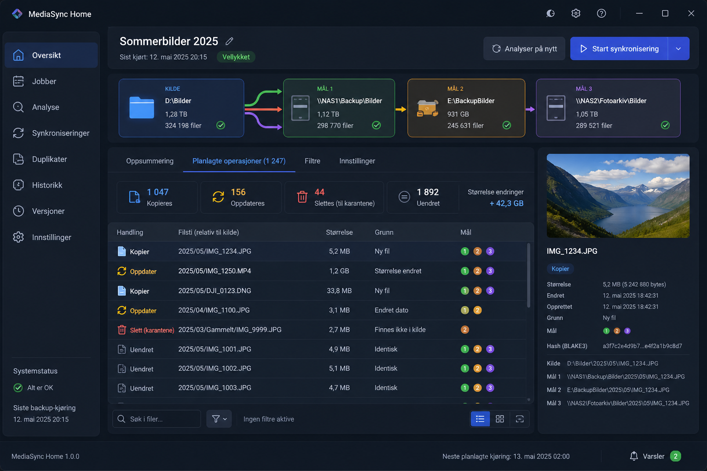

# MediaSync Home

**Rask, trygg og oversiktlig backup av store bilde- og videosamlinger på Windows.**

MediaSync Home er et planlagt Windows-program for å kopiere og synkronisere filer mellom lokale disker, USB-disker og SMB/NAS. Hovedflyten er enkel: velg én kilde, velg opptil tre backupmål, kontroller endringene og start backupen.

[Prosjektstatus](docs/IMPLEMENTATION_STATUS.md) · [Roadmap](docs/RELEASE_SCOPE.md) · [Dokumentasjon](docs/README.md) · [GUI og UX](docs/GUI_AND_UX.md) · [Start med Codex](docs/CODEX_START_PROMPT.md)

> **Prosjektstatus: spesifikasjon / pre-alpha.** Repositoryet inneholder foreløpig produktkrav, arkitektur, kontraktsutkast, testplan og avgrensede Codex-arbeidsordrer. Det finnes ingen installasjonsklar eller produksjonstestet app ennå. Ikke bruk prototyper på den eneste kopien av verdifulle filer.



*Konseptskissen viser ønsket stemning, informasjonsmengde og dataflyt. Den er ikke pikselbindende; den kanoniske navigasjonen og de bindende UX-reglene finnes i [GUI- og UX-spesifikasjonen](docs/GUI_AND_UX.md).*

## Kort fortalt

MediaSync Home skal gjøre dette lett å forstå:

```text
Dette vil jeg beskytte
        ↓
Her vil jeg ha opptil tre kopier
        ↓
Kontroller endringer
        ↓
Kjør backup og se hva som faktisk ble verifisert
```

Prosjektet er laget for store private samlinger med bilder, RAW-filer, video, sidecar-filer og andre filtyper. Det skal fungere uten internett og uten telemetri.

## Planlagte hovedfunksjoner

| Område | Planlagt opplevelse |
|---|---|
| Backup til flere mål | Én kilde kan sikkerhetskopieres til opptil tre uavhengige disker eller NAS-mål. |
| Synkroniseringsmoduser | Oppdater, speil med karantene og senere avansert toveissynkronisering. |
| Forhåndskontroll | Vis kopieringer, erstatninger, konflikter og karantene før risikofylt kjøring. |
| Identiske filer | Behovsstyrt BLAKE3-verifisering og tydelig skille mellom bekreftet identiske filer og metadata-likhet. |
| Høy ytelse | Robocopy som kontrollert overføringsmotor, strømmet skanning, avgrensede køer og adaptiv ressursbruk. |
| Gjenoppretting | Staging, versjonslager, karantene, historikk og krasjsikker recoveryprotokoll. |
| Automatisering | Manuell kjøring, tidsplan, pålogging, oppstart, disktilkobling og filendringer uten Windows-tjeneste. |
| Windows-GUI | Norsk og engelsk PySide6-grensesnitt med lys/mørk modus, tilgjengelighet og full fremdriftsvisning. |

## Sikkerhet før bekvemmelighet

MediaSync Home skal aldri oppnå høy hastighet ved å skjule risiko. De viktigste løftene i designet er:

- Robocopy får bare skrive til et kontrollert stagingområde, aldri direkte til sluttområdet.
- `/MIR`, `/PURGE`, direkte overskriving og skjult permanent sletting er forbudt.
- Eksisterende filer bevares gjennom versjonering eller karantene før erstatning.
- En ufullstendig eller utdatert analyse kan ikke autorisere destruktive operasjoner.
- Hvert skrivbart mål identifiseres og eies av én autorisert installasjon per eierskapsepoke.
- Recovery baseres på varig journal, idempotente steg og faktisk filtilstand etter krasj.
- GUI-et skiller mellom overført, metadata-kontrollert, innholdsverifisert og varig skrevet data.

Se [arkitekturen](docs/ARCHITECTURE.md), [recoveryprotokollen](docs/RECOVERY_PROTOCOL.md) og [endepunkteierskap](docs/ENDPOINT_OWNERSHIP.md) for detaljene.

## Prosjektstatus

| Felt | Nåværende status |
|---|---|
| Spesifikasjonspakke | `v2.9.2` |
| Produktkode | Ikke startet |
| Aktiv arbeidsordre | `0A.0 — miljø- og sikkerhetspreflight` |
| Første leverbare produktmål | Alpha 0.1: én kilde, ett mål og bare nye filer |
| Støttet plattformmål | Windows 10 og Windows 11, x64 |
| Nedlastbar app | Ikke tilgjengelig ennå |
| Lisens | Ikke valgt ennå |

Den detaljerte statusen vedlikeholdes i [IMPLEMENTATION_STATUS.md](docs/IMPLEMENTATION_STATUS.md). En tom eller blokkert test skal aldri omtales som bestått.

## Roadmap

| Leveranse | Omfang |
|---|---|
| **Arkitekturbevis 0A** | Verifiser Windows-prosessmodell, IPC, Robocopy-containment, SMB-lås, recovery, SQLite og pakking. |
| **Alpha 0.1** | Én kilde, ett mål, bare nye filer, manuell kontroll, staging og verifisering. Ingen erstatning eller sletting. |
| **Alpha 0.2** | Erstatning, versjoner, recovery og historikk. |
| **Beta** | Tre mål, NAS/USB, automatikk og duplikatvisning. |
| **1.0** | Speiling med karantene og full gjenoppretting. |
| **Senere** | Reverse-moduser, toveis synkronisering og kontrollert overtakelse av fremmed endpoint. |

[Se den kanoniske leveransestigen.](docs/RELEASE_SCOPE.md)

## Finn riktig inngang

| Jeg vil … | Start her |
|---|---|
| forstå produktet | [Produktkrav](docs/PRODUCT_REQUIREMENTS.md) og [GUI/UX](docs/GUI_AND_UX.md) |
| se hva som skjer nå | [Implementeringsstatus](docs/IMPLEMENTATION_STATUS.md) og [milepæler](docs/MILESTONES.md) |
| vurdere sikkerheten | [Arkitektur](docs/ARCHITECTURE.md), [recovery](docs/RECOVERY_PROTOCOL.md) og [testplan](docs/TEST_PLAN.md) |
| finne en bestemt fagfil | [Dokumentasjonsindeksen](docs/README.md) |
| gi første oppgave til Codex | [AGENTS.md](AGENTS.md), [overleveringssjekklisten](docs/HANDOFF_CHECKLIST.md) og [startprompten](docs/CODEX_START_PROMPT.md) |
| arbeide med kontrakter | [schema/README.md](schema/README.md) og [kontraktsmanifestet](schema/contracts-manifest.yaml) |
| forstå beslutningene | [ADR-katalogen](docs/adr/README.md) og [beslutningsregisteret](docs/DECISION_REGISTER.md) |

## Kom i gang med spesifikasjonspakken

Kjør dette i et rent repository på Windows før første Codex-endring:

```powershell
python -m pip install -r requirements-handoff.txt
python tools/validate_handoff.py --verify-bundle
git add .
git commit -m "chore: add MediaSync Home specification v2.9.2"
```

Gi deretter Codex bare innholdet i [`docs/CODEX_START_PROMPT.md`](docs/CODEX_START_PROMPT.md). Første økt skal utføre **kun 0A.0**, dokumentere miljø og blockers, og deretter stoppe.

Etter at baselinefilene er endret, brukes vanlig validering uten hashkontroll:

```powershell
python tools/validate_handoff.py
python tools/build_adr_docs.py --check
python tools/build_master.py --check
```

0B-utviklingskontrollene bruker de ekstra verktøyene i `requirements-dev.txt`:

```powershell
python -m pip install -r requirements-dev.txt
python -m mypy src
python tools/check_imports.py
python tools/audit_dependencies.py
```

## Repositoryet i korte trekk

```text
AGENTS.md                  Operativ arbeidsordre og sikkerhetsgrenser for Codex
README.md                  Denne GitHub-forsiden
MASTER_SPEC.md             Generert, konsolidert referanse — ikke rediger direkte
docs/README.md             Menneskevennlig dokumentasjonsindeks
docs/                      Kanoniske produkt-, UX-, arkitektur- og testdokumenter
docs/adr/catalog.yaml      Kanonisk ADR-status og eierbeslutning
schema/                    Maskinlesbare kontraktsutkast og tilstandsmaskiner
tools/                     Generatorer og streng overleveringsvalidator
```

Fagfilene under `docs/` er kanoniske. `MASTER_SPEC.md`, `docs/adr/README.md` og `docs/DECISION_REGISTER.md` er genererte visninger og skal ikke redigeres direkte.

## Arbeidsregler for Codex og fremtidige bidragsytere

- Arbeid i én avgrenset arbeidspakke om gangen.
- Bruk aldri ekte bilder, personlige filnavn eller produksjons-NAS i tester.
- Registrer eksakte kommandoer, miljøversjoner, råartefakter og blockers.
- Ikke erstatt manglende Windows- eller SMB-bevis med mocks og kall det bestått.
- Codex kan anbefale ADR-er, men bare prosjekteieren kan godkjenne dem.
- Sikkerhetsinvarianter kan ikke reduseres for å få en milepæl til å se ferdig ut.

Detaljer finnes i [AGENTS.md](AGENTS.md), [governance](docs/GOVERNANCE.md) og [repository-/kodekvalitetsreglene](docs/REPOSITORY_AND_CODE_QUALITY.md).

## Teknologi

Den planlagte stakken er:

- Python 3.14;
- PySide6 / Qt 6;
- SQLite for lokal tilstand;
- Robocopy som isolert overføringsmotor;
- BLAKE3 for behovsstyrt innholdsverifisering;
- Windows Task Scheduler for automatisering;
- Nuitka-basert Windows-pakking dersom arkitekturspiken bekrefter retningen.

Eksakte versjoner fryses først etter reproduserbare Windows-bevis.

## Personvern, lisens og uavhengighet

- Den planlagte appen fungerer lokalt og offline; ingen telemetri skal sendes ut.
- Repositoryet skal aldri inneholde NAS-passord, personlige filstier eller reelle brukerdata.
- Prosjektlisens er ikke valgt. Ikke anta tillatelse til gjenbruk eller distribusjon før en eksplisitt `LICENSE`-fil er lagt til.
- MediaSync Home er et uavhengig prosjekt. Allway Sync har bare vært en referanse for kjente arbeidsflyter; prosjektet bruker ikke proprietær kode, merkevareelementer eller kopiert grensesnitt.

---

**Neste kontrollerte steg:** [Milepæl 0A.0 — miljø- og sikkerhetspreflight](docs/CODEX_START_PROMPT.md).
