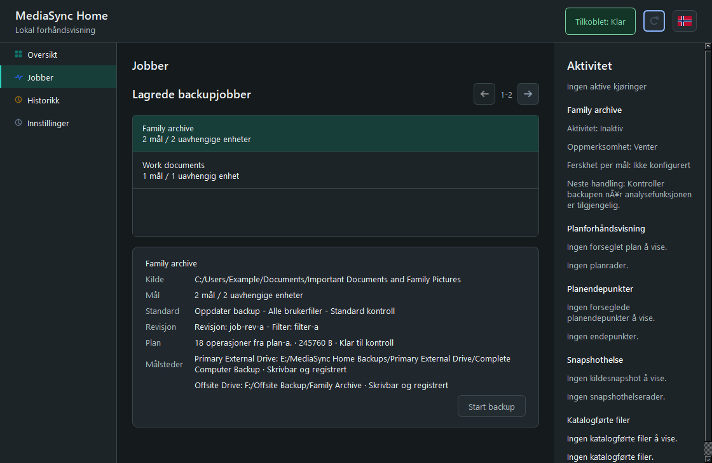

# MediaSync Home

[](https://github.com/thorelvin/MediaSync-Home/actions/workflows/ci.yml)
[](https://github.com/thorelvin/MediaSync-Home/releases)
[](LICENSE)
[](#system-requirements)

**A local-first Windows backup application for photos, videos, documents, and other important files.**

MediaSync Home helps you back up one source folder to local drives, USB disks, and SMB/NAS locations. It shows what will happen before a backup starts, verifies copied data, keeps a durable history, and is designed to recover safely if a run is interrupted.

It works locally, requires no cloud account, and sends no telemetry.

> [!IMPORTANT]
> MediaSync Home is currently an **unsigned alpha release**. Use test data first, keep another known-good copy of important files, and review every plan before starting a backup. Windows SmartScreen may warn about the installer because it is not yet code-signed.



## Why MediaSync Home?

- **Understand the plan first.** Review planned copies, replacements, conflicts, and target status before execution.
- **Back up to independent destinations.** Protect one source with up to three local, removable, or network targets.
- **Verify the result.** MediaSync distinguishes between transferred, metadata-checked, content-verified, and durably committed data.
- **Recover from interruptions.** Staging, operation journals, retries, and idempotent recovery make interrupted runs resumable.
- **Keep control of your data.** Backup state remains on your computer and files are never uploaded to a MediaSync service.
- **Use it in English or Norwegian.** The flag button in the upper-right corner changes the application language.

## Download And Install

1. Open the [MediaSync Home releases page](https://github.com/thorelvin/MediaSync-Home/releases).
2. Download the newest `MediaSyncHome-Setup-*-unsigned.exe` installer.
3. Close any running MediaSync Home window before installing an update.
4. Run the installer for your current Windows user.

The current public package is [MediaSync Home 0.1.0](https://github.com/thorelvin/MediaSync-Home/releases/tag/v0.1.0). The source tree contains the upcoming `0.1.1` alpha update.

The installer does not require administrator access for the standard same-user installation. It can configure same-user startup and scheduled backup tasks. Uninstalling removes verified MediaSync tasks and application files while preserving backup jobs, history, and local state in the user's AppData directory.

### SmartScreen Warning

The alpha installer is not digitally signed. Windows may display a SmartScreen warning even when the file came directly from this repository. Confirm that the download URL belongs to `github.com/thorelvin/MediaSync-Home` and review the release notes before continuing.

## Create Your First Backup

1. **Choose what to protect.** Select a source folder containing the files you care about.
2. **Choose where copies should go.** Add one or more local, USB, or SMB/NAS target folders.
3. **Review the plan.** MediaSync scans both sides and explains the proposed operations.
4. **Start the backup.** Follow per-target progress from the Jobs page and inspect the final result in History.

Targets are registered before MediaSync writes to them. A target must be available, writable, and owned by the current installation before a mutating operation can proceed.

## Current Capabilities

| Area | Available in the alpha |
|---|---|
| Backup jobs | Create, edit, archive, permanently delete, and run saved jobs |
| Destinations | Local folders, removable drives, and SMB/NAS paths |
| Multiple targets | Up to three independently tracked targets per job |
| Planning | Snapshot-based preview with copy, replacement, conflict, and safety decisions |
| Execution | Controlled Robocopy batching into staging, followed by verified final commit |
| Verification | File-size, metadata, content-hash, named-stream, and durability evidence where supported |
| Recovery | Durable operation journals, bounded retries, pause/resume, and restart recovery |
| History | Run, target, operation, verification, version, and recovery details |
| Automation | Manual runs and same-user Windows Task Scheduler integration |
| Interface | Responsive PySide6 desktop UI in English and Norwegian, with light and dark themes |

## Safety Model

MediaSync Home is deliberately conservative around existing data:

- Robocopy writes only into a controlled staging area, never directly over the final file.
- Destructive Robocopy modes such as `/MIR` and `/PURGE` are not used.
- Existing data is preserved through version or quarantine workflows before replacement.
- A stale, incomplete, or identity-mismatched analysis cannot authorize destructive work.
- Each writable target uses ownership records, endpoint leases, and fencing tokens.
- Recovery decisions use durable journal state and the file system's observed state after a crash.
- Permanent job deletion removes MediaSync metadata; it does not delete the user's source or backup files.

The detailed design is documented in [Architecture](docs/ARCHITECTURE.md), [Recovery Protocol](docs/RECOVERY_PROTOCOL.md), and [Endpoint Ownership](docs/ENDPOINT_OWNERSHIP.md).

## Performance

The current implementation batches compatible Robocopy transfers, avoids redundant full-file reads, wakes queued work immediately, and streams large snapshot datasets through bounded SQLite batches.

Local development measurements for the `0.1.1` source tree include:

- **200 small files:** 71.402 ms in one batch versus 2775.242 ms with one process per file, a 38.868x process-amortization improvement.
- **1,000,000 snapshot entries:** 80.544 seconds with 31.3 MiB peak RSS in the bounded pipeline benchmark.

These are development measurements, not universal speed guarantees. Hardware, antivirus software, storage, network conditions, and verification settings all affect real backup performance. Reproduction commands and raw evidence are listed in [Benchmarks](docs/BENCHMARKS.md), and release limits are defined in [Performance](docs/PERFORMANCE.md).

## System Requirements

- Windows 10 or Windows 11, x64
- A standard same-user Windows account
- Enough free space on each target for the selected backup
- Network access to any configured SMB/NAS destination

Building from source additionally requires Python 3.10 or newer. Creating the Windows installer requires [Inno Setup 6](https://jrsoftware.org/isinfo.php).

## Run From Source

From PowerShell in the repository root:

```powershell
py -3.10 -m venv .venv
.venv\Scripts\python.exe -m pip install -r requirements-dev.txt
$env:PYTHONPATH = "src"
.venv\Scripts\python.exe -m mediasync_home
```

The desktop UI starts a local Engine Host in the same user session. Application databases and runtime state are stored below the user's local AppData directory.

## Build The Windows Installer

Install Inno Setup and run the verified build and smoke-test tools:

```powershell
winget install --id JRSoftware.InnoSetup -e --scope user
.venv\Scripts\python.exe tools\build_installer.py
.venv\Scripts\python.exe tools\installer_smoke.py dist\MediaSyncHome-Setup-0.1.1-unsigned.exe
```

The unsigned installer is written to `dist\MediaSyncHome-Setup-0.1.1-unsigned.exe`.

## Development And Validation

The repository uses domain, application, adapter, IPC, presentation, composition, and process boundaries enforced by import contracts. SQLite schemas and protocol contracts are versioned and validated alongside the code.

Common checks:

```powershell
.venv\Scripts\python.exe -m pytest -q
.venv\Scripts\python.exe -m ruff check .
.venv\Scripts\python.exe -m mypy src
.venv\Scripts\python.exe tools\check_imports.py
.venv\Scripts\python.exe tools\validate_contracts.py
.venv\Scripts\python.exe tools\check_performance_gates.py --self-test
```

Start with the [documentation index](docs/README.md) for the product requirements, architecture, UI behavior, contracts, test strategy, and release scope. The consolidated [MASTER_SPEC.md](MASTER_SPEC.md) is generated from the canonical documents under `docs/` and should not be edited directly.

## Project Status And Limitations

MediaSync Home is under active alpha development. The repository contains a working Windows application, installer, real-file copy tests, recovery coverage, and same-user automation. It is not yet a signed production release.

The current release does not promise:

- code-signed installation packages;
- macOS or Linux support;
- cloud-storage destinations;
- unattended Windows service operation;
- general-purpose two-way synchronization;
- a substitute for maintaining multiple independent backups.

See [Implementation Status](docs/IMPLEMENTATION_STATUS.md) and [Release Scope](docs/RELEASE_SCOPE.md) for detailed progress and planned work.

## Privacy And License

MediaSync Home is designed to operate locally and offline. The application does not send telemetry and this repository must not contain credentials, personal paths, or real user data.

The project is licensed under the [MIT License](LICENSE). Third-party components retain their own licenses and notices.

MediaSync Home is an independent project. It does not contain proprietary code, branding, or interface assets from other synchronization products.
