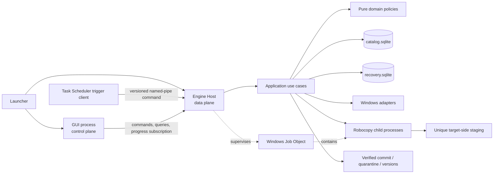
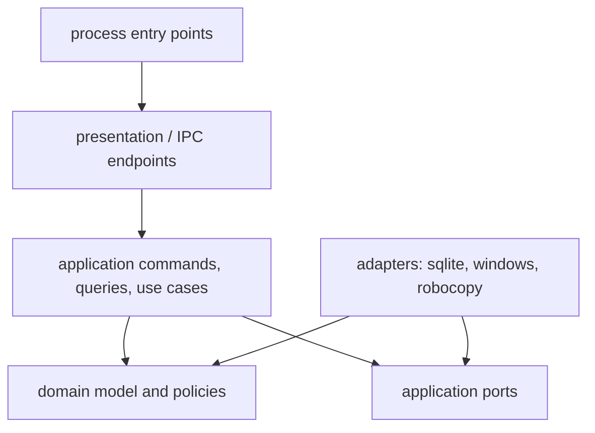

# Arkitektur og sikkerhetsmodell


> **Status:** Kanonisk fagfil for MediaSync Home v2.9.2. `MASTER_SPEC.md` genereres fra fagfilene og skal ikke redigeres direkte. Ved konflikt gjelder presedensen i `AGENTS.md`.


Systemgrenser, prosesser, porter, leases, handoffs, trust boundaries og arkitekturbeslutninger.


## 4. Sikkerhetsmodell og invarianter

### 4.0 Trussel- og feilmodell

MediaSync Home skal beskytte mot realistiske feil i et hjemmeoppsett:

- app-, GUI-, Engine Host- eller Robocopy-krasj;
- strømbrudd og uventet Windows-omstart;
- NAS-/USB-frakobling og midlertidig nettverksbrudd;
- dupliserte Task Scheduler-triggere og samtidige launcherprosesser;
- to MediaSync-installasjoner eller maskiner som forsøker å skrive samme mål;
- mål- eller kildefiler som endres etter analyse;
- feil disk, feil share, stialias, reparse point og rot-overlap;
- full disk, databasebusy, database-/migrasjonsfeil og ufullstendig skann;
- korrupte eller uventede IPC-meldinger;
- uventet oppgradering mens arbeid pågår.

Følgende ligger utenfor garantien og skal beskrives ærlig i brukerhåndboken:

- en ondsinnet lokal administrator eller prosess med samme brukerrettigheter som bevisst endrer databaser, kontrollmapper eller IPC;
- ransomware som har samme eller høyere tilgang enn brukeren;
- lagringsmaskinvare/NAS som bekrefter flush uten å gjøre data fysisk varige;
- bitråte som ikke oppdages uten en eksplisitt integritetskontroll;
- punkt-i-tid-konsistens uten VSS eller endepunktspesifikk snapshotteknologi.

Sikkerhetsmodellen skal derfor aldri markedsføre vanlige backupkopier som ransomware-sikre, offline eller fysisk uavhengige uten faktisk bevis.

### 4.1 Endepunktidentitet, eksklusivt writer-eierskap og kontrollområde

Et endepunkt en jobb kan skrive til, registreres eksplisitt med **Registrer som skrivbart MediaSync-endepunkt**. Registreringen oppretter produktmetadata, men kopierer, erstatter eller flytter ingen brukerfiler. En strengt skrivebeskyttet kilde i `multi_target_backup` kan identifiseres uten kontrollområde. I `pair_sync` må begge endepunkter som kan motta data være registrert.

#### 4.1.1 Én writer-installasjon per skrivbart rotområde

Første komplette hjemmeversjon bruker ikke distribuert multi-writer-koordinering. Den bindende modellen er:

> Ett skrivbart MediaSync-rotområde har nøyaktig én autorisert `owner_installation_id` i én monoton `ownership_epoch`.

En annen installasjon eller maskin kan lese, analysere og vise historisk kontrollmetadata, men kan ikke stagingkopiere, versjonere, karanteneflytte, reparere kontrollområdet eller endre final tree. Lokal fencing er tuple:

```text
(ownership_epoch, local_fencing_token)
```

`local_fencing_token` er bare monoton innen samme eierskapsepoke og må aldri sammenlignes globalt mellom installasjoner. En overtatt eller reinstallert writer får ny `installation_id` og høyere `ownership_epoch`; alle permits, intents og workerresultater fra eldre epoke er stale.

#### 4.1.2 Fysisk kontrollstruktur

Kontrollområdet er globalt for endpointidentitet/lås og namespacet per installasjon for arbeidsobjekter:

```text
<writable-endpoint-root>\.mediasync
├── endpoint.json
├── ownership
│   ├── epoch-00000001.json
│   └── epoch-00000002.json
├── locks
│   └── mutation.lock
└── installations
    └── <installation-id-short>
        ├── objects
        │   └── 3f
        │       └── <allocation-id>.payload
        ├── manifests
        │   └── <allocation-id>.json
        ├── recovery
        │   └── <run-id-short>
        │       └── segment-000001.intent.jsonl
        ├── probes
        └── temp
```

Globale objekter:

- `endpoint.json` — aktiv, checksummet markør med endpoint-ID, owner og eierskapsepoke;
- `ownership/epoch-*.json` — immutable eierskapsbevis og takeover-audit;
- `locks/mutation.lock` — global eksklusiv writerlock for hele rotområdet.

Installasjonsspesifikke objekter:

- korte staging-, version- og quarantineobjekter under `objects/`;
- immutable manifester som binder objekt-ID til logisk rolle, original relativ sti, operation/run og innholdsfingerprint;
- bounded target-side intentsegmenter og probeobjekter.

En installasjon skal aldri rydde en annen installasjons namespace automatisk. Reinstallasjon bruker nytt namespace. Adoption av et gammelt namespace er en separat, journalført recovery-/overtakelsessaga.

#### 4.1.3 Markørformat

`endpoint.json` skal minst følge `schema/endpoint-marker.schema.json` og inneholde:

```json
{
  "control_schema_version": 4,
  "endpoint_id": "550e8400-e29b-41d4-a716-446655440000",
  "control_area_id": "550e8400-e29b-41d4-a716-446655440001",
  "owner_installation_id": "550e8400-e29b-41d4-a716-446655440002",
  "ownership_epoch": 7,
  "ownership_mode": "EXCLUSIVE_WRITER",
  "created_utc": "2026-07-15T12:00:00Z",
  "updated_utc": "2026-07-15T12:00:00Z",
  "expected_volume_id": null,
  "expected_share": "server/share/root",
  "root_identity_hash_algorithm": "BLAKE3-256",
  "root_identity_hash": "0000000000000000000000000000000000000000000000000000000000000000",
  "latest_ownership_record": "ownership/epoch-00000007.json",
  "canonicalization_algorithm": "JCS-RFC8785",
  "marker_checksum_algorithm": "BLAKE3-256",
  "marker_checksum": "1111111111111111111111111111111111111111111111111111111111111111",
  "application": "MediaSync Home"
}
```

`marker_checksum` er BLAKE3-256 over UTF-8-bytene fra `JCS-RFC8785`-kanonisering av hele objektet uten selve `marker_checksum`-feltet. Algoritme- og canonicalization-feltene inngår i det hashende objektet. JSON Schema-validering skal aktivere formatkontroll for `uuid` og `date-time`.

Markør og eierskapsrecord publiseres med unik tempfil, flush etter endpointpolicy og no-overwrite/same-directory rename etter den dokumenterte kontrollprotokollen. Ved takeover skrives først et immutable nytt epoch-record; deretter publiseres ny aktiv markør. En ukjent eller korruptert markør repareres ikke optimistisk.

#### 4.1.4 Klassifisering før ekskludering eller bruk

En katalog med navnet `.mediasync` klassifiseres før den kan brukes som kontrollområde eller ekskluderes fra snapshot:

```text
ABSENT
VALID_OWNED
VALID_FOREIGN
VALID_READ_ONLY_NEWER_SCHEMA
PARTIAL_CONTROL_AREA
UNKNOWN_EMPTY_DIRECTORY
UNKNOWN_NONEMPTY_DIRECTORY
CASE_ALIAS_COLLISION
CORRUPT_MARKER
```

| Tilstand | Tillatt oppførsel |
|---|---|
| `ABSENT` | Kan registreres etter eksplisitt brukerhandling og writable probe |
| `VALID_OWNED` | Normal kontrollbruk når owner/epoch/root matcher |
| `VALID_FOREIGN` | Read-only; tilby kontrollert overtakelsesveiviser |
| `VALID_READ_ONLY_NEWER_SCHEMA` | Read-only; ingen downgrade eller mutasjon |
| `PARTIAL_CONTROL_AREA` | Blokker mutasjon; åpne recoveryveiviser |
| `UNKNOWN_EMPTY_DIRECTORY` | Krev eksplisitt valg; ikke adopter automatisk |
| `UNKNOWN_NONEMPTY_DIRECTORY` | Hard blokkering; behandle som mulig brukerinnhold |
| `CASE_ALIAS_COLLISION` | Hard blokkering til navnekollisjon er løst manuelt |
| `CORRUPT_MARKER` | Read-only/recovery; ingen automatisk «reparasjon» |

Standardfilteret ekskluderer `.mediasync/**` bare når `VALID_OWNED`, `VALID_FOREIGN` eller `VALID_READ_ONLY_NEWER_SCHEMA` beviser et faktisk MediaSync-kontrollområde. På en ren kilde er en ukjent mappe med dette navnet vanlig brukerdata eller et synlig, blokkerende avvik — den forsvinner aldri stille.

#### 4.1.5 Kontrollert overtakelse

Overtakelse av `VALID_FOREIGN` er en eksplisitt saga:

1. ta global `mutation.lock` uten å stole på lokal database;
2. les markør, alle relevante ownership-records, intentsegmenter og namespaces read-only;
3. bevis at ingen aktiv målmutasjon eller uavklart fremmed recovery pågår;
4. vis gammel owner, siste kjente epoke, kontrollrester og konsekvens;
5. krev eksplisitt brukerbekreftelse og ny full analyse;
6. skriv immutable takeover-intent og nytt `ownership/epoch-N.json` med `N > previous`;
7. publiser ny checksummet `endpoint.json` med ny owner og epoke;
8. opprett ny lokal endpointrevisjon og invalider tidligere mutasjonsplaner;
9. tillat ingen mutasjon før full probe, full analyse og recoveryavstemming er bestått.

Hvis gammel epoke ikke kan bestemmes sikkert, er tilstanden `OWNERSHIP_RECOVERY_REQUIRED`; automatisk overtakelse er forbudt.

#### 4.1.6 Preflight før hver muterende kjøring

Engine Host skal verifisere:

- at rot og final namespace matcher lagret endpointrevisjon;
- at kontrollområdet klassifiseres `VALID_OWNED`;
- at `owner_installation_id` er lokal installasjon og `ownership_epoch` matcher planen/permiten;
- at `endpoint_id`, kontrollskjema, volum-/shareidentitet og root fingerprint stemmer;
- at global `mutation.lock` kan tas og holdes;
- at installasjonens object/manifest/recovery-roots faktisk ligger under riktig kontrollområde;
- at ingen fremmed namespace ryddes eller adopteres;
- at kapabilitetsprofil og fri plass tillater operasjonen;
- at actual final path fra handles fortsatt tilhører registrert rot.

Ved avvik stoppes kjøringen før brukerfiler endres. Kontrollområdet kan bare migreres eller repareres gjennom en eksplisitt, journalført flyt med ny endpointrevisjon.

### 4.2 Stibegrensning og reparse-herding

Implementer én sentral `SafePath`/`ReparseGuard`-grense. Alle filsystemoperasjoner bruker den; strengnormalisering alene er ikke tilstrekkelig.

Krav til intern sti:

- lagre faktisk Unicode-sti og separat, versjonert sammenligningsnøkkel;
- intern relativ separator er `/`, men adapteren genererer korrekt Windows-sti ved grensen;
- avvis `..`, absolutte fragmenter, drive-relative paths, ADS-fragmenter, device paths og alternative namespaces i bruker-/planrelative stier;
- avvis `.mediasync` og alle case-/Unicode-aliaser som kontrollsti med mindre den klassifiserte kontrollmarkøren eksplisitt autoriserer adapterrollen;
- kontroller at kombinert logisk sti ligger under endepunktroten;
- støtt `\\?\` og `\\?\UNC\` gjennom én adapter;
- ikke lower-case eller Unicode-normaliser det faktiske filnavnet;
- oppdag reserverte navn, trailing dots/spaces, ugyldige komponenter og lengdegrenser før kjøring.

Krav før hver mutasjon:

1. Åpne rot/foreldre med dokumenterte Win32-flagg og uten å følge et reparse point ukontrollert.
2. Inspiser alle relevante forfedre for reparse-attributt; standardpolicy avviser et nytt reparse point i den planlagte kjeden.
3. Hent final path fra handle der API/endepunkt støtter dette, og verifiser at den fortsatt ligger under registrert rotidentitet.
4. Verifiser parent/final file-ID eller annen identity-precondition når tilgjengelig.
5. Gjenta target-precondition umiddelbart før rename/replace/quarantine.
6. Dersom path resolution eller reparse-status endres mellom analyse og commit, sett operasjonen til `PLAN_STALE_REPARSE_CHANGED` eller `USER_DECISION_REQUIRED`; ikke prøv en alternativ sti.

Jobbvalidering skal avvise:

- mål i kilde eller kilde i mål;
- overlappende/nestede mål;
- overlappende sider i `pair_sync`;
- kjente lokale aliaser, junctions eller alternative stier til samme rot;
- UNC-overlap basert på normalisert server, share og relativ rot;
- overlap med en annen lagret jobb når minst én av rollene kan skrive. Rene read-only claims på samme kilde kan deles;
- et skrivbart rotområde eid av en annen `owner_installation_id` eller en uavklart eierskapsepoke.

Separate røtter på samme fysiske lagringsenhet kan tillates med tydelig advarsel om manglende uavhengighet. Stioverlap er en hard blokkering.

### 4.3 Uforanderlig plan og konfigurasjonsrevisjoner

Når analyse er ferdig, opprettes en plan bundet til eksakte uforanderlige revisjoner:

- `plan_id` og eventuelt `parent_plan_id`;
- `job_revision_id`;
- `endpoint_revision_id` og snapshot per rolle/mål;
- filtersett, filterversjon og rules hash;
- planner-, plan schema- og operation schema-versjon;
- utførelsespolicy og hash;
- kanonisk operasjonsstrøm;
- totaler og risiko per mål;
- checksumalgoritme og `plan_checksum`.

Kontrollsummen beregnes over en dokumentert kanonisk serialisering med stabil feltorden, eksakte integer-/nullregler og stabile relative stier. JSON-objektrekkefølge eller SQLite row order uten eksplisitt `ORDER BY` er ikke kanonisk.

Planen som vises og godkjennes er samme plan Engine Host utfører. Følgende oppretter ny analyse eller avledet plan:

- endret jobb-/filter-/endepunktrevisjon;
- endret utførelsespolicy;
- brukerens «hopp over», «behold begge» eller annen overstyring;
- planner/operation schema som ikke kan utføres semantisk identisk av gjeldende build.

En forseglet plan og dens operasjoner oppdateres aldri in-place. GUI-kommandoren refererer bare `plan_id`; Engine Host laster, verifiserer checksum og revaliderer preconditions.

### 4.4 Eierskap, leases, preconditions og destruktiv sperre

Ingen muterende target-operasjon utføres uten:

- aktiv Engine Host-eierskap;
- kontrollområde klassifisert `VALID_OWNED`;
- matching `owner_installation_id` og `ownership_epoch`;
- lokal run-/resourcelease;
- globalt eksklusivt endpoint lock-handle når endepunktet støtter sikker mutasjon;
- en lokal monoton `fencing_token` bundet til samme eierskapsepoke;
- matching endpointrevisjon/generasjon og planchecksum;
- eksplisitt source- og target-precondition;
- recoveryintensjon før irreversibelt steg;
- en levende, ikke-serialiserbar `MutationPermit` utstedt av ownership-/lease-/pathlaget.

`MutationPermit` binder minst:

```text
installation_id
ownership_epoch
lease_id
resource_key
local_fencing_token
endpoint_revision_id + endpoint_generation
validated root/control handles
tillatt mutasjonsscope
plan/operation binding
```

Den kan ikke opprettes fra IPC, JSON, en rå sti, en boolsk verdi eller en stale recoveryrad. Bare ownership-/leaseadapteren kan utstede den etter vellykket kontrollmarkørvalidering, global OS-lock og recoveryregistrering. Bare commit-, karantene-, versjons- og katalogadapterne kan konsumere den.

#### 4.4.1 Eierskaps- og fencingregel

1. Klassifiser kontrollområdet og verifiser `VALID_OWNED`.
2. Ta global `mutation.lock` på målroten.
3. Les aktiv marker/ownership-record på nytt gjennom validert handle.
4. Avvis dersom owner eller `ownership_epoch` er endret.
5. Recoverywriteren øker lokal token for ressursnøkkelen og registrerer `(ownership_epoch, local_fencing_token)` i én transaksjon.
6. Dersom registreringen feiler, lukkes lock-håndtaket og ingen permit utstedes.
7. Coordinator-, worker- og batchmeldinger bærer begge tokenkomponenter, men kan ikke selv mutere.
8. Rett før sideeffekt validerer adapteren markør, global lock, epoke, permit og lokal token.
9. Lease loss, ownerendring eller høyere eierskapsepoke ugyldiggjør alle eldre permits, meldinger, intents og staging som mutasjonsautorisasjon.

En lokal token fra epoke 12 kan aldri sammenlignes som «nyere» enn en token fra epoke 13. Epoken avgjør først; lokal token avgjør bare innen epoken.

#### 4.4.2 Degradert modus uten pålitelig endpointlock

Et endepunkt uten pålitelig eksklusiv kontrollås får ikke vanlig `UPDATE_FORWARD`. Den eneste mulige muterende degraderingen er:

```text
COPY_NEW_ONLY_NO_REPLACE
```

Dette er bare lov når alle punkter er bevist og dokumentert av endpointprofilen:

- målsti var `ABSENT` ved analyse;
- filen er fortsatt fraværende rett før innsetting;
- adapteren støtter sikker no-overwrite-innsetting;
- ingen eksisterende fil, katalog eller metadata erstattes;
- ingen versjonering, karantene, retention, speiling eller toveisoperasjon kjøres;
- automatisk kjøring er av som standard og GUI viser redusert sikkerhetsnivå.

Hvis sikker no-overwrite-innsetting ikke kan bevises, er endepunktet read-only. «Best effort overwrite» er forbudt.

#### 4.4.3 Target-preconditions

Target-preconditions bruker compare-and-swap-semantikk:

- `ABSENT` — final path må fortsatt mangle;
- `MATCH_FINGERPRINT` — eksisterende mål må fortsatt matche planens fingerprint, type, file-ID-evidence, parentidentity og case-kontekst;
- `DIRECTORY_EMPTY` — katalogen må fortsatt være forventet tom katalog;
- `NONE` — bare lovlig for ikke-muterende planrader.

Dersom en annen app, bruker eller maskin endrer målet etter analyse, skal MediaSync ikke overskrive endringen. Operasjonen blir `TARGET_CHANGED_SINCE_ANALYSIS`; resten kan fortsette bare når avhengigheter og sikkerhet tillater det.

#### 4.4.4 Destruktiv sperre

Karantene-/sletteoperasjoner blokkeres når minst ett av følgende gjelder:

- skann/coverage er ufullstendig eller relevant katalog er volatile/unreadable;
- rot, kontrollklassifisering, owner, eierskapsepoke eller endpointidentitet er endret;
- endpointlease eller global lock mangler/mistes;
- terskler for count, byte eller prosent overskrides;
- mer enn 10 % av tidligere observerte kildefiler plutselig mangler;
- I/O-, database- eller nettverksfeil gjør absence proof usikkert;
- baseline mangler for toveis sletting;
- tids-, case-, hash-evidens- eller kapabilitetssemantikk er ukjent;
- source/target/parent-precondition avviker;
- reparse point, path chain eller final path er endret;
- planen er bygget av inkompatibel planner/operation schema.

Før fase 40–50 skal motoren gjøre destruktiv revalidering:

- valider owner/epoch/global lock/leases og endpointidentity på nytt;
- verifiser coverage og at hver planlagt target-extra fortsatt mangler på kilden;
- revalider målobjektets fingerprint før quarantine;
- blokker alle gjenværende destruktive operasjoner i berørt scope dersom én relevant fraværspåstand ikke kan bevises;
- allerede verifiserte ikke-destruktive commits kan fullføres sikkert uten at drift tolkes som slettetillatelse.

Standard terskler:

```text
Maks karantenefiler uten ekstra bekreftelse: 100
Maks karantenebyte uten ekstra bekreftelse: 50 GiB
Maks andel av målinnhold: 5 %
Plutselig kildetap som blokkerer destruktive handlinger: 10 %
```

Terskler kan justeres per jobb, men hard safety gates kan ikke deaktiveres.

### 4.5 Staging, durability, commit og varig recovery

Filsystemet, katalogdatabasen og recoverydatabasen er tre separate failure domains. Commit er derfor en journalført compare-and-swap-protokoll med idempotente overganger.

#### 4.5.1 Operasjonstilstander

```text
PLANNED
  -> SOURCE_VALIDATED
  -> SOURCE_STABILITY_BOUND
  -> TARGET_PRECONDITION_VALIDATED
  -> STAGING_ALLOCATED
  -> TRANSFERRED
  -> STAGING_DURABLE
  -> STAGING_VERIFIED
  -> COMMIT_INTENT_RECORDED
  -> COMMIT_PRECONDITIONS_REVALIDATED
  -> OLD_TARGET_PRESERVED      # bare fallback
  -> FILESYSTEM_APPLIED
  -> FINAL_DURABLE
  -> FINAL_VERIFIED
  -> CATALOG_RECORDED
  -> CLEANED
```

Terminale/avvikende tilstander:

```text
SKIPPED
CONFLICT
DEFERRED
FAILED_RETRYABLE
FAILED_BLOCKED
CANCELLED
ROLLBACK_REQUIRED
USER_DECISION_REQUIRED
```

Hver overgang skal:

- være tillatt fra en eksplisitt foregående tilstand;
- appendes og committes i `recovery.sqlite` før neste irreversible steg;
- inneholde lease/resource key, endepunkt-/planrevisjoner, bare endepunktrelative stier, expected source/target/parent/staging/final fingerprints og durabilitynivå;
- ha idempotent command handler og verifiserbar postcondition;
- referere et immutable, checksummet target-side intentsegment før første irreversible målmutasjon;
- kunne fault-injiseres før og etter hvert filsystemsteg.

Et intentsegment er sekundært recoverybevis for en avgrenset commitbatch, ikke én fil per operasjon. Det skrives under:

```text
.mediasync\installations\<installation-id-short>\recovery\<run-id-short>\segment-<sequence>.intent.jsonl
```

Segmentet skal:

- inneholde kanoniske intentrader for maksimalt 10 000 operasjoner eller 16 MiB, det som nås først;
- bare bruke relative stier, persistente IDs, fingerprints, endpointgenerasjon, `lease_id`, `fencing_token` og plan-/manifestchecksum;
- skrives til unik tempfil, flushes etter endepunktpolicy og publiseres med no-overwrite rename;
- få en separat manifest/header med schema, antall, byte, segmenthash og tidligere segmenthash;
- være uforanderlig etter publisering;
- være `DURABLE` før noen operasjon i segmentet får gå fra `STAGING_VERIFIED` til `COMMIT_INTENT_RECORDED`;
- beholdes til alle refererte operasjoner er terminale, catalog er avstemt og retentionregelen tillater cleanup.

Dette unngår millioner av små kontrollfiler uten å miste sekundært bevis. Segmentet viser hva MediaSync hadde til hensikt; faktisk filtilstand og primær recoveryjournal avgjør hva som virkelig skjedde.

#### 4.5.2 Normal flyt for ny eller endret fil

1. Kontroller `VALID_OWNED`, owner/epoch, global lock, aktiv lease, endpointrevisjon og planchecksum.
2. Revalider kildefilen mot planens source fingerprint, entry type, reparse tag, volume/file-ID-evidence, parentidentity, path-chain-hash og parent case-context; registrer `SOURCE_VALIDATED`.
3. Forsøk å ta `SourceReadGuard` for den aktive filen eller den lille aktive batchen. På støttede lokale/SMB-endepunkter holdes et read-handle som tillater lesere, men blokkerer skrive-/delete-deling gjennom transferen. Dersom dette ikke er pålitelig, bind eksplisitt alternativ policy: `POST_TRANSFER_CURRENT_HASH_REQUIRED` eller `DEFER_UNSTABLE_SOURCE`. Registrer `SOURCE_STABILITY_BOUND`.
4. Revalider måltilstand mot `ABSENT` eller `MATCH_FINGERPRINT`; registrer `TARGET_PRECONDITION_VALIDATED`.
5. Opprett en kort, unik stagingallokering under installasjonens object namespace; registrer `STAGING_ALLOCATED`. Manifestet inneholder original relativ sti, men fysisk objektsti speiler ikke brukertreet.
6. Kopier med supervisert Robocopy bare til stagingallokeringen; registrer `TRANSFERRED`.
7. Lukk Robocopy-håndtak, enumerer allokeringen, normaliser til `<allocation-id>.payload`, reopen og flush etter endepunktpolicy; registrer faktisk durability som `STAGING_DURABLE`.
8. Les kildeidentitet på nytt. Dersom `SourceReadGuard` ikke ga tilstrekkelig bevis, beregn en nåværende source-hash etter transfer. Sikker modus krever `current source hash == staging hash`; mismatch gir `SOURCE_CHANGED_DURING_TRANSFER` og ingen commit.
9. Verifiser staging med eksplisitt assurance/evidens; registrer `STAGING_VERIFIED`.
10. Kontroller at immutable intentsegment er publisert, checksummet, `DURABLE` og bundet til samme owner/epoch/lease/token som permiten; registrer `COMMIT_INTENT_RECORDED`.
11. Revalider owner/epoch/permit/global lock, final path/reparse/parentidentity/case-context, source og targetprecondition; registrer `COMMIT_PRECONDITIONS_REVALIDATED`.
12. Bruk sikreste støttede operasjon:
    - eksisterende vanlig fil, samme volum: `ReplaceFileW` med objektbasert versjonsbackup når profil/API støtter dette;
    - ny fil: same-volume no-overwrite rename/innsetting;
    - fallback: bevar gammel fil som kort versionobjekt med manifest, registrer `OLD_TARGET_PRESERVED`, og rename staging til final.
13. Ved enhver OS-feil: inspiser faktisk final/staging/version, file IDs, manifests og postconditions; returkode alene avgjør ikke state.
14. Registrer `FILESYSTEM_APPLIED`.
15. Bruk write-through rename/flush etter policy og registrer `FINAL_DURABLE` med ærlig durabilitynivå.
16. Verifiser finalfil og registrer assurance separat fra durability; registrer `FINAL_VERIFIED`.
17. Oppdater catalog outcome/audit/read models i separat kritisk transaksjon; registrer deretter `CATALOG_RECORDED` i recoveryjournalen.
18. Frigi `SourceReadGuard`. Fjern bare sikkert overflødig staging og tempobjekter; registrer `CLEANED`. Intentsegment og bevarte objekter ryddes separat etter referanse-/retentionregler.

Robocopy får aldri final path som destinasjon. Bare commitadapteren kan endre final tree.
#### 4.5.3 Krasjvinduer og recovery

| Observasjon etter oppstart | Sikker handling |
|---|---|
| Staging finnes, final er gammel/absent | Verifiser lease, intentsegment og staging; fortsett eller behold gammel/absent final |
| Gammel fil er bevart, final mangler | Fullfør med verifisert staging eller gjenopprett gammel fil |
| Ny final finnes, catalog mangler | Verifiser final og registrer catalog idempotent |
| Final og version finnes | Verifiser begge; slett ingen før state er entydig |
| Intentsegment finnes, lokal journal mangler | Blokker automatisk mutasjon, importer segmentet som sekundært bevis og krev sikker avstemming |
| Lokal journal finnes, intentsegment mangler før commit | Blokker operasjonen; ikke rekonstruer intent optimistisk etter målmutasjon |
| Målprecondition avviker fra både gammel og ny forventning | `USER_DECISION_REQUIRED`; aldri «nyeste vinner» |
| Ingen forventet fil finnes | Blokker og krev brukeravgjørelse |

Recovery må alltid ta endpointlease og få en ny aktuell `MutationPermit` før den endrer noe. En stale databaserad, gammel fencing token eller et gammelt intentsegment gir ikke i seg selv mutasjonstillatelse. Recovery kan gjenbruke bevis og staging, men må binde eventuell ny sideeffekt til den nye permiten i en eksplisitt journalovergang.

#### 4.5.4 Cross-store handoff mellom catalog, recovery og filsystem

Katalogdatabasen og recoverydatabasen skal aldri låses i samme write-transaksjon. Overgangen inn og ut av en muterende run bruker en eksplisitt saga/handoff med én `handoff_id`, retning, payloadschema, canonical payloadhash og idempotente faser.

Den generiske handofftilstanden er monoton:

```text
PREPARED
  -> PEER_COMMITTED
  -> SOURCE_CONFIRMED
  -> COMPLETED
  -> ABORTED | AMBIGUOUS       # bare etter type-spesifikk regel
```

`SOURCE` betyr databasen som opprettet handoffen; `PEER` betyr den andre databasen. Begge sider lagrer samme ID, retning, payloadschema og payloadhash. Domeneobjektet kan ha egne faser, men de skal aldri brukes som erstatning for handoffens generiske avstemmingsstate.

Runstart (`catalog_to_recovery`):

```text
run: CREATED_NOT_READY
catalog handoff: PREPARED
  -> recovery run + peer handoff: PEER_COMMITTED
  -> catalog run: QUEUED/READY + source handoff: SOURCE_CONFIRMED
  -> begge handoffs: COMPLETED ved avstemming
```

1. En kritisk catalogtransaksjon oppretter `run`, `run_targets`, command receipt og `store_handoff=PREPARED`; receipt står i `EFFECT_PREPARED`, og run er ikke kjørbar.
2. Etter commit validerer recoverywriteren payloaden og oppretter matching `recovery_run` + `recovery_handoff=PEER_COMMITTED` i én separat transaksjon.
3. En ny catalogtransaksjon verifiserer matching peercommit, setter run kjørbar, `store_handoff=SOURCE_CONFIRMED` og command receipt `ACCEPTED` i samme commit.
4. Først etter denne transaksjonen kan Engine Host svare varig `ACCEPTED`, ta mutationleases og starte filarbeid.
5. Reconciler markerer begge sider `COMPLETED` når source-confirmation er observert. Dette er housekeeping; run-tillatelsen kommer fra trinn 3, ikke fra en usikker IPC-hendelse.
6. Krasj mellom fasene avstemmes ved oppstart. En ensidig `PREPARED` ferdigstilles eller aborteres etter type-regelen; receipt løftes aldri til `ACCEPTED` uten matching recoverybinding.

Terminal katalogføring (`recovery_to_catalog`):

1. Recoveryoperasjonen når `FINAL_VERIFIED` og oppretter `recovery_handoff=PREPARED` med operation-/run-/plan-/fencingkontekst.
2. En kritisk catalogtransaksjon validerer handoffpayload og skriver idempotent outcome/audit/read model; matching `store_handoff=PEER_COMMITTED` opprettes i samme commit.
3. Recoverywriteren observerer catalogcommit, registrerer `CATALOG_RECORDED` og `recovery_handoff=SOURCE_CONFIRMED` i samme recoverytransaksjon.
4. Reconciler markerer begge sider `COMPLETED`. Dersom krasj skjer mellom 2 og 3, gjenkjenner startup det allerede committede outcome via samme IDs/payloadhash og fullfører uten duplikat.

Type-regler:

- `ABORTED` er bare lovlig før peer har publisert en irreversibel autoritativ effekt, eller etter bevist kompensasjon.
- `AMBIGUOUS` blokkerer nye mutasjoner i berørt scope og krever faktisk fil-/databaseinspeksjon.
- State kan ikke rulles bakover eller overskrives av «siste writer».
- Handoffpayload inneholder bare stabile IDs, schema, hashes, expected phases, lease/fencing og high-water; bulkdata refereres gjennom immutable entities.
- En handler holder aldri catalog-write lock mens den venter på recovery, filsystem eller IPC.
- Reconciliation har bounded retry, audit og én eier. Den kan ikke ligge som en uavgrenset best-effort-bakgrunnsoppgave.

Uenighet som ikke kan avgjøres fra IDs, hashes, fencing tokens, high-water og faktiske filer blir `RECOVERY_STATE_AMBIGUOUS`, ikke «siste database vinner».


#### 4.5.5 Katalogoperasjoner som egne recoveryprotokoller

Katalogoperasjoner skal ikke behandles som «ufarlige sideeffekter». De har egne monotone state machines og typepreconditions.

Opprett katalog:

```text
DIRECTORY_PLANNED
  -> DIRECTORY_PARENT_VALIDATED
  -> DIRECTORY_CREATE_INTENT_RECORDED
  -> DIRECTORY_CREATED
  -> DIRECTORY_IDENTITY_VERIFIED
  -> DIRECTORY_CATALOG_RECORDED
```

- `ABSENT` må fortsatt gjelde rett før oppretting;
- dersom en vanlig fil eller reparse point finnes på stien, er dette `TARGET_TYPE_CONFLICT`, ikke idempotent suksess;
- eksisterende katalog kan bare godtas som retry når identity/postcondition matcher operasjonen.

Katalogmetadata:

```text
DIRECTORY_METADATA_PLANNED
  -> CHILDREN_TERMINAL
  -> METADATA_PRECONDITION_VALIDATED
  -> METADATA_INTENT_RECORDED
  -> METADATA_APPLIED
  -> METADATA_VERIFIED
  -> DIRECTORY_CATALOG_RECORDED
```

Metadata settes etter alle underordnede filoperasjoner, dypeste katalog først, fordi arbeid under katalogen ellers kan endre tidspunktet igjen.

Karantene/restore av katalog:

```text
DIRECTORY_QUARANTINE_PLANNED
  -> DIRECTORY_EMPTY_REVALIDATED
  -> QUARANTINE_INTENT_RECORDED
  -> DIRECTORY_OBJECT_PRESERVED
  -> SOURCE_PATH_REMOVED
  -> QUARANTINE_CATALOG_RECORDED
```

```text
DIRECTORY_RESTORE_PLANNED
  -> RESTORE_TARGET_ABSENT_REVALIDATED
  -> RESTORE_INTENT_RECORDED
  -> DIRECTORY_RESTORED
  -> DIRECTORY_RESTORE_VERIFIED
  -> RESTORE_CATALOG_RECORDED
```

Recovery skal inspisere type, identity, parent, objectmanifest og faktisk final path. Den må aldri tolke «finnes» som tilstrekkelig postcondition når objektet har feil type eller tilhører en annen operasjon.

### 4.6 Ingen stille datatap

- Toveiskonflikter avgjøres ikke automatisk med «nyeste vinner» som standard.
- Samme navn og ulikt innhold medfører konflikt/versjon, ikke fjerning av én kopi.
- Duplikatdeteksjon er informativ og endrer ikke struktur.
- Fil som endres under kopi eller før commit committes ikke.
- Mål som endres etter analyse overskrives ikke; planen blir utdatert for den operasjonen.
- Reparse-/rotendring etter analyse blokkerer mutasjon.
- Verifiseringsfeil lar tidligere gyldig målversjon forbli tilgjengelig.
- Mistet lease stopper nye mutasjoner og utløser recovery/avstemming.
- Sideeffektfeil i varsling eller Task Scheduler kan ikke rulle tilbake eller skjule en korrekt filcommit.

---

## 9. Teknisk arkitektur

### 9.1 Arkitekturmål og bindende grenser

Arkitekturen skal gjøre det vanskelig å omgå sikkerhetsmodellen ved et uhell. Følgende grenser er bindende:

1. **Kontrollplan og dataplan er separate prosesser.** GUI-et viser og bestiller arbeid. Bare den headless Engine Host-prosessen kan forsegle planer, skrive autoritativ tilstand eller endre brukerfiler.
2. **Én tilstandseier per Windows-bruker og installasjon.** Engine Host er eneste eier av migrasjoner og skriveforbindelser til alle autoritative SQLite-state stores valgt av ADR-003.
3. **Domenet er rent.** `domain` importerer ikke Qt, SQLite, pywin32, Robocopy, filsystemadaptere, klokke eller prosess-API-er.
4. **Alle sideeffekter går gjennom porter.** Application-laget orkestrerer use cases mot eksplisitte `Protocol`-porter; adapters implementerer Windows-, SQLite- og Robocopy-detaljer.
5. **Ingen filsystemmutasjon uten lease, precondition og recoveryintensjon.** Et planlagt mål er ikke nok i seg selv.
6. **IPC-hendelser er ikke sannhetskilde.** Autoritativ tilstand er persistert; GUI-et kan koble fra og rehydrere uten å gjette.
7. **Eksterne sideeffekter er idempotente og avstemmes.** Task Scheduler, Windows-varsler og kontrollfiler behandles som ønsket tilstand pluss faktisk tilstand, ikke som del av en SQLite-transaksjon.
8. **Kompatibilitet er eksplisitt.** IPC-, plan-, kontrollmappe- og databaseskjema har egne versjoner. En ukjent nyere versjon skal blokkeres, ikke tolkes optimistisk.
9. **Mutasjon er kapabilitetsstyrt.** En raw path, boolsk «lease ok» eller generell filsystemport kan ikke autorisere final tree. Bare en smal adapter med levende `MutationPermit`, fencing token og verifisert artefakt kan mutere.
10. **Stale arbeid er inngjerdet.** Lease reacquire øker en monoton token; resultat fra eldre worker, batch, intent eller recoveryforsøk kan aldri brukes som ny sideeffekt.
11. **Idempotens overlever retention.** Command-, trigger- og deliverynøkler bevares som kompakte tombstones etter at detaljhistorikk er ryddet.
12. **Intern state er et par.** Backup, restore, migration og compaction behandler catalog/recovery som ett verifisert epoch-sett, selv om de skrives separat.
13. **Writer-eierskap er mål-side autoritet.** Én installasjon eier et skrivbart rotområde i én `ownership_epoch`; lokal Engine Host-singleton erstatter ikke endpointmarkøren eller global targetlock.
14. **Sammenligningssemantikk er kataloglokal.** Per-katalog case-kontekst og source/target path-chain-evidence inngår i snapshot og preconditions.
15. **Kontrollområdet er et objektlager.** Fysisk staging/version/quarantine bruker korte allokeringsstier; logiske brukerbaner finnes i immutable manifester.
16. **Kontrakter er maskinlesbare.** SQL, JSON Schema og YAML state machines er CI-validerte autoriteter for eksakte felter, enumverdier og overganger.

Disse grensene gjelder før ytelsesoptimalisering. Codex skal ikke «forenkle» ved å la GUI-et åpne en skrivbar databaseforbindelse, starte Robocopy direkte eller utføre filsystemmutasjoner.

### 9.2 Container- og prosessmodell



Produktet pakkes som ett installert produkt, men har fire interne roller:

| Rolle | Ansvar | Forbud |
|---|---|---|
| **Launcher** | Finn/start kompatibel Engine Host, start GUI eller send trigger | Ingen database- eller filsystemmutasjon |
| **GUI process** | Presentasjon, brukerinput, paginerte queries og kommandoer | Ingen skrivbar database, skanning, hashing, Robocopy eller commit |
| **Engine Host** | Eneste tilstandseier, use cases, scheduler, databasewriters, leases, recovery og prosessupervisjon | Ingen Qt-widgets eller mediedekoding |
| **Trigger client** | Lever én idempotent triggerforekomst til Engine Host og avslutt | Ingen direkte kjøring av jobb eller Robocopy |

Alle produktroller kjører som standard under den innloggede Windows-brukerens normale token. Engine Host skal ikke be om UAC-elevasjon, aktivere backup-/restoreprivilegier eller bruke administratorfast paths. Manglende tilgang blir en eksplisitt `ACCESS_DENIED`/policyblokkering. Installer kan bruke separat installasjons-elevasjon, men installert runtime og dets datafolder/pipe/mutex skal ikke arve administratoravhengig eierskap.

Robocopy er alltid et underordnet dataplan-prosess. GUI-et skal kunne lukkes eller krasje uten at Engine Host eller en aktiv kjøring mister eierskap. Process supervisor oppretter transferprosessen suspended, tilordner den et ikke-arvbart Windows Job Object med `KILL_ON_JOB_CLOSE`, avviser breakaway og gjenopptar først etter vellykket assignment. Mislykket assignment terminerer den fortsatt suspenderte prosessen og blokkerer batchen. Dersom Engine Host avsluttes uventet, stopper Job Object tilhørende Robocopy-prosesser, slik at de ikke fortsetter uten recoveryjournal og lease. Robocopy skriver bare til unike stagingområder; en tvungen avslutning kan derfor ikke overskrive en tidligere gyldig sluttfil.

En valgfri forhåndsvisningsarbeider kan brukes for bilde-/videodekoding. Den skal i så fall være en separat, lavt privilegert best-effort-prosess uten database-skrivetilgang, endepunktlegitimasjon eller tilgang til commitporter. Feil i preview skal aldri påvirke syncmotoren.

### 9.3 Engine Host-livssyklus og enkeltinstans

Engine Host er én logisk instans per kombinasjon av:

```text
Windows user SID
installation_id
product channel
```

Krav:

- launcher og Engine Host bruker et navngitt Windows-mutex med ACL begrenset til aktuell bruker og nødvendig `LOCAL_SYSTEM`-tilgang; singletonobjektet skal ligge i et eksplisitt cross-session namespace slik at interaktiv GUI og en Task Scheduler-startet bakgrunnshost ikke kan eie hver sin instans;
- mutex-/pipe-navn skal inkludere en hash av bruker-SID og `installation_id`, ikke rå brukernavn, og cross-session-oppsettet skal integrasjonstestes fra to Windows-sesjoner;
- en ny launcher kobler til eksisterende kompatibel host i stedet for å starte en ny;
- en host som starter, publiserer ikke «klar» før migrasjoner, integritetskontroll, recoveryavstemming og IPC-endepunkt er klare;
- en host med aktive runs, recovery eller utgående sideeffekter avslutter ikke på idle-timeout;
- idle avslutning krever tom kommandokø, tom writerkø, ingen leases, kontrollert WAL-checkpoint og terminal outboxstatus eller dokumentert retry;
- GUI-avslutning er ikke lik Engine Host-avslutning;
- installer/oppgradering skal be host om kontrollert avslutning og blokkere binærutskifting mens en aktiv filsystemovergang pågår;
- dersom en eldre host kjører etter oppgradering, skal launcher enten bruke en eksplisitt kompatibel protokoll eller stoppe med en klar versjonsmelding. Den skal aldri sende nyere kommandoer til en eldre host på antakelse.

### 9.4 Lokal IPC-protokoll

Bruk lokale Windows named pipes. Implementasjonen skal bruke Windows-sikkerhetsattributter og avvise eksterne klienter der API-et støtter det.

Bindende sikkerhetsregler:

- DACL tillater bare aktuell bruker-SID og nødvendig `LOCAL_SYSTEM`-tilgang;
- serveren bruker local-only/`PIPE_REJECT_REMOTE_CLIENTS` der støttet; ingen `Everyone`, anonym eller nettverkstilgang;
- etter connect verifiserer serveren faktisk klienttoken/SID gjennom Windows-pipe-API, samt tillatt integritetsnivå og sesjonsklasse; payloadens `role` eller `client_id` er aldri autentisering;
- sesjonspolicyen er rolle- og launchkontekststyrt, ikke `host_session == client_session`: GUI/tray må være en interaktiv sesjon for samme SID, mens en registrert trigger client kan komme fra en ikke-interaktiv Task Scheduler-sesjon for samme SID; begge valideres mot faktisk token og forventet installasjons-/launchkontekst;
- pipe-serveren bruker en unik `installation_id` og protokollversjon;
- første melding er en handshake med protokollversjon, app-build, rolle, klient-ID og tilfeldig launch nonce;
- en tilfeldig per-launch capability token overføres gjennom en arvet, ikke-logget mekanisme når launcher selv starter klienten; ACL og kontroll av faktisk klienttoken er fortsatt primærgrensen;
- samme-bruker-prosesser regnes ikke som en fullstendig sikkerhetssandbox. Trusselmodellen skal være ærlig om dette;
- meldinger er lengdeprefikset UTF-8 JSON eller en annen eksplisitt, ikke-eksekverbar wire-format; komprimerte rammer er ikke tillatt i første protokollversjon;
- Python `pickle`, `marshal`, dynamisk import og vilkårlig objektserialisering er forbudt;
- maksimal kommandoramme er 1 MiB, maksimal paginert queryrespons er 4 MiB og maksimal progresshendelse er 64 KiB;
- serveren har maksimum for samtidige klienter, subscriptions, utestående requests og frames per sekund, samt handshake-, read-, write- og idle-timeout; overload gir strukturert avvisning uten ubegrenset buffering;
- ukjente felter håndteres etter protokollens kompatibilitetsregel; ukjent obligatorisk felt eller nyere majorversjon blokkeres;
- alle payloads valideres før de når application-laget;
- ingen run-kommando inneholder en vilkårlig filsystemsti. Den refererer `job_id`, `plan_id`, `run_id` eller andre persisterte ID-er som Engine Host selv slår opp og revaliderer;
- launch nonce, capability token og klienttokenopplysninger logges aldri.

Kommandoenvelope:

```json
{
  "protocol_version": 1,
  "schema_version": 1,
  "message_type": "COMMAND",
  "request_id": "44444444-4444-4444-8444-444444444444",
  "client_instance_id": "55555555-5555-4555-8555-555555555555",
  "idempotency_key": "66666666-6666-4666-8666-666666666666",
  "command_name": "CREATE_STANDARD_BACKUP_JOB",
  "payload": {
    "draft_id": "77777777-7777-4777-8777-777777777777"
  },
  "expected_entity_revision": 12,
  "payload_hash_scope": "PAYLOAD_ONLY",
  "payload_canonicalization_algorithm": "JCS-RFC8785",
  "payload_hash_algorithm": "BLAKE3-256",
  "payload_hash": "7ab0d31208e5192e43abd8656d2034fa057d43b61e0966e97f764521f33e490c"
}
```

`protocol_version` er wire-protokollens majorversjon. `schema_version` versjonerer kommandoenvelopens form. Eksempelets `payload_hash` er BLAKE3-256 over JCS-RFC8785-kanoniske UTF-8-bytes av `payload` alene og er identisk med `schema/examples/ipc-command.valid.json`.

Alle muterende kommandoer skal:

1. valideres syntaktisk og semantisk;
2. registreres i `command_receipts` med installasjonsglobal unik `idempotency_key`, canonical payloadhash og command schema version;
3. avvises dersom samme nøkkel gjenbrukes med annet `command_name`, principal, `expected_entity_revision` eller payload;
4. returnere tidligere durable resultat ved identisk retry;
5. bruke optimistic concurrency gjennom forventet revisjon der et muterbart objekt endres;
6. opprette command receipt og den første autoritative effekten i samme catalogtransaksjon når de ligger i samme database;
7. bruke §4.5.4-handoff når effekten også krever recoverydatabase;
8. persistere `ACCEPTED` før en asynkron akseptrespons, eller en terminal receipt før en terminal respons.

Command receipt-livssyklusen er kanonisk definert i `schema/state-machines.yaml`:

```text
RECEIVED        -> VALIDATED | REJECTED
VALIDATED       -> EFFECT_PREPARED | REJECTED
EFFECT_PREPARED -> ACCEPTED | FAILED
ACCEPTED        -> RUNNING | SUCCEEDED | FAILED | CANCELLED
RUNNING         -> SUCCEEDED | FAILED | CANCELLED
```

`REJECTED` betyr at kommandoen ble avvist før en autoritativ effekt ble akseptert. `FAILED` betyr at en forberedt eller akseptert kommando ikke kunne fullføres etter nødvendig avstemming. `RUNNING` brukes bare for langvarige kommandoer; en kort kommando kan gå direkte fra `ACCEPTED` til en terminal tilstand. `SUCCEEDED`, `REJECTED`, `FAILED` og `CANCELLED` er terminale og kan aldri gå tilbake til en ikke-terminal tilstand.

`ACCEPTED` for en langvarig kommando betyr at riktig run/work item og alle nødvendige autoritative bindingssteg er varig opprettet, ikke at arbeidet er ferdig. En run som krever recoverydatabase kan derfor ikke få `ACCEPTED` før matching peer-handoff er committet og catalogkilden er `SOURCE_CONFIRMED`/run er eksplisitt kjørbar. Ved hostkrasj må ikke-terminale receipts gjenopptas eller avstemmes mot den persisterte effekten; de kan ikke bare markeres «failed» og kjøres på nytt. `client_id` brukes til audit/rate limiting, ikke som idempotencynamespace.

0B-startupavstemming behandler bare `RECEIVED` og `VALIDATED` som trygt avvisbare tidligtilstander, fordi ingen autoritativ effekt er forberedt. `EFFECT_PREPARED`, `ACCEPTED` og `RUNNING` rapporteres fortsatt som ventende effektavstemming og beholdes uendret til en effektspesifikk reconciler kan bevise om effekten skal fullføres, feiles eller gjenopptas.

Engine Host-startupkoordinereren kjører command receipt-avstemming før nye muterende commands åpnes, og kan i samme oppstartspass kjøre outbox requeue bare når inaktive owner instance-ID-er er bevist av startupmiljøet.

0B pipe-komposisjonen kan eksplisitt startes med `--state-root` for å opprette og migrere lokale `catalog.sqlite`/`recovery.sqlite` før serving. GUI-rollen har en command-submit smoke mode for denne IPC-linjen, men Engine Host-policyen styrer fortsatt utfallet og skriver terminal receipt når muterende kommandoer er deaktivert. Uten denne flaggen beholdes den ikke-persistente status-previewen, og ingen lokal statefil opprettes av pipe-komposisjonen.

0B read-model-linjen implementerer `QUERY_STATUS`, bounded `QUERY_BACKUP_OVERVIEW`, bounded `QUERY_ACTIVITY_OVERVIEW` og bounded `QUERY_PLAN_OPERATIONS` etter handshake. `QUERY_BACKUP_OVERVIEW` leser standard-backup draft og aktive jobbsammendrag gjennom Engine Host-eide katalogporter. `QUERY_ACTIVITY_OVERVIEW` leser nylige run-/target-sammendrag gjennom Engine Host-eid run read store og bruker catalog indexer for global og job-filtered recent-run order. `QUERY_PLAN_OPERATIONS` leser forseglete planoperasjoner gjennom Engine Host-eid plan read store med `limit <= 1000` og keysetcursor over `execution_phase`, `stable_order_key` og `operation_id`. Backup-/activity-oversiktsqueries krever `limit <= 25` og ikke-negativ `offset`, og alle read-model queries returnerer `read_model_available=false` når hosten kjører uten relevant read store. GUI-/presentation-laget får bare IPC-payloaden og åpner ikke SQLite.

Idempotency-retention:

- command dispatcher slår opp både full receipt og `command_dedup_tombstones` før validering av ny effekt;
- en identisk retry mot tombstone returnerer terminal state/effect-ID eller en eksplisitt `RESULT_COMPACTED` med samme terminal effect hash; den starter aldri command på nytt;
- samme key med ulik principal/schema/`command_name`/`expected_entity_revision`/payloadhash er fortsatt konflikt etter kompaktering;
- tombstone opprettes og detaljresultat komprimeres i samme catalogtransaksjon;
- ikke-terminale receipts, handoffbundne receipts og commands med brukeravgjørelse kan ikke kompakteres.

Queries er sideeffektfrie og paginerte. Progresspublisering kan mistes eller dupliseres; GUI-et bruker `event_sequence` til å oppdage hull og henter da et nytt autoritativt snapshot. Et reconnect skal aldri opprette en ny kjøring.

### 9.5 Kommando-, query- og tilstandseierskap

Arkitekturen bruker et tydelig command/query-skille uten å introdusere et tungt distribuert rammeverk:

- **Commands** endrer ønsket eller faktisk tilstand og går gjennom Engine Hosts serialiserte command dispatcher.
- **Queries** leser ferdige read models gjennom korte, read-only SQLite-transaksjoner i Engine Host.
- **Progress events** er flyktige optimaliseringer for responsivt GUI.
- **Audit/recovery events** er varige og har egen semantikk; de er ikke de samme som UI-events.

| Tilstand | Autoritativ eier | Persistens | GUI-tilgang |
|---|---|---|---|
| Jobbidentitet og aktiv konfigurasjonsrevisjon | Engine Host | `catalog.sqlite` | Query/command via IPC |
| Snapshot og plan | Engine Host | `catalog.sqlite` | Paginert query via IPC |
| Run/target/outcome | Engine Host | `catalog.sqlite` | Query + progresssnapshot |
| Commitfase og aktive leases | Engine Host | `recovery.sqlite` + OS-håndtak | Read-only recoveryquery |
| Robocopy-prosess | Engine Host process supervisor | OS-prosess + run_attempt | Statussnapshot |
| Tema, vindusstørrelse og lokal UI-layout | GUI process | separat UI-settingsfil | Direkte, ingen syncsemantikk |

UI-settings skal ikke inneholde jobbsemantikk, endepunktidentitet, credentials eller planvalg. Dersom GUI og Engine Host er uenige, vinner persistert Engine Host-tilstand.

### 9.6 Lagdeling og avhengighetsretning



Tillatte importretninger:

```text
processes -> presentation/ipc -> application -> domain
adapters  -> application ports + domain
```

Forbudte retninger:

```text
domain      -X-> application, adapters, Qt, sqlite3, pywin32
application -X-> presentation, Qt widgets, concrete adapters
presentation-X-> adapters or writable sqlite3 connections
adapters    -X-> presentation
```

`bootstrap.py`/composition roots er eneste sted som kobler konkrete adapters til use cases. Ingen global service locator, skjult singleton eller modulnivå-databaseforbindelse er tillatt.

Architecture tests skal kjøres i CI og minst bevise:

- ingen Qt-import utenfor `presentation` og UI-entry point;
- ingen `sqlite3`, `subprocess`, `win32*`, `ctypes.windll` eller `os.scandir` i `domain`;
- application importerer bare porter, ikke konkrete adapters;
- GUI har ingen skrivbar databaseforbindelse og ingen Robocopy-import;
- bare Engine Host-composition root kan konstruere muterende adapters;
- application/domain kan ikke importere en generell write-capable filsystemadapter eller konstruere `MutationPermit`;
- `TransferPort`-implementasjoner kan bare adressere staging, mens bare commit/quarantine/version-adapters kan adressere final tree;
- ingen sirkulære pakkeavhengigheter.

### 9.7 Hovedkomponenter og porter

> **Portdisiplin:** Opprett en port/protokoll bare ved en reell prosess-, autoritets-, lagrings-, OS- eller testgrense. Ikke opprett ett interface per intern klasse eller use case på forhånd. En ny port skal ha minst én konkret adapter, en dokumentert grunn til å skille policy fra sideeffekt og en test som bruker grensen. Interne rene funksjoner og stabile domenetyper skal forbli direkte kode til en faktisk grense oppstår.

#### Domain

- `JobIdentity`, `JobRevision`, `EndpointIdentity`, `EndpointRevision`
- `SyncMode`, `FilterSetVersion`, `SnapshotDescriptor`
- `SyncPlan`, `PlannedOperation`, `OperationPreconditions`
- `SafetyDecision`, `RiskSummary`, `Conflict`
- `RunState`, `RunTargetState`, `OperationState`
- rene policies for klassifisering, terskler, planekvivalens og lovlige tilstandsoverganger

#### Application use cases

- `CreateJobDraft`, `CommitJobRevision`, `ArchiveJob`, `ReactivateJob`
- `RegisterEndpoint`, `ProbeEndpoint`, `AnalyzeJob`, `DerivePlan`
- `ApprovePlan`, `StartRun`, `PauseRun`, `ResumeRun`, `CancelRun`
- `RecoverEndpoint`, `RetryRunTarget`, `RestoreVersion`, `RestoreQuarantineItem`
- `EnqueueTriggerOccurrence`, `ReconcileSchedules`, `DispatchOutbox`
- paginerte query handlers for dashboard, analyse, run, historikk og recovery

#### Kapabilitetsobjekter og smale porter

Application-laget skal ikke få en generell filsystemport som både kan lese og skrive vilkårlige stier. Mutasjonsflaten uttrykkes med typede runtimekapabiliteter:

```python
@dataclass(frozen=True)
class EndpointReadContext:
    endpoint_revision_id: str
    endpoint_generation: int
    root_handle_id: str
    root_identity_hash: str

@dataclass(frozen=True)
class MutationPermit:
    installation_id: str
    ownership_epoch: int
    lease_id: str
    resource_key: str
    local_fencing_token: int
    endpoint_revision_id: str
    endpoint_generation: int
    mutation_scope: str
    plan_id: str
    operation_id: str | None
    # Private constructor; kan ikke deserialiseres fra IPC/JSON/database.

@dataclass(frozen=True)
class SourceReadGuard:
    endpoint_revision_id: str
    source_relative_path: str
    guard_kind: str
    source_identity_hash: str
    path_chain_hash: str
    case_context_hash: str
    # Holder adaptereid handle/registrering levende gjennom transfer.

@dataclass(frozen=True)
class StagingAllocation:
    allocation_id: str
    run_target_id: str
    object_relative_path: str
    manifest_relative_path: str
    manifest_hash: str
    ownership_epoch: int
    local_fencing_token: int

@dataclass(frozen=True)
class VerifiedStagingArtifact:
    allocation_id: str
    operation_id: str
    object_relative_path: str
    fingerprint_hash: str
    assurance_level: str
    hash_evidence_kind: str
    durability_level: str
    ownership_epoch: int
    local_fencing_token: int
```

Dataklassene over er illustrerende kontrakter; implementasjonen kan bruke opaque wrappers/private constructors for å gjøre forfalskning vanskeligere. Et `MutationPermit` skal holde eller indirekte referere en levende lease-registrering og OS-handle i adapterlaget. Det skal ikke kunne rekonstrueres bare fra feltene.

```python
class CatalogUnitOfWork(Protocol): ...
class RecoveryJournal(Protocol): ...
class HandoffPort(Protocol): ...
class SnapshotStorePort(Protocol): ...
class PlanStorePort(Protocol): ...
class RootClaimRegistryPort(Protocol): ...
class RetentionGraphPort(Protocol): ...

class EndpointProbePort(Protocol): ...
class EndpointReadPort(Protocol): ...
class SourceReadGuardPort(Protocol): ...
class PathResolverPort(Protocol): ...
class ControlAreaClassifierPort(Protocol): ...
class EndpointOwnershipPort(Protocol): ...
class EndpointLeasePort(Protocol): ...
class ControlAreaPort(Protocol): ...
class ManagedObjectStorePort(Protocol): ...
class StagingAreaPort(Protocol): ...
class TransferPort(Protocol): ...
class VerificationPort(Protocol): ...
class CommitPort(Protocol): ...
class QuarantinePort(Protocol): ...
class VersionStorePort(Protocol): ...
class IntentSegmentPort(Protocol): ...
class HashPort(Protocol): ...
class FilterEvaluationPort(Protocol): ...

class ProcessSupervisorPort(Protocol): ...
class TaskSchedulerPort(Protocol): ...
class NotificationPort(Protocol): ...
class ClockPort(Protocol): ...
class IdGeneratorPort(Protocol): ...
class FaultInjectorPort(Protocol): ...
```

Portregler:

- `EndpointReadPort` kan enumerere/stat/read gjennom en validert `EndpointReadContext`, men har ingen muterende metode.
- `SourceReadGuardPort` kan binde en kildefil gjennom transferen eller returnere en eksplisitt svakere policy; den kan aldri mutere kilden.
- `ControlAreaClassifierPort` klassifiserer `.mediasync` uten sideeffekt. `EndpointOwnershipPort` er eneste port som kan registrere eller overta writer-eierskap.
- `TransferPort` mottar bare manifest og `StagingAllocation`; den kan aldri motta final root eller `MutationPermit`.
- `VerificationPort` produserer `VerifiedStagingArtifact`; den kan ikke committe.
- `CommitPort`, `QuarantinePort` og `VersionStorePort` krever `MutationPermit`, owner/epoch, expected preconditions og aktuell lokal fencing token.
- `ManagedObjectStorePort` allokerer bare korte objekt-/manifeststier i lokal installasjonsnamespace; den mottar aldri en rå absolutt kontrollsti.
- Bare commitadapteren kan skrive til final tree. `ControlAreaPort`, `ManagedObjectStorePort` og `StagingAreaPort` er fysisk begrenset til validert `.mediasync`-namespace.
- Ingen port returnerer en rå SQLite-connection, Win32-handle eller absolutt brukerfilsti til domain/presentation.
- En worker kan produsere data, men den kan ikke produsere eller forlenge en `MutationPermit`.

`ClockPort` eksponerer både UTC for audit og monotonic time for timeout/backoff. Veggklokken skal aldri alene avgjøre leaseutløp, varighet eller retryfrist.

#### Adapters

- SQLite repositories, handoff-/seal-/retention-adapters, migrasjoner, writer queues og backup-sett
- Win32 read context, path resolution, lease/fencing, kontrollområde, staging, flush, commit, quarantine, version, volume og credentialadaptere
- Robocopy command builder, manifest, contained process supervisor og resultatklassifisering
- Task Scheduler desired-state reconciler
- Windows notification dispatcher
- named-pipe server/client med eksplisitt wire-schema

### 9.8 Concurrency-modell og transaksjonsgrenser

Engine Host bruker kontrollert intern samtidighet, men serialiserer tilstandsoverganger:

- én command dispatcher serialiserer muterende kommandoer per aggregatnøkkel;
- én katalogwriter og én recoverywriter eier sine respektive SQLite-skriveforbindelser;
- read-only queries bruker korte forbindelser og avslutter transaksjonen før IPC-respons serialiseres;
- skanning, hashing, verifisering og prosessmonitorering kjører i avgrensede worker pools;
- `RunCoordinator` er en actor-lignende eier av én run og mottar meldinger gjennom en bounded mailbox;
- `RunTargetExecutor` eier rekkefølgen for ett skrivbart mål;
- commit serialiseres per målrot, mens uavhengige mål kan arbeide parallelt;
- ingen database-transaksjon holdes åpen mens kode venter på fil-I/O, Robocopy, IPC, GUI, brukerbeslutning eller sleep;
- ingen use case holder write-transaksjon i både `catalog.sqlite` og `recovery.sqlite` samtidig; cross-store-overgang følger §4.5.4 med durable handoff og expected-state;
- writerkøer mottar immutable commands med idempotency key og returnerer et committet resultat, ikke en levende connection/cursor;
- callbacks fra worker threads kan bare publisere validerte resultater tilbake til coordinatoren; de endrer ikke runstate direkte;
- actor-/coordinatormeldinger som kan retries har message ID, forventet state og aktuell fencing token, slik at restart/replay ikke dobbeltteller byte, muterer under gammel lease eller fullfører samme operasjon to ganger;
- workerresultater er immutable facts med inputhash, operation/attempt-ID og fencing token; coordinatoren validerer dem før state transition;
- tap/reacquire av lease invaliderer alle ventende meldinger for eldre token før nye workers eller commits kan startes;
- alle køer har eksplisitt kapasitet, timeout og shutdown-policy;
- live claims, deadlines og backoff bruker `ClockPort.monotonic_ns()` innen samme Engine Host-instans. Persistente claimrader lagrer owner instance, claim generation, start-UTC og TTL for audit/reconciliation, men ingen ny prosess kan konkludere «utløpt» fra UTC alene.

Hierarkisk kansellering:

```text
Engine shutdown token
  -> run token
      -> target token
          -> batch / hash / verify token
```

Kansellering er nivåutløst og idempotent. Arbeidere sjekker token ved sikre punkter. «Pause» og «stopp» skal ikke implementeres som vilkårlig trådavbrudd. Tvungen prosessavslutning er siste utvei og kan bare ramme Robocopy/staging, aldri en ukontrollert final-path-writer.

### 9.9 Writer-eierskap, leases, låser og deadlock-regler

Performance-tokens og korrekthetsleaser er separate konsepter. En scheduler-token optimaliserer fart; writer-eierskap og lease beviser autorisert eksklusiv mutasjon.

Fire nivåer brukes:

1. **Engine singleton:** navngitt mutex hindrer flere Engine Hosts for samme bruker/installasjon.
2. **Lokal jobb-/rotnøkkel:** lokal read/write lease graph hindrer konflikt mellom samtidige jobber på samme maskin.
3. **Endpoint writer-eierskap:** checksummet `endpoint.json` og immutable ownership-record fastslår én `owner_installation_id` og `ownership_epoch`.
4. **Aktiv endpointlease:** eksklusivt, åpent Windows-filhandle mot `.mediasync\locks\mutation.lock`, bundet til lokal fencing token i samme epoke.

Filens eksistens er ikke en lease. Aktivt OS-håndtak er lockautoritet under en på forhånd validert owner/epoch. `resource_leases` er varig diagnostikk/recoverykontekst; marker/ownership-record er langsiktig writerautoritet.

Regler:

- leaseidentitet er `(ownership_epoch, lease_id, local_fencing_token, resource_key)`;
- token økes monotont per `resource_key` i lokal recoverydatabase etter at global lock er tatt og marker/epoch er revalidert, men før permit utstedes;
- tokenverdier fra forskjellige epoker sammenlignes aldri som én global sekvens;
- databaseheartbeat eller UTC-utløp gir aldri tillatelse til å overta levende OS-lock eller fremmed owner;
- ved mistet SMB-tilkobling, ugyldig lock-handle eller owner/epoch-drift starter ingen nye mutasjoner;
- en backup-run holder mållease fra preflight til target er terminalt og catalog/recovery er avstemt;
- `pair_sync` må holde begge ownergyldige endpointleaser før første mutasjon;
- flere leases tas i sortert canonical resource order og slippes motsatt;
- mislykket delanskaffelse slipper alle handles før retry;
- ingen kode venter på lease/overtakelse mens den holder databasewrite-transaksjon;
- recovery for et mål har høyere prioritet enn ny sync og må ta samme ownergyldige lease;
- stale permit, workerresultat, intentsegment eller recoveryoperasjon med eldre epoke/token avvises selv om filstien fortsatt er tilgjengelig;
- read-only deling av samme kilde kan tillates lokalt, men overlappende røtter med minst én writer blokkeres.

Et endpoint uten bevist eksklusiv lock kan bare være read-only eller bruke den eksplisitte `COPY_NEW_ONLY_NO_REPLACE`-modusen fra §4.4.2. Vanlig update, replace, metadataendring, speiling, retention, restore og toveis er blokkert.

Cross-machine-testen skal bruke to ekte Windows-klienter mot samme SMB-share. Første installasjon skal kunne eie/holde lock; andre installasjon skal klassifiseres `VALID_FOREIGN` eller få lockavslag og skal ikke mutere. Første versjon lover ikke samtidig eller vekslende multi-writer-drift.

### 9.10 Tilstandsmaskiner

#### Analyse

```text
CREATED -> PREFLIGHT -> ACQUIRING_READ_CONTEXT -> SCANNING -> PLANNING
        -> AWAITING_HASHES -> SEALING -> SEALED
        -> BLOCKED | FAILED | CANCELLED
```

Et live-filsystemsnapshot er ikke et VSS/punkt-i-tid-snapshot. `SEALED` betyr at den observerte enumerasjonen, dekningen, feilene og planen er komplett etter dokumentets regler; det betyr ikke at kilden ikke kan endres etterpå.

#### Kjøring og mål

```text
RUN:
CREATED -> QUEUED -> PREFLIGHT -> EXECUTING
        -> PAUSING -> PAUSED -> EXECUTING
        -> COMPLETED | COMPLETED_WITH_WARNINGS | PARTIAL_FAILURE
        -> FAILED | CANCELLED | BLOCKED_BY_SAFETY | RECOVERY_REQUIRED

RUN_TARGET:
PENDING -> ACQUIRING_LEASE -> REVALIDATING -> EXECUTING
        -> PAUSED | WAITING_FOR_ENDPOINT | NEEDS_REVIEW
        -> SUCCEEDED | SUCCEEDED_WITH_WARNINGS | FAILED
        -> CANCELLED | BLOCKED | RECOVERY_REQUIRED
```

Runstate beregnes fra targetstates etter en kanonisk reduksjonsregel. GUI-et skal ikke utlede totalsuksess fra én targethendelse.

#### Operasjon og commit

```text
PLANNED
  -> SOURCE_VALIDATED
  -> SOURCE_STABILITY_BOUND
  -> TARGET_PRECONDITION_VALIDATED
  -> STAGING_ALLOCATED
  -> TRANSFERRED
  -> STAGING_DURABLE
  -> STAGING_VERIFIED
  -> COMMIT_INTENT_RECORDED
  -> COMMIT_PRECONDITIONS_REVALIDATED
  -> OLD_TARGET_PRESERVED      # bare fallback
  -> FILESYSTEM_APPLIED
  -> FINAL_DURABLE
  -> FINAL_VERIFIED
  -> CATALOG_RECORDED
  -> CLEANED
```

Alternative tilstander:

```text
SKIPPED
CONFLICT
DEFERRED
FAILED_RETRYABLE
FAILED_BLOCKED
CANCELLED
ROLLBACK_REQUIRED
USER_DECISION_REQUIRED
```

Recoveryjournalen er autoritativ for commitfasen. Katalogen er autoritativ for ferdig plan, runhistorikk og read models. Uenighet behandles som avstemmingsarbeid, ikke som tillatelse til å overskrive én side.

### 9.11 Strømmet behandlingspipeline

```text
Command accepted / trigger deduplicated
  -> endpoint and configuration revision load
  -> preflight and lease acquisition
  -> endpoint enumeration
  -> metadata/filter batch
  -> catalog writer
  -> indexed SQL comparison
  -> immutable canonical plan stream
  -> target precondition materialization
  -> transfer batch manifest
  -> supervised Robocopy to unique staging
  -> staging durability + verification
  -> journaled compare-and-swap commit
  -> catalog outcome + audit
  -> outbox and external reconciliation
```

Hver overgang har bounded queue og eksplisitt ownership. Når downstream er tregt, bruker systemet backpressure. Ingen fase materialiserer hele filkatalogen, planen, batchlisten eller GUI-tabellen i minnet.

Startgrenser:

| Pipelineledd | Startverdi |
|---|---:|
| Scanner → DB | 4 batcher |
| Poster per skannebatch | 2 048–8 192 |
| Planrader per DB-batch | 1 000–5 000 |
| RunCoordinator mailbox | 1 024 meldinger |
| Progressbuffer per klient | 64 snapshots; nyeste vinner ved overflow |
| Hashjobber per HDD | 1 |
| Robocopy-prosesser per fysisk HDD | 1 |
| Prosesser mot samme NAS/share | 1, eventuelt 2 etter måling |

Progressbuffer kan coalesces. Recovery-, command- og auditmeldinger kan aldri droppes; ved full kritisk kø skal produsenten blokkere eller feile kontrollert.

### 9.12 Uforanderlige revisjoner, cache og ugyldiggjøring

Jobbkonfigurasjon og endepunktbeskrivelser versjoneres. En plan peker på eksakte:

```text
job_revision_id
endpoint_revision_id per rolle
filter_set_id + version + rules_hash
planner_version
plan_schema_version
operation_schema_version
execution_policy_hash
comparison_key_version
```

En jobb kan redigeres mens en tidligere plan finnes, men redigeringen oppretter en ny revisjon. Den endrer aldri planen eller en aktiv run. Brukeroverstyring av en forseglet plan oppretter en ny avledet plan med `parent_plan_id`; planrader oppdateres ikke in-place.

Følgende kan caches når hele nøkkelen fortsatt matcher:

- full/quick hash;
- endepunktkapabilitet med kort levetid;
- ferdige snapshotbatcher og planbatcher;
- paginerte read models;
- ikonraster og UI-data.

Cache keys inkluderer relevante revisjons-ID-er, generasjoner, fingerprints og algoritmeversjoner. Cache er aldri autoritativ for lease, endpointmarkør, target-precondition eller recoveryfase.

### 9.13 Outbox og avstemming av eksterne sideeffekter

SQLite kan ikke atomisk oppdatere Windows Task Scheduler, vise et Windows-varsel eller skrive en kontrollfil på et annet volum. Disse sideeffektene skal derfor bruke én av to mønstre:

1. **Transactional outbox** for engangsmeldinger som varsler og eksportforespørsler.
2. **Desired-state reconciliation** for Task Scheduler-oppgaver og andre eksterne ressurser som kan opprettes, endres eller slettes idempotent.

Outboxregel:

- domain/application-transaksjonen skriver `outbox_messages` i samme katalogtransaksjon som tilstanden som krever sideeffekten;
- en dispatcher claimer én melding med compare-and-swap, `claim_owner_instance_id`, monoton `claim_generation`, tilfeldig `claim_token` og en in-memory monoton deadline; ingen database-transaksjon holdes under ekstern levering;
- fullføring krever samme claim token, payloadhash og idempotency key; et sent resultat fra en utløpt claim avvises;
- krasj eller claim-overtakelse kan gi ny levering. Ny prosess overtar bare etter startup-reconciliation som beviser at gammel `owner_instance_id` ikke er levende; UTC/TTL alene er ikke autoritet. Adapteren må tåle duplikater og bruke stabil delivery key når det eksterne systemet støtter det;
- vellykket levering persisterer terminal effect hash før detaljpayload kan kompakteres;
- aktive outboxrader og `effect_dedup_tombstones` sjekkes i samme dedupoppslag;
- poison messages får bounded retry og går til `dead_letter` med synlig handling; de blokkerer ikke hele dispatcherkøen;
- sideeffektfeil endrer ikke en allerede korrekt filcommit til «mislykket», men vises som eget operasjonelt avvik.

Task Scheduler-regel:

- databasen lagrer ønsket task-definisjon, generasjon og konfigurasjonshash;
- reconciler claimer ressursen med expected generation, leser faktisk task og utfører minste idempotente endring uten å holde catalogtransaksjon;
- observed hash oppdateres bare dersom desired generation fortsatt er den samme; et sent resultat kan ikke overskrive nyere ønsket tilstand;
- foreldreløse tasks identifiseres etter installasjons-ID og eier-SID;
- tasknavn eller argumenter gir aldri vilkårlig sti eller kommando; trigger client mottar bare lagret `schedule_id` og forventet schedule-/taskdefinisjonshash. Forekomstnøkkelen beregnes ved levering, ikke hardkodes i den statiske taskhandlingen.

### 9.14 Datadurability, lagringsgrenser og target-side intentsegmenter

Det skal skilles mellom:

- **prosesskrasj-sikkerhet:** journal og staging gjør at appkrasj kan gjenopprettes;
- **OS-/strømbrudd-resiliens:** kritiske databasecommits bruker `FULL`, staging og finalfil flushes etter dokumentert policy, og rename bruker write-through der støttet;
- **fysisk mediegaranti:** kan ikke loves dersom disk, kontroller eller NAS bekrefter flush uten å gjøre data varig.

Før `STAGING_DURABLE` skal stagingfilen være lukket av Robocopy, åpnet på nytt av filsystemadapteren og flushet når endepunktet støtter dette. Før `FINAL_DURABLE` brukes `ReplaceFileW`, write-through rename eller eksplisitt flush i henhold til endepunktprofilen. Ukjent/ikke-støttet flush skal bli et synlig durability-nivå, ikke falsk garanti.

Før første irreversible målmutasjon i en commitbatch publiseres et bounded, immutable **intentsegment** etter §4.5.1. Segmentet er sekundært target-side bevis dersom lokal recoverydatabase mangler eller er korrupt. Det inneholder bare relative stier, persistente IDs, forventede fingerprints, endpointgenerasjon, `lease_id`/`fencing_token` og plan-/manifestchecksum; ingen credentials eller absolutte røtter.

`recovery.sqlite` er fortsatt primær journal. Intentsegmentet kan bevise hvilke mutasjoner som var autorisert, men aldri alene om de faktisk ble utført eller hvilken av to tvetydige brukerfiler som er riktig. Segmentcleanup skjer først når alle refererte operasjoner har nådd `CATALOG_RECORDED`/terminal avstemming, segmenthashen matcher og ingen hold/recovery refererer segmentet.

### 9.15 Oppstart, avslutning og oppgradering

Oppstartsrekkefølge i Engine Host:

1. ta singleton-mutex;
2. sikre lokal datafolder og ACL;
3. åpne databaser i kompatibilitetsmodus;
4. verifisere migration checksums og schema-versjon;
5. ta eksklusiv migrasjonslease ved behov og lage konsistent backup;
6. kjøre migrasjon, `foreign_key_check`, quick/integrity-check etter policy;
7. avstemme uferdige cross-store-handoffs, recoveryruns og target-side intentsegmenter;
8. starte writer queues, command dispatcher, outbox og IPC;
9. publisere readiness.

GUI kan vise shell før host er klar, men muterende handlinger er deaktivert og tilstanden beskrives som `Starter motoren`, `Gjenoppretter` eller `Oppgradering kreves`.

Avslutning:

- stopp mottak av nye muterende kommandoer;
- be aktive runs nå et sikkert punkt etter bruker-/shutdownpolicy;
- persistér pause/recoverystatus;
- stopp eller terminer Robocopy gjennom Job Object;
- flush kritiske writerkøer, handoffs og eventuelle upubliserte intentsegmenter;
- dispatch ikke-kritisk outbox innen en kort grense, ellers behold for retry;
- checkpoint WAL kontrollert;
- slipp leases og mutex sist.

Oppgradering:

- database- og kontrollmappemigrasjoner er fremoverrettede og checksum-verifiserte;
- Engine Host går i quiesce: ingen nye commands, ingen aktive filsystemoverganger og ingen åpne write-transaksjoner;
- en lokal migration-intentfil med epoch, før-/målversjoner, backupchecksums og handoff high-water marks publiseres før første schemaendring;
- hver databasemigrasjon er separat transaksjonell og restartbar; det påstås ikke at to SQLite-filer migreres atomisk;
- etter krasj skal startup enten fullføre samme epoch eller verifisert restore begge backupene før ordinær readiness; den kan ikke fortsette med tilfeldig blanding av schemaepoker;
- en nyere database åpnes aldri skrivbart av eldre kode;
- planens schema/planner-versjon kontrolleres før kjøring;
- en plan som ikke kan utføres semantisk identisk, forkastes og analyseres på nytt;
- aktiv recovery skal alltid kunne migreres eller blokke oppgraderingen med eksplisitt gjenopprettingsveiledning;
- downgrade støttes ikke med mindre en eksplisitt eksport/import-flyt er implementert.

### 9.16 Lokal observabilitet

Ingen telemetri sendes ut. Engine Host produserer korrelerte, lokale data:

- `process_instance_id`, `command_id`, `analysis_id`, `plan_id`, `run_id`, `run_target_id`, `operation_id`, `batch_id`;
- varighet per fase med monotonic clock;
- queue high-water marks og backpressuretid;
- database commit-/busy-/checkpointlatens;
- lease acquisition/loss, lease ID, fencing token og resource key;
- entries/s, rows/s, hash- og copy-throughput;
- Robocopy-prosesslivssyklus og Job Object-terminering;
- IPC reconnect, dropped/coalesced progress og protocol mismatch;
- outbox retries og reconciliation drift;
- peak RSS og GUI-latensmålinger.

Logger, metrics og progress er observasjoner. De kan ikke brukes som eneste bevis for at en fil ble committed; outcome, recoveryjournal og faktisk filtilstand er autoritative.

### 9.17 Arkitekturbeslutninger

Den kanoniske ADR-katalogen er [`docs/adr/catalog.yaml`](adr/catalog.yaml). Den genererte, lesbare oversikten med beslutning, begrunnelse, konsekvens, bevisstatus og eierbeslutning finnes i [`docs/adr/README.md`](adr/README.md). `docs/DECISION_REGISTER.md` er en generert arbeidsvisning av samme katalog.

Arkitekturkapittelet dupliserer ikke ADR-tabellen. Endring skal gjøres i katalogen og eventuelt i en egen `ADR-NNN.md`, etterfulgt av:

```powershell
python tools/build_adr_docs.py
python tools/build_master.py
python tools/validate_handoff.py
```

En beslutning er bindende bare når `owner_decision = OWNER_ACCEPTED`. Endring av en eiergodkjent beslutning krever ny ADR, berørte krav-ID-er og migrasjons-/testplan.

---
